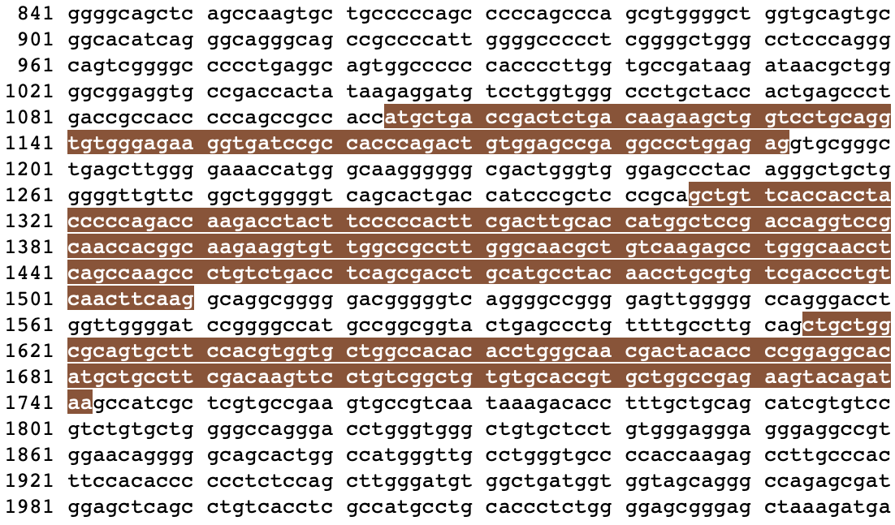
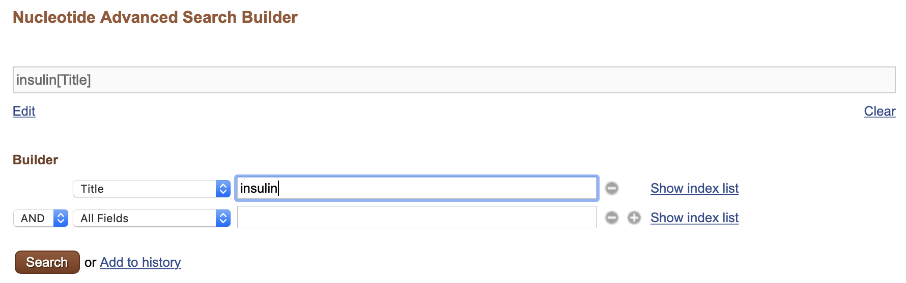
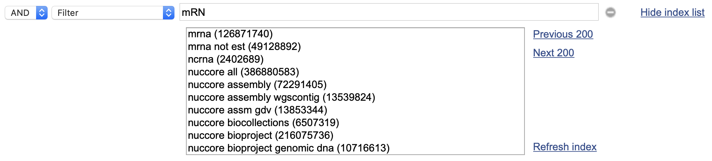
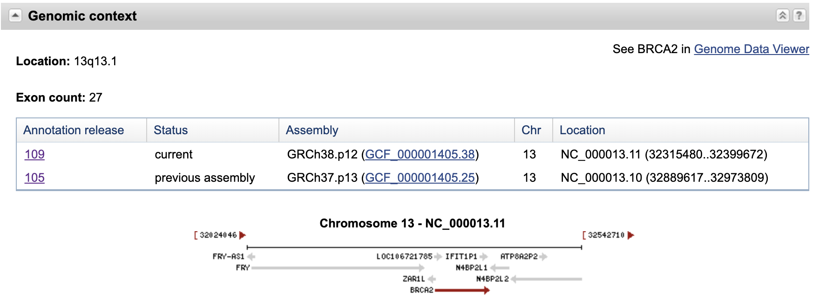
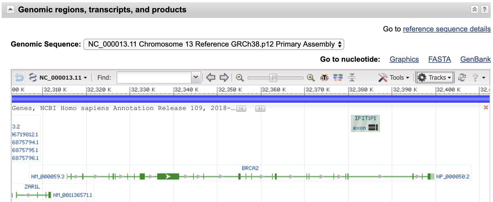
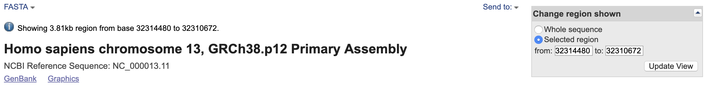
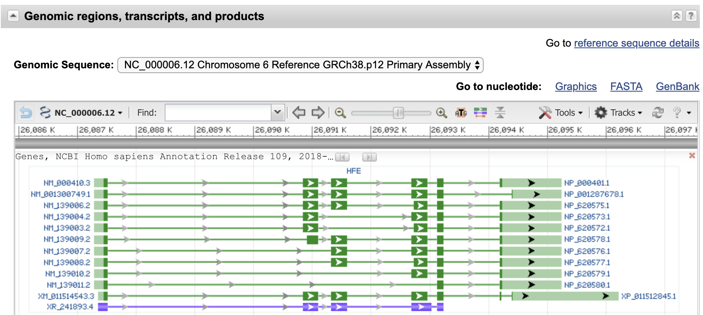
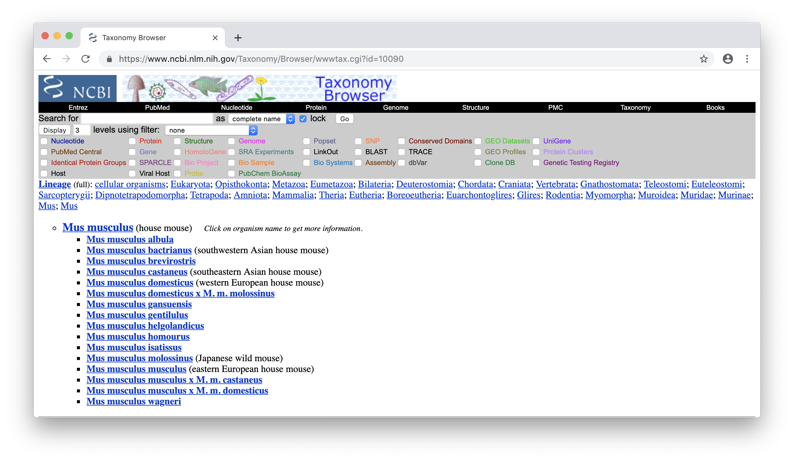
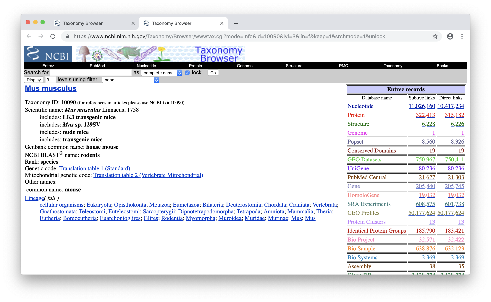

### Zad. 1 - Wyszukiwanie rekordu sekwencji po numerze dostępu
Zadanie na podstawie: [DTU Course](http://teaching.healthtech.dtu.dk/36611/index.php/ExGenbank-new#Searching_for_a_specific_ID).

Bardzo często szukamy sekwencji o konkretnym numerze dostępu (np. numer dostepu genu znaleziono w publikacji). W tym celu, otwórz stronę serwisu [NCBI](https://www.ncbi.nlm.nih.gov). Wybierz nukleotydową bazę danych (`Nucleotide`) i w oknie wyszukiwania wpisz numer dostępu `AB001981`.
> Rekord sekwencji w formacie *GenBank*: [AB001981](https://www.ncbi.nlm.nih.gov/nuccore/AB001981.1/).

1. Rekord `AB001981` dotyczy fragmentu sekwencji genomowego DNA o długość `5891` nukleotydów.

   ```
   LOCUS       AB001981                5891 bp    DNA     linear   VRT 25-DEC-2002
   ```

2. Sekwencja należy do gołębia (*Columba livia*).

   ```
   SOURCE      Columba livia (rock pigeon)
     ORGANISM  Columba livia
               Eukaryota; Metazoa; Chordata; Craniata; Vertebrata; Euteleostomi;
               Archelosauria; Archosauria; Dinosauria; Saurischia; Theropoda;
               Coelurosauria; Aves; Neognathae; Columbiformes; Columbidae;
               Columba.
   ```

3. Sekwencja zawiera dwa geny alfa-globin (*alpha-D globin* i *alpha-A globin*). 

   ```
   DEFINITION  Columba livia DNA for alpha-D globin, alpha-A globin.
   ```

   Informacja na temat lokalizacji i struktury tych genów w sekwencji genomowej znajduje się w części `FEATURES` rekordu:

   ```
   FEATURES
        ...
        gene            join(1104..1192,1306..1510,1614..1742)
                        /gene="alpha-D"
        ...
        gene            join(4915..5009,5165..5369,5474..5602)
                        /gene="alpha-A"
        ...     
   ```

   Oba geny składają się z 3 egzonów. Naciśnięcie przycisku myszy na dowolny element w części `FEATURES` (np.: `gene`, `exon`, `CDS`) spowoduje podświetlenie w sekwencji genomowej fragmentu, który odpowiada danemu elementowi. Na przykład, naciśnięcie na `gene` podświetli sekwencje trzech egzonów tego genu na sekwencji genomowej.

    

4. Linie części `FEATURES` rozpoczynające się od słowa `CDS` oznaczają lokalizację trzech sekwencji kodujących białko (*CDS, Coding sequence*) na sekwencji genomowej. 

   ```
   CDS             join(1104..1192,1306..1510,1614..1742)
   ```

   Na przyklad, fragment sekwencji kodującej `CDS` odpowiadający pierwszemu egzonowi genu `alpha-D` znajduje się w pozycji `1104-1192`. Podświetlając CDS w sekwencji genomowej można zobaczyć, że sekwencja kodująca odpowiadająca pierwszemu egzonowi zaczyna się kodonem *start* (`ATG`). Natomiast sekwencja CDS odpowiadająca trzeciemu egzonowi znajduje się w pozycji `1614-1742` i kończy się kodonem *stop* (`TAA`).


5. Dwie referencje literaturowe odnoszą się do rekordu `AB001981`.

   Pierwsza referencja jest artykułem z 1997 roku na temat izolacji i sekwencjonowania analizowanych dwóch genów alfa-globin. Obok tytułu i autorów artykułu, podany jest również identyfikator artykułu w bazie PubMed (PubMed ID: `9177291`).
   > Informacja na temat artykułu jest przydatna, ponieważ możliwy jest wgląd w szczegółowy opis uzyskania danej sekwencji, co pozwala zweryfikować, czy sekwencja w rekordzie jest wiarygodna. Ma to istotne znaczenie w przypadku gdy gen posiada nietypową strukturę egzon/intro w porównaniu do homologów tego genu u blisko spokrewnionych organizmów.

   ```
   REFERENCE   1
     AUTHORS   Ikehara,T., Eguchi,Y., Kayo,S. and Takei,H.
     TITLE     Isolation and sequencing of two alpha-globin genes alpha(A) and
               alpha(D) in pigeon and evidence for embryo-specific expression of
               the alpha(D)-globin gene
     JOURNAL   Biochem. Biophys. Res. Commun. 234 (2), 450-453 (1997)
      PUBMED   9177291
   ```

   Druga referencja związana jest umieszczeniem tego rekordu bazie GenBank.

   ```
   REFERENCE   2  (bases 1 to 5891)
     AUTHORS   Ikehara,T., Eguchi,Y., Kayo,S. and Takei,H.
     TITLE     Direct Submission
     JOURNAL   Submitted (19-MAR-1997) Tsuyoshi Ikehara, University of the
               Ryukyus, Department of Biochemistry,Faculty of Medicine; Okinawa,
               Nishihara-cho, Uehara,207, Nishihara-cho 903-01, Japan
               (E-mail:k940401@med.u-ryukyu.ac.jp, Tel:098-895-3331)
   ```
 
6. Format FASTA sekwencji genomowej `AB001981` zawiera jedynie numer dostępu i krótki opis sekwencji. 

   ```
   >AB001981.1 Columba livia DNA for alpha-D globin, alpha-A globin
   CGATCAGGTTACATTTACTGCCCATGCCTGTCTCAGAGGAATTCTGACACGAAAAGGTGGGCACAAATTC
   TTAAGCACACTCTGATGGTACAACGTGAGCTGGCACTACAAGCTGTGTTCCTCATCCCGTTTACAAAATT
   TTGAGACTGTGTTTGGGCAAGGGGGAGAGAGACAGTGCAGAAGCTCTGAAGCCACTGAATTTCTCTAAAT
   ...
   ```

#### Zapis rekordu do pliku tekstowego
Zapis rekordu w formacie *GenBank* do pliku: `Send to` > `Complete Record` > `File` > `Create File`. 
> Pobrany plik domyślnie ma nadaną nazwę `sequences.db`. Dobrą praktyką jest zmiana nazwy pobranego pliku na nazwę zawierającą numer dostępu pobranej sekwencji (np. `AB001981.gb`). Przydaje się to w sytuacjach, gdy mamy wiele innych plików z sekwencjami. Wyświetlenie pobranego rekordu umożliwia dowolny edytor tekstowy - najlepiej inny niż Notatnik (np. [Notepad++](https://notepad-plus-plus.org) lub Word).

#### Graficzna prezentacja rekordu
Aby wyświetlić rekord `AB001981` w formie graficznej naciśnij link `Graphics`. Graficzna prezentacja rekordu przedstawia ułożenie dwóch genów (*alpha-D globin* i *alpha-A globin*) na sekwencji genomowej. Widok graficzny jest interaktywny - można go przybliżać/oddalać, zaznaczać pozycje w sekwencji, itd. Na przykład, skierowania kursora myszy na egzon (czarny prostokąt) wskaże jego pozycję w sekwencji genomowej oraz odpowiadającą mu pozycję w sekwencji białkowej, a także sekwencję aminokwasową kodowaną przez wskazany egzon.


<br/><br/>

### Zad. 2 - Wyszukiwanie sekwencji dla wielu numerów dostępu
Bardzo często potrzeba pobrać wiele rekordów sekwencji jednocześnie. Na przykład w oparciu o numery dostępu podane w tabeli w publikacji. W tym celu, NCBI udostępnia funkcję `Batch entrez`.

* Otwórz stronę serwisu [NCBI](https://www.ncbi.nlm.nih.gov).
* Z panelu po prawej stronie `Popular Resources` wybierz `Nucleotide`.
* Naciśnij na link `Batch Entrez`. 
* W polu `File` załaduj plik [accession_numbers.txt](./data/accession_numbers.txt) i naciśnij przycisk `Retrieve`.

Sekwencje transkryptów (mRNA) dla numerów dostępu z pliku [accession_numbers.txt](./data/accession_numbers.txt) pochodzą z następujących organizmów:

```
Metarhizium robertsii ARSEF 23 (1)
Saccharomyces cerevisiae S288C (1)
Drosophila melanogaster (1)
Caenorhabditis elegans (1)
Danio rerio (1)
Homo sapiens (1)
Mus musculus (1)
Trypanosoma grayi (1)
Acanthamoeba castellanii str. Neff (1)
Arabidopsis thaliana (1)
```

Aby zapisać znalezione sekwencje do pliku w formacie FASTA wybierz `Send to` > `Complete Record` > `File` > `Format`: `FASTA` i naciśnij `Create File`.


<br/><br/>

### Zad. 3 - Wyszukiwanie mRNA insuliny człowieka
Otwórz stronę serwisu [NCBI](https://www.ncbi.nlm.nih.gov). Z panelu po prawej stronie `Popular Resources` wybierz `Nucleotide`.

#### Proste wyszukiwanie

1. W polu wyszukiwania wpisz wyraz `insulin` i naciśnij przycisk `Search`. Wyświetlonych zostanie `202 073` rekordów sekwencji. Na liście wyników są różne typy sekwencji (np.: pełnej długości sekwencje genomowe, sekwencje EST, sekwencje mRNA). Niektóre z tych rekordów sekwencji nie zawierają nawet słowa `insulin` w swoich opisach (liniach definicji). Domyślnie, NCBI przeszukuje wszystkie pola rekordów (np. pola w częśći `FEATURES`, `REFERENCES` itd.). Dlatego, jeżeli wyraz `insulin` występuje w którymkolwiek polu w rekordzie, NCBI przedstawi taki rekord na liście wyników.

   *Search details:*

   ```
   insulin[All Fields]
   ```

2. Panele po lewej i prawej stronie umożliwiają zawężanie (*filtrowanie*) listy wyników według różnych kryteriów. Na przykład, naciśnięcie `Results by taxon` > `Homo sapiens` powoduje zawężenie listy wyników do rekordów sekwencji pochodzących z organizmu człowieka. W wyniku tego zawężenia otrzymano `11 106` rekordów sekwencji.

   *Search details:*

   ```
   insulin[All Fields] AND "Homo sapiens"[porgn]
   ```

3. Naciśnięcie linku `Molecule type` > `mRNA` w panelu po prawej stronie spowoduje dalsze zawężenie listy wyników do `6 383` rekordów.

   *Search details:*

   ```
   insulin[All Fields] AND "Homo sapiens"[porgn] AND biomol_mrna[PROP]
   ```

#### Zaawansowane wyszukiwanie
Na stronie nukleotydowej bazy danych NCBI otwórz tryb zaawansowanego wyszukiwania (`Advanced`).


Wybierz pole `Title` i wpisz `insulin`.



*Search details:*

```
insulin[Title]
```

W wyniku otrzymano **21 047** rekordów sekwencji nukleotydowych zawierających wyraz `insulin` w linii tytułowej (definicji) rekordu.

4. Ponownie otwórz tryb zaawansowanego wyszukiwania. W części `History` naciśnij `Add` w celu przywrócenia poprzedniego zapytania do bazy danych.

   *Search details:*

   ```
   insulin[Title] AND "Homo sapiens"[Organism]
   ```

   W wyniku otrzymano **5 410** sekwencje nukleotydowe mRNA insuliny człowieka.

5. Ponownie otwórz tryb zaawansowanego wyszukiwania. Użyj części `History` w celu przywrócenia poprzedniego zapytania do bazy danych. Następnie wybierz pole `Filter`, wpisz `mRN` i naciśnij `Index preview` w celu uzyskania listy podpowiedzi. Z listy podpowiedzi wybierz `mrna`.

   

   *Search details:*
   ```
   insulin[Title] AND "Homo sapiens"[Organism] AND "mrna"[Filter]
   ```

   W wyniku otrzymano **3 982** sekwencje mRNA insuliny człowieka.

6. Ponownie otwórz tryb zaawansowanego wyszukiwania. Skorzystaj z `History`, aby przywrócić poprzednie zapytanie do bazy danych. Następnie dodaj kolejne trzy pola `Title` połączone operatorem logicznym `NOT` i wpisz w nich `insulin-like`, `partial` i `part`.

   *Search details*

   ```
   insulin[Title] AND "Homo sapiens"[Organism] AND "mrna"[Filter] NOT insulin-like[Title] NOT partial[Title] NOT part[Title]
   ```

   W wyniku otrzymano **3 888** serkwencji mRNA insuliny człowieka, które nie są fragmentami sekwencji oraz nie są "insulinopodobne".
<br/><br/>

### Zad. 4 - Od rekordu białka, przez mRNA do rekordu genu
Otwórz stronę serwisu [NCBI](https://www.ncbi.nlm.nih.gov). Z panelu po prawej stronie `Popular Resources` wybierz `Protein`. Otwórz tryb zaawansowanego wyszukiwania i utwórz poniższe zapytanie:

```
BRCA2[Gene Name] AND Homo sapiens[Organism] AND "refseq"[Filter]
```

W wyniku zostanie wyświetlony dokładnie jeden rekord białka **BRCA2** o numerze dostępu [NP_000050](https://www.ncbi.nlm.nih.gov/protein/NP_000050).

#### Rekord sekwencji białka

1. Sekwencja białkowa BRCA2 zbudowana jest z `3418` aminokwasów.
2. Numer dostępu tego rekordu to `NP_000050`.
   > Rekordy sekwencji bazy RefSeq mają charakterystyczny zapis numerów dostępu. Składają się one z dwóch oznaczeń literowych, podkreślnika i 6 cyfr (np. `NP_000050`).
3. Aktualny rekord `NP_000050` jest w drugiej wersji (`NP_000050.2`). Oznacza to, że rekord ten był jeden raz uaktualniany. Data ostatniej modyfikacji rekordu podana jest w pierwszej linii rekordu w formacie GenBank (`23-APR-2019`). 
   > Istnieje możliwość obejrzenia poprzednich wersji rekordów NCBI poprzez wyszukanie numeru dostępu wraz z numerem wersji (np. [NP_000050.1](https://www.ncbi.nlm.nih.gov/protein/NP_000050.1)). Jeżeli numer wersji nie zostanie podany przez użytkownika podczas wyszukiwania (`NP_000050`), NCBI otworzy rekord w najnowszej wersji.

Aby zapisać sekwencję do pliku w formacie FASTA naciśnij link `Send to` > `File` > `Format`: `FASTA` > przycisk `Create File`.

4. Numer dostępu mRNA genu BRCA2 ([NM_000059](https://www.ncbi.nlm.nih.gov/nuccore/NM_000059)) podany jest w polu `DBSOURCE`. 

   ```
   DBSOURCE    REFSEQ: accession NM_000059.3
   ```

#### Rekord sekwencji mRNA

5. Sekwencja mRNA genu BRCA2 zbudowana jest z `11 386` nukleotydów.
6. Identyfikator genu BRCA2 w bazie `Gene` to [675](https://www.ncbi.nlm.nih.gov/gene/675).

   ```
   FEATURES
      ...
      gene         1..11386
                   /gene="BRCA2"
                   /gene_synonym="BRCC2; BROVCA2; FACD; FAD; FAD1; FANCD;
                   FANCD1; GLM3; PNCA2; XRCC11"
                   /note="BRCA2 DNA repair associated"
                   /db_xref="GeneID:675"
    ```

#### Rekord genu

7. Gen BRCA2 zbudowany jest z `27` egzonów.
   > Panel `Genomic context`, pole `Exon count`.
8. Gen BRCA2 zlokalizowany jest na: 
   - chromosomie: `13` 
   - sekwencji genomowej `NC_000013.11`
   - początek genu: `32 315 480`
   - koniec genu: `32 399 672`
   - orientacja genu: nić plus

   

9. Gen BRCA2 ma jeden wariant splicingowy.

   

10. W panelu `Genomic regions, transcripts, and products`, po prawej stronie `Go to nucleotide` naciśnij `FASTA`. Następnie w panelu `Change region shown` po prawej stronie podaj pozycję początku (`32314480`) i końca (`32310672`) wyświetlanej sekwencji. 

   
<br/><br/>

### Zad. 5 - Od rekordu genu, przez mRNA do rekordu białka
Zadanie na podstawie [NCBI YouTube Tutorials](https://www.youtube.com/watch?v=zs46Ur0m0mc).

Skonstruuj poniższe zapytanie do bazy `Gene` serwisu NCBI:

```
HFE[Gene Name] AND Homo sapiens[Organism]
```

W wynikach otrzymano jeden gen HFE człowieka.

1. Indetyfikator genu (`Gene ID`) to [3077](https://www.ncbi.nlm.nih.gov/gene/3077).
2. Gen HFE ma 12 wariantów splicingowych: 
   * 11 koduje białka (numery dostępu `NM/NP` i `XM/XP`)
   * 1 koduje RNA ([XR_002957972.1](https://www.ncbi.nlm.nih.gov/nucleotide/XR_002957972)).

   

3. Spójrz na graficzną reprezentację wariantów splicingowych w części `Genomic regions, transcripts, and products`.
   * W opcji `Genomic Sequence` ustaw `NG_008720.2 RefSeqGene`. 
   * Skieruj kursor myszy na grubą szarą linię w okolicy pozycji `8671`.
   * Naciśnij prawy przycisk myszy > `Set New Marker at Position` > wpisz `8671` i zaznacz `Lock marker`.

   

   Wynikiem powyższych instrukcji jest pionowa linia wyznaczająca wybrany marker (`Marker 1`) w pozycji `8671` sekwencji genomowej. Naciśnij prawy przycisk myszy w miejscu markera i wybierz `Marker details`. W oknie dialogowym podana jest dokładna lokalizacja markera względem genu, transkryptów, CDS i białek.
<br/><br/>

### Zad. 6 - Wyświetlanie SNP danego genu
Zadanie na podstawie [NCBI YouTube Tutorials](https://www.youtube.com/watch?v=rnWZ9MFBwUM).

Skonstruuj poniższe zapytanie do bazy `Gene` serwisu NCBI:

```
BRCA1[Gene Name] AND Homo sapiens[Organism]
```

W wynikach otrzymano gen BRCA1 (Gene ID: [672](https://www.ncbi.nlm.nih.gov/gene/672)).

#### Variation Viewer
*Variation Viewer* składa się z trzech paneli:
1. Lewy panelu umożliwiający wyszukiwanie konkretnych regionów sekwencji genomowej. Przykładowe frazy wyszukiwania znajdują się pod linkiem `Search examples` - mogą to zatem być: geny, polimorfizmy SNP, konkretne regiony chromosomów. 
2. Widok mapy przedstawiający graficznie wyszukany region genomu oraz związane z nim znane warianty genetyczne.
3. Tabela zawierająca listę wariantów znajdujących się w obrębie mapy wyświetlonanego regionu.

W celu znalezienia na egzonie 10 SNP związanego z chorobotwórczością:

* Usuń z widoku mapy *track* związany z obszernymi zmiennościami genetycznymi (`dbVar ClinVar Large Variation`).
* W lewym panelu, w części `Filter by` wybierz `Source data` > `dbSNP`. Zmiana ta spowoduje odświeżenie widoku mapy oraz tabeli i ograniczenie wariantów genetycznych do SNP.
* W panelu mapy zmień ustawienie `Region` na `Go to gene only (no pad)`. 
* W panelu mapy ustaw widok skupiając powiększenie na egzon 10.
  - W opcji `Exon range` wybierz egzon 10.
  - Ustaw największe powiększenie mapy z dokładnością do pojedynczych nukleotydów.
  - W panelu po lewej stronie `Filter by` zaznacz `pathogenic` i `single nucleotide variant`.
* Przeciągnij wykres wzdłuż egzonu i obserwuj, jak zmieniają się SNP w tabeli.


Przykładowym SNP związanym z chorobotwórczością może być [rs80357010](https://www.ncbi.nlm.nih.gov/snp/rs80357010) w pozycji `43,094,051` sekwencji genomowej, który w sekwencji transkryptu `NM_007294.3` w pozycji `c.1480C>T` powoduje zmianę glutaminy (`Gln`) na kodon *stop*, w efekcie doprowadzając do przedwczesnej terminacja translacji i produkcji skróconej formy tego białka.
<br/><br/>

## Baza taksonomiczna (NCBI Taxonomy)


### Zad. 7 - Zasoby sekwencji pojedynczego gatunku
Zadanie na podstawie [NCBI YouTube Tutorials](https://www.youtube.com/watch?v=sK3ykyInU8o).

* Wybierz bazę `Taxonomy` i w oknie wyszukiwania wpisz `mouse`.
* Z listy wyników wybierz *Mus musculus*.
  - W części `Lineage` znajduje się pełna informacja na temat przynależności taksonomicznej myszy. Skierowanie kursora na dowolną jednostkę taksonomiczną pokaże jej rangę (np. *Muridae* to rodzina). Naciśnij na link `Lineage`, aby zobaczyć skróconą ścieżkę taksonomiczną myszy. 
  - Gatunek *Mus musculus* obejmuje kilkanaście podgatunków.

  

* Naciśnij na link `Mus musculus (house mouse)`. Na stronie wyświetlone zostaną szczegółowe informacje na temat gatunku myszy.
  - Identyfikator taksonomiczny myszy w bazie NCBI (`Taxonomy ID`: `10090`). 
    > Identyfikator używany jest również przez inne bazy sekwencji - również poza NCBI np. UniProt, Ensembl.
  - Nazwy zwyczajowe myszy, rangę w taksonomii (gatunek).
* W tabeli po prawej stronie znajdują się informacje na temat zasobów sekwencji dostępnych w NCBI dla gatunku myszy:
  - Kolumna `Subtree link` uwzględnia sekwencje gatunku myszy i wszystkich jej podgatuków. W praktyce, najczęściej używa się właśnie tej kolumny.
  - Kolumna `Direct link` uwzględnia sekwencje z organizmów bezpośrednio związanych z taksonomicznym indetyfikatorem `10090` (tj. *Mus musculus* bez jawnego podłączenia pod podgatunki).

   

1. Identyfikator taksonomiczny myszy w bazie NCBI (`Taxonomy ID`) to `10090`.
2. Dla myszy wraz z wszystkimi podgatunkami dostępnych jest `11 026 160` sekencji nukleotydowych.
   * Naciśnij na link z liczbą sekwencji nukleotydowych. Dostępne typy sekwencji nukleotydowych to: genomowe DNA (`5 191 394`), mRNA (`5 191 394`), rRNA (`53`). 
<br/><br/>

### Zad. 8 - Zasoby sekwencji dowolnej jednostki taksonomicznej
W serwisie NCBI wybierz bazę `Taxonomy`. W oknie wyszukiwania wpisz `rodentia` lub `rodents`.
 
1. Pod polem wyszukiwania, w polu `levels` wpisz `6` i naciśnij przycisk `Display`.
2. Wyświetlone drzewo taksonomiczne rzędu gryzoni wskazuje, że rodzaj *Rattus* należy do podrodziny *Murinae*. 
3. Pod polem wyszukiwania, w polu `levels using filter` wybierz `has genome sequences` i naciśnij przycisk `Display`.
   * Tak, sekwencja genomowa jest dostępna dla szczura (*Rattus norvegicus*).
4. W panelu znajdującym się pod polem wyszukiwania zazacz `protein`, `gene`, `nucleotide` i naciśnij przycisk `Display`.
   * Dla szczura znanych jest `152 583` sekwencji białkowych.

