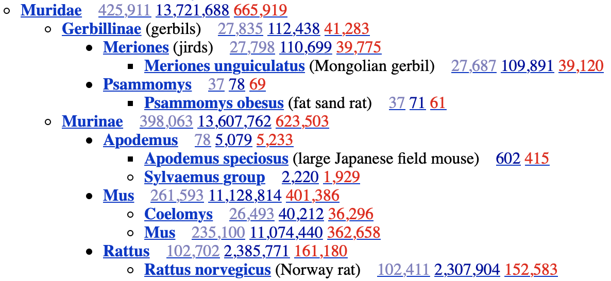

### Zad. 1
Zadanie na podstawie: [DTU Course](http://teaching.healthtech.dtu.dk/36611/index.php/ExGenbank-new#Searching_for_a_specific_ID).

Bardzo często szukamy sekwencji o konkretnym numerze dostępu (np. gen z publikacji). [Rekord sekwencji AB001981](https://www.ncbi.nlm.nih.gov/nuccore/AB001981.1/).

1. Rekord `AB001981` dotyczy sekwencji genomowego DNA. Sekwencja ma długość 5891 nukleotydów. 
2. Sekwencja należy do gołębia (*Columba livia*).
3. Sekwencja zawiera dwa geny alfa-globin (*alpha-D globin* i *alpha-A globin*). Każdy z genów składa się z 3 egzonów. Naciśnięcie na dowolny element sekwencji (`gene`, `exon`, `CDS`) powoduje zaznaczenie odpowiadającego fragmentu w sekwencji genomowej.
4. Linie oznaczają lokalizację trzech sekwencji kodujących (CDS) na sekwencji genomowej. Na przyklad, fragment CDS odpowiadający pierwszemu egzonowi genu `alpha-D` znajduje się w pozycji `1104..1192`. Podświetlając ten fragment w sekwencji genomowej można zobaczyć, że zaczyna się on kodonem start (`ATG`). Natomiast sekwencja CDS odpowiadająca trzeciemu egzonowi znajduje się w pozycji `1614..1742` i kończy ją kodon stop (`TAA`).
5. Rekord zawiera dwie referencje literaturowe. Pierwsza odnosi się do artykuły z 1997 roku na temat wyizolowania i zsekwencjonowania analizowanych dwóch genów alfa-globin. W rekordzie umieszczony jest również link do tej publikacji w bazie PubMed. Druga referencja związana jest umieszczeniem tego rekordu bazie GenBank (`TITLE Direct Submission`). Informacja na temat artykułu jest przydatna, ponieważ możliwy jest wgląd w szczegółowy opis uzyskania danej sekwencji, co pozwala zweryfikować, czy sekwencja jest wiarygodna. Ma to istotne zznaczenie jeżeli coś jest "nie w porządku" z sekwencją (np. gen posiada dziwną strukturę egzon/intro w porównaniu do homologów tego genu u blisko spokrewnionych organizmów).
6. Format FASTA zawiera jedynie numer dostępu i krótki opis sekwencji. 

#### Zapis rekordu do pliku
Zapis rekordu w formacie GenBank do pliku `Send to` > `Complete Record` > `File` > `Create File`. Dobrą praktyką jest zmiana nazwy pobranego pliku z `sequences.gb` na `AB001981.gb`. Przydaje się to, gdy mamy wiele innych plików z sekwencjami. Do wyświetlenie pliku najlepiej użyć innego edytora niż Notatnik (np. [Notepad++](https://notepad-plus-plus.org) lub Winword).

### Graficzna prezentacja rekordu
Graficzna prezentacja rekordu przedstawia ułożenie dwóch genów na sekwencji genomowej. Widok można przybliżać. Skierowania kursora myszy na egzon wskaże jego pozycję w sekwencji genomowej oraz odpowiadającą mu pozycję w sekwencji białkowej wraz z sekwencją aminokwasową.


### Zad. 2
Często potrzebujemy pobrać wiele rekordów sekwencji jednocześnie. Na przykład w oparciu o numery dostępne podane w tabeli w publikacji. Korzystamy wtedy z funcji `Batch entrez`.

Sekwencje transkryptów z pliku [./data/accession_numbers.txt] pochodzą z następujących organizmów:

```
Metarhizium robertsii ARSEF 23 (1)
Saccharomyces cerevisiae S288C (1)
Drosophila melanogaster (1)
Caenorhabditis elegans (1)
Danio rerio (1)
Homo sapiens (1)
Mus musculus (1)
Trypanosoma grayi (1)
Acanthamoeba castellanii str. Neff (1)
Arabidopsis thaliana (1)
```

Aby zapisać znalezione sekwencje do pliku w formacie FASTA wybierz `Send to` > `Complete Record` > `File` > `Format`: `FASTA` i naciśnij `Create File`.


### Zad. 3

#### Proste wyszukiwanie

1. Wpisanie wyrazu `insulin` w oknie wyszukiwania powoduje wyświetlenie 202 073 rekordów. Na liście wyników są różne typy sekwencji (np.: pełnej długości sekwencje genomowe, sekwencje EST, sekwencje mRNA). Niektóre z tych rekordów nie zawierają nawet słowa `insulin` w swoich opisach, ponieważ NCBI przeszukuje wszystkie pola rekordów (np. pola w częśći FEATURES i HEADER). Dlatego jeżeli w rekordzie występuje wyraz `insulin` to NCBI zwraca taki rekord.

   *Search details:*

   ```
   insulin[All Fields]
   ```

2. Panele po lewej i prawej stronie umożliwiają zawężanie (filtrowanie) wyników. Naciśnięcie `Results by taxon` > *Homo sapiens* powoduje zawężenie rekordów do organizmu człowieka ()11 106 rekordów

   *Search details:*

   ```
   insulin[All Fields] AND "Homo sapiens"[porgn]
   ```

3. Zawężenie wyników tylko do mRNA: `Molecule type` > `mRNA` (6 383 rekordów)
   *Search details:*

   ```
   insulin[All Fields] AND "Homo sapiens"[porgn] AND biomol_mrna[PROP]
   ```

#### Zaawansowane wyszukiwanie


*Search details*

```
insulin[Title]        (21 047 rekordów)
```

4. Advanced search > `History` > `Add to builder`.
   *Search details:*

   ```
   insulin[Title] AND "Homo sapiens"[Organism]    (5 410 rekordów)
   ```

5. Advanced > `History` > `Filter` > mRN > Index preview > mRNA (3 982 rekordów)
   *Search details:*
   ```
   (insulin[Title] AND "Homo sapiens"[Organism]) AND "mrna"[Filter]
   ```

6. Advanced search (3 898 rekordów)
   *Search details*

   ```
   insulin[Title] AND "Homo sapiens"[Organism] AND "mrna"[Filter] NOT insulin-like[Title] NOT partial[Title] NOT part[Title]
   ```


### Zad. 4
Poniższe zapytanie zwraca dokładnie jeden rekord białka BRCA2: [NP_000050](https://www.ncbi.nlm.nih.gov/protein/119395734).
```
BRCA2[Gene Name] AND Homo sapiens[Organism] AND "refseq"[Filter]
```

1. Sekwencja białkowa zbudowana jest z 3418 aminokwasów.
2. Numer dostępu tego białka to `NP_000050`.
3. Aktualna rekord jest w drugiej wersji (`NP_000050.2`). Oznacza to, że rekord był raz modyfikowany.
   - Można przejść do poprzedniej wersji rekordu [NP_000050.1](https://www.ncbi.nlm.nih.gov/protein/NP_000050.1).
4. Numer dostępu mRNA: `NM_000059.3`
5. Sekwencja mRNA zbudowana jest z 11 386 nukleotydów.
6. Identyfikator genu (*Gene ID*): `675` [link](https://www.ncbi.nlm.nih.gov/gene/675)
7. Liczba egzonów: `27`
8. Lokalizacja genu na genomie: 
   - chromosom: `13` 
   - numer dostępu sekwencji genomowej: `NC_000013.11`
   - począte genu: `32315480`
   - koniec genu: `32399672)`
   - orientacja genu: nić plus
9. Gen BRCA2 ma jeden wariant splicingowy. Odczytać to można z graficznej prezentacji genu znajdującej się w panelu `Genomic regions, transcripts, and products`.
10. `Go to nucleotide` > `FASTA`. Odjąć 1000 od statu genu i dodać 1000 do końca genu.


### Zad. 5
Zadanie na podstawie [NCBI youtube tutorials](https://www.youtube.com/watch?v=zs46Ur0m0mc).
Zapytanie do bazy `Gene`:

```
HFE[Gene Name] AND Homo sapiens[Organism]
```

1. Gene ID: [3077](https://www.ncbi.nlm.nih.gov/gene/3077)
2. Gen ma 12 wariantów splicingowych. Z tego, 11 koduje białka (numery dostępu `NM/NP` i `XM/XP`) i 1 koduje RNA ([XR_002957972.1](https://www.ncbi.nlm.nih.gov/nucleotide/XR_002957972)).
3. Spójrz na graficzną reprezentację wariantów splicingowych w części *Genomic regions, transcripts, and products*.
   * W opcji `Genomic Sequence` ustaw `NG_008720.2 RefSeqGene`. 
   * Skieruj kursor myszy na grubą szarą linię w okolicy pozycji `8671`.
   * Naciśnij prawy przycisk myszy > `Set New Marker at Position` > wpisz `8671` i zaznacz `Lock marker`


Pojawi się pionowa linia wyznaczająca wybrany marker (`Marker 1`) na sekwencji genomowej genu, transkryptów i białek. Naciśnij prawy przycisk myszy w miejscu markera i wybierz `Marker details`. W okienku dialogowym będzie podana dokładna lokalizacja markera względem genu, transkryptów, CDS i białek.


### Zad. 6
Zadanie na podstawie [NCBI youtube tutorials](https://www.youtube.com/watch?v=rnWZ9MFBwUM).
Zapytanie do bazy `Gene`:

```
BRCA1[Gene Name] AND Homo sapiens[Organism]
```

Gene ID: [672](https://www.ncbi.nlm.nih.gov/gene/672)

#### Variation Viewer
Variation Viewer składa się z trzech części:
1. Lewego panelu umożliwiającego wyszukiwanie regionów sekwencji genomowej. Nacisnąć `Search examples` - mogą to zatem być: geny, polimorfizmy SNP, konkretne regiony chromosomów. 
2. Widoku mapy graficznie przedstawiającego wyszukany region genomu oraz warianty z nim związane.
3. Tabelę zawierającą listę wariantów dotyczącą wyświetlonego regionu.

W celu znalezienia SNP na egzonie 10 związanego z chorobtwórczością:

* Usuń z widoku mapy "track" związany z dużymi zmiennościami (`dbVar ClinVar Large Variation`).
* W lewym panelu, w części `Filter by`, wybierz `Source data` > `dbSNP`. Spowoduje to odświeżenie widoku mapy oraz tabeli.
* W panelu mapy zmień ustawienie `Region` na `Go to gene only (no pad)`. 
* W panelu mapy ustaw widok skupiając powiększenie na egzon 10.
  - W opcji `Exon range` wybierz egzon 10.
  - Ustaw największe powiększenie z dokładnością do pojedynczych nukleotydów.
  - W panelu po prawej stronie `Filter by` zaznacz `pathogenic` i `single nucleotide variant`.
* Przeciągnij wykres wzdłuż egzonu i obserwowuje jak zmieniają się SNP w tabeli o charakterze pathogenic.


Przykładowym SNP związanym z chorobotwórczością może być [rs80357010](https://www.ncbi.nlm.nih.gov/snp/rs80357010) w pozycji `43,094,051` genomowej, który w transkrypcie `NM_007294.3` w pozycji `c.1480C>T` powoduje zmianę Gln na stop kodon, w efekcie skracając białko (przedwczesna terminacja translacji).


### Zad. 7
Zadanie na podstawie [NCBI youtube tutorials](https://www.youtube.com/watch?v=sK3ykyInU8o).

* Wybierz bazę `Taxonomy` i w oknie wyszukiwania wpisz `mouse`.
* Z listy wyników wybierz *Mus musculus*.
  - W części `Lineage` znajduje się pełna informacja na temat przynależności taksonomicznej myszy. Skierowanie kursora na dowolną jednostkę taksonomiczną pokaże jej rank (np. *Muridae* to rodzina). Naciśnij na wyraz `Lineage`, aby zobaczyć skróconą ścieżkę taksonomiczną myszy. 
  - Gatunek *Mus musculus* obejmuje kilkanaście podgatunków.
* Naciśnij na `Mus musculus (house mouse)`. Na stronie wyświetlone są szczegółowe informacje na temat gatunku myszy. Na przykład:
  - Identyfikator taksonomiczny w bazie NCBI (`Taxonomy ID`: `9606`). Identyfikator używany jest również przez inne bazy, poza NCBI, np. UniProt, Ensembl.
  - Nazwy zwyczajowe, ranga w taksonomii (gatunek).
* Po prawej stronie w tabeli znajdują się informacje na temat zasobów sekwencjki gatunku myszy.
  - kolumna `Subtree link` uwzględnia sekwencje dla myszy i wszystkich podgatuków przypisanych do gatunku. W praktyce, najczęściej jesteśmy zainteresowani właśnie tą kolumną.
  - kolumna `Direct link` uwzględnia sekwencje z organizmów bezpośrednio związanych z taksonomicznym indetyfikatorem `9606` (*Mus musculus* bez jawnego podłączenia pod podgatunki).


1. Identyfikator taksonomiczny myszy (`Taxonomy ID`) to `9606`.
2. Dla myszy wraz z wszystkimi podgatunkami dostępnych jest 11 026 116 sekencji nukleotydowych.
   * Naciśnij na link z liczbą sekwencji nukleotydowych. Dostępne typy sekwencji nukleotydowych to: genomowe DNA (5 191 394), mRNA (5 191 394), rRNA (53). 


### Zad. 8
Wybierz bazę `Taxonomy` i w oknie wyszukiwania wpisz `rodentia` lub `rodents`.
 
1. Pod oknem wyszukiwania wpisz `6` w oknie `levels`. Naciśnij przycisk `Display`.
2. W oparciu o wyświetlone drzewo taksonomiczne rzędu gryzoni, rodzaj *Rattus* należy do podrodziny *Murinae*. 
3. Pod oknem wyszukiwania, w polu `levels using filter` wybierz `has genome sequences` i naciśnij przycisk `Display`.
using filter `has genome sequences`.
   * Tak, dla szczura znana jest sekwencja genomu.
4. W panelu zazacz `protein` i nacisnąć przycisk `Display`.
   * Dla szczura znanych jest 152 510 sekwencji białkowych.



## UniProt
Zadania na podstawie: [DTU Course](http://teaching.healthtech.dtu.dk/36611/index.php/Exercise:_The_protein_database_UniProt).

### Zad. 9
1. W wyniku Wpisania frazy `human insulin` znaleziono `1525` rekordów z bazy SwissProt i `3048` rekordów z bazy `trEMBL`.
   * SwissProt zawiera rekordy wysokiej jakości (zweryfikowane przez specjalistów, białka o potwierdzonej funkcji)
   * trEMBL zawiera rekordy o niskiej jakości (niezweryfikowane, białka o niepotwierdzomym występowaniu i funkcji)
2. Tak, na pierwszej stronie listy wyników jest szukane białko (`INS_HUMAN Insulin INS Homo sapiens (Human)`). Na liście znajdują się również białka pochodzące z innych organizmów nie będące insuliną.
3. Wybranie z panelu filtrów organizmu i nazwy białka spowodowało ograniczenie wyników do `199` rekordów człowieka, których nazwa zawiera wyraz `insulin`. Zapytanie do bazy znajduje się w oknie wyszukiwania (`organism:human name:insulin`).
   * Insulina człowieka znajduje się na 7 miejscu na liście znalezionych białek.
4. Dodanie do zapytania frazy `NOT name:protein-like` ograniczyło wyniki do 197 białek, które w nazwie nie mają frazy `protein-like`.
   * Insulina człowieka znajduje się na 7 miejscu na liście znalezionych białek.
5. Zapytanie `organism:human name:insulin NOT name:insulin-like NOT name:receptor` ograniczyło liczbę wyników do 47 białek. 
   * Insulina człowieka znajduje się teraz na pierwszym miejscu listy wyników.


### Zad. 10
Rekord insuliny człowieka: [P01308](https://www.uniprot.org/uniprot/P01308)

1. W lewym panelu (*Display*) wybierz `Publications`. W sumie dla tego białka dostępnych jest 1 050 publikacji. Z tego 1 014 oznaczonych jest jako *Computationally mapped* (są to publikacje automatycznie pobrane z innych baz danych i nie są zweryfikowane przez pracowników UniProt). Natomiast 36 publikacji na temat tego białka insuliny jest zweryfikowanych i dotyczy szczegółowych informacji dotyczących funkcji, sekwencji, struktury, interakcji tego białka.
2. Panelu rekordu `Subcellular location` informuje, że białko jest wydzialane poza komórkę (*Extracellular region or secreted*). Zakładka `GO - Cellular compoenent` podaje szczegółowe miejsce występowania białka, na przykład retikulum endocytoplazmatyczne, ale są to tymczasowe lokalizacje białka zanim zostanie ono wydzielone z komórki.
3. Panel rekordu `PTM / Processing` w części `Molecule processing` informuje, że insulina posiada dwa sygnałowe peptydy: *Signal peptide* na N-końcu w pozycji 1-24 oraz *Propeptide* na C-końcu w pozycji 57-97. Oba te peptydy zostają wycinane zanim białko zostanie wydzielone poza komórkę. Dojrzałe białko insuliny (łańcuchy A i B) są więc mniejsze niż sekwencja, która jest pokaza w panelu `Sequences`.
4. W panelu `Sequence`, części `Natural variant` zawierająca listę mutacji insuliny, które zostały opisane w literaturze. W kolumnie `Description` zawarta jest informacja na temat zmiany aminokwasu .w sekwenci - jeżeli wariant jest związany z chorobą oznaczone jest skrótem choroby (np. "R → C in IDDM2"). Panel `Under Pathol./Biotech` dostarcza informacji na temat choroby, której skrót jest w tabeli oraz powtarza informacje o wariantach sekwencji związanych z tą jednostką chorobową (np. IDDM2 to skrót od Cukrzycy typu 2).
5. U dołu rekordu insuliny, w panelu `Cross-references` podane są odnośniki do innych baz danych. W części `Sequence databases` tego panelu znajduje się odnośnik do sekwencji białkowej i mRNA insuliny w bazie RefSeq (`NP_000198.1` i `NM_000207.2`).


### Zad. 11
1. W bazie UniProt znajduje się ponad 10 milionów białek zawierających peptydy sygnałowe. Z tego, 41 893 należy do bazy SwissProt a 10,787,160 do bazy trEMBL. Zapytanie do bazy: `annotation:(type:signal)`.
2. Lista znalezionych białek zawiera również białka, w których peptydy sygnałowe zostały przewidziane komputerowo i niekoniecznie wsparte są dowodami doświadczalnymi. Wyszukanie białek zawierających sygnałowe peptydy o doświadczalnie potwierdzonej funkcji: `annotation:(type:signal evidence:experimental)`. W wyniku otrzymano 3 650 białek z bazy SwissProt (oczywiście, nie ma takich białek w bazie trEMBL).
3. Wśród białek z poprzedniego zapytania, 723 należy do człowieka. Zapytanie: `annotation:(type:signal evidence:experimental) AND organism:"Homo sapiens (Human) [9606]"`. Warto zwrócić uwagę na identyfikator taksonomiczny z bazy NCBI. Jeżeli wpisalibyśmy tylko `human` bez identyfikatora taksonomicznego w wyniku moglibyśmy otrzymać również białka pochodzące na przykład z *Human immunodeficiency virus*. 