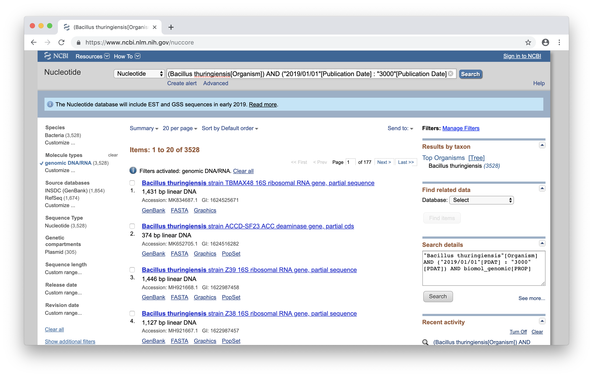
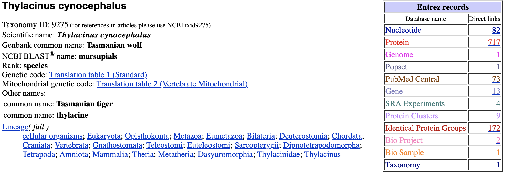

### Zad. 1 - Znajdź sekwencje mRNA insuliny myszy i szczura
Otwórz stronę [NCBI](https://www.ncbi.nlm.nih.gov). Z panelu `Popular Resources` wybierz nukleotydową bazę danych (`Nucleotide`). Użyj zaawasowanego wyszukiwania (`Advanced`) i skonstruuj poniższe zapytanie:

```
insulin[Title] AND ("mus musculus"[Organism] OR "rattus norvegicus"[Organism])
AND "mrna"[Filter] AND "refseq"[Filter]
```

W wyniku otrzymano **53** sekwencje mRNA myszy i szczura pochodzące z bazy RefSeq.
<br/><br/>


### Zad. 2 - Znajdź sekwencje białek alpha-globin u wszystkich zwierząt
Otwórz stronę [NCBI](https://www.ncbi.nlm.nih.gov). Wybierz białkową bazę danych (`Protein`). Użyj zaawasowanego wyszukiwania (`Advanced`) i skonstruuj poniższe zapytanie:

```
alpha-globin[Title] AND "metazoa"[Organism] AND "pdb"[Filter]
```

W wyniku otrzymano **5** zwierzęcych sekwencji białek o rozwiązanej strukturze przestrzennej. 
<br/><br/>

### Zad. 3 - Znajdź 10 najdłuższych sekwencji mRNA człowieka
Otwórz stronę [NCBI](https://www.ncbi.nlm.nih.gov). Wybierz nukleotydową bazę danych (`Nucleotide`). Użyj zaawansowanego wyszukiwania (`Advanced`) i skonstruuj poniższe zapytanie:

```
"mrna"[Filter] AND "Homo sapiens"[Organism] AND 100554:10000000[Sequence Length] 
```

W wyniku otrzymano **10** sekwencji mRNA ludzkiego genu titin (TTN), który koduje olbrzymie białko zapewniające strukturę i elastyczność komórkom mięsniowym. Najdłuższy transkrypt genu TTN ([NM_001267550](https://www.ncbi.nlm.nih.gov/nuccore/NM_001267550)) ma `109 224` pz, a kodowane przez niego białko składa się z `35 991` reszt aminokwasowych.
<br/><br/>

### Zad. 4 - Znajdź sekwencje genomowe B. thuringiensis opublikowane w 2019 roku
Otwórz stronę [NCBI](https://www.ncbi.nlm.nih.gov). Wybierz nukleotydową bazę danych (`Nucleotide`). Użyj zaawansowanego wyszukiwania (`Advanced`) i skonstruuj poniższe zapytanie:

```
Bacillus thuringiensis[Organism] AND 
("2019/01/01"[Publication Date] : "3000"[Publication Date]) AND 
"genomic dna"[Filter] 
```



W wyniku otrzymano **3528** sekwencji genomowych różnych szczepów *Bacillus thuringiensis*.
<br/><br/>

### Zad. 5 - Porównaj linię taksonomiczną myszy i człowieka
Otwórz stronę [NCBI](https://www.ncbi.nlm.nih.gov). Wybierz taksonomiczną bazę danych (`Taxonomy`). Odszukaj takson człowieka wpisując w polu wyszukiwania `human` lub `homo sapiens`. W nowej karcie przeglądarki internetowej odszukaj takson myszy wpisując w polu wyszukiwania `mouse` lub `mus musculus`. 

Linia taksonomiczna (`Lineage`) człowieka i myszy jest wspólna od korzenia *Eukaryota* do nadrzędu *Euarchontoglires*.

#### Homo sapiens (taxId: 9606):

```
Eukaryota; Metazoa; Chordata; Craniata; Vertebrata; Euteleostomi; Mammalia; Eutheria;
Euarchontoglires; Primates; Haplorrhini; Catarrhini; Hominidae; Homo
```

#### Mus musculus (taxId: 10090)

```
Eukaryota; Metazoa; Chordata; Craniata; Vertebrata; Euteleostomi; Mammalia; Eutheria;
Euarchontoglires; Glires; Rodentia; Myomorpha; Muroidea; Muridae; Murinae; Mus; Mus
```
<br/><br/>

### Zad. 6 - Sprawdź zasoby sekwencji dla wymarłego gatunku wilka
Otwórz stronę [NCBI](https://www.ncbi.nlm.nih.gov). Wybierz taksonomiczną bazę danych (`Taxonomy`). Odszukaj takson wilka workowatego wpisując w polu wyszukiwania `Thylacinus cynocephalus`. 



Dla wilka workowatego dostępnych jest `82` sekwencji nukleotydowych i `717` sekwencji białkowych.