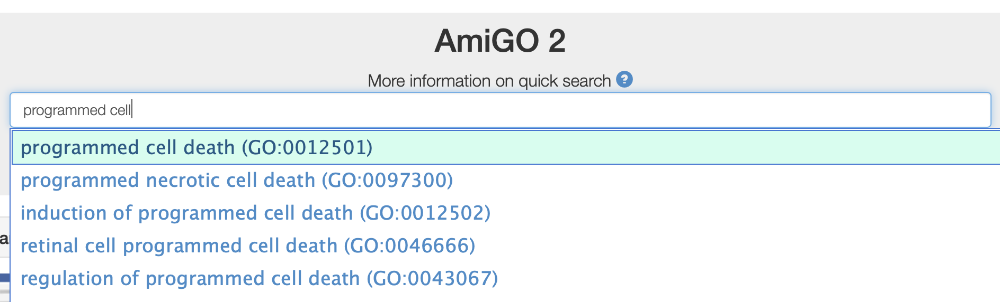

## UniProt

### Zad. 1 - Proste wyszukiwanie insuliny człowieka
Otwórz stronę [serwisu Uniprot](https://www.uniprot.org/). W polu wyszukiwania wpisz `human insulin`.

1. Ile rekordów znaleziono?
2. Na którym miejscu na liście białek znajduje się szukana insulina człowieka?

* W panelu po lewej stronie, pod `Filter "human" as:` wybierz `organism`, a pod `Filter "insulin" as:` wybierz `protein name`.

3. Ile rekordów zostało?
   * Na którym miejscu na liście białek znajduje się szukana insulina człowieka?

* W polu wyszukiwania dodaj do zapytania frazę `NOT name:protein-like`.

5. Ile rekordów zostało?
   * Na którym miejscu na liście białek znajduje się szukana insulina człowieka?

* W podobny sposób ogranicz wyniki do białek, które nie są receptorami.

6. Ile rekordów zostało?
   * Na którym miejscu na liście białek znajduje się szukana insulina człowieka.
<br/><br/>


### Zad. 2 - Rekord UniProt insuliny człowieka
Przejdź do rekordu sekwencji insuliny człowieka o numerze dostępu (`P01308`).

1. Ile referencji literaturowych dotyczy insuliny?
2. Jaka jest lokalizacja komórkowa insuliny?
3. Czy sekwencja insuliny posiada peptydy sygnałowe? (`PTM / Processing`)
4. Czy znane są warianty/polimorfizmy sekwencji związane z jednostkami chorobowymi?
5. Jaki jest numer dostępu tego białka i odpowiadającego mRNA w bazie RefSeq?
<br/><br/>

### Zad. 3 - Zaawansowane wyszukiwanie: peptydy sygnałowe
Korzystając z zaawansowanego wyszukiwania znajdź wszystkie białka w [serwisie UniProt](https://www.uniprot.org) posiadające peptydy sygnałowe.

1. Ile białek znaleziono?
   * Podaj zapytanie do bazy danych.
2. Zawęź wyniki wyszukiwania do białek zawierających peptydy sygnałowe o doświadczalnie potwierdzonej funkcji. 
   * Ile białek znaleziono?
   * Jak wygląda zapytanie do bazy danych?
3. Zawęź wyniki poprzedniego wyszukiwania do białek pochodzących tylko z człowieka.
   * Ile białek znaleziono?
   * Jak wygląda zapytanie do bazy danych?
<br/><br/>


### Zad. 4 - Zamiana numerów dostępu między UniProt a NCBI
Poniżej znajdują się numery dostępu UniProt białek wiążących białka Argonaute w procesie wyciszania genów. Dokonaj konwersji tych numerów dostępu na numery dostępu bazy NCBI RefSeq.

```
TNR6A_HUMAN
Q9UPQ9
Q9HCJ0
B8XQC5_TETTH
Q5D869
```

1. Czy pomyślnie uzyskano numery dostępu NCBI dla wszystkich 5 numerów dostępu UniProt?
2. Pobierz tabelę wyników w formie tekstowej.
<br/><br/>

## Ontologia genów (Gene Ontology)

### Zad. 5 - Ontologia pojedynczego genu
W bazie `Gene` serwisu NCBI wyszukaj gen człowieka o nazwie *CASP6*.

1. Wymień dwa przykładowe opisy ontologii genu dla każdego z trzech działów ontologicznych:
   * funkcji komórkowej
   * procesu biologicznego
   * komponentu komórkowego
2. O czym informują trzyliterowe skróty (kody) znajdujące się w kolumnie `Evidence Code`?
3. Na stronie genu odszukaj identyfikator bazy UniProt odpowiadającego rekodu białka i przejdź do tego rekordu. Czy w rekordzie UniProt również znajdują się informacje na temat ontologii tego genu?
<br/><br/>

### Zad. 6 - Wyszukiwanie genów zaangażowanych w dany proces biologicznych

> Celem tego zadania jest wyszukanie wszystkich genów człowieka (nie tylko *CASP6*) zaangażowanych w proces zaprogramowanej śmierci komórki (*programmed cell death*, PCD).

W serwisie [Gene Ontology](http://amigo.geneontology.org/amigo/), w polu wyszukiwania (`Quick search`) wpisz frazę `programmed cell death` i z listy autouzupełnień wybierz rekord odpowiadający temu procesowi.



1. Podaj numer dostępu procesu PCD w bazie Gene Ontology.
2. Przejdź do zakładki `Inferred Tree View`.
   * Czy PCD jest tożsamy z apoptozą?
3. Wymień 3 przykładowe podtypy procesu PCD (tj. ontologie w relacji `is a`).
4. Podaj nazwę i numer dostępu procesu, który jest nadrzędny dla PCD.
5. Które ontologie są w relacji `part of` do PCD?

#### Zakładka Annotations
Przejdź do zakładki `Annotations`. 

5. Ile genów bierze udział w PCD?
6. Skorzystaj z filtrów (`Filter results`) i ogranicz liczbę wyników do organizmu człowieka.
   - Ile rekordów znaleziono?
7. Ogranicz listę wyników otrzymaną w poprzednim punkcie do genów, których funkcja PCD została przypisana na podstawie doświadczeń laboratoryjnych.
   - Ile rekordów znaleziono?
8. Ogranicz listę wyników do genów kodujących białka pochodzące z bazy UniProt.
   - Ile rekordów znaleziono?

#### UniProt
Z listy wyników wybierz dowolne białko i przejdź do jego rekordu w bazie UniProt.

9. W opraciu o informajce zawarte w rekordzie UniProt odpowiedz, czy białko bierze udział w procesach biologicznych innych niż PCD?


### Zad. 7 - Wzbogacenie terminów Gene Ontology (Gene Ontology Enrichment)
Poniżej znajduje się lista identyfikatorów genów człowieka wykazująca podwyższą ekspresję w pewnym stanie chorobowym. Celem zadania jest przeprowadzenie analizy wzbogacenia terminów Gene Ontology w tej grupie genów za pomocą serwisu [Gene Ontology](http://amigo.geneontology.org/amigo/) i [gProfiler](https://biit.cs.ut.ee/gprofiler/).

```
ENSG00000213341
ENSG00000165637
ENSG00000073150
ENSG00000166126
ENSG00000166266
ENSG00000103569
ENSG00000183691
ENSG00000106571
ENSG00000147133
ENSG00000196557
ENSG00000183153
ENSG00000017797
ENSG00000170802
ENSG00000117450
ENSG00000137672
ENSG00000130529
ENSG00000265107
ENSG00000083067
ENSG00000154889
ENSG00000068305
```
