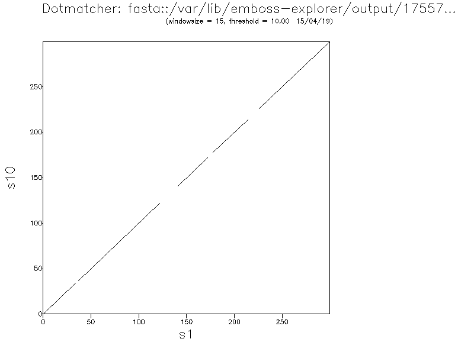
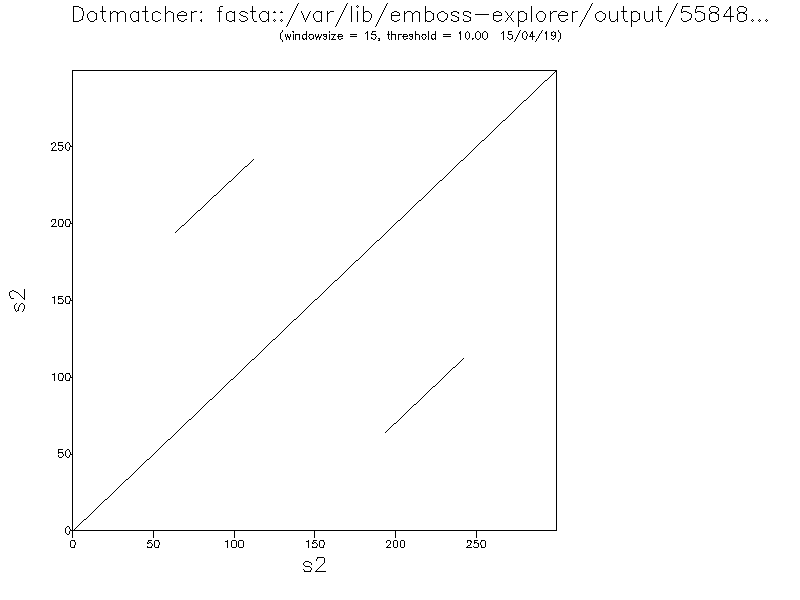
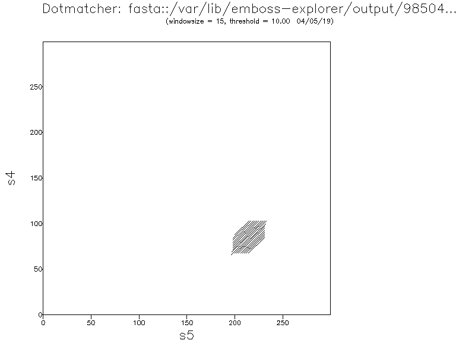
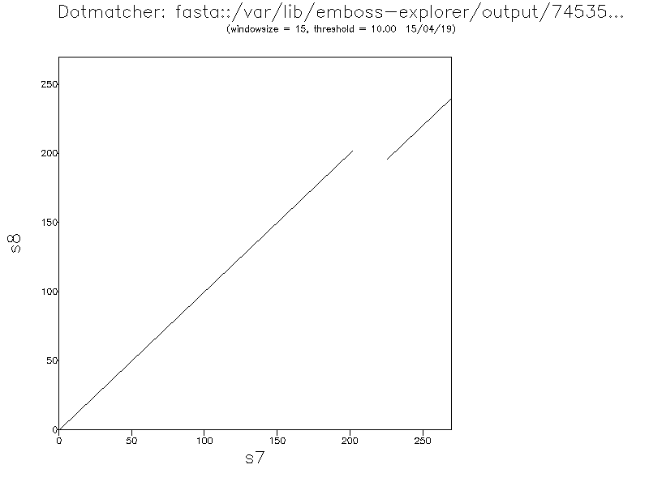
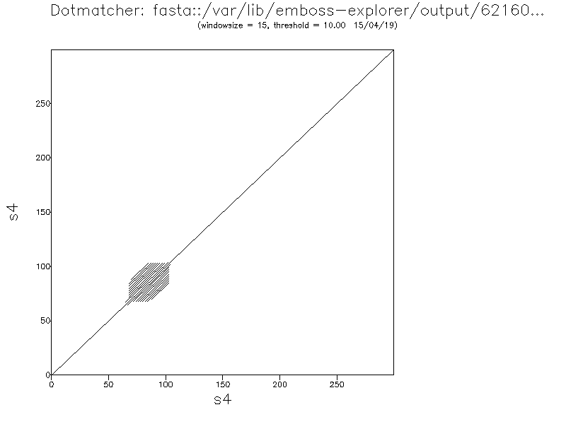

### Zad. 1

1. Długość przyrównania wynosi 9 pozycji.
2. Nukleotydy dopasowane są 5 pozycjach, a niedopasowane na 1 pozycji.
3. Procent identycznośc sekwencji wynosi: `60%` (6 / 10 * 100)
4. Wartość punktacji (`score`) przyrównania wynosi `5`.
   > 2 + 2 - 2 + 2 - 1 + 2 - 2 + 2 - 2 + 2 = 5


### Zad. 2
1. Procent identyczności wynosi `40%` (2 / 5 * 100)
2. Wartośc punktacji (`score`) przyrównania wynosi `4`.
   > 5 + 4 + 0 - 5
3. Procent podobieństwa wynosi `60%` (3 / 5 * 100)


### Zad. 3
Otwórz programy Needle i Water w osobnych kartach przeglądarki internetowej. Ustaw typ porównywanych sekwencji (`Enter a pair of`) jako `DNA`. Umieść pierwszą sekwencję w formacie FASTA w pierwszym oknie i drugą sekwencję w drugim oknie. Wykonaj przyrównanie.

Needle

```
########################################
# Program: needle
# Rundate: Sun 14 Apr 2019 12:05:20
# Commandline: needle
#    -auto
#    -stdout
#    -asequence emboss_needle-I20190414-120519-0694-86100052-p2m.asequence
#    -bsequence emboss_needle-I20190414-120519-0694-86100052-p2m.bsequence
#    -gapopen 10.0
#    -gapextend 0.5
#    -endopen 10.0
#    -endextend 0.5
#    -aformat3 pair
#    -snucleotide1
#    -snucleotide2
# Align_format: pair
# Report_file: stdout
########################################

#=======================================
#
# Aligned_sequences: 2
# 1: DNA
# 2: CDS
# Matrix: EDNAFULL
# Gap_penalty: 10.0
# Extend_penalty: 0.5
#
# Length: 2113
# Identity:     327/2113 (15.5%)
# Similarity:   327/2113 (15.5%)
# Gaps:        1786/2113 (84.5%)
# Score: 1239.0
# 
#
#=======================================

DNA                1 GGCCTAGCTAGGGCTGCTGTCCTGGGGTGGGCTGGGAATGGGCAGCCATC     50
                                                                       
CDS                1 --------------------------------------------------      0

DNA               51 AGGCAGGGGCCCCCTCACTCCCCTACCCCGACAACCTCGGCCCACCCATG    100
                                                                       
CDS                1 --------------------------------------------------      0

DNA              101 GGGGCATCTCGGGCAACCAGAGATAGAGGGCAGGGGTCTGGGGACAGCAG    150
                                                                       
CDS                1 --------------------------------------------------      0

DNA              151 CGTGAAGAGCCCCGCCCTGCAGCCTCCCGCACTCCTGGTCTAATGTGGAA    200
                                                                       
CDS                1 --------------------------------------------------      0

DNA              201 AGTGGCCCAGATGAGGGCTTTGCTCTCCTGGAGACATTTGCCCCCAGCTG    250
                                                                       
CDS                1 --------------------------------------------------      0

DNA              251 TGAGCAGGGACAGGACTGGCCACCAGCGCCTGGTTAAGACTCTAATGACC    300
                                                                       
CDS                1 --------------------------------------------------      0

DNA              301 ACCCCTCCCGGCCCTGAGGAAGAGGTGCTGACGACCAAGGAGATATTCCC    350
                                                                       
CDS                1 --------------------------------------------------      0

DNA              351 GCAGACCCAGCAGCCGGGAAATGATCTGGAAAGTGCAGCCTCAGCCCCCA    400
                                                                       
CDS                1 --------------------------------------------------      0

DNA              401 GCCATCTGCCAGCCCCTGCACCTCAGGCCCTAATGGGCCAGGCGGCAAGG    450
                                                                       
CDS                1 --------------------------------------------------      0

DNA              451 TTGGCAGGTAGGGGAGATGGGCTCTGGGCCTATAAAGCCAGCAGGGACCC    500
                                                                       
CDS                1 --------------------------------------------------      0

DNA              501 AGCAGCCCTCACGCCCGGGACCAGCTGCATCACAGGAGGCCAGCGAGCAG    550
                                                                       
CDS                1 --------------------------------------------------      0

DNA              551 GTCTGTTCCAAGGGCCTTCGAGCCAGTCTGGGCCCCAGGGCTGCCCCACT    600
                                                                       
CDS                1 --------------------------------------------------      0

DNA              601 CGGGGTTCCAGAGCAGTTGGACCCCAGGTCTCAGCGGGAGGGTGTGGCTG    650
                                                                       
CDS                1 --------------------------------------------------      0

DNA              651 GGCTCTGAAGCATTTGGGTGAGCCCAGGGGCTCAGGGCAGGGCACCTGCC    700
                                                                       
CDS                1 --------------------------------------------------      0

DNA              701 TTCAGCGGCCTCAGCCTGCCTGTCTCCCAGGTCTCTGTCCTTCCACCATG    750
                                                                    |||
CDS                1 -----------------------------------------------ATG      3

DNA              751 GCCCTGTGGATGCACCTCCTGCCCCTGCTGGCGCTGCTGGCCCTCTGGGG    800
                     ||||||||||||||||||||||||||||||||||||||||||||||||||
CDS                4 GCCCTGTGGATGCACCTCCTGCCCCTGCTGGCGCTGCTGGCCCTCTGGGG     53

DNA              801 ACCCGAGCCAGCCCCGGCCTTTGTGAACCAGCACCTGTGCGGCCCCCACC    850
                     ||||||||||||||||||||||||||||||||||||||||||||||||||
CDS               54 ACCCGAGCCAGCCCCGGCCTTTGTGAACCAGCACCTGTGCGGCCCCCACC    103

DNA              851 TGGTGGAAGCCCTCTACCTGGTGTGCGGGGAGCGAGGTTTCTTCTACGCA    900
                     ||||||||||||||||||||||||||||||||||||||||||||||||||
CDS              104 TGGTGGAAGCCCTCTACCTGGTGTGCGGGGAGCGAGGTTTCTTCTACGCA    153

DNA              901 CCCAAGACCCGCCGGGAGGCGGAGGACCTGCAGGGTGAGCCCCACCGCCC    950
                     |||||||||||||||||||||||||||||||||                 
CDS              154 CCCAAGACCCGCCGGGAGGCGGAGGACCTGCAG-----------------    186

DNA              951 CTCCGTGCCCCCGCCGCCCCCAGCCACCCCCACTCCCGCTGCTCCCACCC   1000
                                                                       
CDS              187 --------------------------------------------------    186

DNA             1001 AGCCTGGGCAGAAGGGGACAGGAGGCTGCTACCAGTAGGGAGACAGGTGG   1050
                                                                       
CDS              187 --------------------------------------------------    186

DNA             1051 ACTTTTTAAAAAGAAATGAAGTTCTCTTGGTCACATCCTGAAAGTGACCA   1100
                                                                       
CDS              187 --------------------------------------------------    186

DNA             1101 GCTCCCTGTGGCCCCGGCAGAATCTCAGCCTGAGGACGGTATTGGCTTCG   1150
                                                                       
CDS              187 --------------------------------------------------    186

DNA             1151 GCAGCTGAGCTCCGAGATACCTCGGAGGGCACGGCAGGGTAGGGTCCTCC   1200
                                                                       
CDS              187 --------------------------------------------------    186

DNA             1201 CTCCACGTGCCCCTCGAGCAAATGCCTCGCAGCCCACTTCTCCACCCTCA   1250
                                                                       
CDS              187 --------------------------------------------------    186

DNA             1251 CCTGAGGACCGCAGCTTCCAGTGTTTTGTTGAGTACATCAAGTCCTGGGT   1300
                                                                       
CDS              187 --------------------------------------------------    186

DNA             1301 GACCTGCGGTCACAGGGTGCCCCACGCTGCCTGCCTGTGGCAAATGCCCC   1350
                                                                       
CDS              187 --------------------------------------------------    186

DNA             1351 ATGGCACCCTGAGGAAGGCATGGCTGCTGCCACGGTGGGCCAGACCCCTG   1400
                                                                       
CDS              187 --------------------------------------------------    186

DNA             1401 TCCCCGGGCTTCATGACAGCCTCCATAGTCAGGAAATGGGGCAGGCACTG   1450
                                                                       
CDS              187 --------------------------------------------------    186

DNA             1451 GTGACAGGCCCTGGAAAGACGTACCGGGGGTACCCGTTCAGCCTCCTGCC   1500
                                                                       
CDS              187 --------------------------------------------------    186

DNA             1501 ATGGCACCACCCAGGGCATTGAAGTCCTGTATGTCCACACCCAGTGTGGG   1550
                                                                       
CDS              187 --------------------------------------------------    186

DNA             1551 GCACCCTTCCTCAACCTGGGCCCAGCTCGGCTGAGGGGGTGAGGGCGTGA   1600
                                                                       
CDS              187 --------------------------------------------------    186

DNA             1601 CCTGGGGCTGGCGGGCAGGCGGGCACCATCTCTCCCTGACTGTGCCATCC   1650
                                                                       
CDS              187 --------------------------------------------------    186

DNA             1651 TGCGTGCCTCTTCCTCGCCGCTGTTCCGGACCTGCTCTGCGTGGCTCGCC   1700
                                                                       
CDS              187 --------------------------------------------------    186

DNA             1701 CTGGCAGTGGGGCAGGTGGAGCTGGGTGGGGGCTCTATCACGGGCAGCCT   1750
                           ||||||||||||||||||||||||||||||||||||||||||||
CDS              187 ------GTGGGGCAGGTGGAGCTGGGTGGGGGCTCTATCACGGGCAGCCT    230

DNA             1751 GCCACCCTTGGAGGGTCCCATGCAGAAGCGTGGCGTCGTGGATCAGTGCT   1800
                     ||||||||||||||||||||||||||||||||||||||||||||||||||
CDS              231 GCCACCCTTGGAGGGTCCCATGCAGAAGCGTGGCGTCGTGGATCAGTGCT    280

DNA             1801 GCACCAGCATCTGCTCCCTCTACCAGCTGCAGAACTACTGCAACTAGACT   1850
                     |||||||||||||||||||||||||||||||||||||||||||||||   
CDS              281 GCACCAGCATCTGCTCCCTCTACCAGCTGCAGAACTACTGCAACTAG---    327

DNA             1851 GGGCCCACAGCGACCCCGTGCCCACTGCCACCTGCACCAGCACCTGCTCC   1900
                                                                       
CDS              328 --------------------------------------------------    327

DNA             1901 CTCTACCAGCTGGAGAACCACAGCTGGCTGCGGCCCACAGCAGGCCCAAA   1950
                                                                       
CDS              328 --------------------------------------------------    327

DNA             1951 TGCGGCCCTGCACCCTCCTCACCTGCACATGAGTGATGGAATAAAGCCTT   2000
                                                                       
CDS              328 --------------------------------------------------    327

DNA             2001 GAACCAGCTCTGCTGTGCTGTTTGCGTGTTTGGGGGGCCCTGGGCAGACC   2050
                                                                       
CDS              328 --------------------------------------------------    327

DNA             2051 CCGCCGTCCTGGCACTGTTATGAGCCCCTCCCAGCTCTCTCCAAGCTCTC   2100
                                                                       
CDS              328 --------------------------------------------------    327

DNA             2101 GCCCGGCCTGCAG   2113
                                  
CDS              328 -------------    327


#---------------------------------------
#---------------------------------------
```

Water

```
########################################
# Program: water
# Rundate: Sun 14 Apr 2019 12:05:26
# Commandline: water
#    -auto
#    -stdout
#    -asequence emboss_water-I20190414-120523-0124-13440315-p2m.asequence
#    -bsequence emboss_water-I20190414-120523-0124-13440315-p2m.bsequence
#    -gapopen 10.0
#    -gapextend 0.5
#    -aformat3 pair
#    -snucleotide1
#    -snucleotide2
# Align_format: pair
# Report_file: stdout
########################################

#=======================================
#
# Aligned_sequences: 2
# 1: DNA
# 2: CDS
# Matrix: EDNAFULL
# Gap_penalty: 10.0
# Extend_penalty: 0.5
#
# Length: 1100
# Identity:     327/1100 (29.7%)
# Similarity:   327/1100 (29.7%)
# Gaps:         773/1100 (70.3%)
# Score: 1239.0
# 
#
#=======================================

DNA              748 ATGGCCCTGTGGATGCACCTCCTGCCCCTGCTGGCGCTGCTGGCCCTCTG    797
                     ||||||||||||||||||||||||||||||||||||||||||||||||||
CDS                1 ATGGCCCTGTGGATGCACCTCCTGCCCCTGCTGGCGCTGCTGGCCCTCTG     50

DNA              798 GGGACCCGAGCCAGCCCCGGCCTTTGTGAACCAGCACCTGTGCGGCCCCC    847
                     ||||||||||||||||||||||||||||||||||||||||||||||||||
CDS               51 GGGACCCGAGCCAGCCCCGGCCTTTGTGAACCAGCACCTGTGCGGCCCCC    100

DNA              848 ACCTGGTGGAAGCCCTCTACCTGGTGTGCGGGGAGCGAGGTTTCTTCTAC    897
                     ||||||||||||||||||||||||||||||||||||||||||||||||||
CDS              101 ACCTGGTGGAAGCCCTCTACCTGGTGTGCGGGGAGCGAGGTTTCTTCTAC    150

DNA              898 GCACCCAAGACCCGCCGGGAGGCGGAGGACCTGCAGGGTGAGCCCCACCG    947
                     ||||||||||||||||||||||||||||||||||||              
CDS              151 GCACCCAAGACCCGCCGGGAGGCGGAGGACCTGCAG--------------    186

DNA              948 CCCCTCCGTGCCCCCGCCGCCCCCAGCCACCCCCACTCCCGCTGCTCCCA    997
                                                                       
CDS              187 --------------------------------------------------    186

DNA              998 CCCAGCCTGGGCAGAAGGGGACAGGAGGCTGCTACCAGTAGGGAGACAGG   1047
                                                                       
CDS              187 --------------------------------------------------    186

DNA             1048 TGGACTTTTTAAAAAGAAATGAAGTTCTCTTGGTCACATCCTGAAAGTGA   1097
                                                                       
CDS              187 --------------------------------------------------    186

DNA             1098 CCAGCTCCCTGTGGCCCCGGCAGAATCTCAGCCTGAGGACGGTATTGGCT   1147
                                                                       
CDS              187 --------------------------------------------------    186

DNA             1148 TCGGCAGCTGAGCTCCGAGATACCTCGGAGGGCACGGCAGGGTAGGGTCC   1197
                                                                       
CDS              187 --------------------------------------------------    186

DNA             1198 TCCCTCCACGTGCCCCTCGAGCAAATGCCTCGCAGCCCACTTCTCCACCC   1247
                                                                       
CDS              187 --------------------------------------------------    186

DNA             1248 TCACCTGAGGACCGCAGCTTCCAGTGTTTTGTTGAGTACATCAAGTCCTG   1297
                                                                       
CDS              187 --------------------------------------------------    186

DNA             1298 GGTGACCTGCGGTCACAGGGTGCCCCACGCTGCCTGCCTGTGGCAAATGC   1347
                                                                       
CDS              187 --------------------------------------------------    186

DNA             1348 CCCATGGCACCCTGAGGAAGGCATGGCTGCTGCCACGGTGGGCCAGACCC   1397
                                                                       
CDS              187 --------------------------------------------------    186

DNA             1398 CTGTCCCCGGGCTTCATGACAGCCTCCATAGTCAGGAAATGGGGCAGGCA   1447
                                                                       
CDS              187 --------------------------------------------------    186

DNA             1448 CTGGTGACAGGCCCTGGAAAGACGTACCGGGGGTACCCGTTCAGCCTCCT   1497
                                                                       
CDS              187 --------------------------------------------------    186

DNA             1498 GCCATGGCACCACCCAGGGCATTGAAGTCCTGTATGTCCACACCCAGTGT   1547
                                                                       
CDS              187 --------------------------------------------------    186

DNA             1548 GGGGCACCCTTCCTCAACCTGGGCCCAGCTCGGCTGAGGGGGTGAGGGCG   1597
                                                                       
CDS              187 --------------------------------------------------    186

DNA             1598 TGACCTGGGGCTGGCGGGCAGGCGGGCACCATCTCTCCCTGACTGTGCCA   1647
                                                                       
CDS              187 --------------------------------------------------    186

DNA             1648 TCCTGCGTGCCTCTTCCTCGCCGCTGTTCCGGACCTGCTCTGCGTGGCTC   1697
                                                                       
CDS              187 --------------------------------------------------    186

DNA             1698 GCCCTGGCAGTGGGGCAGGTGGAGCTGGGTGGGGGCTCTATCACGGGCAG   1747
                              |||||||||||||||||||||||||||||||||||||||||
CDS              187 ---------GTGGGGCAGGTGGAGCTGGGTGGGGGCTCTATCACGGGCAG    227

DNA             1748 CCTGCCACCCTTGGAGGGTCCCATGCAGAAGCGTGGCGTCGTGGATCAGT   1797
                     ||||||||||||||||||||||||||||||||||||||||||||||||||
CDS              228 CCTGCCACCCTTGGAGGGTCCCATGCAGAAGCGTGGCGTCGTGGATCAGT    277

DNA             1798 GCTGCACCAGCATCTGCTCCCTCTACCAGCTGCAGAACTACTGCAACTAG   1847
                     ||||||||||||||||||||||||||||||||||||||||||||||||||
CDS              278 GCTGCACCAGCATCTGCTCCCTCTACCAGCTGCAGAACTACTGCAACTAG    327


#---------------------------------------
#---------------------------------------
```

1. Badany gen składa się z dwóch egzonów. Na obu przyrównaniach widoczne są dopasowania dwóch osobnych fragmentów.
2. Pierwszy egzon jest w pozycji od `748` do `933`, a drugi egzon jest pozycji `1707-1847`.
3. Procent identyczności w programie Needle to `15.5%`, a w Water `29.7%`.
   * Needle prowadzi dopasowanie na całej długości wobec tego przyrównanie zawiera dużą liczbę przerw, które zmniejszają procent identyczności.


### Zad. 4
Zadanie na podstawie [DTU Course](http://teaching.healthtech.dtu.dk/36611/index.php/ExPairwiseAlignment).

Otwórz programy Needle w przeglądarce internetowej. Ustaw typ porównywanych sekwencji (`Enter a pair of`) jako `PROTEIN`. Umieść dwie sekwencje w formacie FASTA w osobnych polach. Wykonaj przyrównanie.

#### Przyrównanie globalne (Needle)

```
# Length: 361
# Identity:     176/361 (48.8%)
# Similarity:   214/361 (59.3%)
# Gaps:          92/361 (25.5%)
# Score: 916.0
# 
#
#=======================================

P29600             1 --------------------------------------------------      0
                                                                       
P41363             1 MRQSLKVMVLSTVALLFMANPAAASEEKKEYLIVVEPEEVSAQSVEESYD     50

P29600             1 ------------------------------------------AQSVPWGI      8
                                                               :|:|||||
P41363            51 VDVIHEFEEIPVIHAELTKKELKKLKKDPNVKAIEKNAEVTISQTVPWGI    100

P29600             9 SRVQAPAAHNRGLTGSGVKVAVLDTGISTHPDLNIRGGASFVPGEPSTQD     58
                     |.:....|||||:.|:|.:||||||||::||||.|.|||||:..|||..|
P41363           101 SFINTQQAHNRGIFGNGARVAVLDTGIASHPDLRIAGGASFISSEPSYHD    150

P29600            59 GNGHGTHVAGTIAALNNSIGVLGVAPSAELYAVKVLGASGSGSVSSIAQG    108
                     .|||||||||||||||||||||||||||:|||||||..:||||::|:|||
P41363           151 NNGHGTHVAGTIAALNNSIGVLGVAPSADLYAVKVLDRNGSGSLASVAQG    200

P29600           109 LEWAGNNGMHVANLSLGSPSPSATLEQAVNSATSRGVLVVAASGNSGAGS    158
                     :|||.||.||:.|:||||.|.|:|||.|||.|.:.|:|:|.|:||:|...
P41363           201 IEWAINNNMHIINMSLGSTSGSSTLELAVNRANNAGILLVGAAGNTGRQG    250

P29600           159 ISYPARYANAMAVGATDQNNNRASFSQYGAGLDIVAPGVNVQSTYPGSTY    208
                     ::|||||:..|||.|.|||..|||||.||..::|.||||||.|||.|:.|
P41363           251 VNYPARYSGVMAVAAVDQNGQRASFSTYGPEIEISAPGVNVNSTYTGNRY    300

P29600           209 ASLNGTSMATPHVAGAAALVKQKNPSWSNVQIRNHLKNTATSLGSTNLYG    258
                     .||:|||||||||||.|||||.:.||::|.|||..:..|||.|||.:|||
P41363           301 VSLSGTSMATPHVAGVAALVKSRYPSYTNNQIRQRINQTATYLGSPSLYG    350

P29600           259 SGLVNAEAATR    269
                     :|||:|..||:
P41363           351 NGLVHAGRATQ    361
```

1. Wartość punktacji przyrównania (`score`) to 916.
2. Długość przyrównania wynosi 361 pozycji.
3. Procent identyczności to `176/361 (48.8%)`.
4. Procent podobieństwa to `214/361 (59.3%)`
   > Procent podobieństwa jest zawsze wyższy od procentu identyczności, ponieważ oprócz identycznych reszt uwzględnia również substytucje aminokwasów podobnych (tj. takie substytucje, które są dodatnio punktowane w użytej macierzy substytucji, w tym przypadku macierzy `BLOSUM62`).


#### Przyrównanie lokalne (Water)

```
# Length: 269
# Identity:     176/269 (65.4%)
# Similarity:   214/269 (79.6%)
# Gaps:           0/269 ( 0.0%)
# Score: 916.0
# 
#
#=======================================

P29600             1 AQSVPWGISRVQAPAAHNRGLTGSGVKVAVLDTGISTHPDLNIRGGASFV     50
                     :|:||||||.:....|||||:.|:|.:||||||||::||||.|.|||||:
P41363            93 SQTVPWGISFINTQQAHNRGIFGNGARVAVLDTGIASHPDLRIAGGASFI    142

P29600            51 PGEPSTQDGNGHGTHVAGTIAALNNSIGVLGVAPSAELYAVKVLGASGSG    100
                     ..|||..|.|||||||||||||||||||||||||||:|||||||..:|||
P41363           143 SSEPSYHDNNGHGTHVAGTIAALNNSIGVLGVAPSADLYAVKVLDRNGSG    192

P29600           101 SVSSIAQGLEWAGNNGMHVANLSLGSPSPSATLEQAVNSATSRGVLVVAA    150
                     |::|:|||:|||.||.||:.|:||||.|.|:|||.|||.|.:.|:|:|.|
P41363           193 SLASVAQGIEWAINNNMHIINMSLGSTSGSSTLELAVNRANNAGILLVGA    242

P29600           151 SGNSGAGSISYPARYANAMAVGATDQNNNRASFSQYGAGLDIVAPGVNVQ    200
                     :||:|...::|||||:..|||.|.|||..|||||.||..::|.||||||.
P41363           243 AGNTGRQGVNYPARYSGVMAVAAVDQNGQRASFSTYGPEIEISAPGVNVN    292

P29600           201 STYPGSTYASLNGTSMATPHVAGAAALVKQKNPSWSNVQIRNHLKNTATS    250
                     |||.|:.|.||:|||||||||||.|||||.:.||::|.|||..:..|||.
P41363           293 STYTGNRYVSLSGTSMATPHVAGVAALVKSRYPSYTNNQIRQRINQTATY    342

P29600           251 LGSTNLYGSGLVNAEAATR    269
                     |||.:|||:|||:|..||:
P41363           343 LGSPSLYGNGLVHAGRATQ    361
```

5. Najlepsze przyrównania powinno się rozumieć jako przyrównanie, które w najlepszy sposób tłumaczy zmiany jakie zaszły w obu sekwencjach w toku ich ewolucji. Zatem przy wykonywaniu przyrównania zakładamy, że obie sekwencje wywodzą się od sekwencji wspólnego przodka. Trudno jest więc odpowiedzieć na pytanie, które z przyrównań jest lepsze, ponieważ nie znana jest ścieżka ewolucyjna obu sekwencji. Jednak ponieważ obie sekwencje są różnej długości, bardziej sensowne jest użycie algorytmu Smitha-Watermana (lokalne przyrównanie); umożliwia on analizę podobieństw i różnic we fragmentach sekwencji, które są w ogóle porównywalne ze sobą. Z kolei, używając globalnego przyrównania można łatwo zaobserwować, że sekwencje są bardzo podobne do siebie, z wyjątkiem brakującego fragmentu z N-końca pierwszej sekwencji długości ok. 90 reszt aminokwasowych. W tym przypadku wykonanie przyrównania globalne pozwoliło nam uzyskać dodatkową informację na temat dwóch sekwencji. Kiedy obie sekwencje są bardzo podobne - tak jak w tym przypadku - nie ma dużej różnicy pomiędzy lokalnym a globalnym przyrównaniem.
6. Wejdź na stronę bazy [UniProt](https://www.uniprot.org). Odszukaj dwa rekordy w oparciu o numery dostępu: [P29600](https://www.uniprot.org/uniprot/P29600) i [P41363](https://www.uniprot.org/uniprot/P41363). Na podstawie publikacji w rekordach, P29600 zawiera sekwencję otrzymano ze struktury przestrzennej, a P41363 zawiera sekwencję, którą przetłumaczono z DNA.
7. Na podstawie panelu `Subcellular location` oba białka są wydzielane poza komórkę (`Secreted protein`).
8. Na podstawie informacji w panelu `PTM/Processing` wynika, że `P29600` jest sekwencją dojrzałego białka (bez sygnałów peptydowych), natomiast `P41363` zawiera peptyd sygnałowy (w pozycji 1-24) oraz propeptyd (w pozycji 25-93). Oba peptydy są usuwany z dojrzałego białka. Różnica polega na ty, że sekwencja P41363 jest wynikiem tłumaczenie DNA i zawiera pełną informację o sekwencji kodującej, a P29600 powstaje ze struktury 3D, która dotyczy tylko dojrzałej sekwencji. Niedojrzała Savinase posiada dwa sygnały peptydowe.
9. Białko `P41363` prawdopodobnie mogłoby posłużyć jako składnik proszku do prania. Oba białka są tym samym typem proteazy (proteazy serynowe, rodziny S8) i obie są termostabilne. Sekwencje obu białek są również bardzo podobne. Potencjalnym problemem mogłoby być optymalne pH, lecz to mogłoby zostać zoptymalizowane w laboratorium.


### Zad. 5

#### Przyrównanie globalne (*Needle*):

```
# Length: 1289
# Identity:      73/1289 ( 5.7%)
# Similarity:   131/1289 (10.2%)
# Gaps:        1060/1289 (82.2%)
# Score: 158.5
```

#### Przyrównanie globalne (*Needle*, `END GAP PENALTY = true`)

```
# Length: 1255
# Identity:     110/1255 ( 8.8%)
# Similarity:   154/1255 (12.3%)
# Gaps:         992/1255 (79.0%)
# Score: -244.0
```

Włączona opcja `END GAP PENALTY` powoduje, że program punktuje ujemnie również kary za przerwy na końcach przyrównania. Ponieważ sekwencja peptydazy człowieka jest 4 razy dłuższa od sekwencji peptydazy *Savinase*, przyrównanie globalne zawiera więcej przerw (79%) niż aminokwasów (21%). W rezultacie, wartość punktacji przyrównania (`Score`) jest ujemna i wynosi `-244.0`. Domyślnie, w programie *Needle* opcja `END GAP PENALTY` jest wyłączona, a kary za przerwy na końcu przyrównania są ignorowane (jest to algorytm semi-globalny).

#### Przyrównanie lokalne (Water)

```
# Length: 296
# Identity:      71/296 (24.0%)
# Similarity:   129/296 (43.6%)
# Gaps:          73/296 (24.7%)
# Score: 173.0
#=======================================

P29600            23 GSGVKVAVLDTGISTHPDLNIRGGASFVPGEPSTQDGNGHGTHVAGTIAA     72
                     ||.....:|:..::.:.|.|:   .|.|      ..|..|||||| :|||
P29144           234 GSFGTAEMLNYSVNIYDDGNL---LSIV------TSGGAHGTHVA-SIAA    273

P29600            73 LNNSIGVL-------GVAPSAELYAVKV------LGASGSGSVSSIAQGL    109
                          |..       ||||.|::.::|:      ...:|:|.:.::.:.:
P29144           274 -----GHFPEEPERNGVAPGAQILSIKIGDTRLSTMETGTGLIRAMIEVI    318

P29600           110 EWAGNNGMHVANLSLGSPS---PSATLEQAVNSAT-SRGVLVVAASGNSG    155
                         |:...:.|.|.|..:   .|..:.:.:|.|. ...::.|:::||:|
P29144           319 ----NHKCDLVNYSYGEATHWPNSGRICEVINEAVWKHNIIYVSSAGNNG    364

P29600           156 --AGSISYP-ARYANAMAVGATDQNN--------------NRASFSQYGA    188
                       ..::..| ...::.:.|||....:              |:.::|..|.
P29144           365 PCLSTVGCPGGTTSSVIGVGAYVSPDMMVAEYSLREKLPANQYTWSSRGP    414

P29600           189 GLDIVAPGVNVQSTYPGSTYAS-----------LNGTSMATPHVAGAAAL    227
                     ..| .|.||::.:  ||...||           :|||||::|:..|..||
P29144           415 SAD-GALGVSISA--PGGAIASVPNWTLRGTQLMNGTSMSSPNACGGIAL    461

P29600           228 V----KQKNPSWSNVQIRNHLKNTATSLGSTNLY--GSGLVNAEAA    267
                     :    |..|..::...:|..|:|||....:..::  |.|::..:.|
P29144           462 ILSGLKANNIDYTVHSVRRALENTAVKADNIEVFAQGHGIIQVDKA    507
```
 
1. Przyrównanie lokalne i semiglobalne wskazują, że sekwencja prokariotycznej proteazy jest podobobna tylko do części sekwencji białkowej człowieka. Nie jest to natomiast widoczne opierając się na wynikach przyrównania globalnego, w którym wiele krótkich fragmentów przyrównane rozciąga się wzdłuż całej sekwencji człowieka. 
   Przyrównanie semiglobalne stanowi kompromis między globalnym i lokalnym przyrównaniem i często określane jest jako *glokalne*.
   W przypadku porównywania sekwencji odlegle spokrewnionych zaleca się używanie algorytmu lokalnego. Wskazuje on regiony między sekwencjami, które są ze sobą porównywalne.
2. Kiedy wykonujemy przyrównanie dwóch lub większej liczby sekwencji zakładamy, że mają one wspólne pochodzenie (tj. wywodzą się od sekwencji obecnej u wspólnego przodka). 
   W przypadku analizowanych w tym zadaniu sekwencji peptydaz *B. subtilis* i człowieka NIE mamy pewności, czy te sekwencje są ze sobą w ogóle spokrewnione. Bardzo często zdarza się, że niespokrewnione ze sobą sekwencje uzyskują jakieś przyrównanie, ale wtedy wartość punktacji (`score`) takiego przyrównania będzie niska. Wartość punktacji lokalnego przyrównania `P29600` i `P29144` wynosi `174`. Aby móc interpretować tę wartość należałoby znać zakres wartości punktacji, jaki należałoby oczekiwać przy przyrównywaniu niespokrewnionych sekwencji.
   Aby odpowiedzieć na to pytanie, można byłoby dokonać losowego ułożenia aminokwasów w jednej sekwencji. Wówczas jakakolwiek informacja o ewolucyjnym pokrewieństwie tej sekwencji zostałaby utracona, a taka sekwencja nie będzie spokrewniona z żadną inna sekwencją białkową (ale będzie miała taką samą długość i zawartość aminokwasów).
3. Zakres wyników przyrównania sekwencji `P29600` z losowo wygenerowaną sekwencją `P29144` będzie się różnił, ale najprawdopodobniej będzie się mieścił w poniższym zakresie:

   ```
   # Length: 100-300 
   # Identity: 20% -30%  
   # Similarity: 30% -40%  
   # Gaps #: 25% -40%  
   # Score: 40-70 
   ```

   Zatem takich właśnie wartości można się spodziewać podczas porównywania dwóch niespokrewnionych sekwencji o określonej długości i składzie aminokwasów. 
   > Wykonywanie wielu przyrównań *Savinase* z losową sekwencją człowieka dostarcza "modelu null", który następnie można zestawić z prawdziwym przyrównaniem *Savinase* / peptydaza człowieka. Gdyby wykonać procedurę randomizacji sekwencji 100 razy, zamiast 3, można by wyznaczyć przedział ufności dla uzyskanej wartości punktacji oraz jej istotność statystyczną (więcej na temat istotności statystycznej podczas omawiania programu BLAST).  
4. Porównując przyrównanie rzeczywistych sekwencji *Savinase / Human peptidase alignment* (score: `173`) z "celowo kiepskim" przyrównaniem *Savinase / losowa sekwencja*, oryginalne przyrównanie nie wydaje się już tak "kiepskie". Wartośc punktacji jest przynajmniej dwukrotnie wyższa od tych, które uzyskano w przyrównaniu zawierającym losową sekwencję. Warto zwrócić uwagę, że przy interpretacji wyników należy porównywać wartość punktacji aby zaobserwować wyraźną różnicę; inne wartości (identyczność, podobieństwo) mogą być podobne między oryginalnym przyrównaniem a przyrównaniem z losową sekwencją.


### Zad. 6

#### Zmniejszenie kary za przewy
Ponieważ kara za przerwę jest mała (niskie wartości), algorytm chętniej wprowadza przerwy do przyrównania, ponieważ nie mają one tak dużego wpływu na końcową wartość przyrównania (większy wpływ na obniżenie punktacji mają niedopasowania). Algorytm częściej wprowadza przerwy niż niedopasowanie dwóch reszt aminokwasowych/nukleotydowych. W rezultacie, uzyskane przyrównanie będzie zawierać wiele przerw. Takie przyrównanie staje się zatem niewiarygodne z biologicznego punktu widzenia.

```
# Gap_penalty: 1.0
# Extend_penalty: 0.2
#
# Length: 1252
# Identity:     192/1252 (15.3%)
# Similarity:   228/1252 (18.2%)
# Gaps:        1006/1252 (80.4%)
# Score: 727.4
# 
#
#=======================================

P29600             1 A-QSVPW---GISRVQAP-----AA--------HN-RG-----L-T----     22
                     | :. |:   |:  :  |     ||        :: ||     | |    
P29144             5 ATEE-PFPFHGL--L--PKKETGAASFLCRYPEYDGRGVLIAVLDTGVDP     49

P29600            23 GS-G--V------KVA-VLDT---G-IST----HP-D----------L--     41
                     |: |  |      |:. ::||   | ::|    .| |          |  
P29144            50 GAPGMQVTTDGKPKIVDIIDTTGSGDVNTATEVEPKDGEIVGLSGRVLKI     99

P29600            42 -----N--------IR-G--------------------------------     45
                          |        |: |                                
P29144           100 PASWTNPSGKYHIGIKNGYDFYPKALKERIQKERKEKIWDPVHRVALAEA    149

P29600            46 ------------G---A----------------SF------VPGEP----     54
                                 |   |                ||       || |    
P29144           150 CRKQEEFDVANNGSSQANKLIKEELQSQVELLNSFEKKYSD-PG-PVYDC    197

P29600            55 -----------------------ST--------Q----------------     57
                                            ||        |                
P29144           198 LVWHDGEVWRACIDSNEDGDLSKSTVLRNYKEAQEYGSFGTAEMLNYSVN    247

P29600            58 ---DGN--------G-HGTHVAGTIAA--L-----NNSIGVLGVAPSAE-     87
                        |||        | |||||| :|||  .     .|     ||||.|: 
P29144           248 IYDDGNLLSIVTSGGAHGTHVA-SIAAGHFPEEPERN-----GVAPGAQI    291

P29600            88 LYAVKVLG-A--S----GSG---------S-----VS-SI--A-----QG    108
                     | ::|: | .  |    |:|         :     |: |.  |     .|
P29144           292 L-SIKI-GDTRLSTMETGTGLIRAMIEVINHKCDLVNYSYGEATHWPNSG    339

P29600           109 -----L-E--W---------AGNNG-------------------------    116
                          : |  |         |||||                         
P29144           340 RICEVINEAVWKHNIIYVSSAGNNGPCLSTVGCPGGTTSSVIGVGAYVSP    389

P29600           117 --MHVA----------N--------------L--SL----G---S-P---    127
                       | ||          |              |  |:    |   | |   
P29144           390 DMM-VAEYSLREKLPANQYTWSSRGPSADGALGVSISAPGGAIASVPNWT    438

P29600           128 -------------SP----------S---A-----T-------LE-----    134
                                  ||          |   |     |       ||     
P29144           439 LRGTQLMNGTSMSSPNACGGIALILSGLKANNIDYTVHSVRRALENTAVK    488

P29600           135 --------------Q---A----V-N-S-A-------T---SRGV-L---    146
                                   |   |    | | | |       |   :||: |   
P29144           489 ADNIEVFAQGHGIIQVDKAYDYLVQNTSFANKLGFTVTVGNNRGIYLRDP    538

P29600           147 V-VAA-S----G----------NS---G-----A----GS-I---SY---    161
                     | ||| |    |          ||   .     |    .| :   |:   
P29144           539 VQVAAPSDHGVGIEPVFPENTENSEKISLQLHLALTSNSSWVQCPSHLEL    588

P29600           162 ------------PAR-------------Y--A--NA--M------AV-GA    173
                                 | |             |  |  ||  :      || .|
P29144           589 MNQCRHINIRVDP-RGLREGLHYTEVCGYDIASPNAGPLFRVPITAVIAA    637

P29600           174 ------------TD------Q-NNNR-----------A-----------S    182
                                 ||      | .  |           |           |
P29144           638 KVNESSHYDLAFTDVHFKPGQIR--RHFIEVPEGATWAEVTVCSCSSEVS    685

P29600           183 --F--------------S-Q-Y--------G----A-----G--------    189
                       |              | : |        |    |     |        
P29144           686 AKFVLHAVQLVKQRAYRSHEFYKFCSLPEKGTLTEAFPVLGGKAIEFCIA    735

P29600           190 -----L-----D-------IV--AP--------GVN---VQST--Y----    203
                          |     |       ||  ||        |:|   |||:  |    
P29144           736 RWWASLSDVNIDYTISFHGIVCTAPQLNIHASEGINRFDVQSSLKYEDLA    785

P29600           204 --------------------P-GS---------------TYASLN-----    212
                                         | ||               ||   |     
P29144           786 PCITLKNWVQTLRPVSAKTKPLGSRDVLPNNRQLYEMVLTY---NFHQPK    832

P29600           213 -G--T----------------S------------M----A----------    217
                      |  |                |            |    |          
P29144           833 SGEVTPSCPLLCELLYESEFDSQLWIIFDQNKRQMGSGDAYPHQYSLKLE    882

P29600           218 ----T-------------------P----H---------V------A---    222
                         |                   |    |         :      |   
P29144           883 KGDYTIRLQIRHEQISDLERLKDLPFIVSHRLSNTLSLDIHENHSFALLG    932

P29600           223 -----------------------------GA------A------------    225
                                                  ||      |            
P29144           933 KKKSSNLTLPPKYNQPFFVTSLPDDKIPKGAGPGCYLAGSLTLSKTELGK    982

P29600           226 -A--------LV----KQKN-------PS--------------------W    235
                      |        |:    |.||       .|                    |
P29144           983 KADVIPVHYYLIPPPTKTKNGSKDKEKDSEKEKDLKEEFTEALRDLKIQW   1032

P29600           236 ------S-----------N-----V----QI--------R--------N-    242
                           |           |     |    |:        |        | 
P29144          1033 MTKLDSSDIYNELKETYPNYLPLYVARLHQLDAEKERMKRLNEIVDAANA   1082

P29600           243 ---H-----L-----------------KN-------T------------A    248
                        |     |                 ||       |            |
P29144          1083 VISHIDQTALAVYIAMKTDPRPDAATIKNDMDKQKSTLVDALCRKGCALA   1132

P29600           249 -----T-------SL--------G-----S-----------T----N---    255
                          |       |.        |     |           |    |   
P29144          1133 DHLLHTQAQDGAISTDAEGKEEEGESPLDSLAETFWETTKWTDLFDNKVL   1182

P29600           256 -------L----YGSG------LV----------NA-E----------AA    267
                            |    ||.|      ||          |. :          |:
P29144          1183 TFAYKHALVNKMYGRGLKFATKLVEEKPTKENWKNCIQLMKLLGWTHCAS   1232

P29600           268 -T    268
                      |
P29144          1233 FT   1234
```

W wyniku zmniejszenia kary za wprowadzenie przerw (otwarcie przerwy = `1` i wydłużenie przerwy = `0.2`) otrzymane przyrównanie składa się w 80% z samych przerw.

#### Zwiększenie kary za przerwę
Ponieważ kara za przerwę jest duża, algorytm rzadziej wprowadza przerwy do przyrównania, ponieważ zaniżają one wartość punktacji bardziej niż wprowadzanie niedopasowania. W rezultacie, przyrównanie zawiera niewielką liczbę przerw.

```
# Gap_penalty: 20.0
# Extend_penalty: 1.0
#
# Length: 54
# Identity:      17/54 (31.5%)
# Similarity:    29/54 (53.7%)
# Gaps:           4/54 ( 7.4%)
# Score: 69.0
# 
#
#=======================================

EMBOSS_001       211 LNGTSMATPHVAGAAALV----KQKNPSWSNVQIRNHLKNTATSLGSTNL    256
                     :|||||::|:..|..||:    |..|..::...:|..|:|||....:..:
TPP2_HUMAN       445 MNGTSMSSPNACGGIALILSGLKANNIDYTVHSVRRALENTAVKADNIEV    494

EMBOSS_001       257 YGSG    260
                     :..|
TPP2_HUMAN       495 FAQG    498


#---------------------------------------
#---------------------------------------
```

W wyniku zwiększenie kary za wprowadzenie przerw (otwarcie przerwy = `20`, wydłużenie przerwy = `1`) otrzymane przyrównanie składa się w 7% z przerw.


### Zad. 7
Macierz substytucji (np. BLOSUM62) dostarcza informacji na temat wartości punktowania dopasowania i niedopasowania dwóch reszt aminokwasowych. Algorytmy służące do przyrównywania sekwencji (np. algorytm Smitha-Watermana) wykorzystują wartości w macierzach substytucji podczas wyznaczania przyrównania. Macierz substytucji ma zatem wpływ na wynik przyrównania (wszystkie wartości przyrównaniaL: punktacja, identyczność, podobieństwo, długość, liczba przerw).

#### BLOSUM30

```
# Matrix: EBLOSUM62
# Gap_penalty: 10.0
# Extend_penalty: 0.5
#
# Length: 296
# Identity:      71/296 (24.0%)
# Similarity:   129/296 (43.6%)
# Gaps:          73/296 (24.7%)
# Score: 173.0
# 
#
#=======================================

P29600            23 GSGVKVAVLDTGISTHPDLNIRGGASFVPGEPSTQDGNGHGTHVAGTIAA     72
                     ||.....:|:..::.:.|.|:   .|.|      ..|..|||||| :|||
P29144           234 GSFGTAEMLNYSVNIYDDGNL---LSIV------TSGGAHGTHVA-SIAA    273

P29600            73 LNNSIGVL-------GVAPSAELYAVKV------LGASGSGSVSSIAQGL    109
                          |..       ||||.|::.::|:      ...:|:|.:.::.:.:
P29144           274 -----GHFPEEPERNGVAPGAQILSIKIGDTRLSTMETGTGLIRAMIEVI    318

P29600           110 EWAGNNGMHVANLSLGSPS---PSATLEQAVNSAT-SRGVLVVAASGNSG    155
                         |:...:.|.|.|..:   .|..:.:.:|.|. ...::.|:::||:|
P29144           319 ----NHKCDLVNYSYGEATHWPNSGRICEVINEAVWKHNIIYVSSAGNNG    364

P29600           156 --AGSISYP-ARYANAMAVGATDQNN--------------NRASFSQYGA    188
                       ..::..| ...::.:.|||....:              |:.::|..|.
P29144           365 PCLSTVGCPGGTTSSVIGVGAYVSPDMMVAEYSLREKLPANQYTWSSRGP    414

P29600           189 GLDIVAPGVNVQSTYPGSTYAS-----------LNGTSMATPHVAGAAAL    227
                     ..| .|.||::.:  ||...||           :|||||::|:..|..||
P29144           415 SAD-GALGVSISA--PGGAIASVPNWTLRGTQLMNGTSMSSPNACGGIAL    461

P29600           228 V----KQKNPSWSNVQIRNHLKNTATSLGSTNLY--GSGLVNAEAA    267
                     :    |..|..::...:|..|:|||....:..::  |.|::..:.|
P29144           462 ILSGLKANNIDYTVHSVRRALENTAVKADNIEVFAQGHGIIQVDKA    507
```

#### BLOSUM62

```
# Matrix: EBLOSUM62
# Gap_penalty: 10.0
# Extend_penalty: 0.5
#
# Length: 296
# Identity:      71/296 (24.0%)
# Similarity:   129/296 (43.6%)
# Gaps:          73/296 (24.7%)
# Score: 173.0
# 
#
#=======================================

P29600            23 GSGVKVAVLDTGISTHPDLNIRGGASFVPGEPSTQDGNGHGTHVAGTIAA     72
                     ||.....:|:..::.:.|.|:   .|.|      ..|..|||||| :|||
P29144           234 GSFGTAEMLNYSVNIYDDGNL---LSIV------TSGGAHGTHVA-SIAA    273

P29600            73 LNNSIGVL-------GVAPSAELYAVKV------LGASGSGSVSSIAQGL    109
                          |..       ||||.|::.::|:      ...:|:|.:.::.:.:
P29144           274 -----GHFPEEPERNGVAPGAQILSIKIGDTRLSTMETGTGLIRAMIEVI    318

P29600           110 EWAGNNGMHVANLSLGSPS---PSATLEQAVNSAT-SRGVLVVAASGNSG    155
                         |:...:.|.|.|..:   .|..:.:.:|.|. ...::.|:::||:|
P29144           319 ----NHKCDLVNYSYGEATHWPNSGRICEVINEAVWKHNIIYVSSAGNNG    364

P29600           156 --AGSISYP-ARYANAMAVGATDQNN--------------NRASFSQYGA    188
                       ..::..| ...::.:.|||....:              |:.::|..|.
P29144           365 PCLSTVGCPGGTTSSVIGVGAYVSPDMMVAEYSLREKLPANQYTWSSRGP    414

P29600           189 GLDIVAPGVNVQSTYPGSTYAS-----------LNGTSMATPHVAGAAAL    227
                     ..| .|.||::.:  ||...||           :|||||::|:..|..||
P29144           415 SAD-GALGVSISA--PGGAIASVPNWTLRGTQLMNGTSMSSPNACGGIAL    461

P29600           228 V----KQKNPSWSNVQIRNHLKNTATSLGSTNLY--GSGLVNAEAA    267
                     :    |..|..::...:|..|:|||....:..::  |.|::..:.|
P29144           462 ILSGLKANNIDYTVHSVRRALENTAVKADNIEVFAQGHGIIQVDKA    507
```

#### BLOSUM90

```
# Matrix: EBLOSUM62
# Gap_penalty: 10.0
# Extend_penalty: 0.5
#
# Length: 296
# Identity:      71/296 (24.0%)
# Similarity:   129/296 (43.6%)
# Gaps:          73/296 (24.7%)
# Score: 173.0
# 
#
#=======================================

P29600            23 GSGVKVAVLDTGISTHPDLNIRGGASFVPGEPSTQDGNGHGTHVAGTIAA     72
                     ||.....:|:..::.:.|.|:   .|.|      ..|..|||||| :|||
P29144           234 GSFGTAEMLNYSVNIYDDGNL---LSIV------TSGGAHGTHVA-SIAA    273

P29600            73 LNNSIGVL-------GVAPSAELYAVKV------LGASGSGSVSSIAQGL    109
                          |..       ||||.|::.::|:      ...:|:|.:.::.:.:
P29144           274 -----GHFPEEPERNGVAPGAQILSIKIGDTRLSTMETGTGLIRAMIEVI    318

P29600           110 EWAGNNGMHVANLSLGSPS---PSATLEQAVNSAT-SRGVLVVAASGNSG    155
                         |:...:.|.|.|..:   .|..:.:.:|.|. ...::.|:::||:|
P29144           319 ----NHKCDLVNYSYGEATHWPNSGRICEVINEAVWKHNIIYVSSAGNNG    364

P29600           156 --AGSISYP-ARYANAMAVGATDQNN--------------NRASFSQYGA    188
                       ..::..| ...::.:.|||....:              |:.::|..|.
P29144           365 PCLSTVGCPGGTTSSVIGVGAYVSPDMMVAEYSLREKLPANQYTWSSRGP    414

P29600           189 GLDIVAPGVNVQSTYPGSTYAS-----------LNGTSMATPHVAGAAAL    227
                     ..| .|.||::.:  ||...||           :|||||::|:..|..||
P29144           415 SAD-GALGVSISA--PGGAIASVPNWTLRGTQLMNGTSMSSPNACGGIAL    461

P29600           228 V----KQKNPSWSNVQIRNHLKNTATSLGSTNLY--GSGLVNAEAA    267
                     :    |..|..::...:|..|:|||....:..::  |.|::..:.|
P29144           462 ILSGLKANNIDYTVHSVRRALENTAVKADNIEVFAQGHGIIQVDKA    507
```

Wraz ze wzrastającym indeksem BLOSUM (30-90), procent identyczności wzrasta, natomiast maleje długość przyrównania.


## Porównanie sekwencji: wykres Dot plot

### Zad. 8

#### s1:s1
Ciągła linia przekątna wskazuje na dopasowanie sekwencji na całej długości. 


#### s1:s10
Linia przekątna jest przerwana w trzech miejscach - są to regiony w sekwencjach, w których nie ma zgodności.



#### s2:s2
Ciągła linia przekątna wskazuje na dopasowanie sekwencji na całej długości. Porównywane sekwencje są zatem identyczne lub bardzo podobne (zgodnośc przynajmniej 10 na 15 nukleotydów). Dodatkowo, w sekwencjach występuje region (długości ok. 50 nukleotydów) dwukrotnie powtórzony w pozycji ok. 70, i 200.



#### s4:s5
Brak linii przekątnej wskazuje na brak podobieństwa sekwencji na całej długości. W obu sekwencjach występują wielokrotne powtórzenia krótkich fragmentów sekwencji (ok. 20-25 nukleotydów). Tego typu wielokrotne powtórzenia występujące blisko siebie w sekwencji nazywają się *powtórzeniami tandemowymi* (np. czterokrotne powtórzenie podsekwencji `AT` w ciągu `ATATATAT`). Liczba linii odpowiada liczbie powtarzających sie fragmentów. Długość linii oznacza długość fragmentu ulegającego powtórzeniu. Odległość linii od siebie oznacza odległość tych powtórzeń w sekwencji.




#### s7:s8
Przemieszczenie się przekątnej linii oznacza, że zaszła insercja w jednej sekwencji lub delecja w drugiej sekwencji. W tym przypadku, sekwencja `s7` jest dłuższa i zawiera fragment w pozycji `200-220`, który nie występuje w sekwencji `s8`. Zatem, fragment uległ insercji w sekwencji `s7` lub delecji w sekwencji `s8`.



#### s4:s4
Sekwencja `s4` na N-końcu (w pozycji 75-100) zawiera powtórzenia tandemowe.


