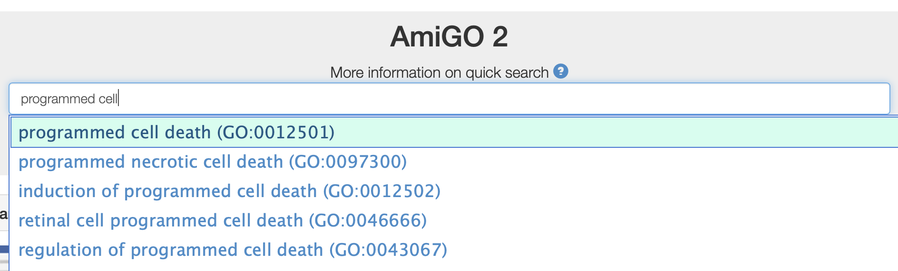

## UniProt

### Zad. 1 - Proste wyszukiwanie insuliny człowieka
1. W wyniku wpisania frazy `human insulin` znaleziono:
   * **1525** rekordów sekwencji z bazy `SwissProt`
     - *Reviewed*: sekwencje wysokiej jakości o potwierdzonym występowaniu i funkcji 
   * **3048** rekordów sekwencji z bazy `trEMBL`
     - *Unreviewed*: sekwencje niskiej jakości o niepotwierdzonym występowaniu i funkcji.
2. Szukane białko (`INS_HUMAN Insulin INS Homo sapiens (Human)`) jest na czwartym miejscu na liście białek.
   * Na liście rekordów znajdują się również białka pochodzące z innych organizmów nie będące insuliną.
3. Wybranie z panelu filtrów organizmu i nazwy białka spowodowało ograniczenie wyników do **199** rekordów człowieka, których nazwa zawiera wyraz `insulin`. 
   * Zapytanie użyte do przeszukania bazy znajduje się w oknie wyszukiwania:
      ```
      organism:human name:insulin
      ```
   * Insulina człowieka znajduje się teraz na 7 miejscu listy białek.
4. Dodanie do zapytania frazy `NOT name:protein-like` ograniczyło wyniki do **197** białek.
   * Insulina człowieka znajduje się nadal na 7 miejscu na liście znalezionych białek.
5. Zapytanie `organism:human name:insulin NOT name:insulin-like NOT name:receptor` ograniczyło liczbę wyników do **47** białek. 
   * Insulina człowieka znajduje się teraz na pierwszym miejscu listy wyników.
<br/><br/>

### Zad. 2 - Rekord UniProt insuliny człowieka
Numer dostępu rekordu insuliny człowieka: [P01308](https://www.uniprot.org/uniprot/P01308).

1. W lewym panelu `Display` wybierz `Publications`. W sumie `1 050` publikacji dotyczy białka insuliny człowieka. 
   * `1 014` publikacji typu **Computationally mapped** 
     - publikacje automatycznie pobrane z innych baz danych i niezweryfikowane przez pracowników UniProt
   * `36` publikacji typu **UniProtKB/Swiss-Prot**
     - zweryfikowane publikacje dotyczące szczegółowych informacji m.in. na temat funkcji, mutagenezy, struktury i interakcji tego białka z innymi białkami
2. Panel `Subcellular location` w rekordzie dostarcza informacji na temat występowania insuliny w organizmie człowieka. 
   * Białko jest wydzialane poza komórkę (*Extracellular region or secreted*). 
   * Zakładka `GO - Cellular compoenent` podaje wszystkie miejsca występowania białka (np. retikulum endocytoplazmatyczne, które stanowi tymczasową lokalizację białka zanim zostanie ono wydzielone z komórki)

   

3. Panel rekordu insuliny `PTM / Processing` w części `Molecule processing` informuje, że insulina posiada dwa sygnałowe peptydy: 
   * *Signal peptide* na N-końcu białka w pozycji 1-24 sekwencji. 
   * *Propeptide* na C-końcu w pozycji 57-97 sekwencji.

   

   Oba peptydy sygnałowe zostają usunięte z białka insuliny zanim białko zostanie wydzielone poza komórkę. Sekwencja dojrzałego białka insuliny (łańcuchy *A* i *B*) jest więc krótsza niż sekwencja wyświetlona w panelu `Sequences` (*The displayed sequence is further processed into a mature form.*)

4. Panel rekordu `Sequence`, w części `Natural variant` zawiera opisane w literaturze mutacje/polimorfizmy w sekwencji insuliny.

   

   W kolumnie `Description` zawarta jest informacja na temat zmiany aminokwasu w sekwencji. Jeżeli mutacja związana jest z chorobą, jednostka chorobowa oznaczona jest skrótem (np. `R → C in IDDM2`). Panel `Under Pathol./Biotech` dostarcza z kolei informacji na temat jednostki chorobowej rozwijając jej skrócony opis (np. `IDDM2` to skrót od cukrzycy typu 2).

5. Na dole rekordu insuliny, w panelu `Cross-references` znajdują się odnośniki dotyczące insuliny w innych bazach danych. W części `Sequence databases` tego panelu znajduje się numer dostępu sekwencji białkowej i mRNA insuliny w bazie RefSeq (`NP_000198.1` i `NM_000207.2`).

   
<br/>


### Zad. 3 - Zaawansowane wyszukiwanie: peptydy sygnałowe
Otwórz stronę [serwisu UniProt](https://www.uniprot.org/). Otwórz tryb zaawansowanego wyszukiwania (`Advanced`) i wybierz `PTM/Processing` > `Molecule Processing` > `Signal peptide` i naciśnij przycisk `Search`.


1. W bazie UniProt znajduje się ponad **10 milionów** białek zawierających peptydy sygnałowe. 
   * `41 893` białek należy do bazy *SwissProt* (*Reviewed*)
   * `10,787,160` białek należy do bazy *trEMBL* (*Unreviewed*). 
   
   Zapytanie do bazy: `annotation:(type:signal)`.

2. Lista wyszukanych białek zawierających peptydy sygnałowe obejmuje również białka, w których peptydy sygnałowe zostały wytypowane komputerowo (ich funkcja może nie być potwierdzona doświadczalnie). 
   Aby wyszukać białka zawierające peptydy sygnałowe o doświadczalnie potwierdzonej funkcji, skonstruuj poniższe zapytanie:

   ```
   annotation:(type:signal evidence:experimental)
   ```

   W wyniku otrzymano **3 650** białek z bazy *SwissProt* (takich białek nie ma w bazie `trEMBL`).

3. Aby wyszukać białka człowieka zawierające peptydy sygnałowe o doświadczalnie potwierdzonej funkcji, skonstruuj poniższe zapytanie:

   ```
   annotation:(type:signal evidence:experimental) AND organism:"Homo sapiens (Human) [9606]"
   ```

   W wyniku otrzymano **723** białek człowieka.

   W powyższym zapytaniu warto zwrócić uwagę na identyfikator taksonomiczny (`taxId`) z taksonomicznej bazy NCBI. Jeżeli zapytanie posiadałoby jedynie frazę `human` bez identifkatora `taxId`, w wyniku mogłyby również znaleźć się białka pochodzące na przykład z wirusa HIV (*Human immunodeficiency virus*).
<br/><br/>


### Zad. 4 - Zamiana numerów dostępu między UniProt a NCBI
Otwórz stronę serwisu [UniProt](https://www.uniprot.org). W menu znajdującycm się na górze stroy, naciśnij link `Retrieve/ID mapping`.

W formularzu:
* W polu tekstowym `Provide your identifiers` umieść identyfikatory NCBI.
* W polu `Select options` ustaw `from` na `UniProtKB AC/ID` a opcję `to` na `Refseq Protein`.
* Uruchom zamianę.


#### Wynik zamiany numerów dostępu z UniProt na RefSeq


1. W wyniku zamieniono 4 z 5 numerów dostępu.
   * Numer dostępu UniProt `B8XQC5_TETTH` nie został zamieniony. Zatem rekord ten nie występuje w bazie RefSeq i najprawdopodobniej należy do bazy GenBank.
2. Aby pobrać tabelę w formie tekstowej naciśnij przycisk `Download` i wybierz `Mapping table`.

   ```
   From  To
   TNR6A_HUMAN NP_055309.2
   TNR6A_HUMAN XP_005255314.1
   TNR6A_HUMAN XP_016878642.1
   TNR6A_HUMAN NP_001317449.1
   Q9UPQ9  NP_001020014.1
   Q9UPQ9  NP_001155973.1
   Q9UPQ9  NP_055903.2
   Q9HCJ0  NP_001136112.1
   Q9HCJ0  NP_061869.2
   Q5D869  NP_181532.2
   ```

Ponownie skorzystaj z narzędzie `Retrieve/ID Mapping` podając identyfikatory UniProt. Tym razem, w formularzu ustaw opcję `to` na `EMBL/GenBank/DDBJ`. W wyniku, otrzymano identyfikatory tych sekwencji w bazie *GenBank* dla wszystkich 5 numerów dostępu *UniProt*.
<br/><br/>

## Ontologia genów (Gene Ontology)

Ontologia genów składa się z trzech działów ontologii:

1. **Funkcja molekularna** (*molecular function*) - opisuje rolę produktu ekspresji genu na poziomie biochemicznym
2. **Proces biologiczny** (*biological process*) - opisuje cele biologiczne, do realizacji których przyczyniają się najczęściej co najmniej dwa produkty ekspresji genów.
3. **Składnik komórkowy** (*cellular component*) - opisuje miejsce w komórce, w którym znajdują się produkty ekspresji poszczególnych genów.

### Zad. 5 - Ontologia pojedynczego genu
Otwórz stronę [serwisu NCBI](https://www.ncbi.nlm.nih.gov). Wybierz bazę `Gene` i korzystając z zaawansowanego wyszukiwania utwórz zapytania:

```
CASP6[Gene Name] AND human[Organism] 
```

W wyniku otrzymany zostanie pojedynczy rekord o identyfikatorze genu (`Gene ID`): [839](https://www.ncbi.nlm.nih.gov/gene/839).

1. W panelu po prawej stronie, pod nagłówkiem `General Gene Information` wybierz `Gene Ontology`.
   * Funkcja komórkowa:
      - aktywność endopeptydazy zaangażowana w proces apoptozy
      - wiązanie białek
   * Proces biologiczny:
      - apoptoza
      - odpowiedź komórkowa na staurosporynę 
   * Składnik komórkowy:
      - cytoplazma
      - cytozol
      - nukleoplazma

   

2. Trzyliterowy kody (np. `IBA`, `TAS`) odnoszą się do opisu danego terminu ontologii. Informują one o  metodzie, według której przypisano dany terminu ontologii do danego genu. Skierowanie kursora myszy na dany kod wyświetli jego pełny opis. Na przykład:
   * skrót `IBA` (*Inferred from Biological aspect of Ancestor*) - dany termin GO został przypisany do tego genu na podstawie organizmu przodka filogenetycznego.
   * skrót `IMP` (*Inferred from Mutant Phenotype*) - termin GO został przypisany do tego genu na podstawie fenotypu mutanta tego genu.
3. W rekordzie genu, w panelu `Related sequences` znajduje się numer dostępu kodowanego przez ten gen białka w bazie UniProt: [UniProtKB/Swiss-Prot:P55212](https://www.uniprot.org/uniprot/P55212). 

   Tak, w rekordzie UniProt również znajdują się informacje dotyczące ontologii genów. Informacja na temat funkcji i procesu biologicznego znajduje się w panelu `Function`, a informacja o przedziale komórkowym znajduje się w panelu `Subcellular location` w zakładce `GO - Cellular component`.
<br/><br/>


### Zad. 6 - Wyszukiwanie genów zaangażowanych w dany proces biologicznych
Otwórz stronę serwisu [Gene Ontology](http://amigo.geneontology.org/amigo/). W polu wyszukiwania wpisz frazę `programmed cell death` i wybierz ją z listy autouzupełnień.



1. Numer dostępu procesu PCD w bazie *Gene Ontology* to [GO:0012501](http://amigo.geneontology.org/amigo/term/GO:0012501).
2. Proces PCD nie jest tożsamy z apoptozą. Według klasyfikacji GO, proces PCD ma szerszy zakres, a apoptoza jest składową procesu PCD.

   

3. Trzy przykładowe procesy wchodzące w skład PCD to:
   * autofagowa degradacja
   * autoliza
   * apoptoza

4. Procesem nadrzędnym dla PCD jest śmierć komórkowa `GO:0008219 cell death`.

#### Zakładka Annotations

5. Serwis kataloguje `35 523` genów zaangażowanych w proces PCD.

6. Po prawej stronie tabeli zawierającej listę białek, w panelu `Filter results`, naciśnij na opcję `Organism`. Z rozwiniętej listy organizmów, naciśnij na zielony przycisk `+` w celu zawężenia listy białek do organizmu człowieka. 

   W wyniku otrzymano `4525` genów człowieka biorących udział w PCD.

7. W panelu `Filter results`, rozwiń opcję `Evidence` i wybierz `Experimental evidence`. W wyniku otrzymano `1755` genów.

8. W panelu `Filter results` rozwiń opcję `Type` i wybierz `protein`. Następnie rozwiń opcję `Contributor` i wybierz `UniProt`. W wyniku otrzymano `1098` genów kodujących białko.

9. Wybierz dowolne białko z listy (np. [ACVR1C](http://amigo.geneontology.org/amigo/gene_product/UniProtKB:Q8NER5)). Naciśnij na numer dostępu tego białka w UniProt ([Q8NER5](https://www.uniprot.org/uniprot/Q8NER5)). 

   W rekordzie UniProt, w części `Function` znajduje się lista wszystkich funkcji oraz procesów biologicznych, w które zaangażowane jest białko `Q8NER5`. Przykładowymi procesami - innymi niż PCD - w które zaangażowane jest to białko to odpowiedź na insulinę (`response to insulin`) lub glukozę (`response to glucose`).
<br/><br/>


### Zad. 7 - Wzbogacenie terminów Gene Ontology (Gene Ontology Enrichment)

#### Amigo Gene Ontology
Otwórz stronę [Gene Ontology](http://amigo.geneontology.org/amigo/). W panelu `Term Enrichment Service` umieść listę genów i naciśnij przycisk `Submit`.


W powyższej tabeli znajduje się lista terminów GO związanych z procesem biologicznym, które są istotnie nadreprezentowane w zadanej grupie 20 genów (*p*-value < 0.05). W wierszach tabeli znajdują się terminy ontologii. 

1. Pierwsza kolumna zawiera nazwę danego terminu GO. 
2. Druga kolumna zawiera liczbę wszystkich referencyjnych genów człowieka przypisanych do tego terminu GO.
3. Trzecia kolumna zawiera liczbę genów w zestawie zapytania przypisanych do tego terminu GO.
4. Czwarta kolumna zawiera oczekiwaną liczbę genów w zestawie zapytania (przy założeniu częstości występowania danego terminu, jak w zestawie referencyjnym).
   > Na przykład, gdyby próba 20 genów została wybrana w sposób losowy, jeden gen (średnio `1.23` genu) powinien być przypisany do terminu `transmembrane transport`. Natomiast w zestawie 20 genów w tym zadaniu, `11` genów jest przypisanych do tego terminu.
5. Piąta kolumna `Fold Enrichment` to stosunek obserwowanej liczby genów w zestawie zapytania do oczekiwanej liczby genów. Wartość `Fold Enrichment` większa od `1` oznacza, że dany termin GO występuje częściej w zadanej próbie genów niż w zestawie referencyjnym.
6. Szósta kolumna (`+/-`) wskazuje, czy dany termin GO w zestawie zapytania jest nadreprezentowany (`+`) lub występuje w niedomiarze (`-`).
7. Siódma kolumna zawiera wartości *p*-value oznaczające prawdopodobieństwo otrzymania obserwowanej liczby genów przypisanej do danego terminu GO przez przypadek (tj. gdyby wylosować je z zestawu referencyjnego). Niskie wartości *p*-value oznaczają, że obserwowana liczba genów jest znacząco nadreprezentowana i interesująca. 

Powyższa lista obejmuje terminy, które otrzymały wartości *p* < `0.05`. Aby wyświetlić pełną listę terminów w próbie genów zapytania naciśnij link `click here to display all results`.

#### gProfiler
Otwórz stronę [gProfiler](https://biit.cs.ut.ee/gprofiler/gost). W polu tekstowym umieść listę 20 genów człowieka i naciśnij przycisk `Compute`. gProfiler przeprowadza statystyczną analizę wzbogacenia terminów GO.

##### Wykres Manhattan
Poniższy wykres Manhattan stanowi podsumowanie przeprowadzonej analizy wzbogacania terminów GO. Podobnie jak w przypadku *AmiGO*, na wykresie wyświetlone są terminy GO, które uzysały wartości *p* < `0.05`.
* Na osi `X` znajdują się terminy GO, które pogrupowowane są w kolory odpowiadające danemu działowi ontologii (np. funkcja moleukularna GO ma kolor czerwony `GO:MF`). Liczba w nawiasie `GO:MF (16)` to liczba terminów GO - w zestawie 20 genów zapytania - związanych z funkcją molekularną.
* Oś `Y` przedstawia dopasowane wartości *p* w ujemnej skali logarytimcznej. Im niższa wartość *p* (nadreprezentacja terminu GO jest bardziej znacząca), tym wyższa wartość `-log10(p)`.
* Punkt na wykresie oznacza termin GO, a odległość punktów od siebie oznacza stopień relacji między danymi terminami. Na przykład, zaznaczony na poniższym wykresie termin GO oznacza transport transbłonowy (`transemembrane transport`). Termin ten występuje w `1511` genów referencyjnych człowieka, a jego wartość *p* w zestawie zapytania wynosi `1.657 * 10^-5`. Termin ten jest zatem istotnie nadreprezentowany w zadanym zestawie genów.


##### Lista terminów GO
Bardziej szczegółowe informacje na temat przeprowadzonej analizy wzbogacenia terminów GO znajdują się w zakładce `Detailed Results`. gProfiler wyświetla nadreprezentowane terminy GO w formie tabeli, osobno dla: funkcji molekularnej (`GO:MF`), procesu biologicznego (`GO:BP`) i składnika komórkowego (`GO:CC`).


Na przykład, w ontologii związanej z funkcją molekularną, najbardziej nadreprezentowanym terminem jest aktywność transportowa kanału/poru `channel activity` (`GO:0015267`). Termin ten występuje w `10` spośród `20` zadanych genów. Kolor i odcień kwadratu oznaczają sposób, w jaki dany termin GO został przypisany do danego genu - np. kolory bordowe oznaczają, że dany termin przypisany został danemu genowi na drodze doświadczeń laboratoryjnych. Termin `channel activity` (`GO:0015267`) przypisano doświadczalnie `7` genom. Prawdopodobieństwo *p* wylosowania 10 genów z tym terminem GO wynosi `7.035 * 10^-9`.

#### ReviGO: wizualizacaja terminów GO
Powyższą listę terminów GO wraz z wartościami *p* można zapisać w formacie CSV. Pobraną listę można następnie wczytać w serwisie [ReviGO](http://revigo.irb.hr/) w celu jej graficznej prezentacji.


