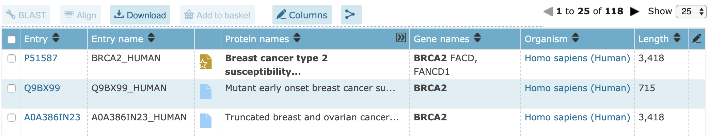
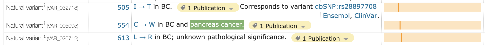

### Zad. 1 - Znajdź białko BRCA2 człowieka
Otwórz stronę serwisu [UniProt](https://www.uniprot.org). Użyj zaawansowanego wyszukiwania i skonstruuj poniższe zapytanie:

```
gene:brca2 AND organism:"Homo sapiens (Human) [9606]"
```



W wyniku otrzymano **118** rekordów białek. Szukane białko ([BRCA2_HUMAN](https://www.uniprot.org/uniprot/P51587)) znajduje się na pierwszym miejscu listy wyników.

1. Ponad `1600` artykułów odnosi się do białka BRCA2.
   * `77` artykułów typu *UniProtKB/Swiss-Prot*
   * `1 562` artykułów typu *Computationally mapped*

   Artykuły dotyczą wielu aspektów białka BRCA2, takich jak: funkcja, ekspresja, mutageneza, modyfikacje posttrasnlacyjne, interakcje z innymi białkami. 
2. Informacja na temat wpływu mutacji sekwencji białkowej BRCA2 zawarta jest w panelu `Pathology & Biotechi`. Mutacja `C` > `W` w pozycji `505` sekwencji aminokwasowej związana jest z rakiem trzustkim.

   

3. Informacja o powiązaniach białka BRCA2 z innymi bazami znajduje się w panelu `Cross-references`. W części `Sequence databases` znajduje się informacja o numerach dostępu odpowiadających temu białku w bazie RefSeq: [NP_000050.2](https://www.ncbi.nlm.nih.gov/protein/NP_000050.2), [NM_000059.3](https://www.ncbi.nlm.nih.gov/nuccore/NM_000059.3).
<br/><br/>

### Zad. 2 - Znajdź wszystkie białka bakterii dwoinki rzeżączki
Otwórz stronę serwisu [UniProt](https://www.uniprot.org). Użyj zaawansowanego wyszukiwania i skonstruuj poniższe zapytanie:

```
organism:"Neisseria gonorrhoeae [485]"
```

1. W wyniku otrzymano **12 711** rekordów białek:
   * `137` rekordów należy do bazy *SwissProt*
   * `12 574` rekordów należy do bazy *trEMBL*

2. W wyniku uwzględnienia wszystkich niższych jednostek taksonomicznych (podgatunków) *N. gonorrhoeae* otrzymano **24 248** białek:
   * `807` rekordów należy do bazy *SwissProt*
   * `23 441` rekordów należy do bazy *trEMBL* 
<br/><br/>

### Zad. 3 - Czy w bazie UniProt znajdują się białka dinozaura?
Otwórz stronę serwisu [UniProt](https://www.uniprot.org). Użyj zaawansowanego wyszukiwania i skonstruuj poniższe zapytanie:

```
organism:"Tyrannosaurus rex (Tyrant lizard king) [436495]"
```

1. W wyniku otrzymano **2** rekordy białek pochodzące z bazy *SwissProt*.
2. Oba znalezione rekordy są fragmentami białek kolagenowych typu 1.
   > Kolegane typu 1 obecny jest w kościach i ścięgnach.

   ```
   P0C2W2   CO1A1_TYREX reviewed Collagen alpha-1(I) chain (Alpha-1 type I collagen) (Fragments)
   P0C2W4   CO1A2_TYREX reviewed Collagen alpha-2(I) chain (Alpha-2 type I collagen) (Fragment)
   ```
3. Tak, powyższe fragmenty białkowe zostały wyizolowane z skamieniliny liczącej ponad 68 milionów lat.
4. Charakterystyczną cechą sekwencji białka `CO1A1_TYREX` jest występowanie w niej wielu nieokreślonych reszt aminokwasowych (`X`). Wyizolowane białko wymagało dokładnego oczyszczenia w celu usunięcia zanieczyszczeń.

   ```
   >sp|P0C2W2|CO1A1_TYREX Collagen alpha-1(I) chain (Fragments) OS=Tyrannosaurus rex
   GATGAPGIAGAPGFPGARGAPGPQGPSGAPGPKXXXXXXXXXXXXXXXXXXXXXXXXXXX
   XXXXXXXXXXXXXXXXXXXXXXXXXXXXXXXXXXXXXXXXXXXXXXXXXXXXXXXXXXXX
   XXXXXXXXXXXXXXXXXXXXXXXXXXXXXXXXXXXXXXXXXXXXXXXXXXXXXXXXXXXX
   XXXXXXXXXXXXXXXXXXXXXXXXXXXXXXXXXXXXXXXXXXXXXXXXXXXXXXXXXXXX
   XXXXXXXXXXXXXXXXXXXXXXXXXXXXXXXXXXXXXXXXXXXXXXXXGVQGPPGPQGPR
   XXXXXXXXXXXXXXXXXXXXXXXXXXXXXXXXXXXXXXXXXXXXXXXXXXXXXXXXXXXX
   XXXXXXXXXXXXXXXXXXXXXXXXXXXXXXXXXXXXXXXXXXXXXXXXXXXXXXXXXXXX
   XXXXXXXXXXXXXXXXXXXXXXXXXXXXXXXXXXXXXXXXXXXXXXXXGSAGPPGATGFP
   GAAGRXXXXXXXXXXXXXXXXXXXXXXXXXXXXXXXXXXXXXXXXXXXXXXXXXXXXXXX
   XXXXXXXXXXXXXXXXXXXXXGVVGLPGQR
   ```

   Druga sekwencja jest krótka (`18` aa) i wszystkie jej aminokwasy są określone.

   ```
   >sp|P0C2W4|CO1A2_TYREX Collagen alpha-2(I) chain (Fragment) OS=Tyrannosaurus rex
   GLPGESGAVGPAGPIGSR
   ```
<br/>

### Zad. 4 - Znajdź najkrótsze sekwencje białkowe człowieka
Otwórz stronę serwisu [UniProt](https://www.uniprot.org). Użyj zaawansowanego wyszukiwania i skonstruuj poniższe zapytanie: 

```
existence:"Evidence at protein level [1]" length:[1 TO 10]
```

1. W wyniku otrzymano `1 144` białek z bazy *SwissProt* i `147` białek z bazy *trEMBL*.

2. Korzystając z zaawasnowanego wyszukiwania zmodyfikuj poprzednie zapytanie: 
   > `Advanced` > `Sequence` > `Fragment` > `Sequence complete`

   ```
   existence:"Evidence at protein level [1]" length:[1 TO 10] fragment:no
   ```
   W wyniku otrzymano `783` rekordów z bazy *SwissProt* i `65` rekordów z bazy *trEMBL*.

3. Korzystając z zaawansowanego wyszukiwania zmodyfikuj poprzednie zapytanie: 

   ```
   existence:"Evidence at protein level [1]" length:[1 TO 10] fragment:no 
   AND organism:"Homo sapiens (Human) [9606]"
   ```

   W wyniku otrzymano `6` białek człowieka z bazy *SwissProt*.


#### Zapis sekwencji w formacie FASTA
Naciśnij przycisk `Download` > `Download all` > `Uncompressed` > Przycisk `GO`.

```
>sp|P0DPR3|TRDD1_HUMAN T cell receptor delta diversity 1 OS=Homo sapiens OX=9606 GN=TRDD1 PE=1 SV=1
EI
>sp|P22103|PNEU_HUMAN Pneumadin OS=Homo sapiens OX=9606 PE=1 SV=1
AGEPKLDAGV
>sp|P02728|GLEM_HUMAN Erythrocyte membrane glycopeptide OS=Homo sapiens OX=9606 PE=1 SV=1
CEGHSHDHGA
>sp|P02729|GLUR_HUMAN Urine glycopeptide OS=Homo sapiens OX=9606 PE=1 SV=1
CEHSHDGA
>sp|P01358|GAJU_HUMAN Gastric juice peptide 1 OS=Homo sapiens OX=9606 PE=1 SV=1
LAAGKVEDSD
>sp|P01858|TUFT_HUMAN Phagocytosis-stimulating peptide OS=Homo sapiens OX=9606 PE=1 SV=1
TKPR
```