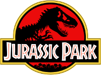

## Wyszukiwanie sekwencji podobnych (BLAST)

### Zad. 1 - Opis wyników programu BLAST
Poniżej znajduje się sekwencja mRNA insuliny gryzonia koszatniczki pospolitej (*Octodon degus*).

```
>M57671.1 Octodon degus insulin mRNA, complete cds
GCATTCTGAGGCATTCTCTAACAGGTTCTCGACCCTCCGCCATGGCCCCGTGGATGCATCTCCTCACCGT
GCTGGCCCTGCTGGCCCTCTGGGGACCCAACTCTGTTCAGGCCTATTCCAGCCAGCACCTGTGCGGCTCC
AACCTAGTGGAGGCACTGTACATGACATGTGGACGGAGTGGCTTCTATAGACCCCACGACCGCCGAGAGC
TGGAGGACCTCCAGGTGGAGCAGGCAGAACTGGGTCTGGAGGCAGGCGGCCTGCAGCCTTCGGCCCTGGA
GATGATTCTGCAGAAGCGCGGCATTGTGGATCAGTGCTGTAATAACATTTGCACATTTAACCAGCTGCAG
AACTACTGCAATGTCCCTTAGACACCTGCCTTGGGCCTGGCCTGCTGCTCTGCCCTGGCAACCAATAAAC
CCCTTGAATGAG
```

W serwisie [NCBI](https://www.ncbi.nlm.nih.gov) otwórz stronę programu `BLAST`. Wybierz program `Nucleotide BLAST`. W formularzu:

* W polu `Enter Query Sequence` umieść powyższą sekwencję w formacie FASTA
* W panelu  `Program Selection` wybierz `Somewhat similar sequences (blastn)`
* Uruchom program BLAST.

#### Odczytywanie wyników
Z listy otrzymanych trafień (panel `Descriptions`) zidentyfikuj sekwencję, która uzyskała najwyższą wartość punktacji (`Max score`). Odpowiedz na poniższe pytania dotyczące tej sekwencji:

1. Jaki jest numer dostępu sekwencji?
2. Ile wynosi wartość punktacji `Max score`?
   * O czym informuje ten parametr?
3. Ile wynosi wartość punktacji `Total score`?
   * O czym informauje ten parametr?
4. Ile wynosi procent identyczności między sekwencją zapytania (`Query`) i sekwencją z bazy danych (`Subject`)?
5. Ile wynosi wartość `Query cover`?
   * O czym informuje ten parametr?
6. Ile wynosi wartość `E-value`?
   * O czym informuje ten parametr?
7. Ile przerw znajduje się w tym przyrównaniu?
8. Ile wynosi długość przyrównania?

Na liście otrzymanych trafień znajdź najwyżej punktowaną sekwencję insuliny człowieka (*Homo sapiens*), która nie jest syntetycznym konstruktem.

* Odpowiedz na te same pytania 1-8 na temat przyrównania z sekwencją człowieka.

9. Jaka jest wielkość przeszukiwanej bazy danych (w liczbie nukleotydów)?
<br/><br/>


### Zad. 2 - Wpływ wielkości bazy danych na wartość E-value
Przeprowadź ponowne przeszukiwanie programem BLAST stosując jako zapytanie mRNA insuliny koszatniczki pospolitej `M57671.1`. W formularzu:

* Ogranicz przeszukiwanie do organizmu człowieka
* W panelu `Program Selection` wybierz `Somewhat similar sequences (blastn)`
* Uruchom program BLAST.

1. Czy w wynikach znalezione zostałe sekwencje człowieka z poprzedniego zadania?
2. Czy wartości poniższych parametrów są takie same, jak w poprzednim zadaniu?
   * punktacja (`Max score`),
   * identyczność
   * E-value
3. Jaka jest wielkość przeszukiwanej bazy danych (w liczbie nukleotydów)?
4. Ile wynosi stosunek wielkości baz danych użytych w poprzednim oraz obecnym zadaniu?
5. Ile wynosi stosunek E-value uzyskanych w poprzednim oraz obecnym przeszukiwaniu?
6. Jaka jest zależność między wielkością bazy danych a wartością E-value dla przyrównań o takiej samej wartości punktacji?
<br/><br/>

### Zad. 3 - Istotność statystyczna wyników BLAST

#### Sekwencje nukleotydowe
* Skorzystaj z serwisu internetowego [SeqGen](http://www.cbs.dtu.dk/biotools/SeqGen-1.0/) i wygeneruj trzy losowe sekwencje DNA o długości 25 pz.
* Otwórz serwis **nucleotide BLAST**. 
   * Umieść wygenerowane sekwencje w polu `Enter Query Sequence`.
   * W panelu `Program Selection` wybierz program `Somewhat similar sequences (blastn)`
   * W panelu `Algorithm parameters`:
      - Odznacz opcję `Automatically adjust parameters for short input sequences`
      - Ustaw `Expected threshold` = `50`
   
   

1. Czy BLAST zidentyfikował sekwencje w bazie danych podobne do trzech sekwencji zapytania?
2. Ile na ogół wynosi długość przyrównań?
3. Jaki zakres punktacji `Max Score` mają znalezione trafienia?
4. Jaki zakres wartości `E-value` mają znalezione trafienia?
5. Czy uzyskane wyniki są istotne biologiczne / czy dostarczają informacji biologicznej?

#### Sekwencje aminokwasowe
* Skorzystaj z serwisu internetowego [SeqGen](http://www.cbs.dtu.dk/biotools/SeqGen-1.0/) i wygeneruj trzy losowe sekwencje białkowe o długości 25 aminokwasów.
* Otwórz serwis **protein BLAST**. Użyj wygenerowanych sekwencji umieszczając je w polu `Enter Query Sequence` formularza BLAST.
   * W panelu `Algorithm parameters`:
      - Odznacza opcję `Automatically adjust parameters for short input sequences`
      - Ustaw `Expected threshold` na `1000`
    * Uruchom program BLAST.

6. Odpowiedz na pytania 1-5.

#### Porównanie istotności przeszukiwań nukleotydowych i aminokwasowych
7. Który typ sekwencji (DNA czy białko) obarczony jest większym ryzykiem otrzymania trafień fałszywie pozytywnych (tj. przyrównań, które wydają się znaczące, ale w rzeczywistości przyrównywane sekwencje nie są spokrewnione)?
<br/><br/>


### Zad. 4 - Wpływ długości sekwencji zapytania na wartość E-value
Poniżej znajdują się trzy różnej długośći fragmenty tej samej sekwencji tRNA. Użyj programu BLAST w celu przeszukania nukleotydowej bazy `nr` w oparciu o poniższe sekwencje.

```
>tRNA
TGGGGTATCGCCAAGCGGTAAGG
>tRNA
TGGGGTATCGCCAAGCGGTAAGGCACCGG
>tRNA
TGGGGTATCGCCAAGCGGTAAGGCACCGGTTTTTG
```

1. Z genomu jakiego organizmu pochodzą powyższe sekwencje?
2. Jak zmienia się wartość E-value w zależności od długości przyrównania?
3. Jaki aminokwas przyłącza analizowane tRNA?
<br/><br/>

### Zad. 5 - Wiele lokalnych przyrównań w obrębie porównywanych sekwencji
W książce Michaela Crichtona *Jurassic Park* na podstawie fragmentu sekwencji DNA dinozaura odtworzono cały organizm gada. Poniżej znajduje się ta sekwencja. 

```
>DinoDNA from JURASSIC PARK  p. 103 nt 1-1200
GCGTTGCTGGCGTTTTTCCATAGGCTCCGCCCCCCTGACGAGCATCACAAAAATCGACGC
GGTGGCGAAACCCGACAGGACTATAAAGATACCAGGCGTTTCCCCCTGGAAGCTCCCTCG
TGTTCCGACCCTGCCGCTTACCGGATACCTGTCCGCCTTTCTCCCTTCGGGAAGCGTGGC
TGCTCACGCTGTACCTATCTCAGTTCGGTGTAGGTCGTTCGCTCCAAGCTGGGCTGTGTG
CCGTTCAGCCCGACCGCTGCGCCTTATCCGGTAACTATCGTCTTGAGTCCAACCCGGTAA
AGTAGGACAGGTGCCGGCAGCGCTCTGGGTCATTTTCGGCGAGGACCGCTTTCGCTGGAG
ATCGGCCTGTCGCTTGCGGTATTCGGAATCTTGCACGCCCTCGCTCAAGCCTTCGTCACT
CCAAACGTTTCGGCGAGAAGCAGGCCATTATCGCCGGCATGGCGGCCGACGCGCTGGGCT
GGCGTTCGCGACGCGAGGCTGGATGGCCTTCCCCATTATGATTCTTCTCGCTTCCGGCGG
CCCGCGTTGCAGGCCATGCTGTCCAGGCAGGTAGATGACGACCATCAGGGACAGCTTCAA
CGGCTCTTACCAGCCTAACTTCGATCACTGGACCGCTGATCGTCACGGCGATTTATGCCG
CACATGGACGCGTTGCTGGCGTTTTTCCATAGGCTCCGCCCCCCTGACGAGCATCACAAA
CAAGTCAGAGGTGGCGAAACCCGACAGGACTATAAAGATACCAGGCGTTTCCCCCTGGAA
GCGCTCTCCTGTTCCGACCCTGCCGCTTACCGGATACCTGTCCGCCTTTCTCCCTTCGGG
CTTTCTCAATGCTCACGCTGTAGGTATCTCAGTTCGGTGTAGGTCGTTCGCTCCAAGCTG
ACGAACCCCCCGTTCAGCCCGACCGCTGCGCCTTATCCGGTAACTATCGTCTTGAGTCCA
ACACGACTTAACGGGTTGGCATGGATTGTAGGCGCCGCCCTATACCTTGTCTGCCTCCCC
GCGGTGCATGGAGCCGGGCCACCTCGACCTGAATGGAAGCCGGCGGCACCTCGCTAACGG
CCAAGAATTGGAGCCAATCAATTCTTGCGGAGAACTGTGAATGCGCAAACCAACCCTTGG
CCATCGCGTCCGCCATCTCCAGCAGCCGCACGCGGCGCATCTCGGGCAGCGTTGGGTCCT
```

Korzystając z programu `Nucleotide BLAST` i algorytmu `Highly similar sequences (megablast)` porównaj powyższą sekwencję z nukleotydową bazą sekwencji `Nucleotide collection (nr/nt)`. Następnie z listy trafień znajdź sekwencję, która najbardziej odpowiada sekwencji zapytania.

Odpowiedz na pytania:

1. Czy sekwencja rzeczywiście pochodzi z dinozaura?
2. Ile lokalnych przyrówań z sekwencją zapytania zostało zidentyfikowanych w tej sekwencji?
3. Ile wynosi wartość `Max score` i `Total score` dla tego przyrównania?
4. Spójrz na lokalne przyrównanie o najwyższej wartości `Max score`.
   * Podaj pozycję startu i końca tego przyrównania w sekwencji `Query` i `Subject`
   * Dlaczego pozycja startu w sekwencji `Subject` jest większa od pozycji końca?

#### Blast Two Sequences (Dot Matrix)
* Otwórz rekord sekwencji wektora i wyświetl sekwencje w formacie FASTA.
* W nowej karcie przeglądarki otwórz stronę `nucleotide BLAST`.
* W formularzu programu BLAST:
   - Zaznacz opcję `Align two or more sequences`
   - Wybierz program `Somewhat similar sequences (blastn)`
   - Umieść sekwencję zapytania w polu `Enter Query Sequence`
   - Umieść sekwencję wektora w polu `Enter Subject Sequence`
* Naciśnij przycisk `BLAST`


5. Spójrz na przyrównanie i wykres `Dot Matrix` obu sekwencji.
   * Jakie modyfikacje wprowadził Michael Crichron w sekwencji źródłowej?
<br/><br/>


### Zad. 6 - Wybór bazy danych dla programu BLAST
> Gen **FOXP2** u naczelnych warunkuje zdolność komunikacji werbalnej. Obecność zaledwie jednej uszkodzonej kopii tego genu u człowieka prowadzi do poważnych zaburzeń artykulacji wyrazów. 

Celem zadania jest sprawdzenie, czy gen *FOXP2* występuje również u zwierząt innych niż naczelne.

* W białkowej bazie NCBI znajdź sekwencję genu o nazwie *FOXP2* u człowieka. 
* Wejdź na stronę rekordu tego białka.
* Przejdź na stronę serwisu BLAST bezpośrednio z rekordu sekwencji - w panelu znajdującym się po prawej stronie rekordu, w części `Analyze this sequence` wybierz opcję `Run BLAST`.
* W formularzu programu BLAST ustaw ograniczenia przeszukiwania do:
   - bazy danych RefSeq (pole `Database`)
   - organizmu zwierząt (*Metazoa*) z wykluczeniem sekwencji pochodzących z naczelnych (*Primaters*)
   
* Uruchom program BLAST.

Z listy otrzymanych trafień wybierz jedną sekwencję, która najbardziej odpowiada sekwencji *FOXP2*.

1. Z jakiego organizmu pochodzi ta sekwencja?
2. Ile wynosi E-value tego dopasowania?
3. Podaj procent identyczności i podobieństwa tego dopasowania.
4. Ile przerw znajduje się w tym dopasowaniu?

#### Raport taksonomiczny (Taxonomy reports)

Skorzystaj z zakładki `Taxonomy reports`.

5. Ile trafień znaleziono wśród ssaków?
6. Czy program BLAST znalazł trafienia wśród ptaków, gadów lub płazów?