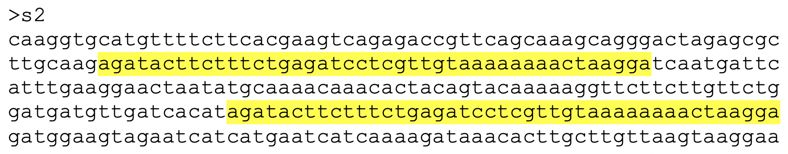

## Porównanie sekwencji: wykres Dot plot

### Zad. 1

#### s1:s1
Ciągła linia przekątna wskazuje na dopasowanie sekwencji na całej długości. Porównywane sekwencje są zatem identyczne lub bardzo podobne (poziom zgodności to przynajmniej 10 na 15 nukleotydów)


#### s1:s10
Linia przekątna jest przerwana w trzech miejscach - są to regiony w sekwencjach, w których nie ma zgodności.


```
# Aligned_sequences: 2
# 1: s1
# 2: s10
# Matrix: EDNAFULL
# Gap_penalty: 10.0
# Extend_penalty: 0.5
#
# Length: 319
# Identity:     267/319 (83.7%)
# Similarity:   267/319 (83.7%)
# Gaps:          38/319 (11.9%)
# Score: 1155.5
# 
#
#=======================================

s1                 1 caaggtgcatgttttcttcacgaagtcaga-gaccgttcag---caaagc     46
                     |||||||||||||||||||||||||||||| |||    |||   ||||||
s10                1 caaggtgcatgttttcttcacgaagtcagaggac----cagcgacaaagc     46

s1                47 agggactagagcgcttgcaagagatacttctttctgagatcctcgttgta     96
                     ||||||||||||||||||||||||||||||||||||||||||||||||||
s10               47 agggactagagcgcttgcaagagatacttctttctgagatcctcgttgta     96

s1                97 aaaaaaactaaggatcaatgattcatttgaaggaactaatatgca-----    141
                     ||||||||||||||||||||||||      .||  |.|.||.|||     
s10               97 aaaaaaactaaggatcaatgattc------cgg--ccagtacgcagagga    138

s1               142 ---aaacaaacactacagtacaaaaaggttct----tcttgttctggatg    184
                        .|.||||||||||||||||||||||||||    .|..||    ||||
s10              139 cgttatcaaacactacagtacaaaaaggttctaggagcgagt----gatg    184

s1               185 atgttgatcacatagatcagttaaatgcattagccgg---ggagcgtgaa    231
                     ||||||||||||||||||||||||||..||.|.|  |   ||||| .|||
s10              185 atgttgatcacatagatcagttaaatcgatgaac--gtccggagc-agaa    231

s1               232 tggtttggtgatggaagtagaatcatcataacaaccaaaagataaacact    281
                     ||||||||||||||||||||||||||||||||||||||||||||||||||
s10              232 tggtttggtgatggaagtagaatcatcataacaaccaaaagataaacact    281

s1               282 tgcttgttaagtaaggaac    300
                     |||||||||||||||||||
s10              282 tgcttgttaagtaaggaac    300
```

#### s2:s2
Ciągła linia przekątna wskazuje na dopasowanie sekwencji na całej długości. Dodatkowo, w sekwencjach występuje region (długości ok. 50 nukleotydów) dwukrotnie powtórzony w sekwencji w pozycji ok. 70, i 200 nukleotydu.




#### s4:s4
Sekwencja `s4` na N-końcu (w pozycji 75-100) zawiera liczne powtórzenia tandemowe.


#### s4:s5
Brak linii przekątnej wskazuje na brak podobieństwa sekwencji na całej długości. Porównywane sekwencje nie wykazują podobieństwa, poza wielokrotnymi powtórzeniami krótkich fragmentów sekwencji (ok. 15 nukleotydów). Tego typu wielokrotne powtórzenia występujące blisko siebie w sekwencji nazywają się **powtórzeniami tandemowymi** lub **powtórzeniami mikrosatelitarnymi** (np. czterokrotne powtórzenie podsekwencji `AT` w sekwencji `ATATATAT`).


Na powyższym wykresie dot plot:
* Liczba linii odpowiada liczbie powtórzonych fragmentów. 
* Długość linii oznacza długość fragmentu podlegającego powtórzeniu. 
* Odległość między liniami na wykresie oznacza odległości między tymi powtórzeniami w sekwencji.
   * Ponieważ powtórzenia `AT` występują bezpośrednie po sobie, odstęp między liniami jest prawie niewidoczny.


#### s7:s8
Przemieszczenie się linii przekątnej oznacza zajście insercji w jednej sekwencji lub delecji w drugiej sekwencji. W tym przypadku, sekwencja `s7` jest dłuższa i zawiera fragment w pozycji `200-220`, który nie występuje w sekwencji `s8`. Zatem, fragment uległ insercji w sekwencji `s7` lub delecji w sekwencji `s8`.


```
# Aligned_sequences: 2
# 1: s7
# 2: s8
# Matrix: EBLOSUM62
# Gap_penalty: 10.0
# Extend_penalty: 0.5
#
# Length: 300
# Identity:     240/300 (80.0%)
# Similarity:   240/300 (80.0%)
# Gaps:          60/300 (20.0%)
# Score: 1304.5
# 
#
#=======================================

s7                 1 caaggtgcatgttttcttcacgaagtcagagaccgttcagcaaagcaggg     50
                     ||||||||||||||||||||||||||||||||||||||||||||||||||
s8                 1 caaggtgcatgttttcttcacgaagtcagagaccgttcagcaaagcaggg     50

s7                51 actagagcgcttgcaagagatacttctttctgagatcctcgttgtaaaaa    100
                     ||||||||||||||||||||||||||||||||||||||||||||||||||
s8                51 actagagcgcttgcaagagatacttctttctgagatcctcgttgtaaaaa    100

s7               101 aaactaaggatcaatgattcatttgaaggaactaatatgcaaaacaaaca    150
                     ||||||||||||||||||||||||||||||||||||||||||||||||||
s8               101 aaactaaggatcaatgattcatttgaaggaactaatatgcaaaacaaaca    150

s7               151 ctacagtacaaaaaggttcttcttgttctggatgatgttgatcacata--    198
                     ||||||||||||||||||||||||||||||||||||||||||||||||  
s8               151 ctacagtacaaaaaggttcttcttgttctggatgatgttgatcacataga    200

s7               199 ----------------------------gaatggtttggtgatggaagta    220
                                                 ||||||||||||||||||||||
s8               201 tcagttaaatgcattagccggggagcgtgaatggtttggtgatggaagta    250

s7               221 gaatcatcataacaaccaaaagataaacacttgcttgttaagtaaggaac    270
                     ||||||||||||||||||||                              
s8               251 gaatcatcataacaaccaaa------------------------------    270
```
<br/>

## BLAST - blastn i blastp

### Zad. 2 - Opis wyników programu BLAST

#### Sekwencja mRNA *Octodon degus*


1. Numer dostępu sekwencji wykazującej największej podobieństwo do sekwencji zapytania to `M57671.1`.
   > Sekwencja użyta w zapytaniu znajduje się w przeszukiwanej bazie danych sekwencji. Dlatego najlepsze trafienie obejmuje przyrównanie sekwencji `M57671.1` samej do siebie.
2. Wartość punktacji `Max score` tego przyrównania wynosi `780` bitów. 
   > Parametr `Max score` określa wartość punktacji najwyżej ocenionego lokalnego przyrównania między sekwencją zapytania (`Query`) a sekwencją z bazy danych (`Subject`). Jeżeli w obrębie przyrównania tych dwóch sekwencji, BLAST zidentyfikowałby kilka lokalnych przyrównań, wtedy `Max score` przyjmuje najwyższą wartość punktacji wśród zidentyfikowanych lokalnych przyrównań.

3. Wartośc punktacji `Total score` tego przyrównania wynosi `780` bitów. 
   > Parametr `Total score` jest sumą wartości punktacji wszystkich znalezionych lokalnych przyrównań między sekwencją zapytania a sekwencją z bazy danych. Ponieważ w obrębie sekwencji `M57671.1` porównanej do samej siebie, BLAST zidentyfikował jedno lokalne przyrównanie, parametr `Total score` ma taką samą wartość jak parametr `Max score`.
4. Procent identyczności sekwencji zapytania i sekwencji bazy danych wynosi `100`.
5. Wartość `Query cover` wynosi `100%`.
   > Parametr ten określa procentowy udział długości sekwencji zapytania w przyrównaniu. W tym przypadku, przyrównaniem objęta jest pełnej długości sekwencja zapytania.
6. Wartość `E-value` wynosi `0` (precyzyjniej, bardzo niska liczba zaokrąglona do zera). 
   > Parametr **E-value** określa oczekiwaną liczbą sekwencji w bazie danych, których przyrównanie z zadaną sekwencją zapytania zostałoby ocenione co najmniej równie dobrze, jak obserwowana wartość punktacji (`score`) przyrównania.
7. W przyrównaniu nie występują przerwy.
8. Długość przyrównania wynosi `432` nukleotydy.

#### Sekwencje mRNA *Homo sapiens*


1. Numery dostępu 6 sekwencji człowieka otrzymały ównie wysokiej wartości punktacji (`Max score`): 

   ```
   NM_001291897.1, JQ951950.1, NM_001185098.1, NM_001185097.1, NM_000207.2, BC005255.1
   ```

2. Wartość punktacji `Max score` to `205` bitów.
3. Wartość punktacji `Total score` to `205` bitów.
4. Procent identyczności wynosi `74.49`.
5. Wartość `Query cover` wynosi `76%`.
6. Wartość `E-value` wynosi `1e-48`.
7. Przyrównanie zawiera `15` przerw, które stanowią `4%` całego przyrównania.
8. Długość przyrównania wynosi `341` nukleotydów.
9. Wielkość przeszukiwanej bazy `nr` to `204,700,810,597` nukleotydów.
   > U góry strony wynikowej programu BLAST naciśnij `Search summary` > `Number of letters`

<br/>

### Zad. 3 - Wpływ wielkości bazy danych na wartość E-value
Wynik programu BLAST przy użyciu sekwencji zapytania mRNA insuliny koszatniczki i ograniczeniu wyników do organizmu człowieka.


1. Tak, w wynikach znajdują się sekwencje człowieka z poprzedniego zadania (np. `NM_001291897.1`).
2. Nie, w stosunku do poprzedniego zadania, zmianie uległa wartość parametru *E*-value. W poprzednim przeszukaniu wartość E-value dla tych samych sekwencji wynosiła `1e-48`, w tym przeszukaniu wynosi `5e-50`. Wartości punktacji (`Max Score` i `Total Score`) oraz wartości identyczności nie uległy zmianie w stosunku do poprzedniego przeszukiwania.
3. Wielkość przeszukiwanej bazy `nr` z ograniczeniem do organizmy człowieka to `7,199,154,007` nukleotydów.
4. Stosunek wielkości dwóch baz danych to `204,700,810,597` / `7,199,154,007` = `28`.
5. Stosunek *E*-value w dwóch przeszukiwaniach wynosi `5e-50` / `1e-48` = `20`.
6. Wartość *E*-value jest wprost proporcjonalna do wielkości bazy. Wartość *E*-value wzrasta wraz ze wzrostem bazy danych.
   > Intuicyjnie, przyrównanie o punktacji na przykład 205 bitów jest badziej znaczące podczas przesukiwania mniejszej bazy danych. W większej bazie danych istnieje większa szansa znalezienia przypadkowych przyrównań o wartości punktacji co najmniej 205 bitów.

<br/>

### Zad. 4 - Istotność statystyczna wyników BLAST
BLAST prawie zawsze umożliwia odnalezienie sekwencji, które będą w jakiś sposób podobne do sekwencji w zapytaniu, mimo, że nie są one z nią spokrewnione (wyniki *fałszywie pozytywne*). W tym zadaniu użyte zostaną - jako sekwencje zapytania w programie BLAST - losowo wygenerowane sekwencje nukleotydowe i aminokwasowe.

#### Sekwencje nukleotydowe

Trzy losowe sekwencje DNA długości 25 pz wygenerowane w programie [SeqGen](http://www.cbs.dtu.dk/biotools/SeqGen-1.0/).

```
>seq1
GCTCGGGCCTGCCTCCTACCACGAC
>seq2
ACTTAAAAAGCGTAATACAGATAGA
>seq3
ATATCTGGAAGCGTGAACATTTATG
```

Wyniki programu **nucleotide BLAST** dla trzech różnych przeszukiwań można przeglądać korzystając z rozwijanego menu: `Results for`:


1. Tak, wiele sekwencji trafień zidentyfikowanych przez program BLAST wykazuje `90-100%` identyczność do losowo wygenerowanych sekwencji zapytania. Na przykład:

   ```
   >XM_004482443.3 PREDICTED: Dasypus novemcinctus Fanconi anemia complementation 
   group F (FANCF), mRNA
   Length=2393

    Score = 35.6 bits (38),  Expect = 12
    Identities = 22/24 (92%), Gaps = 0/24 (0%)
    Strand=Plus/Plus

   Query  2    CTCGGGCCTGCCTCCTACCACGAC  25
               |||||||||||| |||||||| ||
   Sbjct  771  CTCGGGCCTGCCGCCTACCACCAC  794
   ```

2. Długość przyrównań wynosi na ogół `17-22` nukleotydów.
3. Przyrównania przyjmują wartości `Max Score` w zakresie `33-36` bitów.
4. Przyrównania przyjmują wartości `E-value` w zakresie `12-42`.
   > W tych przeszukiwaniach najwyższa dopuszczalna wartość `E-value` została ustawiona w formularzu programu BLAST na `50`. Domyślnie w programie BLAST, `E-value` ma wartość `10`.
5. Otrzymane wyniki **nie mają żadnego sensu biologicznego(!)**. Sekwencje znalezione w bazie danych są rzeczywistymi sekwencjami DNA występującymi w organizmach. Natomiast, sekwencje zapytania są całkowicie losowe i pozbawione jakiejkolwiek pokrewieństwa z sekwencjami znajdującymi się w bazie danych. Zatem skojarzenie sekwencji zapytania z sekwencjami z bazy danych jest wynikiem czystego przypadku.

   Sekwencje zapytania są na tyle krótkie (25 nt), że bardzo często występują w rzeczywistych sekwencjach. Parametr `E-value` określa ich istotność statyczną - im niższa wartość *E*-value, tym mniejsze prawdopodobieństwo, że skojarzenie jest wynikiem zdarzenia losowego, a zatem tym bardziej jest ono istotne. W wynikach BLAST, trafienia uzyskały wartości tego parametru w zakresie `12-42`, co oznacza, że w bazie danych znajduje się od 12 do 42 przypadkowych sekwencji, które uzyskałyby równie dobre przyrównanie.

6. Dla losowych sekwencji DNA o długości `50` nukleotydów, program BLAST nie znajduje przyrównań na pełnej długości. Najdłuższe przyrównania są długości około `20-25` nukleotydów.


#### Sekwencje aminokwasowe
Trzy losowe sekwencje białkowe długości 25 reszt aminokwasowych wygenerowane w programie [SeqGen](http://www.cbs.dtu.dk/biotools/SeqGen-1.0/).

```
>seq1
LGPIYMVYWWEGECRCQSFASAKTT
>seq2
CTENAMFTPMHRGYSSNSDTMTQKP
>seq3
GSDHFLKQGSWKANKEKLWDIDLPP
```

6. Tak, wiele sekwencji trafień zidentyfikowanych przez program BLAST wykazuje podobieństwo do losowo wygenerowanych sekwencji zapytania. Na przykład:

   ```
   >WP_133225980.1 type I-C CRISPR-associated protein Cas7/Csd2 [Paenibacillus sp. 
   MS74]

    Score = 30.4 bits (67),  Expect = 39, Method: Composition-based stats.
    Identities = 9/20 (45%), Positives = 14/20 (70%), Gaps = 0/20 (0%)

   Query  4    IYMVYWWEGECRCQSFASAK  23
               ++ VYWWE  C+   ++SAK
   Sbjct  229  VHTVYWWEHNCKLGQYSSAK  248
   ```

   W wynikach programy BLAST uzyskano następujący zakres parametrów przyrównania:
   * Długość przyrównań wynosi na ogół 15-22 pozycji. 
     - W przyrównaniach jest niewiele przerw, najczęściej kilkanaście substytucji.
   * Trafienia przyjmują wartości `Max Score` w zakresie `33-36` bitów.
   * Trafienia przyjmują wartości `E-value` w zakresie `40-1000`.

7. Sekwencje nukleotydowe obarczone są większym ryzykiem uzyskania przyrównań fałszywie pozytywnych. Przyrównania sekwencji nukleotydowych o długości 25 pz uzyskują wartości *E*-value w zakresie `12-50`, natomiast przyrównania sekwencji aminokwasowych tej samej długości otrzymują wartości *E*-value rzędu `40-1000`.
<br/><br/>


### Zad. 5 - Wpływ długości sekwencji zapytania na wartość E-value

1. Trzy różnej długości sekwencje pochodzą z genomu bakterii *Escherichia coli* strain 103 i wielu innych Enterobakterii.

   

2. Wraz ze wzrostem wartości punktacji przyrównania (`score`), wartość *E*-value maleje (przyrównanie jest bardziej istotne). Z kolei, wartość punktacji przyrównania zależy od długości sekwencji zapytania.

   Długość sekwencji zapytania: **23 nt**

   ```
   >CP020495.1 Escherichia coli strain 103 chromosome, complete genome
   Length=5162123
 
    Features flanking this part of subject sequence:
      236 bp at 5' side: hypothetical protein
      642 bp at 3' side: 2-octaprenyl-3-methyl-6-methoxy-1,4-benzoquinol hydroxylase
 
    Score = 46.1 bits (23),  Expect = 0.008
    Identities = 23/23 (100%), Gaps = 0/23 (0%)
    Strand=Plus/Plus
 
   Query  1        TGGGGTATCGCCAAGCGGTAAGG  23
                   |||||||||||||||||||||||
   Sbjct  3554247  TGGGGTATCGCCAAGCGGTAAGG  3554269

   ```

   Długość sekwencji zapytania: **29 nt**

   ```
   >CP020495.1 Escherichia coli strain 103 chromosome, complete genome
   Length=5162123
 
    Features flanking this part of subject sequence:
      236 bp at 5' side: hypothetical protein
      636 bp at 3' side: 2-octaprenyl-3-methyl-6-methoxy-1,4-benzoquinol hydroxylase
 
    Score = 58.0 bits (29),  Expect = 6e-06
    Identities = 29/29 (100%), Gaps = 0/29 (0%)
    Strand=Plus/Plus
 
   Query  1        TGGGGTATCGCCAAGCGGTAAGGCACCGG  29
                   |||||||||||||||||||||||||||||
   Sbjct  3554247  TGGGGTATCGCCAAGCGGTAAGGCACCGG  3554275
   ```
 
   Długość sekwencji zapytania: **35 nt**

   ```
   >CP020495.1 Escherichia coli strain 103 chromosome, complete genome
   Length=5162123
 
    Features flanking this part of subject sequence:
      236 bp at 5' side: hypothetical protein
      630 bp at 3' side: 2-octaprenyl-3-methyl-6-methoxy-1,4-benzoquinol hydroxylase
 
    Score = 65.8 bits (35),  Expect = 2e-08
    Identities = 35/35 (100%), Gaps = 0/35 (0%)
    Strand=Plus/Plus
 
   Query  1        TGGGGTATCGCCAAGCGGTAAGGCACCGGTTTTTG  35
                   |||||||||||||||||||||||||||||||||||
   Sbjct  3554247  TGGGGTATCGCCAAGCGGTAAGGCACCGGTTTTTG  3554281
   ```

3. Na stronie wyników BLAST dla najdłuższej sekwencji zapytania, zwróć uwagę na pierwsze trafienie. Naciśnij na link `GenBank`.

   

   W części `FEATURES` rekordu `GenBank` znajduje się informacja o genie tRNA specyficznym dla glutaminy.

   ```
   FEATURES             Location/Qualifiers
        ...
        gene            1..>35
                       /locus_tag="CPA47_18610"
        tRNA            1..>35
                       /locus_tag="CPA47_18610"
                       /product="tRNA-Gln"
                       /inference="COORDINATES: profile:tRNAscan-SE:1.23"
                       /anticodon=(pos:3554279..3554281,aa:Gln,seq:ttg)
   ```
<br/>

### Zad. 6 - Wiele lokalnych przyrównań w obrębie porównywanych sekwencji


1. Sekwencja użyta w książce *Jurassic Park* nie pochodzi z dinozaura. Sekwencja pochodzi z sekwencji wektora `Cloning vector pAgaL6, complete sequence` o numerze dostępu [MH621333](https://www.ncbi.nlm.nih.gov/nuccore/MH621333.1).
2. Przyrównanie programem BLAST sekwencji zapytania i sekwencji wektora składa się z czterech lokalnych przyrównań (**HSP**, *High Scoring Pairs*).

    ```
    >MH621333.1 Cloning vector pAgaL6, complete sequence
    Length=7989

     Score = 435 bits (235),  Expect = 3e-117
     Identities = 360/410 (88%), Gaps = 50/410 (12%)
     Strand=Plus/Minus

    Query  302   GTAGGACAGGTGCCGGCAGCGCTCTGGGTCATTTTCGGCGAGGACCGCTTTCGCTGGAG-  360
                 ||||||||||||||||||||||||||||||||||||||||||||||||||||||||||| 
    Sbjct  6179  GTAGGACAGGTGCCGGCAGCGCTCTGGGTCATTTTCGGCGAGGACCGCTTTCGCTGGAGC  6120

    Query  361   ---------ATCGGCCTGTCGCTTGCGGTATTCGGAATCTTGCACGCCCTCGCTCAAGCC  411
                          |||||||||||||||||||||||||||||||||||||||||||||||||||
    Sbjct  6119  GCGACGATGATCGGCCTGTCGCTTGCGGTATTCGGAATCTTGCACGCCCTCGCTCAAGCC  6060

    Query  412   TTCGTCACT----------CCAAACGTTTCGGCGAGAAGCAGGCCATTATCGCCGGCATG  461
                 |||||||||          |||||||||||||||||||||||||||||||||||||||||
    Sbjct  6059  TTCGTCACTGGTCCCGCCACCAAACGTTTCGGCGAGAAGCAGGCCATTATCGCCGGCATG  6000

    Query  462   GCGGCCGACGCGCTGGGCT----------GGCGTTCGCGACGCGAGGCTGGATGGCCTTC  511
                 |||||||||||||||||||          |||||||||||||||||||||||||||||||
    Sbjct  5999  GCGGCCGACGCGCTGGGCTACGTCTTGCTGGCGTTCGCGACGCGAGGCTGGATGGCCTTC  5940

    Query  512   CCCATTATGATTCTTCTCGCTTCCGGCGGC----------CCGCGTTGCAGGCCATGCTG  561
                 ||||||||||||||||||||||||||||||          ||||||||||||||||||||
    Sbjct  5939  CCCATTATGATTCTTCTCGCTTCCGGCGGCATCGGGATGCCCGCGTTGCAGGCCATGCTG  5880

    Query  562   TCCAGGCAGGTAGATGACGACCATCAGGGACAGCTTCAA----------CGGCTCTTACC  611
                 |||||||||||||||||||||||||||||||||||||||          |||||||||||
    Sbjct  5879  TCCAGGCAGGTAGATGACGACCATCAGGGACAGCTTCAAGGATCGCTCGCGGCTCTTACC  5820

    Query  612   AGCCTAACTTCGATCACTGGACCGCTGATCGTCACGGCGATTTATGCCGC  661
                 ||||||||||||||||||||||||||||||||||||||||||||||||||
    Sbjct  5819  AGCCTAACTTCGATCACTGGACCGCTGATCGTCACGGCGATTTATGCCGC  5770


     Score = 359 bits (194),  Expect = 2e-94
     Identities = 298/340 (88%), Gaps = 40/340 (12%)
     Strand=Plus/Minus

    Query  1     GCGTTGCTGGCGTTTTTCCATAGGCTCCGCCCCCCTGACGAGCATCACAAAAATCGACGC  60
                 ||||||||||||||||||||||||||||||||||||||||||||||||||||||||||||
    Sbjct  4415  GCGTTGCTGGCGTTTTTCCATAGGCTCCGCCCCCCTGACGAGCATCACAAAAATCGACGC  4356

    Query  61    ----------GGTGGCGAAACCCGACAGGACTATAAAGATACCAGGCGTTTCCCCCTGGA  110
                           ||||||||||||||||||||||||||||||||||||||||||||||||||
    Sbjct  4355  TCAAGTCAGAGGTGGCGAAACCCGACAGGACTATAAAGATACCAGGCGTTTCCCCCTGGA  4296

    Query  111   AGCTCCCTCGTG----------TTCCGACCCTGCCGCTTACCGGATACCTGTCCGCCTTT  160
                 ||||||||||||          ||||||||||||||||||||||||||||||||||||||
    Sbjct  4295  AGCTCCCTCGTGCGCTCTCCTGTTCCGACCCTGCCGCTTACCGGATACCTGTCCGCCTTT  4236

    Query  161   CTCCCTTCGGGAAGCGTGGC---------T-GCTCACGCTGTACCTATCTCAGTTCGGTG  210
                 ||||||||||||||||||||         | ||||||||||||  |||||||||||||||
    Sbjct  4235  CTCCCTTCGGGAAGCGTGGCGCTTTCTCATAGCTCACGCTGTAGGTATCTCAGTTCGGTG  4176

    Query  211   TAGGTCGTTCGCTCCAAGCTGGGCTGTGTGC----------CGTTCAGCCCGACCGCTGC  260
                 |||||||||||||||||||||||||||||||          |||||||||||||||||||
    Sbjct  4175  TAGGTCGTTCGCTCCAAGCTGGGCTGTGTGCACGAACCCCCCGTTCAGCCCGACCGCTGC  4116

    Query  261   GCCTTATCCGGTAACTATCGTCTTGAGTCCAACCCGGTAA  300
                 ||||||||||||||||||||||||||||||||||||||||
    Sbjct  4115  GCCTTATCCGGTAACTATCGTCTTGAGTCCAACCCGGTAA  4076


     Score = 348 bits (188),  Expect = 3e-91
     Identities = 294/337 (87%), Gaps = 40/337 (12%)
     Strand=Plus/Minus

    Query  669   CGCGTTGCTGGCGTTTTTCCATAGGCTCCGCCCCCCTGACGAGCATCACAAA--------  720
                 ||||||||||||||||||||||||||||||||||||||||||||||||||||        
    Sbjct  4416  CGCGTTGCTGGCGTTTTTCCATAGGCTCCGCCCCCCTGACGAGCATCACAAAAATCGACG  4357

    Query  721   --CAAGTCAGAGGTGGCGAAACCCGACAGGACTATAAAGATACCAGGCGTTTCCCCCTGG  778
                   ||||||||||||||||||||||||||||||||||||||||||||||||||||||||||
    Sbjct  4356  CTCAAGTCAGAGGTGGCGAAACCCGACAGGACTATAAAGATACCAGGCGTTTCCCCCTGG  4297

    Query  779   AAGC----------GCTCTCCTGTTCCGACCCTGCCGCTTACCGGATACCTGTCCGCCTT  828
                 ||||          ||||||||||||||||||||||||||||||||||||||||||||||
    Sbjct  4296  AAGCTCCCTCGTGCGCTCTCCTGTTCCGACCCTGCCGCTTACCGGATACCTGTCCGCCTT  4237

    Query  829   TCTCCCTTCGGG---C-T-----TT-CTCAATGCTCACGCTGTAGGTATCTCAGTTCGGT  878
                 ||||||||||||   | |     || ||||  ||||||||||||||||||||||||||||
    Sbjct  4236  TCTCCCTTCGGGAAGCGTGGCGCTTTCTCATAGCTCACGCTGTAGGTATCTCAGTTCGGT  4177

    Query  879   GTAGGTCGTTCGCTCCAAGCTG----------ACGAACCCCCCGTTCAGCCCGACCGCTG  928
                 ||||||||||||||||||||||          ||||||||||||||||||||||||||||
    Sbjct  4176  GTAGGTCGTTCGCTCCAAGCTGGGCTGTGTGCACGAACCCCCCGTTCAGCCCGACCGCTG  4117

    Query  929   CGCCTTATCCGGTAACTATCGTCTTGAGTCCAACACG  965
                 |||||||||||||||||||||||||||||||||| ||
    Sbjct  4116  CGCCTTATCCGGTAACTATCGTCTTGAGTCCAACCCG  4080


     Score = 289 bits (156),  Expect = 2e-73
     Identities = 231/261 (89%), Gaps = 30/261 (11%)
     Strand=Plus/Minus

    Query  970   AACGGGTTGGCATGGATTGTAGGCGCCGCCCTATACCTTGTCTGCCTCCCCGCG------  1023
                 ||||||||||||||||||||||||||||||||||||||||||||||||||||||      
    Sbjct  5753  AACGGGTTGGCATGGATTGTAGGCGCCGCCCTATACCTTGTCTGCCTCCCCGCGTTGCGT  5694

    Query  1024  ----GTGCATGGAGCCGGGCCACCTCGACCTGAATGGAAGCCGGCGGCACCTCGCTAACG  1079
                     ||||||||||||||||||||||||||||||||||||||||||||||||||||||||
    Sbjct  5693  CGCGGTGCATGGAGCCGGGCCACCTCGACCTGAATGGAAGCCGGCGGCACCTCGCTAACG  5634

    Query  1080  G----------CCAAGAATTGGAGCCAATCAATTCTTGCGGAGAACTGTGAATGCGCAAA  1129
                 |          |||||||||||||||||||||||||||||||||||||||||||||||||
    Sbjct  5633  GATTCACCACTCCAAGAATTGGAGCCAATCAATTCTTGCGGAGAACTGTGAATGCGCAAA  5574

    Query  1130  CCAACCCTTGGC----------CATCGCGTCCGCCATCTCCAGCAGCCGCACGCGGCGCA  1179
                 ||||||||||||          ||||||||||||||||||||||||||||||||||||||
    Sbjct  5573  CCAACCCTTGGCAGAACATATCCATCGCGTCCGCCATCTCCAGCAGCCGCACGCGGCGCA  5514

    Query  1180  TCTCGGGCAGCGTTGGGTCCT  1200
                 |||||||||||||||||||||
    Sbjct  5513  TCTCGGGCAGCGTTGGGTCCT  5493
    ```

3. Wartośc parametru `Max Score` = `435`, a `Total Score` = `1431`.

4. Najwyżej punktowane przyrównanie lokalne między sekwencją zapytania a wektorem znajduje się w pozycji `302-661` w sekwencji zapytania i w pozycji `6179-5770` sekwencji wektora. 
   * W sekwencji wektora, pozycja startu przyrównania jest większa od pozycji końca, ponieważ odnosi się do sekwencji komplementarnej. Zatem w tym przyrównaniu, sekwencja zapytania jest na nici `plus`, natomiast sekwencja wektora na nici `minus`.

#### Blast Two Sequences (Dot Matrix)


5. Michael Crichron złożył sekwnecję "dinozaura" z czterech fragmentów sekwnecji wektora. Dwa fragmenty pochodzą z tego samego regionu sekwencji wektora (w pozycji ok. `4000-4500`). Z każdego z czterech fragmentów Michael usunął w równych odstępach kilka krótszych fragmentów długości ok. 10 nukleotdyów. Połączył cztery fragmenty ze sobą w jedną sekwencję. Następnie utworzył sekwencję do niej komplementarną. Otrzymaną sekwencję umieścił w książce *Jurassic Park*.
<br/><br/>


### Zad. 7 - Wybór bazy danych dla programu BLAST
W [białkowej bazie NCBI](https://www.ncbi.nlm.nih.gov/protein) skorzystaj z zaawansowanego wyszukiwania i utwórz zapytanie do bazy danych:

```
FOXP2[Gene Name] AND Homo sapiens[Organism] 
```

Wybierz rekord `forkhead box protein P2 isoform I [Homo sapiens]` o numerze dostępu [NP_055306](https://www.ncbi.nlm.nih.gov/protein/NP_055306.1). W panelu `Analyze this sequence` po prawej stronie w rekordzie sekwencji, naciśnij link `Run BLAST`.

Formularz programu BLAST:


1. Sekwencją najbardziej odpowiadającą sekwenji FOXP2 człowieka jest sekwencja przewidzianego białka `forkhead box protein P2` u kreta gwiazdonosa amerykańskiego (*Condylura cristata*).
2. `E-value` najlepiej punktowanego przyrównania wynosi `0`.
3. Procent identyczności i podobieństwa tych dwóch sekwencji wynosi `99%`.
4. W przyrównaniu jest jedna przerwa w sekwencji trafienia.

    

#### Taxonomy reports

5. Wśród ssaków BLAST znalazł `81` trafień.
6. Tak, BLAST zwrócił trafienia wśród ptaków (np. *Parus major*), gadów (np. *Crocodylus porosus*) i płazów (np. jaszczurka *Anolis carolinensis*).

   
<br/>


### Zad. 8 - Przeszukiwanie pełnych sekwencji genomu
Wynik przeszukiwania programu *megablast* w genomie człowieka.


Sekwencja zapytania pochodzi z chromosomu 17 człowieka. Jednak, najwyżej punktowane trafienie dotyczy niekompletnej sekwencji chromosomu 17 (numer dostępu w bazie RefSeq to `NT_187663.1`, gdzie `NT_` oznacza sekwencje *contigu*). Pełne złożenie chromosomu 17 ma numer dostępu `NC_000017.11`. Sekwencja zapytania pochodzi z nici `plus` chromosomu `NC_000017.11` i znajduje się w pozycji `45 961 145 - 45 965 104`.

Aby odpowiedzieć na pytanie, jaki gen zawarty jest lokalizacji `45 961 145 - 45 965 104` chromosomu 17, naciśnij na link `GenBank` znajdujący się nad przyrównaniem sekwencji zapytania i `NC_000017.11` (`Range 1: 45961145 to 45965104`). W rekordzie sekwencji odpowiadającym temu regionowi, w części `FEATURES` znajduje się gen **MAPT**.

```
FEATURES             Location/Qualifiers
     ...
     gene            <1..>3960
                     /gene="MAPT"
                     /gene_synonym="DDPAC; FTDP-17; MAPTL; MSTD; MTBT1; MTBT2;
                     PPND; PPP1R103; TAU"
``` 

Współrzędne sekwencji `<1..>3960` oznaczają, że pełnej długości gen MAPT rozciąga się poniżej (`<1`) i powyżej (`>3960`) wyświetlonej sekwencji. Aby poznać dokładną lokalizację genu MAPT na sekwencji chromosomu 17, naciśnij na identyfikator genu MAPT (*GeneID*: [4137](https://www.ncbi.nlm.nih.gov/gene/4137)).


Gen **MAPT** znajduje się na chromosomie 17 w pozycji `45 894 382` - `46 028 334` na nici `plus`.
<br/><br>

### Zad. 9 - Ograniczenie bazy sekwencji BLAST przez zapytanie Entrez
Otwórz stronę serwisu [nucleotide BLAST](https://blast.ncbi.nlm.nih.gov/Blast.cgi?PROGRAM=blastn&PAGE_TYPE=BlastSearch&LINK_LOC=blasthome). W polu tekstowym umieść sekwencję zapytania, a w polu `Entrez` umieść poniższe zapytanie.

```
protein kinase[All fields] AND mrna[Filter] AND 1000:10000000[SLEN]
```


1. Sekwencja trafienia wykazująca największą wartość punktacji:

```
>XM_011776823.1 Trypanosoma brucei gambiense DAL972 polo-like protein kinase 
partial mRNA
Length=1830

 Score = 312 bits (345),  Expect = 4e-83
 Identities = 189/200 (95%), Gaps = 0/200 (0%)
 Strand=Plus/Plus

Query  1    CGGGACCTTAAGCTTGACAACATAATGATGGATGCAAATATGAACGTGAAGATTAGGGAC  60
            || ||||| || ||||  |||||||||||||||||||||||||||||||||||| |||||
Sbjct  25   CGTGACCTGAAACTTGGTAACATAATGATGGATGCAAATATGAACGTGAAGATTGGGGAC  84

Query  61   TTCGGTTTGGCTGCTGAGTTGCAGTACGACGGGGAGCGGAAACGCACTATTTGTGGCACG  120
            ||||||||||||||||||||||||||||||||||||||||||||||||||||||||||||
Sbjct  85   TTCGGTTTGGCTGCTGAGTTGCAGTACGACGGGGAGCGGAAACGCACTATTTGTGGCACG  144

Query  121  CCCAATTATATCGCACCGGAGATCATTGAAGGTTCGCGCGAGGGACATAGTTACGAAGTG  180
            ||||||||||||||||||||||||||||||||||||||||||||||||||||||||||||
Sbjct  145  CCCAATTATATCGCACCGGAGATCATTGAAGGTTCGCGCGAGGGACATAGTTACGAAGTG  204

Query  181  GACGTATGGGCCTTCGGTGT  200
            || || ||| |  |||||||
Sbjct  205  GATGTGTGGTCGCTCGGTGT  224
```

2. Przeszukiwana bazy sekwencji BLAST złożona jest z `430 000` sekwencji odpowiadających zapytaniu Entrez.
   > `Search Summary` > `Database size`.

