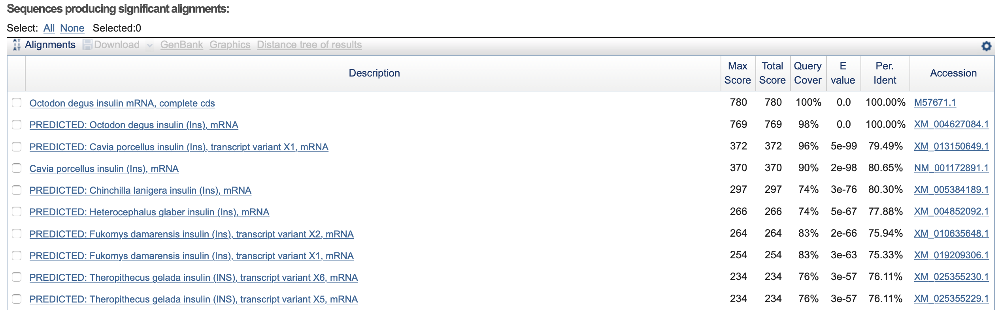
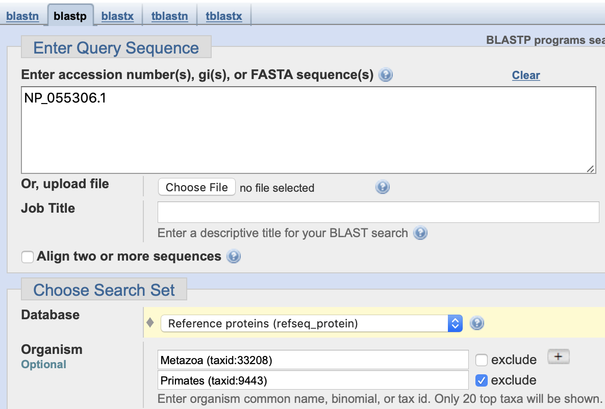

## Wyszukiwanie sekwencji podobnych (BLAST)

### Zad. 1 - Opis wyników programu BLAST
Celem zadania jest znalezienie sekwencji najbardziej podobnych do sekwencji mRNA insuliny koszatniczki pospolitej.

#### Odczytywanie wyników

##### Sekwencja mRNA *Octodon degus*



1. Numer dostępu sekwencji wykazującej największej podobieństwo do sekwencji zapytania to `M57671.1`.
   > Jest to ta sama sekwencja, która została użyta w zapytaniu.
2. Wartość punktacji `Max score` tego przyrównania wynosi `780`. 
   > Parametr `Max score` określa wartość punktacji najwyżej ocenionego lokalnego przyrównania między sekwencją zapytania a sekwencją z bazy danych. Jeżeli w obrębie przyrównania dwóch sekwencji, BLAST zidentyfikowałby kilka lokalnych przyrównań, wtedy `Max score` przyjmuje najwyższą wartość punktacji wśród lokalnych przyrównań.

3. Wartośc punktacji `Total score` tego przyrównania wynosi `780`. Parametr `Total score` jest sumą wartości punktacji wszystkich znalezionych lokalnych przeyrównań między sekwencją zapytania a sekwencją z bazy danych. Ponieważ w obrębie sekwencji `M57671.1` porównanej do samej siebie, BLAST zidentyfikował jedno lokalne przyrównanie, parametr `Total score` ma taką samą wartość jak parametr `Max score`.
4. Procent identyczności sekwencji zapytania i sekwencji bazy danych wynosi `100`.
5. Wartość `Query cover` wynosi `100%`.
   > Parametr ten określa procentowy udział długości sekwencji zapytania w przyrównaniu. W tym przypadku, przyrównaniem objęta jest pełnej długości sekwencja zapytania.
6. Wartość `E-value` wynosi `0` (precyzyjniej, bardzo niska liczba zaokrąglona do zera). 
   > Parametr **E-value** określa oczekiwaną liczbą sekwencji w bazie danych, których przyrównanie z zadaną sekwencją zapytania zostałoby ocenione co najmniej równie dobrze, jak obserwowana wartość punktacji (`score`) przyrównania.
7. W przyrównaniu nie ma żadnych przerw.
8. Długość przyrównania wynosi `432` nukleotydy.

##### Sekwencje mRNA *Homo sapiens*


1. Numery dostępu sekwencji człowieka o równie wysokiej wartości punktacji (`Max score`): 

   ```
   NM_001291897.1, JQ951950.1, NM_001185098.1, NM_001185097.1, NM_000207.2, BC005255.1
   ```

2. Wartość punktacji `Max score` to `205` bitów.
3. Wartość punktacji `Total score` to `205` bitów.
4. Procent identyczności wynosi `74.49`.
5. Wartość `Query cover` wynosi `76%`.
6. Wartość `E-value` wynosi `1e-48`.
7. Przyrównanie zawiera `15` przerw stanowiąc 4% całego przyrównania.
8. Długość przyrównania wynosi `341` nukleotydów.
9. Wielkość przeszukiwanej bazy `NR` to `204,700,810,597` nukleotydów.
   > U góry strony wynikowej programu BLAST naciśnij `Search summary` > `Number of letters`

<br/>

### Zad. 2 - Wpływ wielkości bazy danych na wartość E-value
Wynik programu BLAST przy użyciu sekwencji zapytania mRNA insuliny koszatniczki i ograniczeniu wyników do organizmu człowieka.


1. Tak, w wynikach znajdują się sekwencje człowieka z poprzedniego zadania (np. `NM_001291897.1`).
2. Nie, w stosunku do poprzedniego zadania, zmianie uległa wartość parametru E-value. W poprzednim przeszukaniu wartość E-value dla tych samych sekwencji wynosiła `1e-48`, w tym przeszukaniu wynosi `5e-50`. Wartości punktacji i identyczności nie uległy zmianie.
3. Wielkość przeszukiwanej bazy `NR` z ograniczeniem do organizmy człowieka to `7,199,154,007` nukleotydów.
4. Stosunek wielkości dwóch baz danych to `204,700,810,597` / `7,199,154,007` = `28`.
5. Stosunek E-value w dwóch przeszukiwaniach wynosi `5e-50` / `1e-48` = `20`.
6. Wartość E-value jest wprost proporcjonalna do wielkości bazy. Wartość E-value wzrasta wraz ze wzrostem bazy danych.
   > Intuicyjnie, przyrównanie o punktacji na przykład 205 bitów jest badziej znaczące podczas przesukiwania mniejszej bazy danych. W większej bazie danych istnieje większa szansa znalezienia przypadkowych przyrównań o wartości punktacji co najmniej 205 bitów.

<br/>

### Zad. 3 - Istotność statystyczna wyników BLAST
BLAST niemal zawsze umożliwia odnalezienie sekwencji, które będą w jakiś sposób podobne do sekwencji w zapytaniu, mimo, że nie są one z nią spokrewnione (wyniki *fałszywie pozytywne*). W tym zadaniu użyte zostaną - jako sekwencję zapytania w programie BLAST - losowo wygenerowane sekwencje nukleotydowe i aminokwasowe.

#### Sekwencje nukleotydowe

Trzy losowe sekwencje DNA długości 25 pz wygenerowane w programie [SeqGen](http://www.cbs.dtu.dk/biotools/SeqGen-1.0/).

```
>seq1
GCTCGGGCCTGCCTCCTACCACGAC
>seq2
ACTTAAAAAGCGTAATACAGATAGA
>seq3
ATATCTGGAAGCGTGAACATTTATG
```

Wyniki programu **nucleotide BLAST** dla trzech różnych przeszukiwań można przeglądać korzystając z rozwijanego menu: `Results for`:


1. Tak, wiele sekwencji trafień zidentyfikowanych przez program BLAST wykazuje 90-100% identyczność do losowo wygenerowanych sekwencji zapytania. Na przykład:

   ```
   >XM_004482443.3 PREDICTED: Dasypus novemcinctus Fanconi anemia complementation 
   group F (FANCF), mRNA
   Length=2393

    Score = 35.6 bits (38),  Expect = 12
    Identities = 22/24 (92%), Gaps = 0/24 (0%)
    Strand=Plus/Plus

   Query  2    CTCGGGCCTGCCTCCTACCACGAC  25
               |||||||||||| |||||||| ||
   Sbjct  771  CTCGGGCCTGCCGCCTACCACCAC  794
   ```

2. Długość przyrównań wynosi na ogół `17-22` nukleotydów.
3. Przyrównania przyjmują wartości `Max Score` w zakresie `33-36` bitów.
4. Przyrównania przyjmują wartości `E-value` w zakresie `12-42`.
   > W tych przeszukiwaniach najwyższa dopuszczalna wartość `E-value` została ustawiona w formularzu programu BLAST na `50`. Domyślnie w programie BLAST, `E-value` ma wartość `10`.
5. Otrzymane wyniki **nie mają żadnego sensu biologicznego(!)**. Sekwencje znalezione w bazie danych są rzeczywistymi sekwencjami DNA występującymi w organizmach. Natomiast, sekwencje zapytania są całkowicie losowe i pozbawione jakiejkolwiek pokrewieństwa z sekwencjami znajdującymi się w bazie danych. Zatem skojarzenie sekwencji zapytania z sekwencjami z bazy danych jest wynikiem czystego przypadku.

   Sekwencje zapytania są na tyle krótkie (25 nt), że bardzo często występują w prawdziwych sekwencjach. Parametr `E-value` określa ich istotność statyczną - im niższa wartość E-value, tym mniejsze prawdopodobieństwo, że skojarzenie jest wynikiem zdarzenia losowego, a zatem tym bardziej jest ono istotne. W wynikach BLAST, trafienia uzyskały wartości tego parametru w zakresie `12-42`, co oznacza, że w bazie danych znajduje się od 12 do 42 przypadkowych sekwencji, które uzyskałyby równie dobre przyrównanie.

#### Sekwencje aminokwasowe
Trzy losowe sekwencje aminowasowe długości 25 reszt wygenerowane w programie [SeqGen](http://www.cbs.dtu.dk/biotools/SeqGen-1.0/).

```
>seq1
LGPIYMVYWWEGECRCQSFASAKTT
>seq2
CTENAMFTPMHRGYSSNSDTMTQKP
>seq3
GSDHFLKQGSWKANKEKLWDIDLPP
```

6. Tak, wiele sekwencji trafień zidentyfikowanych przez program BLAST wykazuje podobieństwo do losowo wygenerowanych sekwencji zapytania. Na przykład:

   ```
   >WP_133225980.1 type I-C CRISPR-associated protein Cas7/Csd2 [Paenibacillus sp. 
   MS74]

    Score = 30.4 bits (67),  Expect = 39, Method: Composition-based stats.
    Identities = 9/20 (45%), Positives = 14/20 (70%), Gaps = 0/20 (0%)

   Query  4    IYMVYWWEGECRCQSFASAK  23
               ++ VYWWE  C+   ++SAK
   Sbjct  229  VHTVYWWEHNCKLGQYSSAK  248
   ```

   Uzyskano przyrównania następujących parametrach:
   * Długość przyrównań wynosi na ogół 15-22 pozycji. 
     - W przyrównaniach jest niewiele przerw, najczęściej kilkanaście substytucji.
   * Trafienia przyjmują wartości `Max Score` w zakresie `33-36` bitów.
   * Trafienia przyjmują wartości `E-value` w zakresie `40-1000`.

7. Sekwencje nukleotydowe obarczone są większym ryzykiem uzyskania trafień fałszywie pozytywnych w programie BLAST. Przyrównania sekwencji nukleotydowych o długości 25 pz uzyskują wartości E-value rzędu `12-50`, natomiast przyrównania sekwencji aminokwasowych długości 25 aa otrzymują wartości E-value w zakresie `40-1000`.
<br/><br/>


### Zad. 4 - Wpływ długości sekwencji zapytania na wartość E-value

1. Trzy różnej długości sekwencje pochodzą z genomu bakterii *Escherichia coli* strain 103 i wielu innych Enterobakterii.

   

2. Wraz ze wzrostem wartości punktacji przyrównania (`score`), wartość E-value maleje (przyrównanie jest bardziej istotne). Z kolei, wartość punktacji przyrównania zależy od długości sekwencji zapytania.

   Długość sekwencji zapytania: 23 nt

   ```
   >CP020495.1 Escherichia coli strain 103 chromosome, complete genome
   Length=5162123
 
    Features flanking this part of subject sequence:
      236 bp at 5' side: hypothetical protein
      642 bp at 3' side: 2-octaprenyl-3-methyl-6-methoxy-1,4-benzoquinol hydroxylase
 
    Score = 46.1 bits (23),  Expect = 0.008
    Identities = 23/23 (100%), Gaps = 0/23 (0%)
    Strand=Plus/Plus
 
   Query  1        TGGGGTATCGCCAAGCGGTAAGG  23
                   |||||||||||||||||||||||
   Sbjct  3554247  TGGGGTATCGCCAAGCGGTAAGG  3554269

   ```

   Długość sekwencji zapytania: 29 nt

   ```
   >CP020495.1 Escherichia coli strain 103 chromosome, complete genome
   Length=5162123
 
    Features flanking this part of subject sequence:
      236 bp at 5' side: hypothetical protein
      636 bp at 3' side: 2-octaprenyl-3-methyl-6-methoxy-1,4-benzoquinol hydroxylase
 
    Score = 58.0 bits (29),  Expect = 6e-06
    Identities = 29/29 (100%), Gaps = 0/29 (0%)
    Strand=Plus/Plus
 
   Query  1        TGGGGTATCGCCAAGCGGTAAGGCACCGG  29
                   |||||||||||||||||||||||||||||
   Sbjct  3554247  TGGGGTATCGCCAAGCGGTAAGGCACCGG  3554275
   ```
 
   Długość sekwencji zapytania: 29 nt

   ```
   >CP020495.1 Escherichia coli strain 103 chromosome, complete genome
   Length=5162123
 
    Features flanking this part of subject sequence:
      236 bp at 5' side: hypothetical protein
      630 bp at 3' side: 2-octaprenyl-3-methyl-6-methoxy-1,4-benzoquinol hydroxylase
 
    Score = 65.8 bits (35),  Expect = 2e-08
    Identities = 35/35 (100%), Gaps = 0/35 (0%)
    Strand=Plus/Plus
 
   Query  1        TGGGGTATCGCCAAGCGGTAAGGCACCGGTTTTTG  35
                   |||||||||||||||||||||||||||||||||||
   Sbjct  3554247  TGGGGTATCGCCAAGCGGTAAGGCACCGGTTTTTG  3554281
   ```

3. Na stronie wyników BLAST dla najdłuższej sekwencji zapytania, w panelu `Alignments`, zwróć uwagę na pierwsze trafienie. Naciśnij na link `GenBank`.

   

   W części `FEATURES` rekordu `GenBank` znajduje się informacja o genie tRNA specyficznym dla glutaminy.

   ```
   FEATURES             Location/Qualifiers
        ...
        gene            1..>35
                       /locus_tag="CPA47_18610"
        tRNA            1..>35
                       /locus_tag="CPA47_18610"
                       /product="tRNA-Gln"
                       /inference="COORDINATES: profile:tRNAscan-SE:1.23"
                       /anticodon=(pos:3554279..3554281,aa:Gln,seq:ttg)
   ```
<br/>

### Zad. 5 - Wiele lokalnych przyrównań w obrębie porównywanych sekwencji


1. Sekwencja użyta w książce *Jurassic Park* nie pochodzi z dinozaura. Sekwencja pochodzi z sekwencji wektora `Cloning vector pAgaL6, complete sequence` o numerze dostępu [MH621333](https://www.ncbi.nlm.nih.gov/nuccore/MH621333.1).
2. Przyrównanie programem BLAST sekwencji zapytania i sekwencji wektora składa się z czterech lokalnych przyrównań (**HSP**, *High Scoring Pairs*).

```
>MH621333.1 Cloning vector pAgaL6, complete sequence
Length=7989

 Score = 435 bits (235),  Expect = 3e-117
 Identities = 360/410 (88%), Gaps = 50/410 (12%)
 Strand=Plus/Minus

Query  302   GTAGGACAGGTGCCGGCAGCGCTCTGGGTCATTTTCGGCGAGGACCGCTTTCGCTGGAG-  360
             ||||||||||||||||||||||||||||||||||||||||||||||||||||||||||| 
Sbjct  6179  GTAGGACAGGTGCCGGCAGCGCTCTGGGTCATTTTCGGCGAGGACCGCTTTCGCTGGAGC  6120

Query  361   ---------ATCGGCCTGTCGCTTGCGGTATTCGGAATCTTGCACGCCCTCGCTCAAGCC  411
                      |||||||||||||||||||||||||||||||||||||||||||||||||||
Sbjct  6119  GCGACGATGATCGGCCTGTCGCTTGCGGTATTCGGAATCTTGCACGCCCTCGCTCAAGCC  6060

Query  412   TTCGTCACT----------CCAAACGTTTCGGCGAGAAGCAGGCCATTATCGCCGGCATG  461
             |||||||||          |||||||||||||||||||||||||||||||||||||||||
Sbjct  6059  TTCGTCACTGGTCCCGCCACCAAACGTTTCGGCGAGAAGCAGGCCATTATCGCCGGCATG  6000

Query  462   GCGGCCGACGCGCTGGGCT----------GGCGTTCGCGACGCGAGGCTGGATGGCCTTC  511
             |||||||||||||||||||          |||||||||||||||||||||||||||||||
Sbjct  5999  GCGGCCGACGCGCTGGGCTACGTCTTGCTGGCGTTCGCGACGCGAGGCTGGATGGCCTTC  5940

Query  512   CCCATTATGATTCTTCTCGCTTCCGGCGGC----------CCGCGTTGCAGGCCATGCTG  561
             ||||||||||||||||||||||||||||||          ||||||||||||||||||||
Sbjct  5939  CCCATTATGATTCTTCTCGCTTCCGGCGGCATCGGGATGCCCGCGTTGCAGGCCATGCTG  5880

Query  562   TCCAGGCAGGTAGATGACGACCATCAGGGACAGCTTCAA----------CGGCTCTTACC  611
             |||||||||||||||||||||||||||||||||||||||          |||||||||||
Sbjct  5879  TCCAGGCAGGTAGATGACGACCATCAGGGACAGCTTCAAGGATCGCTCGCGGCTCTTACC  5820

Query  612   AGCCTAACTTCGATCACTGGACCGCTGATCGTCACGGCGATTTATGCCGC  661
             ||||||||||||||||||||||||||||||||||||||||||||||||||
Sbjct  5819  AGCCTAACTTCGATCACTGGACCGCTGATCGTCACGGCGATTTATGCCGC  5770


 Score = 359 bits (194),  Expect = 2e-94
 Identities = 298/340 (88%), Gaps = 40/340 (12%)
 Strand=Plus/Minus

Query  1     GCGTTGCTGGCGTTTTTCCATAGGCTCCGCCCCCCTGACGAGCATCACAAAAATCGACGC  60
             ||||||||||||||||||||||||||||||||||||||||||||||||||||||||||||
Sbjct  4415  GCGTTGCTGGCGTTTTTCCATAGGCTCCGCCCCCCTGACGAGCATCACAAAAATCGACGC  4356

Query  61    ----------GGTGGCGAAACCCGACAGGACTATAAAGATACCAGGCGTTTCCCCCTGGA  110
                       ||||||||||||||||||||||||||||||||||||||||||||||||||
Sbjct  4355  TCAAGTCAGAGGTGGCGAAACCCGACAGGACTATAAAGATACCAGGCGTTTCCCCCTGGA  4296

Query  111   AGCTCCCTCGTG----------TTCCGACCCTGCCGCTTACCGGATACCTGTCCGCCTTT  160
             ||||||||||||          ||||||||||||||||||||||||||||||||||||||
Sbjct  4295  AGCTCCCTCGTGCGCTCTCCTGTTCCGACCCTGCCGCTTACCGGATACCTGTCCGCCTTT  4236

Query  161   CTCCCTTCGGGAAGCGTGGC---------T-GCTCACGCTGTACCTATCTCAGTTCGGTG  210
             ||||||||||||||||||||         | ||||||||||||  |||||||||||||||
Sbjct  4235  CTCCCTTCGGGAAGCGTGGCGCTTTCTCATAGCTCACGCTGTAGGTATCTCAGTTCGGTG  4176

Query  211   TAGGTCGTTCGCTCCAAGCTGGGCTGTGTGC----------CGTTCAGCCCGACCGCTGC  260
             |||||||||||||||||||||||||||||||          |||||||||||||||||||
Sbjct  4175  TAGGTCGTTCGCTCCAAGCTGGGCTGTGTGCACGAACCCCCCGTTCAGCCCGACCGCTGC  4116

Query  261   GCCTTATCCGGTAACTATCGTCTTGAGTCCAACCCGGTAA  300
             ||||||||||||||||||||||||||||||||||||||||
Sbjct  4115  GCCTTATCCGGTAACTATCGTCTTGAGTCCAACCCGGTAA  4076


 Score = 348 bits (188),  Expect = 3e-91
 Identities = 294/337 (87%), Gaps = 40/337 (12%)
 Strand=Plus/Minus

Query  669   CGCGTTGCTGGCGTTTTTCCATAGGCTCCGCCCCCCTGACGAGCATCACAAA--------  720
             ||||||||||||||||||||||||||||||||||||||||||||||||||||        
Sbjct  4416  CGCGTTGCTGGCGTTTTTCCATAGGCTCCGCCCCCCTGACGAGCATCACAAAAATCGACG  4357

Query  721   --CAAGTCAGAGGTGGCGAAACCCGACAGGACTATAAAGATACCAGGCGTTTCCCCCTGG  778
               ||||||||||||||||||||||||||||||||||||||||||||||||||||||||||
Sbjct  4356  CTCAAGTCAGAGGTGGCGAAACCCGACAGGACTATAAAGATACCAGGCGTTTCCCCCTGG  4297

Query  779   AAGC----------GCTCTCCTGTTCCGACCCTGCCGCTTACCGGATACCTGTCCGCCTT  828
             ||||          ||||||||||||||||||||||||||||||||||||||||||||||
Sbjct  4296  AAGCTCCCTCGTGCGCTCTCCTGTTCCGACCCTGCCGCTTACCGGATACCTGTCCGCCTT  4237

Query  829   TCTCCCTTCGGG---C-T-----TT-CTCAATGCTCACGCTGTAGGTATCTCAGTTCGGT  878
             ||||||||||||   | |     || ||||  ||||||||||||||||||||||||||||
Sbjct  4236  TCTCCCTTCGGGAAGCGTGGCGCTTTCTCATAGCTCACGCTGTAGGTATCTCAGTTCGGT  4177

Query  879   GTAGGTCGTTCGCTCCAAGCTG----------ACGAACCCCCCGTTCAGCCCGACCGCTG  928
             ||||||||||||||||||||||          ||||||||||||||||||||||||||||
Sbjct  4176  GTAGGTCGTTCGCTCCAAGCTGGGCTGTGTGCACGAACCCCCCGTTCAGCCCGACCGCTG  4117

Query  929   CGCCTTATCCGGTAACTATCGTCTTGAGTCCAACACG  965
             |||||||||||||||||||||||||||||||||| ||
Sbjct  4116  CGCCTTATCCGGTAACTATCGTCTTGAGTCCAACCCG  4080


 Score = 289 bits (156),  Expect = 2e-73
 Identities = 231/261 (89%), Gaps = 30/261 (11%)
 Strand=Plus/Minus

Query  970   AACGGGTTGGCATGGATTGTAGGCGCCGCCCTATACCTTGTCTGCCTCCCCGCG------  1023
             ||||||||||||||||||||||||||||||||||||||||||||||||||||||      
Sbjct  5753  AACGGGTTGGCATGGATTGTAGGCGCCGCCCTATACCTTGTCTGCCTCCCCGCGTTGCGT  5694

Query  1024  ----GTGCATGGAGCCGGGCCACCTCGACCTGAATGGAAGCCGGCGGCACCTCGCTAACG  1079
                 ||||||||||||||||||||||||||||||||||||||||||||||||||||||||
Sbjct  5693  CGCGGTGCATGGAGCCGGGCCACCTCGACCTGAATGGAAGCCGGCGGCACCTCGCTAACG  5634

Query  1080  G----------CCAAGAATTGGAGCCAATCAATTCTTGCGGAGAACTGTGAATGCGCAAA  1129
             |          |||||||||||||||||||||||||||||||||||||||||||||||||
Sbjct  5633  GATTCACCACTCCAAGAATTGGAGCCAATCAATTCTTGCGGAGAACTGTGAATGCGCAAA  5574

Query  1130  CCAACCCTTGGC----------CATCGCGTCCGCCATCTCCAGCAGCCGCACGCGGCGCA  1179
             ||||||||||||          ||||||||||||||||||||||||||||||||||||||
Sbjct  5573  CCAACCCTTGGCAGAACATATCCATCGCGTCCGCCATCTCCAGCAGCCGCACGCGGCGCA  5514

Query  1180  TCTCGGGCAGCGTTGGGTCCT  1200
             |||||||||||||||||||||
Sbjct  5513  TCTCGGGCAGCGTTGGGTCCT  5493
```

3. Wartośc parametru `Max Score` = `435`, a `Total Score` = `1431`.

4. Najwyżej punktowane przyrównanie lokalne między sekwencją zapytania a wektorem znajduje się w pozycji `302-661` w sekwencji zapytania i w pozycji `6179-5770` sekwencji wektora. 
   * W sekwencji wektora, pozycja startu przyrównania jest większa od pozycji końca, ponieważ odnosi się do sekwencji komplementarnej. Zatem w tym przyrównaniu, sekwencja zapytania jest na nici `plus`, natomiast sekwencja wektora na nici `minus`.

#### Blast Two Sequences (Dot Matrix)


5. Michael Crichron wyciął z sekwencji wektora cztery fragmenty. Z każdego fragmentu usunął w równych odstępach kilka krótszych fragmentów długości ok. 10 nukleotdyów. Połączył cztery fragmenty ze sobą w jedną sekwencję. Następnie utworzył sekwencję do niej komplementarną. Otrzymaną sekwencję umieścił w książce *Jurassic Park*.
<br/><br/>


### Zad. 6 - Wybór bazy danych dla programu BLAST
W bazie białkowej NCBI skorzystaj z zaawansowanego wyszukiwania i utwórz zapytanie do bazy danych:

```
FOXP2[Gene Name] AND Homo sapiens[Organism] 
```

Wybierz rekord *forkhead box protein P2 isoform I [Homo sapiens]* o numerze dostępu [NP_055306](https://www.ncbi.nlm.nih.gov/protein/NP_055306.1). W panelu `Analyze this sequence` po prawej stronie w rekordzie sekwencji, naciśnij link `Run BLAST`.

Formularz programu BLAST:



1. Sekwencją najbardziej odpowiadającą sekwenji FOXP2 człowieka jest przewidziana sekwencja białka *forkhead box protein P2* u gwiazdonosa amerykańskiego (*Condylura cristata*).
2. E-value najlepiej punktowanego przyrównania wynosi `0`.
3. Procent identyczności i podobieństwa tych dwóch sekwencji wynosi `99%`.
4. W przyrównaniu jest jedna przerwa w sekwencji trafienia.

    

#### Taxonomy reports

5. Wśród ssaków BLAST znalazł `81` trafień.
6. Tak, BLAST zwrócił trafienia wśród ptaków (np. *Parus major*), gadów (np. *Crocodylus porosus*) i płazów (np. jaszczurka *Anolis carolinensis*).

   