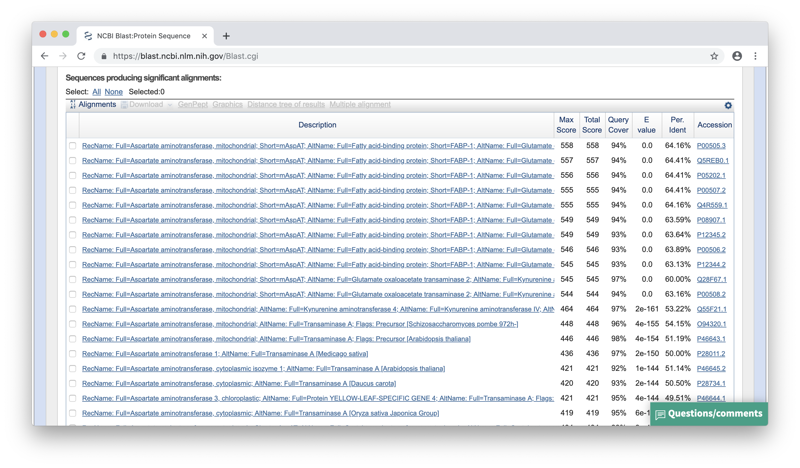
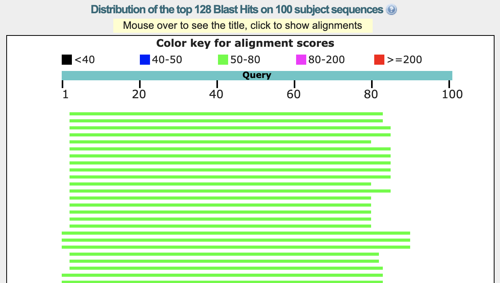

### Zad. 1 - blastp: identyfikacja sekwencji białka
Otwórz stronę serwisu [NCBI BLAST](https://blast.ncbi.nlm.nih.gov/) i wybierz program *protein blast*. Ogranicz wyszukiwania do bazy danych `UniProtKB/Swiss-Prot` i organizmu *Drosophila melanogaster*.



Najwyżej punktowane trafienia należą do mitochondrialną aminotransferazą asparaginianową.
<br/><br/>

### Zad. 2 - blastp: powtórzony fragment sekwencji
Otwórz stronę serwisu [NCBI BLAST](https://blast.ncbi.nlm.nih.gov/) i wybierz program *protein blast*. Ogranicz wyszukiwania do organizmu *Arabidopsis thaliana*.



Między sekwencją zapytania a sekwencją `NP_199836.1` *A. thaliana* program *blastp* zidentyfikował dwa przyrównania. Fragment sekwencji zapytania (w pozycji `3-83`) wykazuje podobieństwo do dwóch miejsc w sekwencji trafienia (w pozycji `209-289` i pozycji `115-195`). Fragment ten (w pozycji `3-83`) odpowiada domenie wiążącej RNA (RRM) i występuje jako pojedyczna domena w sekwencji zapytania, a w sekwencji trafienia występuje dwukrotnie. Sekwencja domeny RRM białka zapytania wykazuje większe podobieństwo do  domeny RRM z C-końca białka trafienia (`score = 77.4`), niż do N-końcowej domeny RRM (`score = 62.4`).

```
>NP_199836.1 chloroplast RNA-binding protein 31B [Arabidopsis thaliana]
Length=289

 Score = 77.4 bits (189),  Expect = 5e-18, Method: Compositional matrix adjust.
 Identities = 40/81 (49%), Positives = 52/81 (64%), Gaps = 0/81 (0%)

Query  3    IYVGNLSYDVSEADLTAVFAEYGSVKRVQLPTDRETGRMRGFGFVELEADAEETAAIEAL  62
            IYVGNL +DV    L  +F+E+G V   ++ +DRETGR RGFGFV++  + E   AI AL
Sbjct  209  IYVGNLPWDVDSGRLERLFSEHGKVVDARVVSDRETGRSRGFGFVQMSNENEVNVAIAAL  268

Query  63   DGAEWMGRDLKVNKAKPRENR  83
            DG    GR +KVN A+ R  R
Sbjct  269  DGQNLEGRAIKVNVAEERTRR  289


 Score = 62.4 bits (150),  Expect = 2e-12, Method: Compositional matrix adjust.
 Identities = 32/81 (40%), Positives = 48/81 (59%), Gaps = 0/81 (0%)

Query  3    IYVGNLSYDVSEADLTAVFAEYGSVKRVQLPTDRETGRMRGFGFVELEADAEETAAIEAL  62
            ++VGNL YDV    L  +F + G+V+  ++  +R+T + RGFGFV +    E   A+E  
Sbjct  115  LFVGNLPYDVDSQALAMLFEQAGTVEISEVIYNRDTDQSRGFGFVTMSTVEEAEKAVEKF  174

Query  63   DGAEWMGRDLKVNKAKPRENR  83
            +  E  GR L VN+A PR +R
Sbjct  175  NSFEVNGRRLTVNRAAPRGSR  195
```

<br/>

### Zad. 3 - Identyfikacja polimorfizmów w genomach wirusów HIV
Otwórz stronę serwisu [NCBI BLAST](https://blast.ncbi.nlm.nih.gov/Blast.cgi). Wybierz program `nucleotide BLAST` i algorytm `blastn`. W wynikach programu BLAST ustaw `Formatting Options` > `Alignment view` > `Flat query-anchored with dots for identities`).


W pozycji 6 przyrównań występują warianty `A/G`.
<br/><br/>

