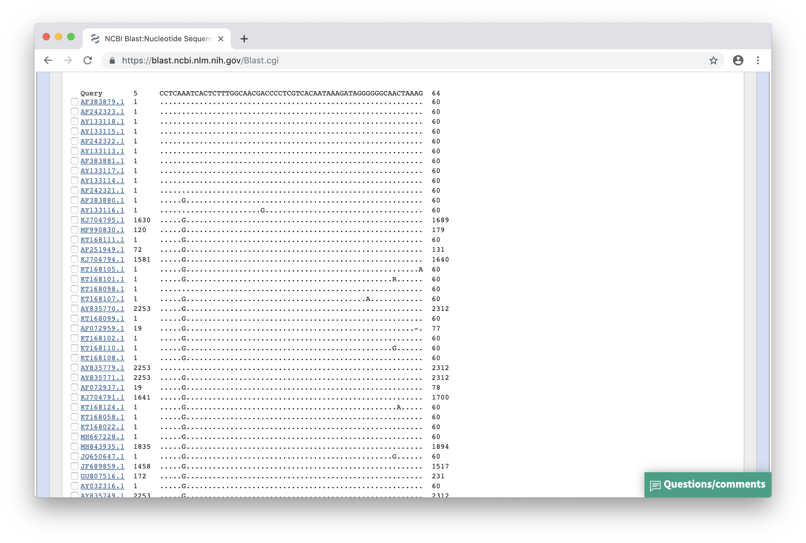

## Zad. 1
Otwórz stronę serwisu [NCBI BLAST](https://blast.ncbi.nlm.nih.gov/Blast.cgi). Ponieważ sekwencja koduje białko wybierz program **blastx**. W formularzu programu BLAST umieść sekwencję zapytania i przeprowadź przeszukiwanie.

Sekwencja jest najbardziej podobna do białka otoczki wirusa HIV (*HIV1 envelope glycoprotein*) o numerze dostępu `AAL71628.1` (E-value: `1e-104`).

Przesunięcie ramki odczytu widoczne jest na graficznej prezentacji trafień jako mała czarna pionowa linia znajdująca się na trafieniu.


Sekwencja trafienia `AAL71628.1` składa się z dwóch przyrównań z sekwencją zapytania. Każde przyrównanie pochodzi z translacji w dwóch różnych ramkach odczytu. Drugie przyrównanie dotyczy początku sekwencji zapytania (`2-268`, ramka oczytu: `+2`) i sekwencji trafienia w pozycji `1-89` (pozycje wyrażone w aminokwasach). Z kolei pierwsze przyrównanie dotyczy drugiej części sekwencij zapytania (`268-600`) i sekwencji trafienia `90-201` (ramka odczytu: `+1`). Przesunięcie ramki odczytu jest więc spowodowane delecją jednego nukleotydu w sekwencji zapytania w pobliżu pozycji `268`.

```
>AAL71628.1 envelope glycoprotein, partial [Human immunodeficiency virus 
1]
Length=201

 Score = 226 bits (576),  Expect(2) = 1e-104, Method: Compositional matrix adjust.
 Identities = 110/112 (98%), Positives = 110/112 (98%), Gaps = 1/112 (1%)
 Frame = +1

Query  268  TIAFNQSSGGDPEIVMHSFNCGGEFFYCNTTQLFNSTWPTNK-KSTNKTGTITLPCRIKQ  444
            TIAFNQSSGGDPEIVMHSFNCGGEFFYCNTTQLFNSTWPTN  KSTNKTGTITLPCRIKQ
Sbjct  90   TIAFNQSSGGDPEIVMHSFNCGGEFFYCNTTQLFNSTWPTNNTKSTNKTGTITLPCRIKQ  149

Query  445  IINRWQEVGKAMYAPPIKGQIRCSSNITGIFLTRDGGNASDETETFRPGGGN  600
            IINRWQEVGKAMYAPPIKGQIRCSSNITGIFLTRDGGNASDETETFRPGGGN
Sbjct  150  IINRWQEVGKAMYAPPIKGQIRCSSNITGIFLTRDGGNASDETETFRPGGGN  201


 Score = 182 bits (461),  Expect(2) = 1e-104, Method: Compositional matrix adjust.
 Identities = 89/89 (100%), Positives = 89/89 (100%), Gaps = 0/89 (0%)
 Frame = +2

Query  2    EEDIVIRSENFTNNAKTIIVQLKESIKINCTRPNNNTRKSIPIATGGAIYATGDIIGDIR  181
            EEDIVIRSENFTNNAKTIIVQLKESIKINCTRPNNNTRKSIPIATGGAIYATGDIIGDIR
Sbjct  1    EEDIVIRSENFTNNAKTIIVQLKESIKINCTRPNNNTRKSIPIATGGAIYATGDIIGDIR  60

Query  182  QAHCNLSRDQWDNTLSQLVTKLREQFGNK  268
            QAHCNLSRDQWDNTLSQLVTKLREQFGNK
Sbjct  61   QAHCNLSRDQWDNTLSQLVTKLREQFGNK  89
```

### Zad. 2
Otwórz stronę serwisu [NCBI BLAST](https://blast.ncbi.nlm.nih.gov/Blast.cgi). Wybierz program `nucleotide BLAST` i algorytm `blastn`. W wynikach programu BLAST ustaw `Formatting Options` > `Alignment view` > `Flat query-anchored with dots for identities`).



W pozycji 6 przyrównań występują warianty `A/G`.