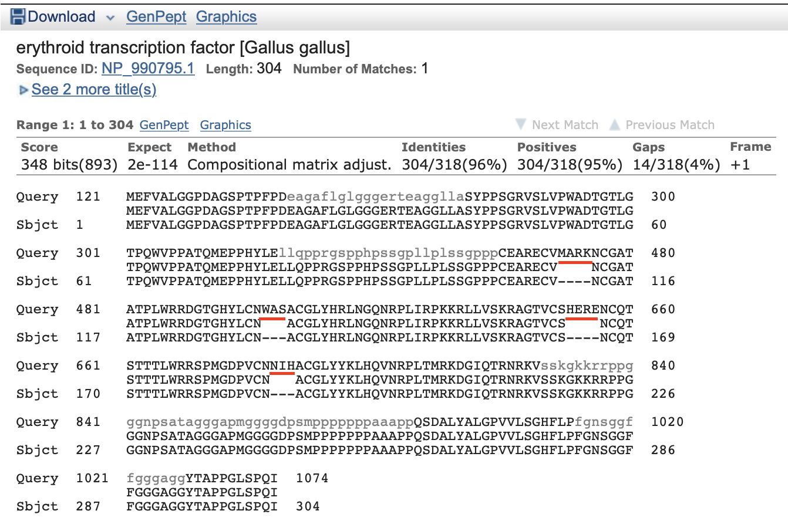
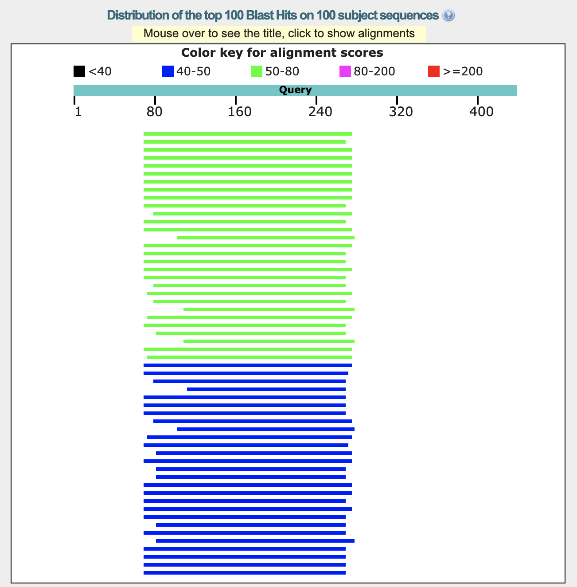
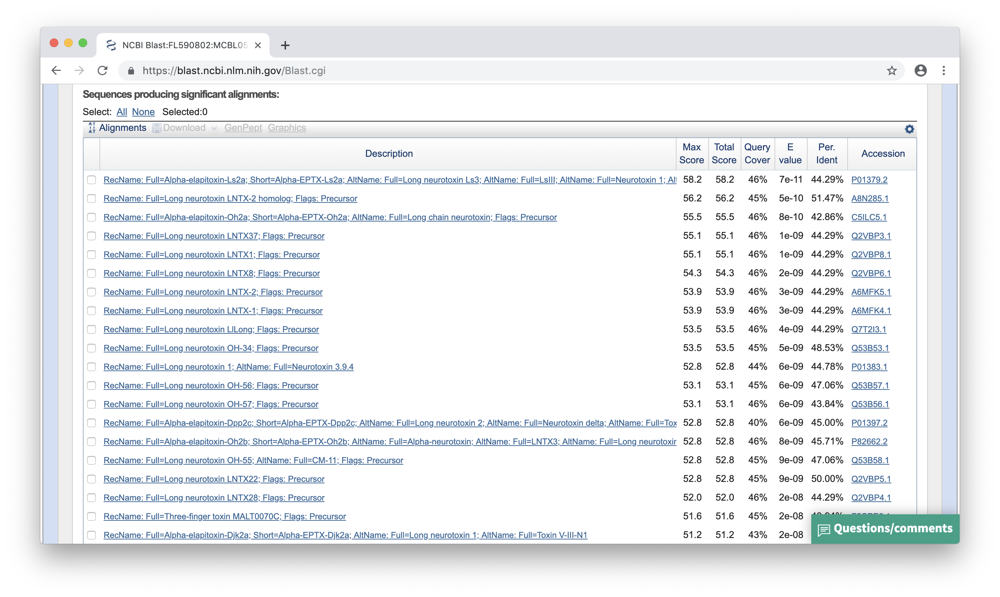
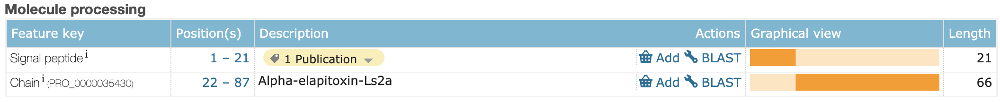
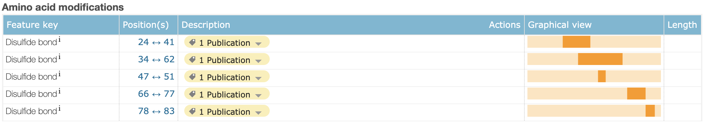
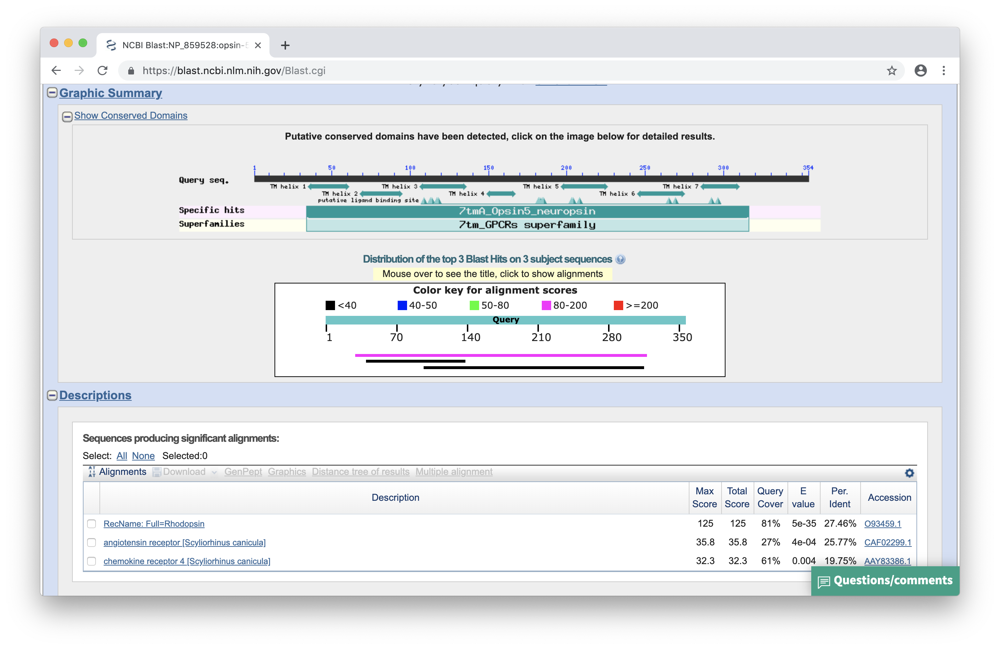

## BLAST - zaawansowane zagadnienia

### Zad. 1 - Proste przeszukiwanie blastx
Otwórz serwis [BLAST](https://blast.ncbi.nlm.nih.gov/Blast.cgi). Wybierz program **blastx**. Umieść sekwencję zapytania, użyj domyślnych ustawień programu. Uruchom program BLAST.

> Program blastx dokonuje translacji nukleotydowej sekwencji w zapytaniu i dla tak uzyskanej sekwencji aminokwasowej przeszukuje bazę danych sekwencji aminokwasowych. Translacja dokonywana przez program blastx prowadzona jest w sześciu ramkach odczytu (trzy ramki odczytu na nici `plus` i trzy ramki odczytu na nici `minus`).

1. Sekwencja z bazy danych, która wykazuje największe podobieństwo do sekwencji zapytania jest czynnikiem transkrypcyjnym kurczaka (*Gallus gallus*) o numerze dostępu [NP_990795.1](https://www.ncbi.nlm.nih.gov/protein/NP_990795.1).
2. Przyrównanie sekwencji Marka i sekwencji `NP_990795.1`.

   

   Ukryta wiadomość to `MARK WAS HERE`. Mark użył sekwencji DNA kodującej czynnik transkrypcyjny. Umieścił w niej odpowiednie kodony tak, aby po przetłumaczeniu sekwencji DNA na białko powstała wiadomość.

3. Fragmenty przyrównania oznaczone małymi szarymi literami oznaczają regiony sekwencji o niskiej złożoności aminokwasowej (*low complexity*). Są to regiony zawierające wielokrotnie powtórzone reszty - krótkie segmenty powtórzeń albo segmenty, w których kila reszt występje częściej od innych (np. region `pppppppaaapp`). 

   Obecność tych segmentów w badanych sekwencjach powoduje tworzenie nieprawdziwych dopasowań i prowadzi do sztucznego zawyżania oceny przyrównania niespokrewnionych sekwencji. Dlatego regiony te nie są brane pod uwagę podczas wyznaczania przyrównania przez program BLAST (są "maskowane"), ponieważ mogłyby one fałszywie zawyżyć wartość punktacji `score`.
   > Program BLAST domyślnie maskuje te regiony, ale możliwe jest wyłączenie opcji maskowania w formularzu prorgamu BLAST (w panelu `Algorithm parameters`, w części `Filters and Masking`, zaznaczyć/odznaczyć `Filter low complexity regions`).

<br/><br/>

### Zad. 2 - Złożone przeszukiwanie blastx
Rekord sekwencji EST węża koralowego (*Micrurus corallinus*): [FL590802](https://www.ncbi.nlm.nih.gov/nuccore/FL590802).

#### Przeszukiwanie blastx z sekwencją zapytania FL590802 i bazą danych UniProtKB/Swiss-Prot



1. Nie, sekwencja zapytania nie jest dopasowana na całej długości do sekwencji trafień.
   > Sekwencja zapytania jest sekwencją cDNA, które może posiadać na 5p i 3p końcach sekwencje nie ulegające translacji (*UTRs*, *Untranslated Regions*). Ponieważ blastx wyszukuje podobieństwo do sekwencji białkowych (przeszukiwaną bazą danych są sekwencje białkowej), nie należy oczewkiać, że regiony *UTR* będą wykazywały istotne podobieństwo do białek. 
2. Znalezione trafienia sekwencji białkowych są w większości jednorodne. Sekwencje te dotyczą neurotoksyn, których przyrównania otrzymują podobne wartości punktacji (w zakresie `50-80` bitów), *E*-value (`7e-11 - 6e-08`), i procent identyczności (`44-55%`). Sekwencja zapytania EST jest najprawdopodobniej neurotoksyną biorać pod uwagę, że pochodzi ona z gruczołów jadowych węża.

   

### Najwyżej punktowane przyrównanie

```
>P01379.2 RecName: Full=Alpha-elapitoxin-Ls2a; Short=Alpha-EPTX-Ls2a; AltName: 
Full=Long neurotoxin Ls3; AltName: Full=LsIII; AltName: 
Full=Neurotoxin 1; AltName: Full=Neurotoxin alpha; Flags: 
Precursor
Length=87

 Score = 58.2 bits (139),  Expect = 7e-11, Method: Compositional matrix adjust.
 Identities = 31/70 (44%), Positives = 41/70 (59%), Gaps = 4/70 (6%)
 Frame = +1

Query  70   GYTRKCYEGEGTRKSVTCPKGEKVCYTIFLVGP--SHPAKVLKWGCAASCPKVGLGARIS  243
            GYTR+CY       + TCP G+++CY         S   KVL++GCAA+CP V  G  I 
Sbjct  19   GYTRECYLNP--HDTQTCPSGQEICYVKSWCNAWCSSRGKVLEFGCAATCPSVNTGTEIK  76

Query  244  CCSKDNCNSH  273
            CCS D CN++
Sbjct  77   CCSADKCNTY  86
```

3. Sekwencja zapytania została poddana translacji w pierwszej ramce odczytu (`Frame = +1`).
4. Sekwencja zapytania ma długość `435` nukleotydów. W przyrównaniu rozpoczyna się ona od `70` nukleotydu i kończy nukleotydem w pozycji `273`.
5. Białkowa sekwencja trafienia ma długość `87` aminokwasów. W przyrównaniu rozpoczyna się ona od `19` reszty aminokwasowej i kończy w `86` pozycji.

    ```
                        1        70               273                    435
    EST FL590802      5P----------------------------------------------------3P
                                  |||||||||||||||||||
    P01379                 ---------------------------
                           1     19                86
    ```

    Lokalizacja przyrównania wskazuje, że pierwsze 18 aminokwasów sekwencji trafienia nie zostało przyrównanych z przetłumaczoną sekwencją EST. Natomiast przyrównanie kończy się na przedostatnim aminokwasie.
    > Numerowanie pozycji na sekwencji zapytania i trafienia jest inne. Zapytanie jest sekwencją DNA poddaną translacji do aminokwasów, ale numerowanie odnosi się do sekwencji DNA. Każda przerwa w sekwencji zapytania oznacza trzy nukleotydy, a przerwa w sekwencji trafienia oznacza jeden aminokwas. 

    Sekwencja EST najprawdopodobniej zawiera również region 3P UTR transkryptu neurotoksyny. W tym przypadku, neurotoksyna kodowana przez sekwencję zapytania ma - podobnie jak sekwencja trafienia - długość ok. 87 aminokwasów. Można zaobserwować, że przyrównania sekwencji zapytania z pozostałymi trafieniami nie rozciągają się poza pozcyję `273`.

6. Sekwencja aminokwasowa trafienia (`P01379`) oznaczona jest jako białko prekursorowe (`Flags: Precursor`). Rekord tego białka w bazie UniProt ([P01379](https://www.uniprot.org/uniprot/P01379)) dostarcza dodatkowej informacji, że na N-końcu tego białka (w pozycji `1-21`) znajduje się peptyd sygnałowy. 

   

   Podobnie, jak u innych neurotoksyn węży, sekwencja sygnałowa kieruje nowo otrzymane białko na zewnątrz komórki. Podczas procesu sekrecji, sekwencja sygnałowa jest usuwana z białka. Cechą charakterystyczną peptydów sygnałowych jest niska zachowawczość ich sekwencji, która najczęściej uniemożliwia otrzymanie wiarygodnego przyrównania. Możliwe jest, że sekwencja sygnałowa zakodowana jest w sekwencji EST; 69 nukleotydów upstream od przyrównania blastx odpowiada długości kodowanej sekwencji sygnałowej przynajmniej 18 aminokasów.

7. W rekordzie UniProt (`P01379`), w części `Amino acid modifications` przedstawione są pozycje mostków dwusiarczkowych (np. między cysteinami w pozycjach `24` i `41`). Cysteiny utzymują tę kró†ką sekwencję białkową w ścisłej strukturze umożliwiającej realizację swojej funkcji. Co ciekawe, białko kodowane przez sekwencję EST pozbawione jest dwóch cysteiny, co sugeruje, że struktura przestrzenna tego białka może być inna.

   


### Zad. 3 - Identyfikacja ortologów (*Reciprocal BLAST*)

#### BLAST w jednym kierunku
Sekwencja białkowa opsyny-5 człowieka ([NP_859528](https://www.ncbi.nlm.nih.gov/protein/NP_859528)), użyta w programie BLAST do przeszukania sekwencji białkowych rekina (*Scyliorhinus canicula*), wykazuje największe podobieństwo do sekwencji rodopsyny rekina o numerze dostępu [O93459](https://www.uniprot.org/uniprot/O93459). 



Przyrównanie sekwencji opsyny-5 i rodopsyny rekina:

```
>O93459.1 RecName: Full=Rhodopsin
 CAA76797.1 opsin [Scyliorhinus canicula]
Length=354

 Score = 125 bits (315),  Expect = 5e-35, Method: Compositional matrix adjust.
 Identities = 81/295 (27%), Positives = 149/295 (51%), Gaps = 21/295 (7%)

Query  30   WEADLVAG--FYLTIIGILSTFGNGYVLYMSSRRKKKLRPAEIMTINLAVCDLGISVVGK  87
            W+  ++A   F+L I G    F     LY++ + KK  +P   + +NLAV DL +   G 
Sbjct  35   WKFSVLAAYMFFLIIAGFPVNF---LTLYVTIQHKKLRQPLNYILLNLAVADLFMIFGGF  91

Query  88   PFTIISCFCHRWVFGWIGCRWYGWAGFFFGCGSLITMTAVSLDRYLKICYLSYGVWLKRK  147
            P T+I+     +VFG  GC + G+     G   L ++  ++++RY+ +C          +
Sbjct  92   PSTMITSMNGYFVFGPSGCNFEGFFATLGGEIGLWSLVVLAIERYVVVCKPMSNFRFGSQ  151

Query  148  HAYICLAAIWAYASFWTTMPLVGLGDYVPEPFGTSCTLDWWLAQASVGGQVFILNILFFC  207
            HA++ +   W  A      PLVG   Y+PE    SC +D++  +  V  + F++ +    
Sbjct  152  HAFMGVGLTWIMAMACAFPPLVGWSRYIPEGMQCSCGIDYYTLKPEVNNESFVIYMFVVH  211

Query  208  LLLPTAVIVFSYVKIIAKVKSSSKEVAHFDSRIHSSHVLEMKLTKVAMLICAGFLIAWIP  267
              +P  +I F Y +++  VK ++ +         ++   E ++T++ +++   FLI W+P
Sbjct  212  FSIPLTIIFFCYGRLVCTVKEAAAQ----QQESETTQRAEREVTRMVIIMVIAFLICWLP  267

Query  268  YAVVSVW------SAFGRPDSIPIQLSVVPTLLAKSAAMYNPIIYQVIDYKFACC  316
            YA V+ +      S FG     PI ++ +P   AK+A++YNP+IY +++ +F  C
Sbjct  268  YASVAFFIFCNQGSEFG-----PIFMT-IPAFFAKAASLYNPLIYILMNKQFRNC  316
```

Sekwencja rodopsyny rekina (UniProtKB: `O93459`) i powiązanie z sekwencją DNA (`CAA76797`) wskazują, że sekwencję otrzymano w projekcie związanym z fotoreceptorami. Identyczność porównywanych sekwencji wynosi `27%`, ale podobieństwo jest dwukrotnie wyższe (`51%`). 

1. Na tym etapie analizy nie można odpowiedzieć na pytanie, czy rodopsyna rekina (`O93459`) może być ortologiem opsyny-5 człowieka. Są trzy możliwości odpowiedzi na to pytanie:
   * Tak, sekwencja rekina `O93459` jest najlepszym trafieniem, ale została błędnie nazwana jako rodopsyna.
   * Nie, mimo, że sekwencja rekina `O93459` jest najlepszym trafieniem, geny rekina nie zostały w pełni poznane. Gdy wszystkie geny rekina zostaną poznane, najprawdopodobniej wyżej ocenione trafienie zostanie zidentyfikowane.
   * Nie, u rekina nie ma ortologicznego białka opsyny-5.

#### BLAST w drugim kierunku
Przeszukiwanie BLAST w drugim kierunku wskazuje, że sekwencja rekina (`O93459`) zidentyfikowana w pierwszym wyszukiwaniu BLAST **nie jest** opsyną-5, ale prawdopodobną rodopsyną. Jeśli sekwencja rekina byłaby ortologiem ludzkiej opsyny-5, w wynikach drugiego przeszukiwania BLAST najprawdpodobniej otrzymanoby ludzką opsynę-5 - jako najwyżej ocenione trafienie. 


Jednak, opsyna-5 znajduje się na 12. miejscu na liście trafień i wartość jej punktacji (*score*: `126`, *E*-value: `2e-32`) jest znacząco niższa niż wartość punktacji przyrównania z rodopsyną człowieka (*score*: `592`, *E*-value: `0.0`).

```
>NP_000530.1 rhodopsin [Homo sapiens]
Length=348

 Score = 593 bits (1528),  Expect = 0.0, Method: Compositional matrix adjust.
 Identities = 288/354 (81%), Positives = 322/354 (91%), Gaps = 6/354 (2%)

Query  1    MNGTEGENFYIPMSNKTGVVRSPFDYPQYYLAEPWKFSVLAAYMFFLIIAGFPVNFLTLY  60
            MNGTEG NFY+P SN TGVVRSPF+YPQYYLAEPW+FS+LAAYMF LI+ GFP+NFLTLY
Sbjct  1    MNGTEGPNFYVPFSNATGVVRSPFEYPQYYLAEPWQFSMLAAYMFLLIVLGFPINFLTLY  60

Query  61   VTIQHKKLRQPLNYILLNLAVADLFMIFGGFPSTMITSMNGYFVFGPSGCNFEGFFATLG  120
            VT+QHKKLR PLNYILLNLAVADLFM+ GGF ST+ TS++GYFVFGP+GCN EGFFATLG
Sbjct  61   VTVQHKKLRTPLNYILLNLAVADLFMVLGGFTSTLYTSLHGYFVFGPTGCNLEGFFATLG  120

Query  121  GEIGLWSLVVLAIERYVVVCKPMSNFRFGSQHAFMGVGLTWIMAMACAFPPLVGWSRYIP  180
            GEI LWSLVVLAIERYVVVCKPMSNFRFG  HA MGV  TW+MA+ACA PPL GWSRYIP
Sbjct  121  GEIALWSLVVLAIERYVVVCKPMSNFRFGENHAIMGVAFTWVMALACAAPPLAGWSRYIP  180

Query  181  EGMQCSCGIDYYTLKPEVNNESFVIYMFVVHFSIPLTIIFFCYGRLVCTVKEAAAQQQES  240
            EG+QCSCGIDYYTLKPEVNNESFVIYMFVVHF+IP+ IIFFCYG+LV TVKEAAAQQQES
Sbjct  181  EGLQCSCGIDYYTLKPEVNNESFVIYMFVVHFTIPMIIIFFCYGQLVFTVKEAAAQQQES  240

Query  241  ETTQRAEREVTRMVIIMVIAFLICWLPYASVAFFIFCNQGSEFGPIFMTIPAFFAKAASL  300
             TTQ+AE+EVTRMVIIMVIAFLICW+PYASVAF+IF +QGS FGPIFMTIPAFFAK+A++
Sbjct  241  ATTQKAEKEVTRMVIIMVIAFLICWVPYASVAFYIFTHQGSNFGPIFMTIPAFFAKSAAI  300

Query  301  YNPLIYILMNKQFRNCMITTICCGKNPFEEEESTSASASKTEASSVSSSQVAPA  354
            YNP+IYI+MNKQFRNCM+TTICCGKNP  ++E+ SA+ SKTE     +SQVAPA
Sbjct  301  YNPVIYIMMNKQFRNCMLTTICCGKNPLGDDEA-SATVSKTE-----TSQVAPA  348
```

Powyższa analiza dwukierunkowego przeszukiwania BLAST sugeruje, że sekwencja opsyny-5 rekina nie występuje w bazie danych lub nie istnieje.