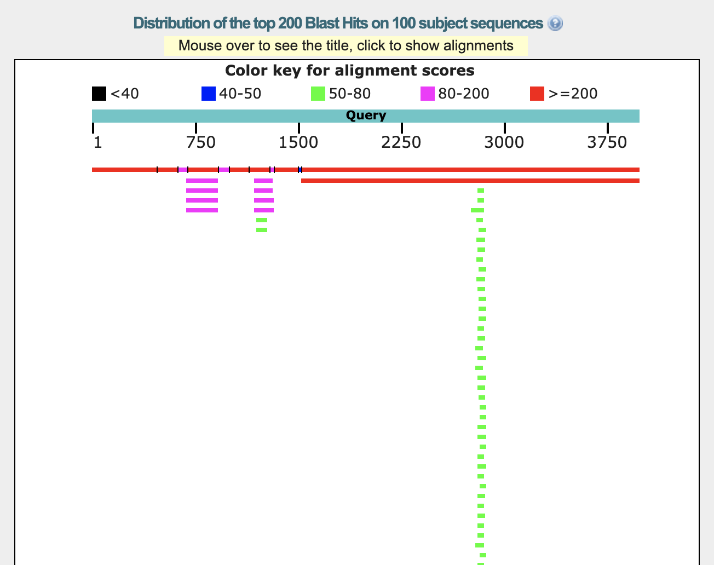
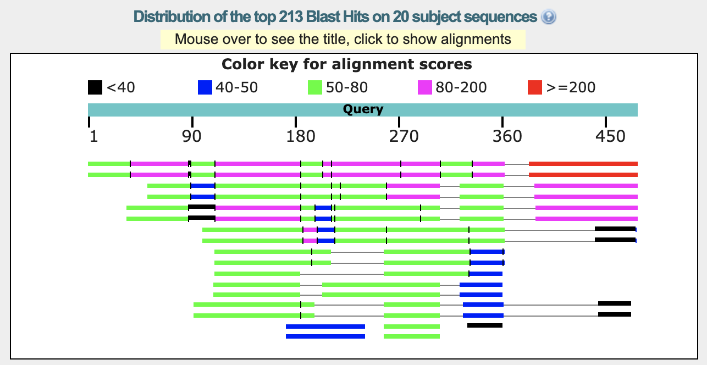

## BLAST - blastx, tblastn, blast2seqs

### Zad. 1 - Proste przeszukiwanie blastx
Otwórz serwis [BLAST](https://blast.ncbi.nlm.nih.gov/Blast.cgi). Wybierz program **blastx**. Umieść sekwencję zapytania, użyj domyślnych ustawień programu. Uruchom program BLAST.

> Program **blastx** dokonuje translacji nukleotydowej sekwencji w zapytaniu i dla tak uzyskanej sekwencji aminokwasowej przeszukuje bazę danych sekwencji aminokwasowych. Translacja dokonywana przez program blastx prowadzona jest w sześciu ramkach odczytu (trzy ramki odczytu na nici `plus` i trzy ramki odczytu na nici `minus`). Zatem z nukleotydowej sekwencji zapytania powstaje 6 różnych sekwencji białkowych, które następnie użyte zostają do przeszukania bazy danych sekwencji białkowych.

1. Sekwencja z bazy danych, która wykazuje największe podobieństwo do sekwencji zapytania jest czynnikiem transkrypcyjnym kurczaka (*Gallus gallus*) o numerze dostępu [NP_990795.1](https://www.ncbi.nlm.nih.gov/protein/NP_990795.1).
2. Sekwencja zapytania została przetłumaczona w pierwszej ramce odczytu (`Frame: +1`).
3. Pozycje startu i końca przyrównania:

   ```
   Query   121   1074
   Sbjct     1    304
   ```

   Długości nie odpowiadają sobie, ponieważ współrzędne sekwencji zapytania wyrażone są w liczbie nukleotydów, a współrzędne sekwencji trafienia są podane w pozycjach aminokwasów. Liczba aminokwasów przyrównanej sekwencji `Query` i `Subject` wynoszą:

   ```
   Query   (1074 - 121 + 1) * 3 = 318
   Sbjct            304 - 1 + 1 = 304
   ``` 

4. Przyrównanie sekwencji Marka i sekwencji `NP_990795.1`.

   

   Ukryta wiadomość to `MARK WAS HERE`. Mark użył sekwencji DNA kodującej czynnik transkrypcyjny. Umieścił w niej odpowiednie kodony tak, aby po przetłumaczeniu sekwencji DNA na białko powstała wiadomość.

   W uzyskanym przyrównaniu sekwencja zapytania przedstawiona jest jako sekwencja białkowa, natomiast jej współrzędne podane są w nukleotydach. Zatem jeden aminokwas odpowiada trzem nukleotydom. Wyraz `MARK` znajduje się w pozycji `453-465`.

   ```
      M         A         R         K
   453-456   456-459   459-462   462-465
   ```

5. Fragmenty przyrównania oznaczone małymi szarymi literami oznaczają regiony sekwencji o niskiej złożoności aminokwasowej (*low complexity*). Są to regiony zawierające wielokrotnie powtórzone reszty - krótkie segmenty powtórzeń albo segmenty, w których kila reszt występje częściej od innych (np. region `pppppppaaapp`). 

   Obecność tych segmentów w badanych sekwencjach powoduje tworzenie nieprawdziwych dopasowań i prowadzi do sztucznego zawyżania oceny przyrównania niespokrewnionych sekwencji. Dlatego regiony te nie są brane pod uwagę podczas wyznaczania przyrównania przez program BLAST (są "maskowane"), ponieważ mogłyby one fałszywie zawyżyć wartość punktacji `score`.
   > Program BLAST domyślnie maskuje te regiony, ale możliwe jest wyłączenie opcji maskowania w formularzu prorgamu BLAST (w panelu `Algorithm parameters`, w części `Filters and Masking`, zaznaczyć/odznaczyć `Filter low complexity regions`).

<br/>

### Zad. 2 - Złożone przeszukiwanie blastx
Rekord sekwencji EST węża koralowego (*Micrurus corallinus*): [FL590802](https://www.ncbi.nlm.nih.gov/nuccore/FL590802).

#### Przeszukiwanie blastx z sekwencją zapytania FL590802 i bazą danych UniProtKB/Swiss-Prot


1. Nie, sekwencja zapytania nie jest dopasowana na całej długości do sekwencji trafień.
   > Sekwencja zapytania jest sekwencją cDNA, które może posiadać na 5p i 3p końcach sekwencje nie ulegające translacji (*UTRs*, *Untranslated Regions*). Ponieważ blastx wyszukuje podobieństwo do sekwencji białkowych (przeszukiwaną bazą danych są sekwencje białkowej), nie należy oczewkiać, że regiony *UTR* będą wykazywały istotne podobieństwo do białek. 
2. Znalezione trafienia sekwencji białkowych są w większości jednorodne. Sekwencje te dotyczą neurotoksyn, których przyrównania otrzymują podobne wartości punktacji (w zakresie `50-80` bitów), *E*-value (`7e-11 - 6e-08`), i procent identyczności (`44-55%`). Sekwencja zapytania EST jest najprawdopodobniej neurotoksyną biorać pod uwagę, że pochodzi ona z gruczołów jadowych węża.

   

#### Najwyżej punktowane przyrównanie

```
>P01379.2 RecName: Full=Alpha-elapitoxin-Ls2a; Short=Alpha-EPTX-Ls2a; AltName: 
Full=Long neurotoxin Ls3; AltName: Full=LsIII; AltName: 
Full=Neurotoxin 1; AltName: Full=Neurotoxin alpha; Flags: 
Precursor
Length=87

 Score = 58.2 bits (139),  Expect = 7e-11, Method: Compositional matrix adjust.
 Identities = 31/70 (44%), Positives = 41/70 (59%), Gaps = 4/70 (6%)
 Frame = +1

Query  70   GYTRKCYEGEGTRKSVTCPKGEKVCYTIFLVGP--SHPAKVLKWGCAASCPKVGLGARIS  243
            GYTR+CY       + TCP G+++CY         S   KVL++GCAA+CP V  G  I 
Sbjct  19   GYTRECYLNP--HDTQTCPSGQEICYVKSWCNAWCSSRGKVLEFGCAATCPSVNTGTEIK  76

Query  244  CCSKDNCNSH  273
            CCS D CN++
Sbjct  77   CCSADKCNTY  86
```

3. Sekwencja zapytania została poddana translacji w pierwszej ramce odczytu (`Frame = +1`).
4. Sekwencja zapytania ma długość `435` nukleotydów. W przyrównaniu rozpoczyna się ona od `70` nukleotydu i kończy nukleotydem w pozycji `273`.
5. Białkowa sekwencja trafienia ma długość `87` aminokwasów. W przyrównaniu rozpoczyna się ona od `19` reszty aminokwasowej i kończy w `86` pozycji.

    ```
                        1        70               273                    435
    EST FL590802      5P----------------------------------------------------3P
                                  |||||||||||||||||||
    P01379                 ---------------------------
                           1     19                86
    ```

    Lokalizacja przyrównania wskazuje, że pierwsze 18 aminokwasów sekwencji trafienia nie zostało przyrównanych z przetłumaczoną sekwencją EST. Natomiast przyrównanie kończy się na przedostatnim aminokwasie.
    > Numerowanie pozycji na sekwencji zapytania i trafienia jest inne. Zapytanie jest sekwencją DNA poddaną translacji do aminokwasów, ale numerowanie odnosi się do sekwencji DNA. Każda przerwa w sekwencji zapytania oznacza trzy nukleotydy, a przerwa w sekwencji trafienia oznacza jeden aminokwas. 

    Sekwencja EST najprawdopodobniej zawiera również region 3P UTR transkryptu neurotoksyny. W tym przypadku, neurotoksyna kodowana przez sekwencję zapytania ma - podobnie jak sekwencja trafienia - długość ok. 87 aminokwasów. Można zaobserwować, że przyrównania sekwencji zapytania z pozostałymi trafieniami nie rozciągają się poza pozcyję `273`.

6. Sekwencja aminokwasowa trafienia (`P01379`) oznaczona jest jako białko prekursorowe (`Flags: Precursor`). Rekord tego białka w bazie UniProt ([P01379](https://www.uniprot.org/uniprot/P01379)) dostarcza dodatkowej informacji, że na N-końcu tego białka (w pozycji `1-21`) znajduje się peptyd sygnałowy. 

   

   Podobnie, jak u innych neurotoksyn węży, sekwencja sygnałowa kieruje nowo otrzymane białko na zewnątrz komórki. Podczas procesu sekrecji, sekwencja sygnałowa jest usuwana z białka. Cechą charakterystyczną peptydów sygnałowych jest niska zachowawczość ich sekwencji, która najczęściej uniemożliwia otrzymanie wiarygodnego przyrównania. Możliwe jest, że sekwencja sygnałowa zakodowana jest w sekwencji EST; 69 nukleotydów upstream od przyrównania blastx odpowiada długości kodowanej sekwencji sygnałowej przynajmniej 18 aminokasów.

7. W rekordzie UniProt (`P01379`), w części `Amino acid modifications` przedstawione są pozycje mostków dwusiarczkowych (np. między cysteinami w pozycjach `24` i `41`). Cysteiny utzymują tę kró†ką sekwencję białkową w ścisłej strukturze umożliwiającej realizację swojej funkcji. Co ciekawe, białko kodowane przez sekwencję EST pozbawione jest dwóch cysteiny, co sugeruje, że struktura przestrzenna tego białka może być inna.

   
<br/>

### Zad. 3 - Proste przeszukiwanie tblastn
Przeszukiwanie tblastn sekwencji ludzkiego białka LIM [NP_001167617](https://www.ncbi.nlm.nih.gov/protein/NP_001167617) w sekwencjach *EST* pochodzących z gąbek (*Porifera*).


1. Większość zidentyfikowanych sekwencji gąbek pochodzi z *Amphimedon queenslandica*, gąbki z Wielkiej Rafy Koralowej u wybrzeży Australii.

   

2. Sekwencja trafienia `GW188954.1` została poddana translacji w 3 ramce odczytu (`Frame = +3`)

   ```
   >GW188954.1 CAYI9900.b1 CAYI Amphimedon queenslandica competent larva (one 
   day old) (L) Amphimedon queenslandica cDNA clone CAYI9900 
   5', mRNA sequence
   Length=669
   
    Score = 114 bits (286),  Expect = 2e-29, Method: Compositional matrix adjust.
    Identities = 49/118 (42%), Positives = 75/118 (64%), Gaps = 1/118 (1%)
    Frame = +3
   
   Query  53   PAVCEGCQRPISDRFLMRVNESSWHEECLQCAACQQALTTSCYFRDRKLYCKQDYQQLFA  112
               P +C GC  PI +RFLM+V + SWH +C++C+ CQ  L+  C+ RD KLYC+ D+ + + 
   Sbjct  42   PFICAGCSEPIMERFLMKVLDKSWHVQCVKCSDCQCLLSEKCFSRDNKLYCRSDFFRQYG  221
   
   Query  113  AKCSGCMEKIAPTEFVMRALECVYHLGCFCCCVCERQLRKGDEFVLKEGQ-LLCKGDY  169
                +C+ C E + P + V R +  +YH+ CF C VC+RQL  G++  L +G+  LC   Y
   Sbjct  222  TQCASCKEGLCPEDLVRRGVNKIYHVQCFKCSVCQRQLNTGEQLYLVQGEKFLCDSCY  395
   ```

3. Białkowa sekwencja zapytania ma długość 405 aminokwasów. Przyrównanie obejmuje jej N-końcowy fragment od pozycji `53` do `169` reszt aminokwasowych.
4. Nukleotydowa sekwencja EST ma długość 669 nukleotydów. Przyrównanie obejmuje jej fragment od pozycji `42` do `395` nukleotydów.
<br/><br/>


### Zad. 4 - Wyznaczanie lokalizacji egzonów (blastn)
Rekord traskryptu genu GABRG2 człowieka: [NM_198904](https://www.ncbi.nlm.nih.gov/nuccore/NM_198904).

Najwyżej punktowanym trafieniem jest referencyjny gen (`RefSeqGene`): [NG_009290.1](https://www.ncbi.nlm.nih.gov/nucleotide/NG_009290.1).

```
>NG_009290.1 Homo sapiens gamma-aminobutyric acid type A receptor gamma2 subunit 
(GABRG2), RefSeqGene on chromosome 5
Length=94898

 Score = 4417 bits (4898),  Expect = 0.0
 Identities = 2449/2449 (100%), Gaps = 0/2449 (0%)
 Strand=Plus/Plus

Query  1509   AGGCCCCTACCATTGATATCCGCCCAAGATCAGCAACCATTCAAATGAATAATGCTACAC  1568
              ||||||||||||||||||||||||||||||||||||||||||||||||||||||||||||
Sbjct  90450  AGGCCCCTACCATTGATATCCGCCCAAGATCAGCAACCATTCAAATGAATAATGCTACAC  90509

Query  1569   ACCTTCAAGAGAGAGATGAAGAGTACGGCTATGAGTGTCTGGACGGCAAGGACTGTGCCA  1628
              ||||||||||||||||||||||||||||||||||||||||||||||||||||||||||||
Sbjct  90510  ACCTTCAAGAGAGAGATGAAGAGTACGGCTATGAGTGTCTGGACGGCAAGGACTGTGCCA  90569

Query  1629   GTTTTTTCTGCTGTTTTGAAGATTGTCGAACAGGAGCTTGGAGACATGGGAGGATACATA  1688
              ||||||||||||||||||||||||||||||||||||||||||||||||||||||||||||
Sbjct  90570  GTTTTTTCTGCTGTTTTGAAGATTGTCGAACAGGAGCTTGGAGACATGGGAGGATACATA  90629

Query  1689   TCCGCATTGCCAAAATGGACTCCTATGCTCGGATCTTCTTCCCCACTGCCTTCTGCCTGT  1748
              ||||||||||||||||||||||||||||||||||||||||||||||||||||||||||||
Sbjct  90630  TCCGCATTGCCAAAATGGACTCCTATGCTCGGATCTTCTTCCCCACTGCCTTCTGCCTGT  90689

Query  1749   TTAATCTGGTCTATTGGGTCTCCTACCTCTACCTGTGAGGAGGTATGGGTTTTACTGATA  1808
              ||||||||||||||||||||||||||||||||||||||||||||||||||||||||||||
Sbjct  90690  TTAATCTGGTCTATTGGGTCTCCTACCTCTACCTGTGAGGAGGTATGGGTTTTACTGATA  90749

Query  1809   TGGTTCTTATTCACTGAGTCTCATGGAGAGATGTCTGTTCTAAGTCCACTTAAATAATCC  1868
              ||||||||||||||||||||||||||||||||||||||||||||||||||||||||||||
Sbjct  90750  TGGTTCTTATTCACTGAGTCTCATGGAGAGATGTCTGTTCTAAGTCCACTTAAATAATCC  90809

Query  1869   TCTATGTGGTTGATAATGATCTGAATCTGTTTCTATGTCCAAACCTGGTAAATTTTATAA  1928
              ||||||||||||||||||||||||||||||||||||||||||||||||||||||||||||
Sbjct  90810  TCTATGTGGTTGATAATGATCTGAATCTGTTTCTATGTCCAAACCTGGTAAATTTTATAA  90869

Query  1929   TGTCATATTGTTTGTGCCCAGCCCTCCTTTGGTTAGTGTACTTTGAACTTCGATGTTTGC  1988
              ||||||||||||||||||||||||||||||||||||||||||||||||||||||||||||
Sbjct  90870  TGTCATATTGTTTGTGCCCAGCCCTCCTTTGGTTAGTGTACTTTGAACTTCGATGTTTGC  90929

Query  1989   TGTGTTTCAAACCTGCAAGGCAAAGTAAAATTAGAGCAAGAACATTCAAACCAAATAAGA  2048
              ||||||||||||||||||||||||||||||||||||||||||||||||||||||||||||
Sbjct  90930  TGTGTTTCAAACCTGCAAGGCAAAGTAAAATTAGAGCAAGAACATTCAAACCAAATAAGA  90989

Query  2049   TATTTTTCAGCTACAGCAAATAAAACAGTGAAAGCCCTGACTATTTACAGTAGTGGTATC  2108
              ||||||||||||||||||||||||||||||||||||||||||||||||||||||||||||
Sbjct  90990  TATTTTTCAGCTACAGCAAATAAAACAGTGAAAGCCCTGACTATTTACAGTAGTGGTATC  91049

Query  2109   CTTACTAGATTCATAATGCAATTAGATAGAAAAGGTCCAAAACTGTACCCTATGTTCACT  2168
              ||||||||||||||||||||||||||||||||||||||||||||||||||||||||||||
Sbjct  91050  CTTACTAGATTCATAATGCAATTAGATAGAAAAGGTCCAAAACTGTACCCTATGTTCACT  91109

Query  2169   CCGGGTCAAGTTGTGATAAATTTGATCCCAATAGAATACCTCCCTCATTTAAGAAAAATC  2228
              ||||||||||||||||||||||||||||||||||||||||||||||||||||||||||||
Sbjct  91110  CCGGGTCAAGTTGTGATAAATTTGATCCCAATAGAATACCTCCCTCATTTAAGAAAAATC  91169

Query  2229   ATAACTCACTTTAAATATGAAAGCCTAGTCCAGAAATCTATTACACCTTTATCTCAAGAT  2288
              ||||||||||||||||||||||||||||||||||||||||||||||||||||||||||||
Sbjct  91170  ATAACTCACTTTAAATATGAAAGCCTAGTCCAGAAATCTATTACACCTTTATCTCAAGAT  91229

Query  2289   AGGAAGAAAATTTCCTCCACATTCATGTACAATGATGTAAATATTTCAATAACTTAGAAT  2348
              ||||||||||||||||||||||||||||||||||||||||||||||||||||||||||||
Sbjct  91230  AGGAAGAAAATTTCCTCCACATTCATGTACAATGATGTAAATATTTCAATAACTTAGAAT  91289

Query  2349   GCTTCAAGTTTAGTGCATGCATCTCTTTAGATCCAAAATAAATGGACTGAAGTTATCATC  2408
              ||||||||||||||||||||||||||||||||||||||||||||||||||||||||||||
Sbjct  91290  GCTTCAAGTTTAGTGCATGCATCTCTTTAGATCCAAAATAAATGGACTGAAGTTATCATC  91349

Query  2409   CTATTGTCTTTTATTTTGTGTCCTTGGGCTATAAAAGATTCCTGAATGTAATTATAAGGA  2468
              ||||||||||||||||||||||||||||||||||||||||||||||||||||||||||||
Sbjct  91350  CTATTGTCTTTTATTTTGTGTCCTTGGGCTATAAAAGATTCCTGAATGTAATTATAAGGA  91409

Query  2469   TTTGGGTTTGGAAATGGAGGGAGGAATTTTCATTGCCTTCTCCCTCATGCATGAAGATTC  2528
              ||||||||||||||||||||||||||||||||||||||||||||||||||||||||||||
Sbjct  91410  TTTGGGTTTGGAAATGGAGGGAGGAATTTTCATTGCCTTCTCCCTCATGCATGAAGATTC  91469

Query  2529   GAACAGCTTATTTTTTCCTTGTATGACATATTACAACACTTTAAGTAAAATATAGACTGG  2588
              ||||||||||||||||||||||||||||||||||||||||||||||||||||||||||||
Sbjct  91470  GAACAGCTTATTTTTTCCTTGTATGACATATTACAACACTTTAAGTAAAATATAGACTGG  91529

Query  2589   ATAATCAACATTTGCCACCTCTAAATATGCCCAATTTCATAACTAGAGTATAAAGTAATT  2648
              ||||||||||||||||||||||||||||||||||||||||||||||||||||||||||||
Sbjct  91530  ATAATCAACATTTGCCACCTCTAAATATGCCCAATTTCATAACTAGAGTATAAAGTAATT  91589

Query  2649   GTATGTGCTTGCCGCTAtttttttCTTCCTTTTAGGATGATAGATCATAACAGAACTTAT  2708
              ||||||||||||||||||||||||||||||||||||||||||||||||||||||||||||
Sbjct  91590  GTATGTGCTTGCCGCTATTTTTTTCTTCCTTTTAGGATGATAGATCATAACAGAACTTAT  91649

Query  2709   TCTCCATCTCAAGATCTGCTTCTAGTGATTGTGAGTGCCTTGTGGGCAGAATCCTTGTCA  2768
              ||||||||||||||||||||||||||||||||||||||||||||||||||||||||||||
Sbjct  91650  TCTCCATCTCAAGATCTGCTTCTAGTGATTGTGAGTGCCTTGTGGGCAGAATCCTTGTCA  91709

Query  2769   TTTCCTCTTTGGGTCTGTAGCACCTTGCATAGTGCCTGGCATATAGTTGGTGCTCAATAA  2828
              ||||||||||||||||||||||||||||||||||||||||||||||||||||||||||||
Sbjct  91710  TTTCCTCTTTGGGTCTGTAGCACCTTGCATAGTGCCTGGCATATAGTTGGTGCTCAATAA  91769

Query  2829   ATATGGTTTGAAGTGAATTGCCCTCACATGCTTCTGGCAAATCTCTGTGCTGGCCTGAAA  2888
              ||||||||||||||||||||||||||||||||||||||||||||||||||||||||||||
Sbjct  91770  ATATGGTTTGAAGTGAATTGCCCTCACATGCTTCTGGCAAATCTCTGTGCTGGCCTGAAA  91829

Query  2889   CCAGTGACTCATCTTCTCACATAGGTGTTGTCAAGTGATATTTGATTTTGTAAAAATAAC  2948
              ||||||||||||||||||||||||||||||||||||||||||||||||||||||||||||
Sbjct  91830  CCAGTGACTCATCTTCTCACATAGGTGTTGTCAAGTGATATTTGATTTTGTAAAAATAAC  91889

Query  2949   CAGTAGGATCCAAAGAACTTTAGCTATTTATGTTCATCTTCAAAAAATTATTTTAGGCAA  3008
              ||||||||||||||||||||||||||||||||||||||||||||||||||||||||||||
Sbjct  91890  CAGTAGGATCCAAAGAACTTTAGCTATTTATGTTCATCTTCAAAAAATTATTTTAGGCAA  91949

Query  3009   AGTCCATACTCCTTTTAAAACAATATTTATGTCCTATGTTTGTGTATAGACATGACTCTA  3068
              ||||||||||||||||||||||||||||||||||||||||||||||||||||||||||||
Sbjct  91950  AGTCCATACTCCTTTTAAAACAATATTTATGTCCTATGTTTGTGTATAGACATGACTCTA  92009

Query  3069   CTAGGGCATAATTAGAGTTTGTGTATTATTTTTCCAGGTTTGGGGATGAGTCAGTCCTTG  3128
              ||||||||||||||||||||||||||||||||||||||||||||||||||||||||||||
Sbjct  92010  CTAGGGCATAATTAGAGTTTGTGTATTATTTTTCCAGGTTTGGGGATGAGTCAGTCCTTG  92069

Query  3129   CCCATCCACAATTTTGTTTGTGAACTTATAACAGGAATAAGCAAAATTCATACCTGACTA  3188
              ||||||||||||||||||||||||||||||||||||||||||||||||||||||||||||
Sbjct  92070  CCCATCCACAATTTTGTTTGTGAACTTATAACAGGAATAAGCAAAATTCATACCTGACTA  92129

Query  3189   GTGTTCAGAATGTAGCATTCTGTGCGAAAAAGTATTGAAGATTAGCTTTTAAAAACTGaa  3248
              ||||||||||||||||||||||||||||||||||||||||||||||||||||||||||||
Sbjct  92130  GTGTTCAGAATGTAGCATTCTGTGCGAAAAAGTATTGAAGATTAGCTTTTAAAAACTGAA  92189

Query  3249   aaaaaaaaaTGAATGACTCACATAGAGGTTGAGCCAATGACTGTGGCCTCATTAGATTAC  3308
              ||||||||||||||||||||||||||||||||||||||||||||||||||||||||||||
Sbjct  92190  AAAAAAAAATGAATGACTCACATAGAGGTTGAGCCAATGACTGTGGCCTCATTAGATTAC  92249

Query  3309   ATTGTAGTTAAACAAAGCAATTTCTCCAGACTTAAAACATGATGAGTTGAGCTCTATCTT  3368
              ||||||||||||||||||||||||||||||||||||||||||||||||||||||||||||
Sbjct  92250  ATTGTAGTTAAACAAAGCAATTTCTCCAGACTTAAAACATGATGAGTTGAGCTCTATCTT  92309

Query  3369   CATGTACTCATCCTGAATCCTTATTTTTCTAAAATAGCACCCTTTGTTAATTATTTTTAT  3428
              ||||||||||||||||||||||||||||||||||||||||||||||||||||||||||||
Sbjct  92310  CATGTACTCATCCTGAATCCTTATTTTTCTAAAATAGCACCCTTTGTTAATTATTTTTAT  92369

Query  3429   GGAAATTATTACTCTGTCATAATTAAATCATAGCTAGTATAACTTTACAGATAACCTAAA  3488
              ||||||||||||||||||||||||||||||||||||||||||||||||||||||||||||
Sbjct  92370  GGAAATTATTACTCTGTCATAATTAAATCATAGCTAGTATAACTTTACAGATAACCTAAA  92429

Query  3489   AAGAATAGAAAAGAAGAGAGAGTGGCTTTGTCAGTATAAAACCATGTAAAGTCATCATCA  3548
              ||||||||||||||||||||||||||||||||||||||||||||||||||||||||||||
Sbjct  92430  AAGAATAGAAAAGAAGAGAGAGTGGCTTTGTCAGTATAAAACCATGTAAAGTCATCATCA  92489

Query  3549   AGTCATCTGGATGAATCTTGAAACACATTTAGCTGCCAGTTTTACAAACCTTTAATATAT  3608
              ||||||||||||||||||||||||||||||||||||||||||||||||||||||||||||
Sbjct  92490  AGTCATCTGGATGAATCTTGAAACACATTTAGCTGCCAGTTTTACAAACCTTTAATATAT  92549

Query  3609   CAGTGCTCCAGTATATAACCTCAAACAAATGTAAATAGAACGAATTATTTTCTTGTTTTG  3668
              ||||||||||||||||||||||||||||||||||||||||||||||||||||||||||||
Sbjct  92550  CAGTGCTCCAGTATATAACCTCAAACAAATGTAAATAGAACGAATTATTTTCTTGTTTTG  92609

Query  3669   AATTGTCAATATATTAAATGTTGACTCTTTGGGAGAGTTGTTGGCAAGTTTCAATGGTGA  3728
              ||||||||||||||||||||||||||||||||||||||||||||||||||||||||||||
Sbjct  92610  AATTGTCAATATATTAAATGTTGACTCTTTGGGAGAGTTGTTGGCAAGTTTCAATGGTGA  92669

Query  3729   GAAACATTATTGTCAACTTGAAATGTGTTCTGTAATGGGGACACTACAAAAAGCTAGCTT  3788
              ||||||||||||||||||||||||||||||||||||||||||||||||||||||||||||
Sbjct  92670  GAAACATTATTGTCAACTTGAAATGTGTTCTGTAATGGGGACACTACAAAAAGCTAGCTT  92729

Query  3789   TCCAATGTGTGCATAGTATTGGCAATATGAatatatattatatataATCTAATACTTATT  3848
              ||||||||||||||||||||||||||||||||||||||||||||||||||||||||||||
Sbjct  92730  TCCAATGTGTGCATAGTATTGGCAATATGAATATATATTATATATAATCTAATACTTATT  92789

Query  3849   ATAAGCTGCTCCCTGTCTATGTATTTGGAAACCTTTTCACAAAGGGAATTGCCTAACATG  3908
              ||||||||||||||||||||||||||||||||||||||||||||||||||||||||||||
Sbjct  92790  ATAAGCTGCTCCCTGTCTATGTATTTGGAAACCTTTTCACAAAGGGAATTGCCTAACATG  92849

Query  3909   TGGACTTTTACAATAAAAATGCTGCATTCTAATCCATGGTGGCATCTCA  3957
              |||||||||||||||||||||||||||||||||||||||||||||||||
Sbjct  92850  TGGACTTTTACAATAAAAATGCTGCATTCTAATCCATGGTGGCATCTCA  92898


 Score = 839 bits (930),  Expect = 0.0
 Identities = 465/465 (100%), Gaps = 0/465 (0%)
 Strand=Plus/Plus

Query  1     GTAAGTGTGAGGGGCATGAGTATACACGAGTGTGCGTGTCTTTCCCTCTCCCTTATTTGT  60
             ||||||||||||||||||||||||||||||||||||||||||||||||||||||||||||
Sbjct  5001  GTAAGTGTGAGGGGCATGAGTATACACGAGTGTGCGTGTCTTTCCCTCTCCCTTATTTGT  5060

Query  61    CTCCGTATGAGTCTCTCCTTGTACCCTCCCCCTGCCTCGATGATATTACTCCCCCAGACT  120
             ||||||||||||||||||||||||||||||||||||||||||||||||||||||||||||
Sbjct  5061  CTCCGTATGAGTCTCTCCTTGTACCCTCCCCCTGCCTCGATGATATTACTCCCCCAGACT  5120

Query  121   TGGAAGCCGCTGCCAGAGTGACGCTTTGATGGTATCTGCAAGCGTTTTTGCTGATCTTAT  180
             ||||||||||||||||||||||||||||||||||||||||||||||||||||||||||||
Sbjct  5121  TGGAAGCCGCTGCCAGAGTGACGCTTTGATGGTATCTGCAAGCGTTTTTGCTGATCTTAT  5180

Query  181   CTCTGCCCCCTGAATATTAATTCCCTAATCTGGTAGCAATCCATCTCCCCAGTGAAGGAC  240
             ||||||||||||||||||||||||||||||||||||||||||||||||||||||||||||
Sbjct  5181  CTCTGCCCCCTGAATATTAATTCCCTAATCTGGTAGCAATCCATCTCCCCAGTGAAGGAC  5240

Query  241   CTACTAGAGGCAGGTGGGGGGAGCCACCATCAGATCATAAGCATAAGAATAATACAAAGG  300
             ||||||||||||||||||||||||||||||||||||||||||||||||||||||||||||
Sbjct  5241  CTACTAGAGGCAGGTGGGGGGAGCCACCATCAGATCATAAGCATAAGAATAATACAAAGG  5300

Query  301   GGAGGGATTCTTCTGCAACCAAGAGGCAAGAGGCGAGAGAAGGaaaaaaaaaaaaGCGAT  360
             ||||||||||||||||||||||||||||||||||||||||||||||||||||||||||||
Sbjct  5301  GGAGGGATTCTTCTGCAACCAAGAGGCAAGAGGCGAGAGAAGGAAAAAAAAAAAAGCGAT  5360

Query  361   GAGTTCGCCAAATATATGGAGCACAGGAAGCTCAGTCTACTCGACTCCTGTATTTTCACA  420
             ||||||||||||||||||||||||||||||||||||||||||||||||||||||||||||
Sbjct  5361  GAGTTCGCCAAATATATGGAGCACAGGAAGCTCAGTCTACTCGACTCCTGTATTTTCACA  5420

Query  421   GAAAATGACGGTGTGGATTCTGCTCCTGCTGTCGCTCTACCCTGG  465
             |||||||||||||||||||||||||||||||||||||||||||||
Sbjct  5421  GAAAATGACGGTGTGGATTCTGCTCCTGCTGTCGCTCTACCCTGG  5465


 Score = 405 bits (448),  Expect = 3e-109
 Identities = 224/224 (100%), Gaps = 0/224 (0%)
 Strand=Plus/Plus

Query  685    GGAATACACTATTGATATATTTTTTGCGCAAACGTGGTATGACAGACGTTTGAAATTTAA  744
              ||||||||||||||||||||||||||||||||||||||||||||||||||||||||||||
Sbjct  34996  GGAATACACTATTGATATATTTTTTGCGCAAACGTGGTATGACAGACGTTTGAAATTTAA  35055

Query  745    CAGCACCATTAAAGTCCTCCGATTGAACAGCAACATGGTGGGGAAAATCTGGATTCCAGA  804
              ||||||||||||||||||||||||||||||||||||||||||||||||||||||||||||
Sbjct  35056  CAGCACCATTAAAGTCCTCCGATTGAACAGCAACATGGTGGGGAAAATCTGGATTCCAGA  35115

Query  805    CACTTTCTTCAGAAATTCCAAAAAAGCTGATGCACACTGGATCACCACCCCCAACAGGAT  864
              ||||||||||||||||||||||||||||||||||||||||||||||||||||||||||||
Sbjct  35116  CACTTTCTTCAGAAATTCCAAAAAAGCTGATGCACACTGGATCACCACCCCCAACAGGAT  35175

Query  865    GCTGAGAATTTGGAATGATGGTCGAGTGCTCTACACCCTAAGGT  908
              ||||||||||||||||||||||||||||||||||||||||||||
Sbjct  35176  GCTGAGAATTTGGAATGATGGTCGAGTGCTCTACACCCTAAGGT  35219


 Score = 380 bits (421),  Expect = 1e-101
 Identities = 212/213 (99%), Gaps = 0/213 (0%)
 Strand=Plus/Plus

Query  1274   TCTTTAGGTATCACCACTGTCCTGACAATGACCACCCTCAGCACCATTGCCCGGAAATCG  1333
              |||| |||||||||||||||||||||||||||||||||||||||||||||||||||||||
Sbjct  86460  TCTTCAGGTATCACCACTGTCCTGACAATGACCACCCTCAGCACCATTGCCCGGAAATCG  86519

Query  1334   CTCCCCAAGGTCTCCTATGTCACAGCGATGGATCTCTTTGTATCTGTTTGTTTCATCTTT  1393
              ||||||||||||||||||||||||||||||||||||||||||||||||||||||||||||
Sbjct  86520  CTCCCCAAGGTCTCCTATGTCACAGCGATGGATCTCTTTGTATCTGTTTGTTTCATCTTT  86579

Query  1394   GTCTTCTCTGCTCTGGTGGAGTATGGCACCTTGCATTATTTTGTCAGCAACCGGAAACCA  1453
              ||||||||||||||||||||||||||||||||||||||||||||||||||||||||||||
Sbjct  86580  GTCTTCTCTGCTCTGGTGGAGTATGGCACCTTGCATTATTTTGTCAGCAACCGGAAACCA  86639

Query  1454   AGCAAGGACAAAGATAAAAAGAAGAAAAACCCT  1486
              |||||||||||||||||||||||||||||||||
Sbjct  86640  AGCAAGGACAAAGATAAAAAGAAGAAAAACCCT  86672


 Score = 283 bits (313),  Expect = 2e-72
 Identities = 160/161 (99%), Gaps = 1/161 (1%)
 Strand=Plus/Plus

Query  1123   TTCC-GGAGATTATGTGGTCATGTCTGTCTACTTTGATCTGAGCAGAAGAATGGGATACT  1181
              |||| |||||||||||||||||||||||||||||||||||||||||||||||||||||||
Sbjct  79517  TTCCAGGAGATTATGTGGTCATGTCTGTCTACTTTGATCTGAGCAGAAGAATGGGATACT  79576

Query  1182   TTACCATCCAGACCTATATCCCCTGCACACTCATTGTCGTCCTATCCTGGGTGTCTTTCT  1241
              ||||||||||||||||||||||||||||||||||||||||||||||||||||||||||||
Sbjct  79577  TTACCATCCAGACCTATATCCCCTGCACACTCATTGTCGTCCTATCCTGGGTGTCTTTCT  79636

Query  1242   GGATCAATAAGGATGCTGTTCCAGCCAGAACATCTTTAGGT  1282
              |||||||||||||||||||||||||||||||||||||||||
Sbjct  79637  GGATCAATAAGGATGCTGTTCCAGCCAGAACATCTTTAGGT  79677


 Score = 277 bits (306),  Expect = 1e-70
 Identities = 153/153 (100%), Gaps = 0/153 (0%)
 Strand=Plus/Plus

Query  465    GCTTCACTAGCCAGAAATCTGATGATGACTATGAAGATTATGCTTCTAACAAAACATGGG  524
              ||||||||||||||||||||||||||||||||||||||||||||||||||||||||||||
Sbjct  31186  GCTTCACTAGCCAGAAATCTGATGATGACTATGAAGATTATGCTTCTAACAAAACATGGG  31245

Query  525    TCTTGACTCCAAAAGTTCCTGAGGGTGATGTCACTGTCATCTTAAACAACCTGCTGGAAG  584
              ||||||||||||||||||||||||||||||||||||||||||||||||||||||||||||
Sbjct  31246  TCTTGACTCCAAAAGTTCCTGAGGGTGATGTCACTGTCATCTTAAACAACCTGCTGGAAG  31305

Query  585    GATATGACAATAAACTTCGGCCTGATATAGGAG  617
              |||||||||||||||||||||||||||||||||
Sbjct  31306  GATATGACAATAAACTTCGGCCTGATATAGGAG  31338


 Score = 251 bits (278),  Expect = 4e-63
 Identities = 139/139 (100%), Gaps = 0/139 (0%)
 Strand=Plus/Plus

Query  990    ATGGCTATCCACGTGAAGAAATTGTTTATCAATGGAAGCGAAGTTCTGTTGAAGTGGGCG  1049
              ||||||||||||||||||||||||||||||||||||||||||||||||||||||||||||
Sbjct  41248  ATGGCTATCCACGTGAAGAAATTGTTTATCAATGGAAGCGAAGTTCTGTTGAAGTGGGCG  41307

Query  1050   ACACAAGATCCTGGAGGCTTTATCAATTCTCATTTGTTGGTCTAAGAAATACCACCGAAG  1109
              ||||||||||||||||||||||||||||||||||||||||||||||||||||||||||||
Sbjct  41308  ACACAAGATCCTGGAGGCTTTATCAATTCTCATTTGTTGGTCTAAGAAATACCACCGAAG  41367

Query  1110   TAGTGAAGACAACTTCCGG  1128
              |||||||||||||||||||
Sbjct  41368  TAGTGAAGACAACTTCCGG  41386


 Score = 155 bits (171),  Expect = 8e-34
 Identities = 87/88 (99%), Gaps = 0/88 (0%)
 Strand=Plus/Plus

Query  902    CTAAGGTTGACAATTGATGCTGAGTGCCAATTACAATTGCACAACTTTCCAATGGATGAA  961
              || |||||||||||||||||||||||||||||||||||||||||||||||||||||||||
Sbjct  38589  CTTAGGTTGACAATTGATGCTGAGTGCCAATTACAATTGCACAACTTTCCAATGGATGAA  38648

Query  962    CACTCCTGCCCCTTGGAGTTCTCCAGTT  989
              ||||||||||||||||||||||||||||
Sbjct  38649  CACTCCTGCCCCTTGGAGTTCTCCAGTT  38676


 Score = 129 bits (142),  Expect = 3e-26
 Identities = 71/71 (100%), Gaps = 0/71 (0%)
 Strand=Plus/Plus

Query  616    AGTGAAGCCAACGTTAATTCACACAGACATGTATGTGAATAGCATTGGTCCAGTGAACGC  675
              ||||||||||||||||||||||||||||||||||||||||||||||||||||||||||||
Sbjct  32852  AGTGAAGCCAACGTTAATTCACACAGACATGTATGTGAATAGCATTGGTCCAGTGAACGC  32911

Query  676    TATCAATATGG  686
              |||||||||||
Sbjct  32912  TATCAATATGG  32922


 Score = 46.4 bits (50),  Expect = 0.30
 Identities = 25/25 (100%), Gaps = 0/25 (0%)
 Strand=Plus/Plus

Query  1487   CTTCTTCGGATGTTTTCCTTCAAGG  1511
              |||||||||||||||||||||||||
Sbjct  89089  CTTCTTCGGATGTTTTCCTTCAAGG  89113


 Score = 45.5 bits (49),  Expect = 1.0
 Identities = 32/37 (86%), Gaps = 0/37 (0%)
 Strand=Plus/Plus

Query  2786   TAGCACCTTGCATAGTGCCTGGCATATAGTTGGTGCT  2822
              ||||| || || |||||||||||| ||||| ||||||
Sbjct  59042  TAGCAACTAGCTTAGTGCCTGGCACATAGTAGGTGCT  59078
```


1. Gen GABRG2 znajduje się na chromosomie 5 człowieka.
2. Tak, sekwencja mRNA została przyrównana na całej swojej długości do sekwencji genomowej GABRG2 (`Query Cover`: `100%`).
3. Program *blastn* wyznaczył 11 przyrównań między sekwencją mRNA a sekwencją genomową genu GABRG2.
4. Tak, wszystkie przyrównania są w jednej orientacji nici DNA (`plus/plus`).
   > Egzony należące do jednego genu zawsze mają jeden kierunek (wszystkie na nici `plus` lub na nici `minus`)
5. Nie, przyrównania między sekwencją mRNA a odpowiadającą sekwencją genomową genu GABRG2 ułożone są według malejących wartości punktacji (`score`). Na przykład, pierwsze przyrównania (`4417` bitów) odpowiada dziesiątemu egzonowi, drugie przyrównanie (`839` bitów) dotyczy pierwszego egzonu.
6. Program *blastn* odnalazł wszystkie 10 egzonów genu GABRG2. Jednak, dokładna lokalizacja początku i końca egzonu została wyznaczona poprawnie tylko dla pierwszego egzonu (`1..465`). Dla pozostałych 9 egzonów, wyznaczone miejsca ich początku i końca różnią się o najczęściej o 1-2 nukleotydy.

    ```
       RefSeq           blastn
       1   465          1   465          OK
     466   617        466   617
     618   685        616   686
     686   906        685   908
     907   989        902   989
     990   1127       990   1128
    1128   1280      1123   1282
    1281   1486      1274   1486
    1487   1510      1487   1511
    1511   3957      1509   3957
    ```
7. Niezgodności w przyrównaniach sekwencji identycznych występują najczęściej na 5P i/lub 3P końcach przyrównania, ponieważ algorytm *blast* rozszerza przyrównanie w obu kierunkach. Algorytm *blast* nie zna miejsca początku i końca egzonu; algorytm może więc zwrócić przyrównanie nieco "wydłużone" od rzeczywistego egzonu, pod warunkiem, że "wydłużone" fragmenty nie zawierają zbyt dużo niezgodnych nukleotydów. Program *blastn* wyznaczył lokalizację piągego egzonu w pozycji `902..989`, podczas gdy prawidłowa pozycja to `907..989`. Algorytm rozszerzył zatem przyrównanie na 5P końcu o 5 nukleotydów kosztem jednej niezgodnej reszty nukleotydowej w pozycji `904`.

8. Dodatkowe przyrównanie (`2786..2822`) obejmuje fragment 10 egzonu genu GABRG2 (`1511..3957`), który wykazuje przypadkowe podobieństwo do innego regionu w tym geniu. Wartość *E*-value tego przyrównania wynosi `1`.

#### NCBI Splign
Otwórz stronę serwisu [NCBI Splign](https://www.ncbi.nlm.nih.gov/sutils/splign/). W polu `cDNA` umieść numer dostępu `NM_198904`, a w polu `Genomic` umieść `NG_009290` i naciśnij przycisk `Align`. Na stronie wynikowej, wyświetl widok w formacie tekstowym (`Text`).

9. Tak, program Splign wyznaczył prawidłowe lokalizacje wszystkich 10 egzonów genu GABRG2.

   
<br/>

### Zad. 5 - Wyznaczanie lokalizacji ortologicznych egzonów kodujących (blastn i tblastn)

#### blastn



1. Gen GABRG2 znajduje się na chromosomie 2 gibona *N. leucogenys* ([NC_019817.1](https://www.ncbi.nlm.nih.gov/nucleotide/NC_019817.1).
2. Tak, sekwencja ludzkiego transkryptu GABRG2 została przyrównana na całej swojej długości (`Query Cover: 100%`).
3. Program *blastn* wyznaczył `161` przyrównań między sekwencją ludzkiego transkryptu GABRG2 a sekwencją chromosomu 2 gibona.
4. Nie, zidentyfikowane przyrównania znajdują się w różnej orientacji.

#### tblastn



5. Nie, sekwencja białka GABRG2 człowieka nie została przyrównana na całej swojej długości do sekwencji genomowej gibona (`Query Cover`: `95%`).
   > Graficzna prezentacja trafień wskazuje, że region białka zlokalizowany około pozycji `360-380` nie został przyrównany. Region ten odpowiada najkrótszemu egzonowi genu GABRG2 (długości `24` nukleotydów), który z kolei odpowiada peptydowi długości `8` aminokwasów (`LLRMFSFK`). Tak krótki peptyd występuje często w niespokrewnionych sekwencjach białkowych i wartość *E*-value jego przyrównania jest większa od dopuszczalnej wartości *E*-value = `10`.
6. Program *tblastn* wyznaczył `31` przyrównań między sekwencją białka GABRG2 człowieka a sekwencją genomową gibona.
7. Przyrównania otrzymane w programie *tblastn* obejmują translację sekwencji genomowej w sześciu ramkach odczytu (3 ramki na nici `plus` i 3 ramki na nici `minus`). Ponieważ wszystkie egzony muszą być w tej samej orientacji (`plus` albo `minus`) w wynikach programu tblastn należy rozpatrywać jedną z nici. Sekwencja kodująca w egzonach może być jednak odczytywana w różnych ramkach odczytu. Ponieważ przyrównania na nici `plus` wykazują istotnie wyższe wartości punktacji `score` można wnioskować, że gen GABRG2 gibona znajduje się właśnie na tej nici. Między sekwencją białka GABRG2 człowieka a sekwencją genomową gibona są **23 przyrównania** na nici `plus`.

    ```
    >NC_036884.1 Pan troglodytes isolate Yerkes chimp pedigree #C0471 (Clint) 
    chromosome 5, Clint_PTRv2, whole genome shotgun sequence
    Length=159319378

     Features in this part of subject sequence:
       gamma-aminobutyric acid receptor subunit gamma-2 isoform X2
       gamma-aminobutyric acid receptor subunit gamma-2 isoform X1

     Score = 203 bits (516),  Expect = 3e-54, Method: Compositional matrix adjust.
     Identities = 92/94 (98%), Positives = 93/94 (99%), Gaps = 0/94 (0%)
     Frame = +2

    Query  382        SFKAPTIDIRPRSATIQMNNATHLQERDEEYGYECLDGKDCASFFCCFEDCRTGAWRHGR  441
                      S +APTIDIRPRSATIQMNNATHLQERDEEYGYECLDGKDCASFFCCFEDCRTGAWRHGR
    Sbjct  140283245  SSQAPTIDIRPRSATIQMNNATHLQERDEEYGYECLDGKDCASFFCCFEDCRTGAWRHGR  140283424

    Query  442        IHIRIAKMDSYARIFFPTAFCLFNLVYWVSYLYL  475
                      IHIRIAKMDSYARIFFPTAFCLFNLVYWVSYLYL
    Sbjct  140283425  IHIRIAKMDSYARIFFPTAFCLFNLVYWVSYLYL  140283526


     Features in this part of subject sequence:
       gamma-aminobutyric acid receptor subunit gamma-2 isoform X2
       gamma-aminobutyric acid receptor subunit gamma-2 isoform X1

     Score = 157 bits (397),  Expect = 8e-39, Method: Compositional matrix adjust.
     Identities = 74/77 (96%), Positives = 75/77 (97%), Gaps = 0/77 (0%)
     Frame = +2

    Query  107        INMEYTIDIFFAQTWYDRRLKFNSTIKVLRLNSNMVGKIWIPDTFFRNSKKADAHWITTP  166
                      +  EYTIDIFFAQTWYDRRLKFNSTIKVLRLNSNMVGKIWIPDTFFRNSKKADAHWITTP
    Sbjct  140228030  LKQEYTIDIFFAQTWYDRRLKFNSTIKVLRLNSNMVGKIWIPDTFFRNSKKADAHWITTP  140228209

    Query  167        NRMLRIWNDGRVLYTLR  183
                      NRMLRIWNDGRVLYTLR
    Sbjct  140228210  NRMLRIWNDGRVLYTLR  140228260


     Features in this part of subject sequence:
       gamma-aminobutyric acid receptor subunit alpha-6

     Score = 125 bits (313),  Expect = 5e-28, Method: Compositional matrix adjust.
     Identities = 61/129 (47%), Positives = 79/129 (61%), Gaps = 28/129 (22%)
     Frame = +3

    Query  110        EYTIDIFFAQTWYDRRLKFNSTIKVLRLNSNMVGKIWIPDTFFRNSKKADAHWITTPNRM  169
                      EYT+D+FF QTW D RLKF    ++L LN+ MV KIW PDTFFRN KK+ AH +TTPN++
    Sbjct  139832781  EYTMDVFFRQTWTDERLKFGGPTEILSLNNLMVSKIWTPDTFFRNGKKSIAHNMTTPNKL  139832960

    Query  170        LRIWNDGRVLYTL----------------------------RLTIDAECQLQLHNFPMDE  201
                       RI  +G +LYT+                            RLTI+A+C ++L NFPMD 
    Sbjct  139832961  FRIMQNGTILYTMR*GFSNSISPA*MICP*Y*LRTVDFNVSRLTINADCPMRLVNFPMDG  139833140

    Query  202        HSCPLEFSS  210
                      H+CPL+F S
    Sbjct  139833141  HACPLKFGS  139833167


     Features in this part of subject sequence:
       gamma-aminobutyric acid receptor subunit gamma-2 isoform X2
       gamma-aminobutyric acid receptor subunit gamma-2 isoform X1

     Score = 105 bits (263),  Expect = 1e-21, Method: Compositional matrix adjust.
     Identities = 50/50 (100%), Positives = 50/50 (100%), Gaps = 0/50 (0%)
     Frame = +1

    Query  37         FTSQKSDDDYEDYASNKTWVLTPKVPEGDVTVILNNLLEGYDNKLRPDIG  86
                      FTSQKSDDDYEDYASNKTWVLTPKVPEGDVTVILNNLLEGYDNKLRPDIG
    Sbjct  140224228  FTSQKSDDDYEDYASNKTWVLTPKVPEGDVTVILNNLLEGYDNKLRPDIG  140224377


     Features in this part of subject sequence:
       gamma-aminobutyric acid receptor subunit gamma-2 isoform X2
       gamma-aminobutyric acid receptor subunit gamma-2 isoform X1

     Score = 101 bits (252),  Expect = 3e-20, Method: Compositional matrix adjust.
     Identities = 48/51 (94%), Positives = 49/51 (96%), Gaps = 0/51 (0%)
     Frame = +1

    Query  254        TTSGDYVVMSVYFDLSRRMGYFTIQTYIPCTLIVVLSWVSFWINKDAVPAR  304
                      +  GDYVVMSVYFDLSRRMGYFTIQTYIPCTLIVVLSWVSFWINKDAVPAR
    Sbjct  140272600  SVPGDYVVMSVYFDLSRRMGYFTIQTYIPCTLIVVLSWVSFWINKDAVPAR  140272752


     Features in this part of subject sequence:
       gamma-aminobutyric acid receptor subunit gamma-2 isoform X2
       gamma-aminobutyric acid receptor subunit gamma-2 isoform X1

     Score = 101 bits (252),  Expect = 3e-20, Method: Compositional matrix adjust.
     Identities = 53/78 (68%), Positives = 59/78 (76%), Gaps = 1/78 (1%)
     Frame = +2

    Query  194        LHNFPMDEHSCPLEF-SSYGYPREEIVYQWKRSSVEVGDTRSWRLYQFSFVGLRNTTEVV  252
                      LH    +   C L + ++ GYPREEIVYQWKRSSVEVGDTRSWRLYQFSFVGLRNTTEVV
    Sbjct  140234261  LHMLIYNHF*CELSYLTADGYPREEIVYQWKRSSVEVGDTRSWRLYQFSFVGLRNTTEVV  140234440

    Query  253        KTTSGDYVVMSVYFDLSR  270
                      KTTSG   +  +  D SR
    Sbjct  140234441  KTTSGKMHLRRISSDPSR  140234494


     Features in this part of subject sequence:
       gamma-aminobutyric acid receptor subunit alpha-1
       gamma-aminobutyric acid receptor subunit alpha-1

     Score = 98.6 bits (244),  Expect = 3e-19, Method: Compositional matrix adjust.
     Identities = 45/74 (61%), Positives = 55/74 (74%), Gaps = 0/74 (0%)
     Frame = +2

    Query  110        EYTIDIFFAQTWYDRRLKFNSTIKVLRLNSNMVGKIWIPDTFFRNSKKADAHWITTPNRM  169
                      EYTID+FF Q+W D RLKF   + VLRLN+ M  KIW PDTFF N KK+ AH +T PN++
    Sbjct  140016776  EYTIDVFFRQSWKDERLKFKGPMTVLRLNNLMASKIWTPDTFFHNGKKSVAHNMTMPNKL  140016955

    Query  170        LRIWNDGRVLYTLR  183
                      LRI  DG +LYT+R
    Sbjct  140016956  LRITEDGTLLYTMR  140016997


     Features in this part of subject sequence:
       gamma-aminobutyric acid receptor subunit gamma-2 isoform X2
       gamma-aminobutyric acid receptor subunit gamma-2 isoform X1

     Score = 80.5 bits (197),  Expect = 2e-13, Method: Compositional matrix adjust.
     Identities = 39/39 (100%), Positives = 39/39 (100%), Gaps = 0/39 (0%)
     Frame = +3

    Query  322        ARKSLPKVSYVTAMDLFVSVCFIFVFSALVEYGTLHYFV  360
                      ARKSLPKVSYVTAMDLFVSVCFIFVFSALVEYGTLHYFV
    Sbjct  140279283  ARKSLPKVSYVTAMDLFVSVCFIFVFSALVEYGTLHYFV  140279399


     Features in this part of subject sequence:
       gamma-aminobutyric acid receptor subunit alpha-6

     Score = 77.4 bits (189),  Expect = 1e-12, Method: Compositional matrix adjust.
     Identities = 32/49 (65%), Positives = 41/49 (84%), Gaps = 0/49 (0%)
     Frame = +3

    Query  256        SGDYVVMSVYFDLSRRMGYFTIQTYIPCTLIVVLSWVSFWINKDAVPAR  304
                      +G+YV+M+VYF L R+MGYF IQ Y PC + V+LS VSFWINK++VPAR
    Sbjct  139834029  TGEYVIMTVYFHLQRKMGYFMIQIYTPCIMTVILSQVSFWINKESVPAR  139834175


     Features in this part of subject sequence:
       gamma-aminobutyric acid receptor subunit alpha-1
       gamma-aminobutyric acid receptor subunit alpha-1

     Score = 75.1 bits (183),  Expect = 8e-12, Method: Compositional matrix adjust.
     Identities = 30/49 (61%), Positives = 42/49 (86%), Gaps = 0/49 (0%)
     Frame = +1

    Query  256        SGDYVVMSVYFDLSRRMGYFTIQTYIPCTLIVVLSWVSFWINKDAVPAR  304
                      SG+YVVM+ +F L R++GYF IQTY+PC + V+LS VSFW+N+++VPAR
    Sbjct  140034583  SGEYVVMTTHFHLKRKIGYFVIQTYLPCIMTVILSQVSFWLNRESVPAR  140034729


     Features in this part of subject sequence:
       gamma-aminobutyric acid receptor subunit gamma-2 isoform X2
       gamma-aminobutyric acid receptor subunit gamma-2 isoform X1

     Score = 74.3 bits (181),  Expect = 1e-11, Method: Compositional matrix adjust.
     Identities = 36/36 (100%), Positives = 36/36 (100%), Gaps = 0/36 (0%)
     Frame = +1

    Query  1          MSSPNIWSTGSSVYSTPVFSQKMTVWILLLLSLYPG  36
                      MSSPNIWSTGSSVYSTPVFSQKMTVWILLLLSLYPG
    Sbjct  140198401  MSSPNIWSTGSSVYSTPVFSQKMTVWILLLLSLYPG  140198508


     Features in this part of subject sequence:
       gamma-aminobutyric acid receptor subunit gamma-2 isoform X2
       gamma-aminobutyric acid receptor subunit gamma-2 isoform X1

     Score = 67.4 bits (163),  Expect = 2e-09, Method: Compositional matrix adjust.
     Identities = 29/32 (91%), Positives = 31/32 (97%), Gaps = 0/32 (0%)
     Frame = +1

    Query  179        LYTLRLTIDAECQLQLHNFPMDEHSCPLEFSS  210
                      ++ LRLTIDAECQLQLHNFPMDEHSCPLEFSS
    Sbjct  140231623  IFLLRLTIDAECQLQLHNFPMDEHSCPLEFSS  140231718


     Features in this part of subject sequence:
       gamma-aminobutyric acid receptor subunit pi

     Score = 63.9 bits (154),  Expect = 3e-08, Method: Compositional matrix adjust.
     Identities = 28/51 (55%), Positives = 39/51 (76%), Gaps = 0/51 (0%)
     Frame = +1

    Query  254        TTSGDYVVMSVYFDLSRRMGYFTIQTYIPCTLIVVLSWVSFWINKDAVPAR  304
                      T SG+Y  + + F+L R + YF ++TY+P T +VVLSWVSFWI+ D+VPAR
    Sbjct  148951279  TLSGNYTRLVLQFELRRNVLYFILETYVPSTFLVVLSWVSFWISLDSVPAR  148951431


     Features in this part of subject sequence:
       gamma-aminobutyric acid receptor subunit pi

     Score = 63.5 bits (153),  Expect = 3e-08, Method: Compositional matrix adjust.
     Identities = 30/76 (39%), Positives = 48/76 (63%), Gaps = 1/76 (1%)
     Frame = +1

    Query  108        NMEYTIDIFFAQTWYDRRLKFNSTIKVLRLNSNMVGKIWIPDTFFRNSKKADAHWITTPN  167
                      + +YT  I+  Q W D+RL F    K   L++ +V  +W+PDT+   SKK+  H +T  N
    Sbjct  148938025  SQDYTATIYLRQRWMDQRLVFEGN-KSFTLDARLVEFLWVPDTYIVESKKSFLHEVTVGN  148938201

    Query  168        RMLRIWNDGRVLYTLR  183
                      R++R++++G VLY LR
    Sbjct  148938202  RLIRLFSNGTVLYALR  148938249


     Features in this part of subject sequence:
       gamma-aminobutyric acid receptor subunit alpha-6

     Score = 59.3 bits (142),  Expect = 8e-07, Method: Compositional matrix adjust.
     Identities = 26/38 (68%), Positives = 32/38 (84%), Gaps = 0/38 (0%)
     Frame = +1

    Query  322        ARKSLPKVSYVTAMDLFVSVCFIFVFSALVEYGTLHYF  359
                      AR SLPKVSY TAMD F++VCF FVFSAL+E+  ++YF
    Sbjct  139835812  ARHSLPKVSYATAMDWFIAVCFAFVFSALIEFAAVNYF  139835925


     Features in this part of subject sequence:
       gamma-aminobutyric acid receptor subunit alpha-1
       gamma-aminobutyric acid receptor subunit alpha-1

     Score = 57.8 bits (138),  Expect = 2e-06, Method: Compositional matrix adjust.
     Identities = 25/38 (66%), Positives = 33/38 (87%), Gaps = 0/38 (0%)
     Frame = +3

    Query  322        ARKSLPKVSYVTAMDLFVSVCFIFVFSALVEYGTLHYF  359
                      AR SLPKV+Y TAMD F++VC+ FVFSAL+E+ T++YF
    Sbjct  140039373  ARNSLPKVAYATAMDWFIAVCYAFVFSALIEFATVNYF  140039486


     Features in this part of subject sequence:
       gamma-aminobutyric acid receptor subunit gamma-2 isoform X2
       gamma-aminobutyric acid receptor subunit gamma-2 isoform X1

     Score = 52.0 bits (123),  Expect = 1e-04, Method: Compositional matrix adjust.
     Identities = 23/23 (100%), Positives = 23/23 (100%), Gaps = 0/23 (0%)
     Frame = +1

    Query  87         VKPTLIHTDMYVNSIGPVNAINM  109
                      VKPTLIHTDMYVNSIGPVNAINM
    Sbjct  140225893  VKPTLIHTDMYVNSIGPVNAINM  140225961


     Features in this part of subject sequence:
       gamma-aminobutyric acid receptor subunit alpha-1
       gamma-aminobutyric acid receptor subunit alpha-1

     Score = 48.1 bits (113),  Expect = 0.002, Method: Compositional matrix adjust.
     Identities = 18/32 (56%), Positives = 25/32 (78%), Gaps = 0/32 (0%)
     Frame = +3

    Query  179        LYTLRLTIDAECQLQLHNFPMDEHSCPLEFSS  210
                      ++ LRLT+ AEC + L +FPMD H+CPL+F S
    Sbjct  140019207  MFPLRLTVRAECPMHLEDFPMDAHACPLKFGS  140019302


     Features in this part of subject sequence:
       gamma-aminobutyric acid receptor subunit alpha-6

     Score = 43.9 bits (102),  Expect = 0.043, Method: Compositional matrix adjust.
     Identities = 18/27 (67%), Positives = 21/27 (78%), Gaps = 0/27 (0%)
     Frame = +1

    Query  447        AKMDSYARIFFPTAFCLFNLVYWVSYL  473
                      +K+D Y+RI FP AF  FNLVYWV YL
    Sbjct  139845487  SKIDQYSRILFPVAFAGFNLVYWVVYL  139845567


     Features in this part of subject sequence:
       gamma-aminobutyric acid receptor subunit pi

     Score = 40.8 bits (94),  Expect = 0.38, Method: Compositional matrix adjust.
     Identities = 17/38 (45%), Positives = 27/38 (71%), Gaps = 1/38 (3%)
     Frame = +3

    Query  322        ARKSLPKVS-YVTAMDLFVSVCFIFVFSALVEYGTLHY  358
                      +R SLP  + ++ A+D+++ +CF FVF AL+EY   HY
    Sbjct  148952301  SRTSLPNTNCFIKAIDVYLGICFSFVFGALLEYAVAHY  148952414


     Features in this part of subject sequence:
       gamma-aminobutyric acid receptor subunit alpha-1
       gamma-aminobutyric acid receptor subunit alpha-1

     Score = 38.5 bits (88),  Expect = 1.8, Method: Compositional matrix adjust.
     Identities = 15/28 (54%), Positives = 21/28 (75%), Gaps = 0/28 (0%)
     Frame = +3

    Query  446        IAKMDSYARIFFPTAFCLFNLVYWVSYL  473
                      ++K+D  +RI FP  F +FNLVYW +YL
    Sbjct  140040963  VSKIDRLSRIAFPLLFGIFNLVYWATYL  140041046


     Features in this part of subject sequence:
       gamma-aminobutyric acid receptor subunit alpha-6

     Score = 37.0 bits (84),  Expect = 5.6, Method: Compositional matrix adjust.
     Identities = 16/24 (67%), Positives = 20/24 (83%), Gaps = 0/24 (0%)
     Frame = +2

    Query  65         DVTVILNNLLEGYDNKLRPDIGVK  88
                      +V+ IL+NLLEGYDN+LRP  G K
    Sbjct  139830113  NVSRILDNLLEGYDNRLRPGFGGK  139830184


     Features in this part of subject sequence:
       gamma-aminobutyric acid receptor subunit alpha-6

     Score = 36.6 bits (83),  Expect = 6.9, Method: Compositional matrix adjust.
     Identities = 18/49 (37%), Positives = 29/49 (59%), Gaps = 4/49 (8%)
     Frame = +2

    Query  212        GYPREEIVYQWKRS---SVEVGDTRSWRLYQFSFVGLRNTTEVVKTTSG  257
                       YP+ EI+Y WK+    SVEV +  S  L Q+  +G   ++E +K+ +G
    Sbjct  139833470  AYPKSEIIYTWKKGPLYSVEVPEESS-SLLQYDLIGQTVSSETIKSNTG  139833613
    ``` 
8. Program *tblastn* odnalazł większość egzonów genu GABRG2 gibona. Lokalizacja tylko pierwzego egzonu została całkowicie poprawnie wyznaczona (`1-36`). W przypadku lokalizacji pozostałych egzonów, różnice w miejscu początku i końca egzonu dotyczyły od kilku do kilkunastu reszt aminokwasowych.
   > Wyznaczenie pozycji ortologicznych egzonów jest skomplikowaną procedurą. Po pierwsze, porównywane sekwencje nie są identyczne, ponieważ ulegają one dywergencji ewolucyjnej od momentu rozdzielenia się linii ewolucyjnych analizowanych gatunków. Ponadto, niektóre kodony mogą być rozdzielone w sekwencji na dwa egzony. Na przykład, glicyna na C-końcu pierwszego egzonu (`1-36  MSSPNIWSTGSSVYSTPVFSQKMTVWILLLLSLYPG`) określona jest przez kodon `GGC`, przy czym `GG` znajduje się na końcu egzonu pierwszego a trzeci nukleotyd `C` tego kodonu znajduje się na początku drugiego egzonu. 

    ```
     RefSeq    tblastn
      1–36      1-36      OK
     37–87     37-86
     88–109    87-109
    110–183   107-183
    184–211   194-270
    212–257
    258–308   254-304
    309–376   322-360
    377–384
    385–475   382-475
    ```
<br/>

### Zad. 6 - Identyfikacja ortologów (*Reciprocal BLAST*)

#### BLAST w jednym kierunku
Sekwencja białkowa opsyny-5 człowieka ([NP_859528](https://www.ncbi.nlm.nih.gov/protein/NP_859528)), użyta w programie BLAST do przeszukania sekwencji białkowych rekina (*Scyliorhinus canicula*), wykazuje największe podobieństwo do sekwencji rodopsyny rekina o numerze dostępu [O93459](https://www.uniprot.org/uniprot/O93459). 


Przyrównanie sekwencji opsyny-5 i rodopsyny rekina:

```
>O93459.1 RecName: Full=Rhodopsin
 CAA76797.1 opsin [Scyliorhinus canicula]
Length=354

 Score = 125 bits (315),  Expect = 5e-35, Method: Compositional matrix adjust.
 Identities = 81/295 (27%), Positives = 149/295 (51%), Gaps = 21/295 (7%)

Query  30   WEADLVAG--FYLTIIGILSTFGNGYVLYMSSRRKKKLRPAEIMTINLAVCDLGISVVGK  87
            W+  ++A   F+L I G    F     LY++ + KK  +P   + +NLAV DL +   G 
Sbjct  35   WKFSVLAAYMFFLIIAGFPVNF---LTLYVTIQHKKLRQPLNYILLNLAVADLFMIFGGF  91

Query  88   PFTIISCFCHRWVFGWIGCRWYGWAGFFFGCGSLITMTAVSLDRYLKICYLSYGVWLKRK  147
            P T+I+     +VFG  GC + G+     G   L ++  ++++RY+ +C          +
Sbjct  92   PSTMITSMNGYFVFGPSGCNFEGFFATLGGEIGLWSLVVLAIERYVVVCKPMSNFRFGSQ  151

Query  148  HAYICLAAIWAYASFWTTMPLVGLGDYVPEPFGTSCTLDWWLAQASVGGQVFILNILFFC  207
            HA++ +   W  A      PLVG   Y+PE    SC +D++  +  V  + F++ +    
Sbjct  152  HAFMGVGLTWIMAMACAFPPLVGWSRYIPEGMQCSCGIDYYTLKPEVNNESFVIYMFVVH  211

Query  208  LLLPTAVIVFSYVKIIAKVKSSSKEVAHFDSRIHSSHVLEMKLTKVAMLICAGFLIAWIP  267
              +P  +I F Y +++  VK ++ +         ++   E ++T++ +++   FLI W+P
Sbjct  212  FSIPLTIIFFCYGRLVCTVKEAAAQ----QQESETTQRAEREVTRMVIIMVIAFLICWLP  267

Query  268  YAVVSVW------SAFGRPDSIPIQLSVVPTLLAKSAAMYNPIIYQVIDYKFACC  316
            YA V+ +      S FG     PI ++ +P   AK+A++YNP+IY +++ +F  C
Sbjct  268  YASVAFFIFCNQGSEFG-----PIFMT-IPAFFAKAASLYNPLIYILMNKQFRNC  316
```

Sekwencja rodopsyny rekina (UniProtKB: `O93459`) i powiązanie z sekwencją DNA (`CAA76797`) wskazują, że sekwencję otrzymano w projekcie związanym z fotoreceptorami. Identyczność porównywanych sekwencji wynosi `27%`, ale podobieństwo jest dwukrotnie wyższe (`51%`). 

1. Na tym etapie analizy nie można odpowiedzieć na pytanie, czy rodopsyna rekina (`O93459`) może być ortologiem opsyny-5 człowieka. Są trzy możliwości odpowiedzi na to pytanie:
   * Tak, sekwencja rekina `O93459` jest najlepszym trafieniem, ale została błędnie nazwana jako rodopsyna.
   * Nie, mimo, że sekwencja rekina `O93459` jest najlepszym trafieniem, geny rekina nie zostały w pełni poznane. Gdy wszystkie geny rekina zostaną poznane, najprawdopodobniej wyżej ocenione trafienie zostanie zidentyfikowane.
   * Nie, u rekina nie ma ortologicznego białka opsyny-5.

#### BLAST w przeciwnym kierunku
Przeszukiwanie BLAST w drugim kierunku wskazuje, że sekwencja rekina (`O93459`) zidentyfikowana w pierwszym wyszukiwaniu BLAST **nie jest** opsyną-5, ale prawdopodobną rodopsyną. Jeśli sekwencja rekina byłaby ortologiem ludzkiej opsyny-5, w wynikach drugiego przeszukiwania BLAST najprawdpodobniej otrzymanoby ludzką opsynę-5 - jako najwyżej ocenione trafienie. 


Jednak, opsyna-5 znajduje się na 12. miejscu na liście trafień i wartość jej punktacji (*score*: `126`, *E*-value: `2e-32`) jest znacząco niższa niż wartość punktacji przyrównania z rodopsyną człowieka (*score*: `592`, *E*-value: `0.0`).

```
>NP_000530.1 rhodopsin [Homo sapiens]
Length=348

 Score = 593 bits (1528),  Expect = 0.0, Method: Compositional matrix adjust.
 Identities = 288/354 (81%), Positives = 322/354 (91%), Gaps = 6/354 (2%)

Query  1    MNGTEGENFYIPMSNKTGVVRSPFDYPQYYLAEPWKFSVLAAYMFFLIIAGFPVNFLTLY  60
            MNGTEG NFY+P SN TGVVRSPF+YPQYYLAEPW+FS+LAAYMF LI+ GFP+NFLTLY
Sbjct  1    MNGTEGPNFYVPFSNATGVVRSPFEYPQYYLAEPWQFSMLAAYMFLLIVLGFPINFLTLY  60

Query  61   VTIQHKKLRQPLNYILLNLAVADLFMIFGGFPSTMITSMNGYFVFGPSGCNFEGFFATLG  120
            VT+QHKKLR PLNYILLNLAVADLFM+ GGF ST+ TS++GYFVFGP+GCN EGFFATLG
Sbjct  61   VTVQHKKLRTPLNYILLNLAVADLFMVLGGFTSTLYTSLHGYFVFGPTGCNLEGFFATLG  120

Query  121  GEIGLWSLVVLAIERYVVVCKPMSNFRFGSQHAFMGVGLTWIMAMACAFPPLVGWSRYIP  180
            GEI LWSLVVLAIERYVVVCKPMSNFRFG  HA MGV  TW+MA+ACA PPL GWSRYIP
Sbjct  121  GEIALWSLVVLAIERYVVVCKPMSNFRFGENHAIMGVAFTWVMALACAAPPLAGWSRYIP  180

Query  181  EGMQCSCGIDYYTLKPEVNNESFVIYMFVVHFSIPLTIIFFCYGRLVCTVKEAAAQQQES  240
            EG+QCSCGIDYYTLKPEVNNESFVIYMFVVHF+IP+ IIFFCYG+LV TVKEAAAQQQES
Sbjct  181  EGLQCSCGIDYYTLKPEVNNESFVIYMFVVHFTIPMIIIFFCYGQLVFTVKEAAAQQQES  240

Query  241  ETTQRAEREVTRMVIIMVIAFLICWLPYASVAFFIFCNQGSEFGPIFMTIPAFFAKAASL  300
             TTQ+AE+EVTRMVIIMVIAFLICW+PYASVAF+IF +QGS FGPIFMTIPAFFAK+A++
Sbjct  241  ATTQKAEKEVTRMVIIMVIAFLICWVPYASVAFYIFTHQGSNFGPIFMTIPAFFAKSAAI  300

Query  301  YNPLIYILMNKQFRNCMITTICCGKNPFEEEESTSASASKTEASSVSSSQVAPA  354
            YNP+IYI+MNKQFRNCM+TTICCGKNP  ++E+ SA+ SKTE     +SQVAPA
Sbjct  301  YNPVIYIMMNKQFRNCMLTTICCGKNPLGDDEA-SATVSKTE-----TSQVAPA  348
```

Powyższa analiza dwukierunkowego przeszukiwania BLAST sugeruje, że sekwencja opsyny-5 rekina nie występuje w bazie danych lub nie istnieje.