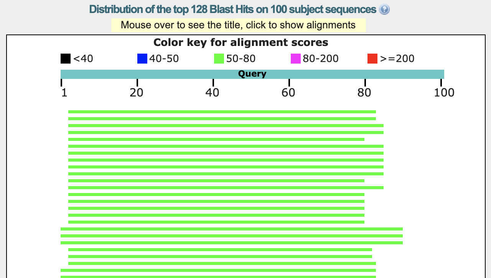
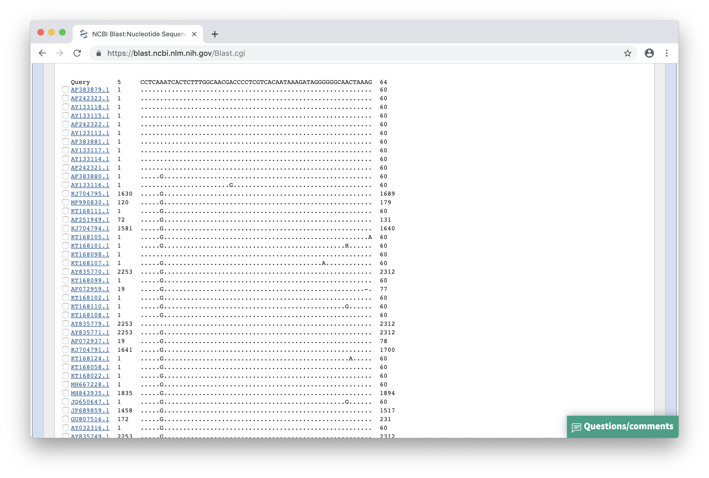
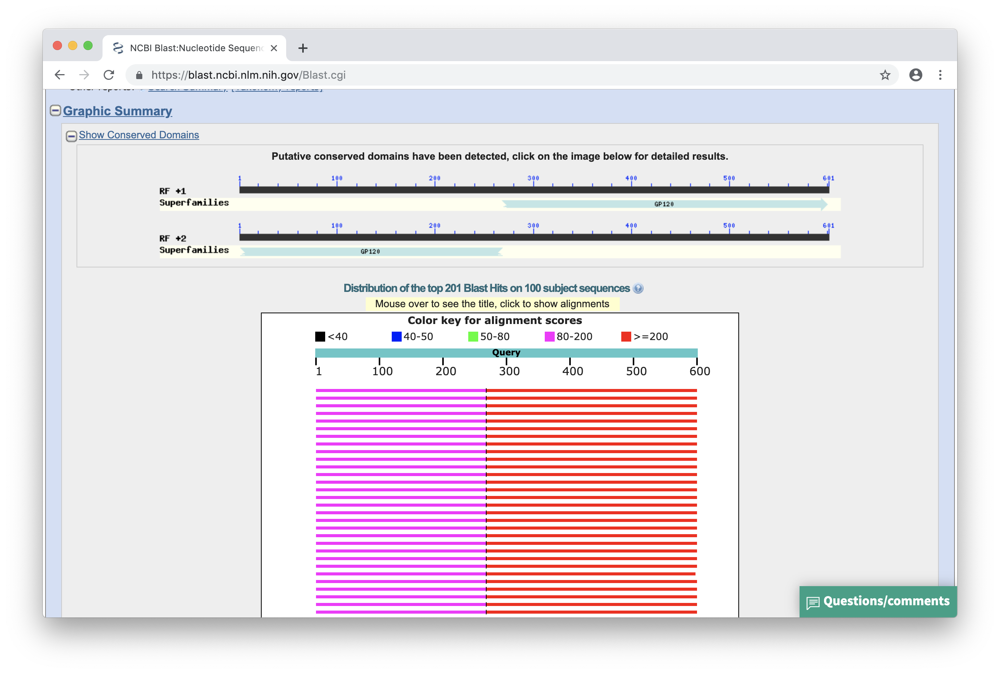

### Zad. 1 - blastp: identyfikacja sekwencji białka
Otwórz stronę serwisu [NCBI BLAST](https://blast.ncbi.nlm.nih.gov/) i wybierz program *protein blast*. Ogranicz wyszukiwania do bazy danych `UniProtKB/Swiss-Prot` i organizmu *Drosophila melanogaster*.


Najwyżej punktowane trafienia należą do mitochondrialnej aminotransferazy asparaginianowej.
<br/><br/>

### Zad. 2 - blastp: powtórzony fragment sekwencji
Otwórz stronę serwisu [NCBI BLAST](https://blast.ncbi.nlm.nih.gov/) i wybierz program `Protein BLAST`. W formularzu programu ogranicz wyszukiwania do organizmu *Arabidopsis thaliana*.



Między białkową sekwencją zapytania cyjanobakterii a sekwencją trafienia `NP_199836.1` *A. thaliana* program *blastp* zidentyfikował dwa przyrównania. Fragment sekwencji zapytania (w pozycji `3-83`) wykazuje podobieństwo do dwóch odrębnych miejsc w sekwencji trafienia (w pozycji `209-289` i pozycji `115-195`).

```
>NP_199836.1 chloroplast RNA-binding protein 31B [Arabidopsis thaliana]
Length=289

 Score = 77.4 bits (189),  Expect = 5e-18, Method: Compositional matrix adjust.
 Identities = 40/81 (49%), Positives = 52/81 (64%), Gaps = 0/81 (0%)

Query  3    IYVGNLSYDVSEADLTAVFAEYGSVKRVQLPTDRETGRMRGFGFVELEADAEETAAIEAL  62
            IYVGNL +DV    L  +F+E+G V   ++ +DRETGR RGFGFV++  + E   AI AL
Sbjct  209  IYVGNLPWDVDSGRLERLFSEHGKVVDARVVSDRETGRSRGFGFVQMSNENEVNVAIAAL  268

Query  63   DGAEWMGRDLKVNKAKPRENR  83
            DG    GR +KVN A+ R  R
Sbjct  269  DGQNLEGRAIKVNVAEERTRR  289


 Score = 62.4 bits (150),  Expect = 2e-12, Method: Compositional matrix adjust.
 Identities = 32/81 (40%), Positives = 48/81 (59%), Gaps = 0/81 (0%)

Query  3    IYVGNLSYDVSEADLTAVFAEYGSVKRVQLPTDRETGRMRGFGFVELEADAEETAAIEAL  62
            ++VGNL YDV    L  +F + G+V+  ++  +R+T + RGFGFV +    E   A+E  
Sbjct  115  LFVGNLPYDVDSQALAMLFEQAGTVEISEVIYNRDTDQSRGFGFVTMSTVEEAEKAVEKF  174

Query  63   DGAEWMGRDLKVNKAKPRENR  83
            +  E  GR L VN+A PR +R
Sbjct  175  NSFEVNGRRLTVNRAAPRGSR  195
```

Przyrównany fragment sekwencji zapytania (w pozycji `3-83`) odpowiada domenie wiążącej RNA (domena RRM). Występuje ona jako pojedyczna domena w sekwencji zapytania, natomiast w sekwencji trafienia *A. thaliana* występuje dwukrotnie. Sekwencja domeny RRM białka zapytania wykazuje większe podobieństwo do domeny RRM z C-końca białka trafienia (`score = 77.4`), niż do N-końcowej domeny RRM (`score = 62.4`).
<br/><br/>

### Zad. 3 - Identyfikacja polimorfizmów w genomach wirusów HIV
Otwórz stronę serwisu [NCBI BLAST](https://blast.ncbi.nlm.nih.gov/Blast.cgi). Wybierz program `Nucleotide BLAST` i algorytm `blastn`. W wynikach programu BLAST ustaw `Formatting Options` > `Alignment view` > `Flat query-anchored with dots for identities`).



W pozycji 6 przyrównań występują warianty `A/G`.
<br/><br/>
### Zad. 4 - blastn: ograniczanie bazy sekwencji BLAST przez zapytanie Entrez
<br/><br/>


### Zad. 5 - Identyfikacja przesunięcia ramki odczytu
Otwórz stronę serwisu [NCBI BLAST](https://blast.ncbi.nlm.nih.gov/Blast.cgi). Ponieważ sekwencja koduje białko wybierz program **blastx**. W formularzu programu BLAST umieść sekwencję zapytania i przeprowadź przeszukiwanie.

Sekwencja jest najbardziej podobna do białka otoczki wirusa HIV (*HIV1 envelope glycoprotein*) o numerze dostępu `AAL71628.1` (E-value: `1e-104`).

Przesunięcie ramki odczytu widoczne jest na graficznej prezentacji trafień jako mała czarna pionowa linia znajdująca się na trafieniu.



Sekwencja trafienia `AAL71628.1` składa się z dwóch przyrównań z sekwencją zapytania. Każde przyrównanie pochodzi z translacji w dwóch różnych ramkach odczytu. Drugie przyrównanie dotyczy początku sekwencji zapytania (`2-268`, ramka oczytu: `+2`) i sekwencji trafienia w pozycji `1-89` (pozycje wyrażone w aminokwasach). Z kolei pierwsze przyrównanie dotyczy drugiej części sekwencij zapytania (`268-600`) i sekwencji trafienia `90-201` (ramka odczytu: `+1`). Przesunięcie ramki odczytu jest więc spowodowane delecją jednego nukleotydu w sekwencji zapytania w pobliżu pozycji `268`.

```
>AAL71628.1 envelope glycoprotein, partial [Human immunodeficiency virus 1]
Length=201

 Score = 226 bits (576),  Expect(2) = 1e-104, Method: Compositional matrix adjust.
 Identities = 110/112 (98%), Positives = 110/112 (98%), Gaps = 1/112 (1%)
 Frame = +1

Query  268  TIAFNQSSGGDPEIVMHSFNCGGEFFYCNTTQLFNSTWPTNK-KSTNKTGTITLPCRIKQ  444
            TIAFNQSSGGDPEIVMHSFNCGGEFFYCNTTQLFNSTWPTN  KSTNKTGTITLPCRIKQ
Sbjct  90   TIAFNQSSGGDPEIVMHSFNCGGEFFYCNTTQLFNSTWPTNNTKSTNKTGTITLPCRIKQ  149

Query  445  IINRWQEVGKAMYAPPIKGQIRCSSNITGIFLTRDGGNASDETETFRPGGGN  600
            IINRWQEVGKAMYAPPIKGQIRCSSNITGIFLTRDGGNASDETETFRPGGGN
Sbjct  150  IINRWQEVGKAMYAPPIKGQIRCSSNITGIFLTRDGGNASDETETFRPGGGN  201


 Score = 182 bits (461),  Expect(2) = 1e-104, Method: Compositional matrix adjust.
 Identities = 89/89 (100%), Positives = 89/89 (100%), Gaps = 0/89 (0%)
 Frame = +2

Query  2    EEDIVIRSENFTNNAKTIIVQLKESIKINCTRPNNNTRKSIPIATGGAIYATGDIIGDIR  181
            EEDIVIRSENFTNNAKTIIVQLKESIKINCTRPNNNTRKSIPIATGGAIYATGDIIGDIR
Sbjct  1    EEDIVIRSENFTNNAKTIIVQLKESIKINCTRPNNNTRKSIPIATGGAIYATGDIIGDIR  60

Query  182  QAHCNLSRDQWDNTLSQLVTKLREQFGNK  268
            QAHCNLSRDQWDNTLSQLVTKLREQFGNK
Sbjct  61   QAHCNLSRDQWDNTLSQLVTKLREQFGNK  89
```
<br/>

### Zad. 6 - Identyfikacja ortologów

1. Otwórz [serwis NCBI](https://www.ncbi.nlm.nih.gov), wybierz białkową bazę danych i skonstruuj poniższe zapytanie:

   ```
   major urinary protein 3[Title] AND Mus musculus[Organism] AND refseq[Filter]
   ```

   W wyniku powyższego zapytania otrzymano 1 rekord: [NP_001034633](https://www.ncbi.nlm.nih.gov/protein/NP_001034633). Ze strony rekordu, w prawym panelu `Analyze this record` wybierz `Run BLAST`. W formularzu programu BLAST wybierz bazę danych `nr` i ogranicz wyszukiwania do organizmu *Monodelphis domestica*.

2. W wynikach programu BLAST, najwyżej ocenioną sekwencją oposa jest `XP_007475409`.

   ```
    >XP_007475409.1 PREDICTED: trichosurin-like [Monodelphis domestica]
    Length=181

     Score = 112 bits (281),  Expect = 2e-31, Method: Compositional matrix adjust.
     Identities = 59/161 (37%), Positives = 94/161 (58%), Gaps = 0/161 (0%)

    Query  19   CIHAEESSSMERNFNVEQISGYWFSIAEASDEREKIEEHGSMRAFVENITVLENSLVFKF  78
                 +HA  +   +   NV Q+SG W SI  AS++ ++I + G M   + NITV E+++ F  
    Sbjct  16   ALHAHRTRPEKHLENVNQLSGPWHSIYLASNDMDRISKGGDMNISIHNITVNESTVTFNV  75

    Query  79   HLIVNEECTEMTAIGEQTEKAGIYYMNYDGFNTFSILKTDYDNYIMIHLINKKDGKTFQL  138
                +L  NEEC  ++ + ++TEK  ++ +NY G N   + +     Y +    N ++GK   L
    Sbjct  76   NLWQNEECIPISMVAKKTEKNNVFKLNYGGENYIYLEELKPKEYAIFCTHNHQNGKETLL  135

    Query  139  MELYGREPDLSLDIKEKFAKLCEEHGIIRENIIDLTNVNRC  179
                MELYG  P L   +K+ F  LC+++GI +ENIID+T V+ C
    Sbjct  136  MELYGWTPILKEKVKKTFKDLCQKYGIDKENIIDMTKVDHC  176
    ```

3. W wynikach programu BLAST w drugim kierunku otrzymano białko użyte w pierwszym zapytaniu.

    ```
    >NP_001034633.1 major urinary protein 3 precursor [Mus musculus]
    Length=184

     Score = 113 bits (282),  Expect = 2e-31, Method: Compositional matrix adjust.
     Identities = 59/160 (37%), Positives = 94/160 (59%), Gaps = 0/160 (0%)

    Query  17   LHAHRTRPEKHLENVNQLSGPWHSIYLASNDMDRISKGGDMNISIHNITVNESTVTFNVN  76
                +HA  +   +   NV Q+SG W SI  AS++ ++I + G M   + NITV E+++ F  +
    Sbjct  20   IHAEESSSMERNFNVEQISGYWFSIAEASDEREKIEEHGSMRAFVENITVLENSLVFKFH  79

    Query  77   LWQNEECIPISMVAKKTEKNNVFKLNYGGENYIYLEELKPKEYAIFCTHNHQNGKETLLM  136
                L  NEEC  ++ + ++TEK  ++ +NY G N   + +     Y +    N ++GK   LM
    Sbjct  80   LIVNEECTEMTAIGEQTEKAGIYYMNYDGFNTFSILKTDYDNYIMIHLINKKDGKTFQLM  139

    Query  137  ELYGWTPILKEKVKKTFKDLCQKYGIDKENIIDMTKVDHC  176
                ELYG  P L   +K+ F  LC+++GI +ENIID+T V+ C
    Sbjct  140  ELYGREPDLSLDIKEKFAKLCEEHGIIRENIIDLTNVNRC  179
    ```
4. Sekwencja białka `XP_007475409` oposa jest prawdopodobnym ortologiem białka MUP3 (`NP_001034633`) myszy.