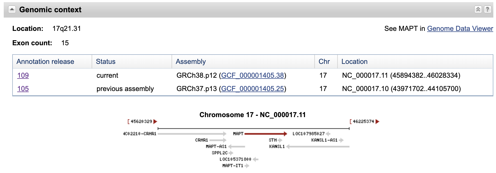

## Zad. 1
Otwórz stronę serwisu [NCBI BLAST](https://blast.ncbi.nlm.nih.gov/Blast.cgi). Ponieważ sekwencja koduje białko wybierz program **blastx**. W formularzu programu BLAST umieść sekwencję zapytania i przeprowadź przeszukiwanie.

Sekwencja jest najbardziej podobna do białka otoczki wirusa HIV (*HIV1 envelope glycoprotein*) o numerze dostępu `AAL71628.1` (E-value: `1e-104`).

Przesunięcie ramki odczytu widoczne jest na graficznej prezentacji trafień jako mała czarna pionowa linia znajdująca się na trafieniu.


Sekwencja trafienia `AAL71628.1` składa się z dwóch przyrównań z sekwencją zapytania. Każde przyrównanie pochodzi z translacji w dwóch różnych ramkach odczytu. Drugie przyrównanie dotyczy początku sekwencji zapytania (`2-268`, ramka oczytu: `+2`) i sekwencji trafienia w pozycji `1-89` (pozycje wyrażone w aminokwasach). Z kolei pierwsze przyrównanie dotyczy drugiej części sekwencij zapytania (`268-600`) i sekwencji trafienia `90-201` (ramka odczytu: `+1`). Przesunięcie ramki odczytu jest więc spowodowane delecją jednego nukleotydu w sekwencji zapytania w pobliżu pozycji `268`.

```
>AAL71628.1 envelope glycoprotein, partial [Human immunodeficiency virus 1]
Length=201

 Score = 226 bits (576),  Expect(2) = 1e-104, Method: Compositional matrix adjust.
 Identities = 110/112 (98%), Positives = 110/112 (98%), Gaps = 1/112 (1%)
 Frame = +1

Query  268  TIAFNQSSGGDPEIVMHSFNCGGEFFYCNTTQLFNSTWPTNK-KSTNKTGTITLPCRIKQ  444
            TIAFNQSSGGDPEIVMHSFNCGGEFFYCNTTQLFNSTWPTN  KSTNKTGTITLPCRIKQ
Sbjct  90   TIAFNQSSGGDPEIVMHSFNCGGEFFYCNTTQLFNSTWPTNNTKSTNKTGTITLPCRIKQ  149

Query  445  IINRWQEVGKAMYAPPIKGQIRCSSNITGIFLTRDGGNASDETETFRPGGGN  600
            IINRWQEVGKAMYAPPIKGQIRCSSNITGIFLTRDGGNASDETETFRPGGGN
Sbjct  150  IINRWQEVGKAMYAPPIKGQIRCSSNITGIFLTRDGGNASDETETFRPGGGN  201


 Score = 182 bits (461),  Expect(2) = 1e-104, Method: Compositional matrix adjust.
 Identities = 89/89 (100%), Positives = 89/89 (100%), Gaps = 0/89 (0%)
 Frame = +2

Query  2    EEDIVIRSENFTNNAKTIIVQLKESIKINCTRPNNNTRKSIPIATGGAIYATGDIIGDIR  181
            EEDIVIRSENFTNNAKTIIVQLKESIKINCTRPNNNTRKSIPIATGGAIYATGDIIGDIR
Sbjct  1    EEDIVIRSENFTNNAKTIIVQLKESIKINCTRPNNNTRKSIPIATGGAIYATGDIIGDIR  60

Query  182  QAHCNLSRDQWDNTLSQLVTKLREQFGNK  268
            QAHCNLSRDQWDNTLSQLVTKLREQFGNK
Sbjct  61   QAHCNLSRDQWDNTLSQLVTKLREQFGNK  89
```
<br/><br/>

### Zad. 2
Otwórz stronę serwisu [BLAST](https://blast.ncbi.nlm.nih.gov/Blast.cgi). W polu wyszukiwania zatytułowanym `BLAST Genomes` wpisz `human`. Z listy autouzupełnień wybierz `human (taxId: 9606)`. W formularzu programu BLAST:
* Umieść sekwencję zapytania w polu `Enter Query Sequence`
* W polu `Database` wybierz aktualne złożenie sekwencji genomu człowieka (*Genome (GRCh38.p12 reference, Annotation Release 109)*).
* Uruchom program BLAST.


Sekwencja zapytania pochodzi z chromosomu 17 człowieka. Jednak, najwyżej punktowane trafienie dotyczy niekompletnej sekwencji chromosomu 17 (numer dostępu w bazie RefSeq to `NT_187663.1`, gdzie `NT_` oznacza sekwencje *contigu*). Pełne złożenie chromosomu 17 ma numer dostępu `NC_000017.11`. Sekwencja zapytania pochodzi z nici `plus` chromosomu `NC_000017.11` i znajduje się w pozycji `45 961 145 - 45 965 104`.

Aby odpowiedzieć na pytanie, jaki gen zawarty jest lokalizacji `45 961 145 - 45 965 104` chromosomu 17, naciśnij na link `GenBank` znajdujący się nad przyrównaniem sekwencji zapytania i `NC_000017.11` (`Range 1: 45961145 to 45965104`). W rekordzie sekwencji odpowiadającym temu regionowi, w części `FEATURES` znajduje się gen **MAPT**.

```
FEATURES             Location/Qualifiers
     ...
     gene            <1..>3960
                     /gene="MAPT"
                     /gene_synonym="DDPAC; FTDP-17; MAPTL; MSTD; MTBT1; MTBT2;
                     PPND; PPP1R103; TAU"
``` 

Współrzędne sekwencji `<1..>3960` oznaczają, że pełnej długości gen MAPT rozciąga się poniżej (`<1`) i powyżej (`>3960`) wyświetlonej sekwencji. Aby poznać dokładną lokalizację genu MAPT na sekwencji chromosomu 17, naciśnij na identyfikator genu MAPT (*GeneID*: [4137](https://www.ncbi.nlm.nih.gov/gene/4137)).



<br/>