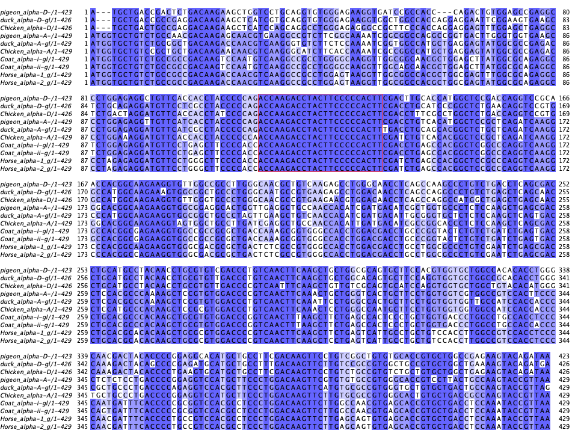

## Przyrównanie wielu sekwencji (MSA)

### Zad. 1 - Podstawowe informacje nt. MSA (ClustalOmega)
W pliku [ube.fasta](./data/ube.fasta) znajdują się sekwencje białkowe aktywnego enzymu koniugującego ubikwitynę pochodzące z wielu organizmów. Korzystając z programu [ClustalOmega](http://www.ebi.ac.uk/Tools/msa/) wykonaj ich przyrównanie.

1. Co oznaczają gwiazdki (`*`), dwukropki (`:`) i kropki (`.`) w otrzymanym dopasowaniu?
2. Wypisz aminokwasy, które są całkowicie zachowane u wszystkich organizmów.
3. Jaka może być przyczyna zachowania tych aminokwasów we wszystkich sekwencjach?
4. Podaj procent identyczności sekwencji enzymu drożdżowego `UBC6_YEAST` (`P33296)` i sekwencji enzymu królika `UB2R2_RABIT` (`Q29503`)?
   > Wskazówka: `Result Summary` –> `Percent Identity Matrix`

#### Wyznaczenie funkcjonalnie istotnych regionów sekwencji

W bazie RefSeq istnieją dwa białka drożdży o numerach dostępu: `NP_588162` i `NP_011428`, które należą do tej samej rodziny białkowej, ale **nie posiadają** aktywności katalitycznej. Otwórz program ClustalOmega w nowej karcie przeglądarki i wykonaj przyrównanie sekwencji z pliku `ube.fasta` dodając do niego dwie sekwencje z drożdży.

5. Jakie aminokwasy zostały zachowane w tym przyrównaniu?
6. Porównaj wyniki obu przyrównań i podaj aminokwas kluczowy dla aktywności enzymu.


### Zad. 2 - Przyrównanie sekwencji kodujących alfa-globiny (MAFFT)
W pliku [alfa_globins.cds.fasta](./data/alpha_globins.cds.fasta) znajduje się 10 sekwencji kodujących alfa-globiny u różnych zwierząt.


Otwórz program [MAFFT](http://www.ebi.ac.uk/Tools/msa/). W formularzu programu ustaw `OUTPUT FORMAT` na `ClustalW`. Wykonaj przyrównanie.

1. Ile fragmentów o całkowitym zachowaniu (przynajmniej 10 nukleotdyów) znajduje się w przyrównaniu?

Przejdź do zakładki `Guide Tree` przedstawiającej dystanse między sekwencjami. 

2. Czy sekwencje są umieszczone na drzewie w sposób zrozumiały biologicznie? Czy raczej, ich rozmieszczenie wydaje się przypadkowe?

#### JalView - wizualizacja przyrównania
Wróć do zakładki `Alignments`. Naciśnij przycisk `View result with JalView`. Otwórz pobrany plik.


3. Podaj początek i koniec najdłuższego całkowicie zachowane fragmentu sekwencji.

* Ustaw kolor przyrównania według poziomu identyczności.
* Zaznacz czerwoną ramkę dookoła zakonserwowanego fragmentu.
* Usuń z widoku przyrównania sekwencję konsensusową (`Annotation` > odznacz `Show annotations`)
* Przedstaw przyrównanie w formie zwiniętej (`Format` > `Wrap`)
* Wyeksportuj grafikę jako obraz PNG lub EPS (`File` > `Export image` > `PNG`).




#### Zad. 3 - Przyrównanie sekwencji białkowych alfa-globin
Skorzystaj z programu [EMBOSS Transeq](https://www.ebi.ac.uk/Tools/st/emboss_transeq/) i dokonaj translacji sekwencji CDS alfa-globin na sekwencje aminokwasowe. Następnie dokonaj przyrównania otrzymanych sekwencji aminokwasowych za pomocą programu MAFFT.

1. Ile fragmentów sekwencji o nieprzerwanej 100% identyczności (dłuższych niż 5 aminokwasów) znajduje się w przyrównaniu?

Wyświetl uzyskane przyrównanie w programie JalView.
* Wypróbuj różne sposoby kolorowania przyrównania.

2. Zidentyfikuj wszystkie delecje w przyrównaniu.
3. Czy poprzednie przyrównanie sekwencji CDS w pełni odpowiada przyrównaniu sekwencji aminokwasowych?
   * Czy przyrównanie sekwencji CDS jest poprawne?


### Zad. 4 - Alternatywny splicing i izoformy białek
W pliku [EPB4.1_human.fasta](./data/EPB4.1_human.fasta) znajduje się 11 izoform białka człowieka 
błony komórkowej erytrocytów (EPB, *human erythrocyte membrane protein band 4.1*).

Celem zadania jest porównanie 3 programów służących do przyrównywania sekwencji i dpowiedzenie na pytanie, jak dobrze, te programy są w stanie przyrównać sekwnecje, które są identyczne (nie ma substytucji aminokwasowych) z wyjątkiem tego, że mają delecje.

Przyrównaj sekwencje `EPB4.1_human` używając programów **MAFFT**, **MUSCLE** i **Kalign** dostępnych na stronie [EBI Multiple Sequence Alignment](https://www.ebi.ac.uk/Tools/msa/). Wykonaj przyrównania w osobnych kartach przeglądarki. Porównaj uzyskane przyrównania (możesz skorzystać z JalView).

1. Czy uzyskane przyrównania są różne?
2. Czy któryś z programów rozwiązał problem całkowicie poprawnie?


### Zad. 5 - Przyrównanie sekwencji CDS w oparciu o sekwencje białek
Celem zadania jest wykorzystanie informacji zawartej w sekwencjach białkowych do utworzenia prawidłowego przyrównania sekwencji CDS.

W pliku [insulin.cds.clean.fasta](./data/insulin.cds.clean.fasta) znajdują się sekwencje CDS insuliny (bez zduplikowanych sekwencj identycznych). Otwórz program [RevTrans](http://www.cbs.dtu.dk/services/RevTrans-2.0/web/). Umieść sekwencje CDS w polu `Paste in DNA sequences` i wykonaj przyrównanie.

1. Czy liczba przerw jest zawsze podzielna przez 3?
2. Czy wszystkie kodony zostały przyrównane? (pierwsza pozycja kodonu powinna być w tej samej kolumnie co pozostałe pierwsze pozycje kodonu w innych sekwencjach)


## Logo wielu sekwencji

### Zad. 6 - Miejsca donorowe egzonów
Poniżej znajdują się 20 sekwencji (każda w osobnej linii) wyodrębnionych z sekwencji genów człowieka w miejscu bezprośrednio PRZED i PO miejscem exon/intron.

```
CAAAACCATTGTGAGTAATC
GCCAGAGCAGGTAAAATATC
GAACAGTCAGGTCTGTTGCT
GAAGGCCCAGGTGAGCATAA
TCCTCTACAGGTGGGTACAT
GGCGTCCCGCGTAAGTATGG
CCTCGTGCAGGTAAGATTAA
TGCATGACAGGTGAGTGTTA
GAAATGTACAGTAAGTCTCT
GGTTCTCTGGGTAAGTAGAG
AAATGTACAGGTGAGTACTG
ACCTCGCTTGGTACGTGGGA
AATCAGACAGGTATAGAAAC
AGGACAGAAGGTAATTTTCT
AACTATTTGGGTAGGTAGCA
GAACTTCCAGGTGTGTGCAG
AAACTTGAAGGTATGTTGTT
CTGGGATAAGGTAAAAGTAT
TTGCACCCAGGTTAGTGGAT
ACTTCAATCGGTATGTTTTC
```

* Otwórz stronę programu [WebLogo](http://weblogo.berkeley.edu/logo.cgi).
* Umieść sekwencje w polu `Multiple Sequence Alignment`.
* Utwórz logo naciskając przycisk `Create logo`

1. Czy możliwe jest zidentyfikowanie miejsca donorowego?
   * Ile bitów informacji znajduje się w pozycji zawierającej `GT`?
2. Ile nukleotydów należy do egzonu, a ile do intronu?

#### Ustawienia LOGO
* Ponieważ interesującą częścią sekwencji jest granica exon/intron, zmienione zostanie numerowanie nukleotydów tak, aby `GT` miało pozycję `0`. 
  W formularzu programu WebLogo ustaw:
  - `First position number` na `-10`. 
  - tytuł wykresu (`Title`) na `Human donor sites -10/+10`
* Wygeneruj kolejne logo, aby pokazana była na nim częstość występowania nukleotydu w każdej pozycji (`Frequency plot`)


### Zad. 7
W pliku [ecoli_promotor.fasta](./data/ecoli_promotor.fasta) znajduje się 350 sekwencji regionów promotorów *E. coli*, które obejmują fragment 10pz upstream, nazywany kasetą Pribnowa. Wykonaj logo tych sekwencji. Zidentyfikuj kasetę Pribnowa.