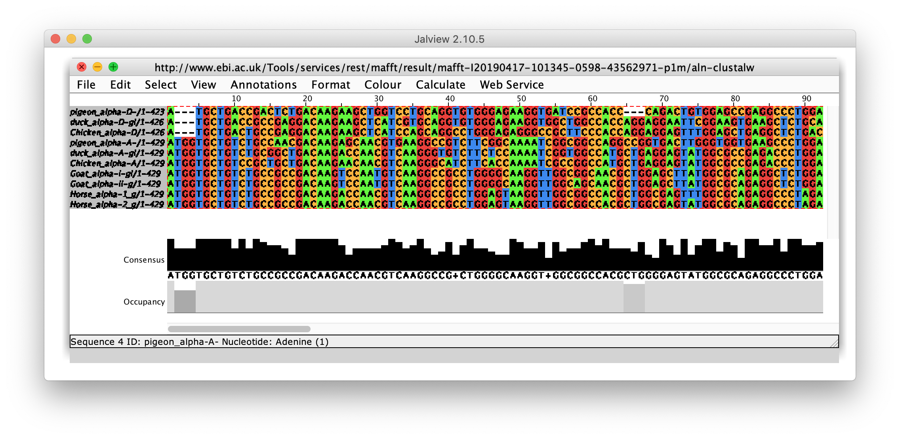

## Przyrównanie wielu sekwencji (MSA)

### Zad. 1 - Podstawowe informacje nt. MSA (ClustalOmega)
W pliku [ube.fasta](./data/ube.fasta) znajdują się sekwencje białkowe aktywnego enzymu koniugującego ubikwitynę pochodzące z wielu organizmów. Korzystając z programu [ClustalOmega](http://www.ebi.ac.uk/Tools/msa/) wykonaj ich przyrównanie.

1. Co oznaczają gwiazdki (`*`), dwukropki (`:`) i kropki (`.`) w otrzymanym dopasowaniu?
2. Wypisz aminokwasy, które są całkowicie zachowane u wszystkich organizmów.
3. Jaka może być przyczyna zachowania tych aminokwasów we wszystkich sekwencjach?
4. Podaj procent identyczności sekwencji enzymu drożdżowego `UBC6_YEAST` (`P33296)` i sekwencji enzymu królika `UB2R2_RABIT` (`Q29503`)?
   > Wskazówka: `Result Summary` –> `Percent Identity Matrix`

#### Wyznaczenie funkcjonalnie istotnych regionów sekwencji

W bazie RefSeq istnieją dwa białka drożdży o numerach dostępu: `NP_588162` i `NP_011428`, które należą do tej samej rodziny białkowej, ale **nie posiadają** aktywności katalitycznej. Otwórz program ClustalOmega w nowej karcie przeglądarki i wykonaj przyrównanie sekwencji z pliku `ube.fasta` dodając do niego dwie sekwencje z drożdży.

5. Jakie aminokwasy zostały zachowane w tym przyrównaniu?
6. Porównaj wyniki obu przyrównań i podaj aminokwas kluczowy dla aktywności enzymu.

### Zad. 2 - Przyrównanie sekwencji kodujących alfa-globiny (MAFFT)
W pliku [alfa_globins.cds.fasta](./data/alpha_globins.cds.fasta) znajduje się 10 sekwencji kodujących alfa-globiny u różnych zwierząt.

Otwórz program [MAFFT](http://www.ebi.ac.uk/Tools/msa/). W formularzu programu ustaw `OUTPUT FORMAT` na `ClustalW`. Wykonaj przyrównanie.

1. Ile fragmentów o całkowitym zachowaniu (przynajmniej 10 nukleotdyów) znajduje się w przyrównaniu?

Przejdź do zakładki `Guide Tree` przedstawiającej dystanse między sekwencjami. 

2. Czy sekwencje są umieszczone na drzewie w sposób zrozumiały biologicznie? Czy raczej, ich rozmieszczenie wydaje się przypadkowe?

#### JalView - wizualizacja przyrównania
Wróć do zakładki `Alignments`. Naciśnij przycisk `View result with JalView`. Otwórz pobrany plik.

3. Podaj początek i koniec najdłuższego całkowicie zachowane fragmentu sekwencji.

* Ustaw kolor przyrównania według poziomu identyczności.
* Zaznacz czerwoną ramkę dookoła zakonserwowanego fragmentu.
* Usuń z widoku przyrównania sekwencję konsensusową (`Annotation` > odznacz `Show annotations`)
* Przedstaw przyrównanie w formie zwiniętej (`Format` > `Wrap`)
* Wyeksportuj grafikę jako obraz PNG lub EPS (`File` > `Export image` > `PNG`).

#### Zad. 3 - Przyrównanie sekwencji białkowych alfa-globin
Skorzystaj z programu [EMBOSS Transeq](https://www.ebi.ac.uk/Tools/st/emboss_transeq/) i dokonaj translacji sekwencji CDS alfa-globin na sekwencje aminokwasowe. Następnie dokonaj przyrównania otrzymanych sekwencji aminokwasowych za pomocą programu MAFFT.

1. Ile fragmentów sekwencji o nieprzerwanej 100% identyczności (dłuższych niż 5 aminokwasów) znajduje się w przyrównaniu?

Wyświetl uzyskane przyrównanie w programie JalView.
* Wypróbuj różne sposoby kolorowania przyrównania.

2. Zidentyfikuj wszystkie delecje w przyrównaniu.
3. Czy poprzednie przyrównanie sekwencji CDS w pełni odpowiada przyrównaniu sekwencji aminokwasowych?
   * Czy przyrównanie sekwencji CDS jest poprawne? 