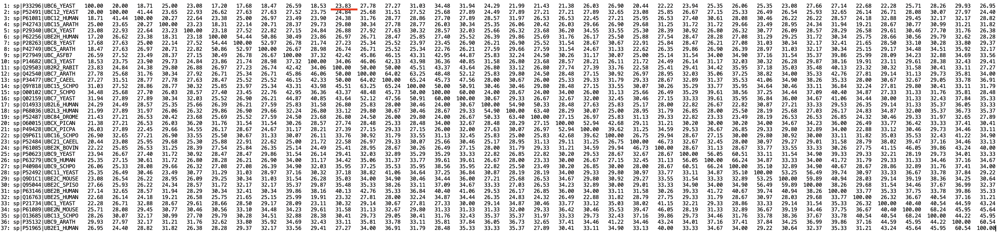

## Przyrównanie wielu sekwencji (MSA)

### Zad. 1

```
                            ========= FRAGMENT MSA =========

sp|P33296|UBC6_YEAST       GTLTFPSDYPYKPPAIRMITPN--------------------------------GRFKP- 82
sp|P52491|UBC12_YEAST      FNLDFNEVYPIEPPKVVCLK----------------------------------KIFHPN 107
sp|P61081|UBC12_HUMAN      FSFKVGQGYPHDPPKVKCET----------------------------------MVYHPN 103
sp|P42743|UBC15_ARATH      LQVEFPEHYPMEAPQVVFVS---------------------------------PAPSHPH 91
sp|P29340|UBCX_YEAST       ILIEVPSSYPMNPPKISFMQ---------------------------------NNILHCN 106
sp|P62256|UBE2H_HUMAN      VRVDLPDKYPFKSPSIGFMN----------------------------------KIFHPN 78
sp|P28263|UBC8_YEAST       LHVELPDNYPYKSPSIGFVN----------------------------------KIFHPN 76
sp|P42749|UBC5_ARATH       IRVELPDAYPYKSPSVGFIT----------------------------------KIYHPN 76
sp|P27949|UBC_ASFB7        AKVAFPPEYPYAPPKLTFTS----------------------------------EMWHPN 77
sp|P14682|UBC3_YEAST       AQMRFPEDFPFSPPQFRFTP----------------------------------AIYHPN 87
sp|Q29503|UB2R2_RABIT      AHIKFPIDYPYSPPTFRFLT----------------------------------KMWHPN 85
sp|Q42540|UBC7_ARATH       AIMTFPQNYPNSPPTVRFTS----------------------------------DMWHPN 81
sp|P34477|UBC7_CAEEL       AILDFPRDYPQKPPKMKFIS----------------------------------EIWHPN 80
sp|Q9Y818|UBC15_SCHPO      ATLSFPQDYPLMPPKMKFTT----------------------------------EIWHPN 82
sp|O00102|UBC7_SCHPO       ATLKFPSDYPLGPPTLKFEC----------------------------------EFFHPN 82
sp|Q02159|UBC7_YEAST       AKLEFPKDYPLSPPKLTFTP----------------------------------SILHPN 81
sp|O14933|UB2L6_HUMAN      LRISFPPEYPFKPPMIKFTT----------------------------------KIYHPN 78
sp|P68036|UB2L3_HUMAN      IEINFPAEYPFKPPKITFKT----------------------------------KIYHPN 78
sp|P52487|UBC84_DROME      IEINFPPQYPFMPPKILFKT----------------------------------KIYHPN 78
sp|O60015|UBCX_PICAN       LEIDIPTNYPLDPPKIKFVVFGEEKIRQLQRKT------------SSGARKVCYKMPHPN 110
sp|P49428|UBCX_PICPA       LQIDIPSNYPTQPPKFTFIVSDDIPRNRRQRQTNQIQDDDEFEGAEKEVLRHCYRMPHPN 124
sp|Q9P6I1|UBC16_SCHPO      LDIHVHEGYPISPPSVYFQT----------------------------------KIVHPN 81
sp|P52484|UBC21_CAEEL      IKVDIPEHYPFEPPKAKFVT----------------------------------RIWHPN 97
sp|P61085|UBE2K_BOVIN      LEIKIPETYPFNPPKVRFIT----------------------------------KIWHPN 83
sp|P50623|UBC9_YEAST       ITVEYPNEYPSKPPKVKFPA----------------------------------GFYHPN 85
sp|P63279|UBC9_HUMAN       LRMLFKDDYPSSPPKCKFEP----------------------------------PLFHPN 85
sp|P40984|UBC9_SCHPO       LTMAFPEEYPTRPPKCRFTP----------------------------------PLFHPN 85
sp|P52492|UBC11_YEAST      VSLKFPQNYPFHPPMIKFLS----------------------------------PMWHPN 85
sp|Q9D1C1|UBE2C_MOUSE      LSLEFPSGYPYNAPTVKFLT----------------------------------PCYHPN 106
sp|Q95044|UBE2C_SPISO      LTLEFPSDYPYKPPVVKFTT----------------------------------PCWHPN 106
sp|P63146|UBE2B_HUMAN      LVIEFSEEYPNKPPTVRFLS----------------------------------KMFHPN 80
sp|Q16763|UBE2S_HUMAN      MKLLLGKDFPASPPKGYFLT----------------------------------KIFHPN 87
sp|P21734|UBC1_YEAST       VDIEVPMEYPFKPPKMQFDT----------------------------------KVYHPN 79
sp|P61089|UBE2N_MOUSE      LELFLPEEYPMAAPKVRFMT----------------------------------KIYHPN 79
sp|O13685|UBC13_SCHPO      LELFLPDEYPMMPPNVRFLT----------------------------------KIYHPN 78
sp|P35132|UBC9_ARATH       VTIHFPPDYPFKPPKVAFRT----------------------------------KVFHPN 77
sp|P51965|UB2E1_HUMAN      LDITFTPEYPFKPPKVTFRT----------------------------------RIYHCN 123
                             .     :*   *                                           :  

sp|P33296|UBC6_YEAST       ----NTRLCLSMSDYHP----------DTWNPGWSVSTILNGLLSFMTSDEATTGSITTS 128
sp|P52491|UBC12_YEAST      IDL-KGNVCLNILRE-------------DWSPALDLQSIITGL-LFLFLEPNPNDPLNKD 152
sp|P61081|UBC12_HUMAN      IDL-EGNVCLNILRE-------------DWKPVLTINSIIYGL-QYLFLEPNPEDPLNKE 148
sp|P42743|UBC15_ARATH      IYS-NGHICLDILYD-------------SWSPAMTVNSVCISILSMLSSSPAKQRPADND 137
sp|P29340|UBCX_YEAST       VKSATGEICLNILKP------------EEWTPVWDLLHCVHAV-WRLLREPVCDSPLDVD 153
sp|P62256|UBE2H_HUMAN      IDEASGTVCLDVINQ-------------TWTALYDLTNIFESFLPQLLAYPNPIDPLNGD 125
sp|P28263|UBC8_YEAST       IDIASGSICLDVINS-------------TWSPLYDLINIVEWMIPGLLKEPNGSDPLNNE 123
sp|P42749|UBC5_ARATH       VDEMSGSVCLDVINQ-------------TWSPMFDLVNVFETFLPQLLLYPNPSDPLNGE 123
sp|P27949|UBC_ASFB7        IYP-DGRLCISILHGDNA-----EEQGMTWSPAQKIDTILLSV-ISLLNEPNPDSPANVD 130
sp|P14682|UBC3_YEAST       VYR-DGRLCISILHQSGD-PMTDEPDAETWSPVQTVESVLISI-VSLLEDPNINSPANVD 144
sp|Q29503|UB2R2_RABIT      IYE-NGDVCISILHPPVDDPQSGELPSERWNPTQNVRTILLSV-ISLLNEPNTFSPANVD 143
sp|Q42540|UBC7_ARATH       VYS-DGRVCISILHPPGDDPSGYELASERWTPVHTVESIMLSI-ISMLSGPNDESPANVE 139
sp|P34477|UBC7_CAEEL       IDK-EGNVCISILHDPGDDKWGYERPEERWLPVHTVETILLSV-ISMLTDPNFESPANVD 138
sp|Q9Y818|UBC15_SCHPO      VHP-NGEVCISILHPPGDDKYGYEDAGERWLPVHSPETILISV-ISMLSSPNDESPANID 140
sp|O00102|UBC7_SCHPO       VYK-DGTVCISILHAPGDDPNMYESSSERWSPVQSVEKILLSV-MSMLAEPNDESGANID 140
sp|Q02159|UBC7_YEAST       IYP-NGEVCISILHSPGDDPNMYELAEERWSPVQSVEKILLSV-MSMLSEPNIESGANID 139
sp|O14933|UB2L6_HUMAN      VDE-NGQICLPIISS------------ENWKPCTKTCQVLEAL-NVLVNRPNIREPLRMD 124
sp|P68036|UB2L3_HUMAN      IDE-KGQVCLPVISA------------ENWKPATKTDQVIQSL-IALVNDPQPEHPLRAD 124
sp|P52487|UBC84_DROME      VDE-KGEVCLPIIST------------DNWKPTTRTEQVLQAL-VAIVHNPEPEHPLRSD 124
sp|O60015|UBCX_PICAN       VNFKTGEICLDILQQ-------------KWSPAWTLQSALVAI-VVLLANPEPLSPLNID 156
sp|P49428|UBCX_PICPA       IAFNTGEICLDILQA-------------KWTPAWTLSSALTAI-VLLLNDPEPLSPLDID 170
sp|Q9P6I1|UBC16_SCHPO      ISWTNGEVCMDILKT-------------HWSPAWSLQSACLAI-ISLLSNYDASSPLNVD 127
sp|P52484|UBC21_CAEEL      ISSQTGTICLDILKD-------------KWTASLTLRTVLLSL-QAMLCSPEPSDPQDAV 143
sp|P61085|UBE2K_BOVIN      ISSVTGAICLDILKD-------------QWAAAMTLRTVLLSL-QALLAAAEPDDPQDAV 129
sp|P50623|UBC9_YEAST       VYP-SGTICLSILNE-----------DQDWRPAITLKQIVLGV-QDLLDSPNPNSPAQEP 132
sp|P63279|UBC9_HUMAN       VYP-SGTVCLSILEE-----------DKDWRPAITIKQILLGI-QELLNEPNIQDPAQAE 132
sp|P40984|UBC9_SCHPO       VYP-SGTVCLSILNE-----------EEGWKPAITIKQILLGI-QDLLDDPNIASPAQTE 132
sp|P52492|UBC11_YEAST      VDK-SGNICLDILKE-------------KWSAVYNVETILLSL-QSLLGEPNNRSPLNAV 130
sp|Q9D1C1|UBE2C_MOUSE      VDT-QGNICLDILKD-------------KWSALYDVRTILLSI-QSLLGEPNIDSPLNTH 151
sp|Q95044|UBE2C_SPISO      VDQ-SGNICLDILKE-------------NWTASYDVRTILLSL-QSLLGEPNNASPLNAQ 151
sp|P63146|UBE2B_HUMAN      VYA-DGSICLDILQN-------------RWSPTYDVSSILTSI-QSLLDEPNPNSPANSQ 125
sp|Q16763|UBE2S_HUMAN      VGA-NGEICVNVLKR-------------DWTAELGIRHVLLTI-KCLLIHPNPESALNEE 132
sp|P21734|UBC1_YEAST       ISSVTGAICLDILKN-------------AWSPVITLKSALISL-QALLQSPEPNDPQDAE 125
sp|P61089|UBE2N_MOUSE      VDK-LGRICLDILKD-------------KWSPALQIRTVLLSI-QALLSAPNPDDPLAND 124
sp|O13685|UBC13_SCHPO      VDK-LGRICLSTLKK-------------DWSPALQIRTVLLSI-QALMGAPNPDDPLDND 123
sp|P35132|UBC9_ARATH       INS-NGSICLDILKE-------------QWSPALTISKVLLSI-CSLLTDPNPDDPLVPE 122
sp|P51965|UB2E1_HUMAN      INS-QGVICLDILKD-------------NWSPALTISKVLLSI-CSLLTDCNPADPLVGS 168
                                  :*:                   *            .   : 

                            ========= FRAGMENT MSA =========
```

1. Symbole znajdujące się pod kolumnami przyrównania oznaczają stopień zachowania danej reszty aminokwasowej na danej pozycji w przyrównaniu.
   * `*` - całkowite zachowanie danej reszty w danej pozycji (aminokwas występuje we wszystkich sekwencjach w analizowanej pozycji przyrównania)
   * `:` - aminokwasy o bardzo podobnych właściwościach fizykochemicznych (ściślej, aminowasy, których wartość punktacji substytucji osiąga pewną wartość według użytej macierzy substytucji)
   * `.` - aminokwasy o podobnych właściwościach fizykochemiczych.
2. Trzy aminokwasy są całkowicie zachowane u wszystkich organizmów: `P` dwukrotnie, `C` i `W`. 
3. Zachowane aminokwasy najprawdopodobniej pełnią istotne funkcji w działaniu enzymu koniugującego ubikwitynę.
4. Aby zobaczyć procent identyczności między dowolną parą sekwencji w przyrównaniu wybierz `Result Summary` –> `Percent Identity Matrix`. Para sekwencji `sp|P33296|UBC6_YEAST` i `sp|Q29503|UB2R2_RABIT` ma `23.83%` identyczności.



#### Wyznaczenie funkcjonalnie istotnych regionów sekwencji

Białka drożdży nie posiadające aktywności katalitycznej: [NP_588162](https://www.ncbi.nlm.nih.gov/protein/NP_588162) i [NP_011428](https://www.ncbi.nlm.nih.gov/protein/NP_011428):

```
>NP_588162.1 ubiquitin-conjugating enzyme Mms2 [Schizosaccharomyces pombe]
MAKVPRNFKLLEELEKGEKGLGESSCSYGLTNADDITLSDWNATILGPAHSVHENRIYSLKIHCDANYPD
APPIVTFVSRINLPGVDGETGKVNPHKIDCLRHWKREYSMETVLLDLKKEMASSSNRKLPQPPEGSTFF

>NP_011428.1 E2 ubiquitin-conjugating protein MMS2 [Saccharomyces cerevisiae S288C]
MSKVPRNFRLLEELEKGEKGFGPESCSYGLADSDDITMTKWNGTILGPPHSNHENRIYSLSIDCGPNYPD
SPPKVTFISKINLPCVNPTTGEVQTDFHTLRDWKRAYTMETLLLDLRKEMATPANKKLRQPKEGETF
```

Przyrównanie sekwencji białek `ube.fasta` wraz z sekwencjami `NP_588162.1` i `NP_011428.1`.

```
                            ========= FRAGMENT MSA =========

NP_588162.1                LKIHCDANYPDAPPIVTFVS----------------------------------RINLPG 85
NP_011428.1                LSIDCGPNYPDSPPKVTFIS----------------------------------KINLPC 85
sp|P33296|UBC6_YEAST       GTLTFPSDYPYKPPAIRMITPN--------------------------------GRFKP- 82
sp|P52491|UBC12_YEAST      FNLDFNEVYPIEPPKVVCLK----------------------------------KIFHPN 107
sp|P61081|UBC12_HUMAN      FSFKVGQGYPHDPPKVKCET----------------------------------MVYHPN 103
sp|P42743|UBC15_ARATH      LQVEFPEHYPMEAPQVVFVS---------------------------------PAPSHPH 91
sp|P29340|UBCX_YEAST       ILIEVPSSYPMNPPKISFMQ---------------------------------NNILHCN 106
sp|P62256|UBE2H_HUMAN      VRVDLPDKYPFKSPSIGFMN----------------------------------KIFHPN 78
sp|P28263|UBC8_YEAST       LHVELPDNYPYKSPSIGFVN----------------------------------KIFHPN 76
sp|P42749|UBC5_ARATH       IRVELPDAYPYKSPSVGFIT----------------------------------KIYHPN 76
sp|P27949|UBC_ASFB7        AKVAFPPEYPYAPPKLTFTS----------------------------------EMWHPN 77
sp|P14682|UBC3_YEAST       AQMRFPEDFPFSPPQFRFTP----------------------------------AIYHPN 87
sp|Q29503|UB2R2_RABIT      AHIKFPIDYPYSPPTFRFLT----------------------------------KMWHPN 85
sp|Q42540|UBC7_ARATH       AIMTFPQNYPNSPPTVRFTS----------------------------------DMWHPN 81
sp|P34477|UBC7_CAEEL       AILDFPRDYPQKPPKMKFIS----------------------------------EIWHPN 80
sp|Q9Y818|UBC15_SCHPO      ATLSFPQDYPLMPPKMKFTT----------------------------------EIWHPN 82
sp|O00102|UBC7_SCHPO       ATLKFPSDYPLGPPTLKFEC----------------------------------EFFHPN 82
sp|Q02159|UBC7_YEAST       AKLEFPKDYPLSPPKLTFTP----------------------------------SILHPN 81
sp|O14933|UB2L6_HUMAN      LRISFPPEYPFKPPMIKFTT----------------------------------KIYHPN 78
sp|P68036|UB2L3_HUMAN      IEINFPAEYPFKPPKITFKT----------------------------------KIYHPN 78
sp|P52487|UBC84_DROME      IEINFPPQYPFMPPKILFKT----------------------------------KIYHPN 78
sp|O60015|UBCX_PICAN       LEIDIPTNYPLDPPKIKFVVFGEEKIRQLQRKT------------SSGARKVCYKMPHPN 110
sp|P49428|UBCX_PICPA       LQIDIPSNYPTQPPKFTFIVSDDIPRNRRQRQTNQIQDDDEFEGAEKEVLRHCYRMPHPN 124
sp|Q9P6I1|UBC16_SCHPO      LDIHVHEGYPISPPSVYFQT----------------------------------KIVHPN 81
sp|P52484|UBC21_CAEEL      IKVDIPEHYPFEPPKAKFVT----------------------------------RIWHPN 97
sp|P61085|UBE2K_BOVIN      LEIKIPETYPFNPPKVRFIT----------------------------------KIWHPN 83
sp|P50623|UBC9_YEAST       ITVEYPNEYPSKPPKVKFPA----------------------------------GFYHPN 85
sp|P63279|UBC9_HUMAN       LRMLFKDDYPSSPPKCKFEP----------------------------------PLFHPN 85
sp|P40984|UBC9_SCHPO       LTMAFPEEYPTRPPKCRFTP----------------------------------PLFHPN 85
sp|P52492|UBC11_YEAST      VSLKFPQNYPFHPPMIKFLS----------------------------------PMWHPN 85
sp|Q9D1C1|UBE2C_MOUSE      LSLEFPSGYPYNAPTVKFLT----------------------------------PCYHPN 106
sp|Q95044|UBE2C_SPISO      LTLEFPSDYPYKPPVVKFTT----------------------------------PCWHPN 106
sp|P63146|UBE2B_HUMAN      LVIEFSEEYPNKPPTVRFLS----------------------------------KMFHPN 80
sp|Q16763|UBE2S_HUMAN      MKLLLGKDFPASPPKGYFLT----------------------------------KIFHPN 87
sp|P21734|UBC1_YEAST       VDIEVPMEYPFKPPKMQFDT----------------------------------KVYHPN 79
sp|P61089|UBE2N_MOUSE      LELFLPEEYPMAAPKVRFMT----------------------------------KIYHPN 79
sp|O13685|UBC13_SCHPO      LELFLPDEYPMMPPNVRFLT----------------------------------KIYHPN 78
sp|P35132|UBC9_ARATH       VTIHFPPDYPFKPPKVAFRT----------------------------------KVFHPN 77
sp|P51965|UB2E1_HUMAN      LDITFTPEYPFKPPKVTFRT----------------------------------RIYHCN 123
                             .     :*   *                                              

NP_588162.1                VDGETGKVNPHKIDC-----------LRHWKREYSMETVLLDLKKEMASSSNRKLPQPPE 134
NP_011428.1                VNPTTGEVQT-DFHT-----------LRDWKRAYTMETLLLDLRKEMATPANKKLRQPKE 133
sp|P33296|UBC6_YEAST       ----NTRLCLSMSDYHP----------DTWNPGWSVSTILNGLLSFMTSDEATTGSITTS 128
sp|P52491|UBC12_YEAST      IDL-KGNVCLNILRE-------------DWSPALDLQSIITGL-LFLFLEPNPNDPLNKD 152
sp|P61081|UBC12_HUMAN      IDL-EGNVCLNILRE-------------DWKPVLTINSIIYGL-QYLFLEPNPEDPLNKE 148
sp|P42743|UBC15_ARATH      IYS-NGHICLDILYD-------------SWSPAMTVNSVCISILSMLSSSPAKQRPADND 137
sp|P29340|UBCX_YEAST       VKSATGEICLNILKP------------EEWTPVWDLLHCVHAV-WRLLREPVCDSPLDVD 153
sp|P62256|UBE2H_HUMAN      IDEASGTVCLDVINQ-------------TWTALYDLTNIFESFLPQLLAYPNPIDPLNGD 125
sp|P28263|UBC8_YEAST       IDIASGSICLDVINS-------------TWSPLYDLINIVEWMIPGLLKEPNGSDPLNNE 123
sp|P42749|UBC5_ARATH       VDEMSGSVCLDVINQ-------------TWSPMFDLVNVFETFLPQLLLYPNPSDPLNGE 123
sp|P27949|UBC_ASFB7        IYP-DGRLCISILHGDNA-----EEQGMTWSPAQKIDTILLSV-ISLLNEPNPDSPANVD 130
sp|P14682|UBC3_YEAST       VYR-DGRLCISILHQSGD-PMTDEPDAETWSPVQTVESVLISI-VSLLEDPNINSPANVD 144
sp|Q29503|UB2R2_RABIT      IYE-NGDVCISILHPPVDDPQSGELPSERWNPTQNVRTILLSV-ISLLNEPNTFSPANVD 143
sp|Q42540|UBC7_ARATH       VYS-DGRVCISILHPPGDDPSGYELASERWTPVHTVESIMLSI-ISMLSGPNDESPANVE 139
sp|P34477|UBC7_CAEEL       IDK-EGNVCISILHDPGDDKWGYERPEERWLPVHTVETILLSV-ISMLTDPNFESPANVD 138
sp|Q9Y818|UBC15_SCHPO      VHP-NGEVCISILHPPGDDKYGYEDAGERWLPVHSPETILISV-ISMLSSPNDESPANID 140
sp|O00102|UBC7_SCHPO       VYK-DGTVCISILHAPGDDPNMYESSSERWSPVQSVEKILLSV-MSMLAEPNDESGANID 140
sp|Q02159|UBC7_YEAST       IYP-NGEVCISILHSPGDDPNMYELAEERWSPVQSVEKILLSV-MSMLSEPNIESGANID 139
sp|O14933|UB2L6_HUMAN      VDE-NGQICLPIISS------------ENWKPCTKTCQVLEAL-NVLVNRPNIREPLRMD 124
sp|P68036|UB2L3_HUMAN      IDE-KGQVCLPVISA------------ENWKPATKTDQVIQSL-IALVNDPQPEHPLRAD 124
sp|P52487|UBC84_DROME      VDE-KGEVCLPIIST------------DNWKPTTRTEQVLQAL-VAIVHNPEPEHPLRSD 124
sp|O60015|UBCX_PICAN       VNFKTGEICLDILQQ-------------KWSPAWTLQSALVAI-VVLLANPEPLSPLNID 156
sp|P49428|UBCX_PICPA       IAFNTGEICLDILQA-------------KWTPAWTLSSALTAI-VLLLNDPEPLSPLDID 170
sp|Q9P6I1|UBC16_SCHPO      ISWTNGEVCMDILKT-------------HWSPAWSLQSACLAI-ISLLSNYDASSPLNVD 127
sp|P52484|UBC21_CAEEL      ISSQTGTICLDILKD-------------KWTASLTLRTVLLSL-QAMLCSPEPSDPQDAV 143
sp|P61085|UBE2K_BOVIN      ISSVTGAICLDILKD-------------QWAAAMTLRTVLLSL-QALLAAAEPDDPQDAV 129
sp|P50623|UBC9_YEAST       VYP-SGTICLSILNE-----------DQDWRPAITLKQIVLGV-QDLLDSPNPNSPAQEP 132
sp|P63279|UBC9_HUMAN       VYP-SGTVCLSILEE-----------DKDWRPAITIKQILLGI-QELLNEPNIQDPAQAE 132
sp|P40984|UBC9_SCHPO       VYP-SGTVCLSILNE-----------EEGWKPAITIKQILLGI-QDLLDDPNIASPAQTE 132
sp|P52492|UBC11_YEAST      VDK-SGNICLDILKE-------------KWSAVYNVETILLSL-QSLLGEPNNRSPLNAV 130
sp|Q9D1C1|UBE2C_MOUSE      VDT-QGNICLDILKD-------------KWSALYDVRTILLSI-QSLLGEPNIDSPLNTH 151
sp|Q95044|UBE2C_SPISO      VDQ-SGNICLDILKE-------------NWTASYDVRTILLSL-QSLLGEPNNASPLNAQ 151
sp|P63146|UBE2B_HUMAN      VYA-DGSICLDILQN-------------RWSPTYDVSSILTSI-QSLLDEPNPNSPANSQ 125
sp|Q16763|UBE2S_HUMAN      VGA-NGEICVNVLKR-------------DWTAELGIRHVLLTI-KCLLIHPNPESALNEE 132
sp|P21734|UBC1_YEAST       ISSVTGAICLDILKN-------------AWSPVITLKSALISL-QALLQSPEPNDPQDAE 125
sp|P61089|UBE2N_MOUSE      VDK-LGRICLDILKD-------------KWSPALQIRTVLLSI-QALLSAPNPDDPLAND 124
sp|O13685|UBC13_SCHPO      VDK-LGRICLSTLKK-------------DWSPALQIRTVLLSI-QALMGAPNPDDPLDND 123
sp|P35132|UBC9_ARATH       INS-NGSICLDILKE-------------QWSPALTISKVLLSI-CSLLTDPNPDDPLVPE 122
sp|P51965|UB2E1_HUMAN      INS-QGVICLDILKD-------------NWSPALTISKVLLSI-CSLLTDCNPADPLVGS 168
                                  :                     *            .   :  
                            ========= FRAGMENT MSA =========           
```

5. W powyższym przyrównaniu (uwzględniającym białka `NP_588162.1` i `NP_011428.1`) zachowane są aminokwasy: `P` dwukrotnie oraz `W`.
6. W przyrównaniu sekwencji białek `ube.fasta` o znanej aktywności katalitycznej zachowane są trzy aminokwasy: `P`, `C` i `W`. Białka drożdżowe nie posiadające aktywności katalitycznej mają zachowane aminokwasy `P` i `W`, natomiast nie posiadają zachowanej reszty `C`. Wynika z tego, że cysteina jest kluczowa do działaniu enzymu.


### Zad. 2
Przyrównanie sekwencji kodujących (CDS) alfa-globin przy użyciu programu MAFFT.

```
CLUSTAL format alignment by MAFFT FFT-NS-i (v7.397)


pigeon_alpha-D- A---TGCTGACCGACTCTGACAAGAAGCTGGTCCTGCAGGTGTGGGAGAAGGTGATCCGC
duck_alpha-D-gl A---TGCTGACCGCCGAGGACAAGAAGCTCATCGTGCAGGTGTGGGAGAAGGTGGCTGGC
Chicken_alpha-D A---TGCTGACTGCCGAGGACAAGAAGCTCATCCAGCAGGCCTGGGAGAGGGCCGCTTCC
pigeon_alpha-A- ATGGTGCTGTCTGCCAACGACAAGAGCAACGTGAAGGCCGTCTTCGGCAAAATCGGCGGC
duck_alpha-A-gl ATGGTGCTGTCTGCGGCTGACAAGACCAACGTCAAGGGTGTCTTCTCCAAAATCGGTGGC
Chicken_alpha-A ATGGTGCTGTCCGCTGCTGACAAGAACAACGTCAAGGGCATCTTCACCAAAATCGCCGGC
Goat_alpha-i-gl ATGGTGCTGTCTGCCGCCGACAAGTCCAATGTCAAGGCCGCCTGGGGCAAGGTTGGCGGC
Goat_alpha-ii-g ATGGTGCTGTCTGCCGCCGACAAGTCCAATGTCAAGGCCGCCTGGGGCAAGGTTGGCAGC
Horse_alpha-1_g ATGGTGCTGTCTGCCGCCGACAAGACCAACGTCAAGGCCGCCTGGAGTAAGGTTGGCGGC
Horse_alpha-2_g ATGGTGCTGTCTGCCGCCGACAAGACCAACGTCAAGGCCGCCTGGAGTAAGGTTGGCGGC
                *   ***** *.*     ******      .*   *   .. *     *.... . .  *

pigeon_alpha-D- CACC---CAGACTGTGGAGCCGAGGCCCTGGAGAGGCTGTTCACCACCTACCCCCAGACC
duck_alpha-D-gl CACCAGGAGGAATTCGGAAGTGAAGCTCTGCAGAGGATGTTCCTCGCCTACCCCCAGACC
Chicken_alpha-D CACCAGGAGGAGTTTGGAGCTGAGGCTCTGACTAGGATGTTCACCACCTATCCCCAGACC
pigeon_alpha-A- CAGGCCGGTGACTTGGGTGGTGAAGCCCTGGAGAGGTTGTTCATCACCTACCCCCAGACC
duck_alpha-A-gl CATGCTGAGGAGTATGGCGCCGAGACCCTGGAGAGGATGTTCATCGCCTACCCCCAGACC
Chicken_alpha-A CATGCTGAGGAGTATGGCGCCGAGACCCTGGAAAGGATGTTCACCACCTACCCCCCAACC
Goat_alpha-i-gl AACGCTGGAGCTTATGGCGCAGAGGCTCTGGAGAGGATGTTCCTGAGCTTCCCCACCACC
Goat_alpha-ii-g AACGCTGGAGCTTATGGCGCAGAGGCTCTGGAGAGGATGTTCCTGAGCTTCCCCACCACC
Horse_alpha-1_g CACGCTGGCGAGTTTGGCGCAGAGGCCCTAGAGAGGATGTTCCTGGGCTTCCCCACCACC
Horse_alpha-2_g CACGCTGGCGAGTATGGCGCAGAGGCCCTAGAGAGGATGTTCCTGGGCTTCCCCACCACC
                 *       *  *  ** .  **..*.**.   *** ***** . . ** .***   ***

pigeon_alpha-D- AAGACCTACTTCCCCCACTTCGACTTGCACCATGGCTCCGACCAGGTCCGCAACCACGGC
duck_alpha-D-gl AAGACCTACTTCCCCCACTTCGACCTGCATCCCGGCTCTGAACAGGTCCGTGGCCATGGC
Chicken_alpha-D AAGACCTACTTCCCCCACTTCGACCTTTCGCCTGGCTCTGACCAGGTCCGTGGCCATGGC
pigeon_alpha-A- AAGACCTACTTCCCCCACTTCGACCTGTCACATGGCTCCGCTCAGATCAAGGGGCACGGC
duck_alpha-A-gl AAGACCTACTTCCCCCACTTTGACCTGCAGCACGGCTCTGCTCAGATCAAGGCCCATGGC
Chicken_alpha-A AAGACCTACTTCCCCCACTTCGATCTGTCACACGGCTCCGCTCAGATCAAGGGGCACGGC
Goat_alpha-i-gl AAGACCTACTTCCCCCACTTCGACCTGAGCCACGGCTCGGCCCAGGTCAAGGGCCACGGC
Goat_alpha-ii-g AAGACCTACTTCCCCCACTTCGACCTGAGCCACGGCTCGGCCCAGGTCAAGGGCCACGGC
Horse_alpha-1_g AAGACCTACTTCCCCCACTTCGATCTGAGCCACGGCTCCGCCCAGGTCAAGGCCCACGGC
Horse_alpha-2_g AAGACCTACTTCCCCCACTTCGATCTGAGCCACGGCTCCGCCCAGGTCAAGGCCCACGGC
                ********************.**..*    * .***** *  ***.** . .  **.***

pigeon_alpha-D- AAGAAGGTGTTGGCCGCCTTGGGCAACGCTGTCAAGAGCCTGGGCAACCTCAGCCAAGCC
duck_alpha-D-gl AAGAAAGTGGCGGCTGCCCTGGGCAATGCCGTGAAGAGCCTGGACAACCTCAGCCAGGCC
Chicken_alpha-D AAGAAGGTGTTGGGTGCCCTGGGCAACGCCGTGAAGAACGTGGACAACCTCAGCCAGGCC
pigeon_alpha-A- AAGAAGGTGGCGGAGGCACTGGTTGAGGCTGCCAACCACATCGATGACATCGCTGGTGCC
duck_alpha-A-gl AAGAAGGTGGCGGCTGCCCTAGTTGAAGCTGTCAACCACATCGATGACATTGCGGGTGCT
Chicken_alpha-A AAGAAGGTAGTGGCTGCCTTGATCGAGGCTGCCAACCACATTGATGACATCGCCGGCACC
Goat_alpha-i-gl GAGAAGGTGGCCGCCGCGCTGACCAAAGCGGTGGGCCACCTGGACGACCTGCCCGGTACT
Goat_alpha-ii-g GAGAAGGTGGCCGCCGCGCTGACCAAAGCGGTGGGCCACCTGGACGACCTGCCCGGTACT
Horse_alpha-1_g AAGAAGGTGGGCGACGCGCTGACTCTCGCCGTGGGCCACCTGGACGACCTGCCTGGCGCC
Horse_alpha-2_g CAGAAGGTGGGCGACGCGCTGACTCTCGCCGTGGGCCACCTGGACGACCTGCCTGGCGCC
                 ****.**.   *  ** .*.. .   ** *. ..  .* * *...** *     . .*.

pigeon_alpha-D- CTGTCTGACCTCAGCGACCTGCATGCCTACAACCTGCGTGTCGACCCTGTCAACTTCAAG
duck_alpha-D-gl CTGTCTGAGCTCAGCAACCTGCATGCCTACAACCTGCGTGTTGACCCTGTCAACTTCAAG
Chicken_alpha-D ATGGCTGAGCTGAGCAACCTGCATGCCTACAACCTGCGTGTTGACCCCGTCAATTTCAAG
pigeon_alpha-A- CTCTCCAAGCTGAGCGACCTCCACGCCCAAAAGCTCCGTGTGGACCCCGTCAACTTCAAA
duck_alpha-A-gl CTCTCCAAGCTCAGTGACCTCCACGCCCAAAAGCTCCGTGTGGACCCTGTCAACTTCAAA
Chicken_alpha-A CTCTCCAAGCTCAGCGACCTCCATGCCCACAAGCTCCGCGTGGACCCTGTCAACTTCAAA
Goat_alpha-i-gl CTGTCTGATCTGAGTGACCTGCACGCCCACAAGCTGCGTGTGGACCCGGTCAACTTTAAG
Goat_alpha-ii-g CTGTCTGATCTGAGTGACCTGCACGCCCACAAGCTGCGTGTGGACCCGGTCAACTTTAAG
Horse_alpha-1_g CTGTCGAATCTGAGCGACCTGCACGCACACAAGCTGCGCGTGGACCCCGTCAACTTCAAG
Horse_alpha-2_g CTGTCGAATCTGAGCGACCTGCACGCACACAAGCTGCGCGTGGACCCCGTCAACTTCAAG
                 *  * .* ** **..**** **.** .* ** ** **.** ***** *****.**.**.

pigeon_alpha-D- CTGCTGGCGCAGTGCTTCCACGTGGTGCTGGCCACACACCTGGGCAACGACTACACCCCG
duck_alpha-D-gl CTGCTGGCACAGTGCTTCCAGGTGGTGCTGGCCGCACACCTGGGCAAAGACTACAGCCCC
Chicken_alpha-D CTGTTGTCGCAGTGCATCCAGGTGGTGCTGGCTGTACACATGGGCAAAGACTACACCCCT
pigeon_alpha-A- CTGCTGGGTCACTGCTTCCTGGTGGTCGTGGCCGTCCACTTCCCCTCTCTCCTGACCCCG
duck_alpha-A-gl TTCCTGGGCCACTGCTTCCTGGTGGTGGTTGCCATCCACCACCCCGCTGCCCTGACCCCA
Chicken_alpha-A CTCCTGGGCCAATGCTTCCTGGTGGTGGTGGCCATCCACCACCCTGCTGCCCTGACCCCG
Goat_alpha-i-gl CTTCTGAGCCACTCCCTGCTGGTGACCCTGGCCTGCCACCTCCCCAATGATTTCACCCCC
Goat_alpha-ii-g CTTCTGAGCCACTCCCTGCTGGTGACCCTGGCCTGCCACCACCCCAGTGATTTCACCCCC
Horse_alpha-1_g CTTCTGAGTCATTGCCTGCTGTCCACCTTGGCCGTCCACCTCCCCAACGATTTCACCCCT
Horse_alpha-2_g CTCCTGAGTCATTGCCTGCTGTCCACCTTGGCCGTCCACCTCCCCAACGATTTCACCCCT
                .* .**   ** * * * *   . ..  * **.   ***     .     ..  * *** 

pigeon_alpha-D- GAGGCACATGCTGCCTTCGACAAGTTCCTGTCGGCTGTGTGCACCGTGCTGGCCGAGAAG
duck_alpha-D-gl GAGATGCATGCTGCCTTTGACAAGTTCTTGTCCGCCGTGGCTGCCGTGCTGGCTGAAAAG
Chicken_alpha-D GAAGTGCATGCTGCCTTCGACAAGTTCCTGTCTGCCGTGTCTGCTGTGCTGGCTGAGAAG
pigeon_alpha-A- GAGGTCCATGCTTCCCTGGACAAGTTCGTGTGTGCCGTGGGCACCGTCCTTACTGCCAAG
duck_alpha-A-gl GAGGTCCACGCTTCCCTGGACAAGTTCATGTGCGCCGTGGGTGCTGTGCTGACTGCCAAG
Chicken_alpha-A GAGGTCCATGCTTCCCTGGACAAGTTCTTGTGCGCCGTGGGCACTGTGCTGACCGCCAAG
Goat_alpha-i-gl GCGGTCCACGCCTCCCTGGACAAGTTCTTGGCCAACGTGAGCACCGTGCTGACCTCCAAA
Goat_alpha-ii-g GCGGTCCACGCCTCCCTGGACAAGTTCTTGGCCAACGTGAGCACCGTGCTGACCTCCAAA
Horse_alpha-1_g GCCGTCCACGCCTCCCTGGACAAGTTCTTGAGCAGTGTGAGCACCGTGCTGACCTCCAAA
Horse_alpha-2_g GCCGTCCACGCCTCCCTGGACAAGTTCTTGAGCAGTGTGAGCACCGTGCTGACCTCCAAA
                *  .. **.**. **.* ********* **   . .***  ..*.** ** .*.   **.

pigeon_alpha-D- TACAGATAA
duck_alpha-D-gl TACAGATGA
Chicken_alpha-D TACAGATAA
pigeon_alpha-A- TACCGTTAA
duck_alpha-A-gl TACCGTTAG
Chicken_alpha-A TACCGTTAA
Goat_alpha-i-gl TACCGTTAA
Goat_alpha-ii-g TACCGTTAA
Horse_alpha-1_g TACCGTTAA
Horse_alpha-2_g TACCGTTAA
                *** * *..
```
