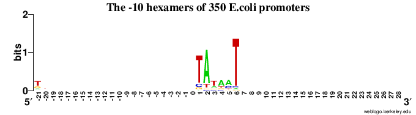

## Przyrównanie wielu sekwencji (MSA)

### Zad. 1 - Identyfikacja funkcjonalnych regionów sekwencji (ClustalOmega)

```
                            ========= FRAGMENT MSA =========

sp|P33296|UBC6_YEAST       GTLTFPSDYPYKPPAIRMITPN--------------------------------GRFKP- 82
sp|P52491|UBC12_YEAST      FNLDFNEVYPIEPPKVVCLK----------------------------------KIFHPN 107
sp|P61081|UBC12_HUMAN      FSFKVGQGYPHDPPKVKCET----------------------------------MVYHPN 103
sp|P42743|UBC15_ARATH      LQVEFPEHYPMEAPQVVFVS---------------------------------PAPSHPH 91
sp|P29340|UBCX_YEAST       ILIEVPSSYPMNPPKISFMQ---------------------------------NNILHCN 106
sp|P62256|UBE2H_HUMAN      VRVDLPDKYPFKSPSIGFMN----------------------------------KIFHPN 78
sp|P28263|UBC8_YEAST       LHVELPDNYPYKSPSIGFVN----------------------------------KIFHPN 76
sp|P42749|UBC5_ARATH       IRVELPDAYPYKSPSVGFIT----------------------------------KIYHPN 76
sp|P27949|UBC_ASFB7        AKVAFPPEYPYAPPKLTFTS----------------------------------EMWHPN 77
sp|P14682|UBC3_YEAST       AQMRFPEDFPFSPPQFRFTP----------------------------------AIYHPN 87
sp|Q29503|UB2R2_RABIT      AHIKFPIDYPYSPPTFRFLT----------------------------------KMWHPN 85
sp|Q42540|UBC7_ARATH       AIMTFPQNYPNSPPTVRFTS----------------------------------DMWHPN 81
sp|P34477|UBC7_CAEEL       AILDFPRDYPQKPPKMKFIS----------------------------------EIWHPN 80
sp|Q9Y818|UBC15_SCHPO      ATLSFPQDYPLMPPKMKFTT----------------------------------EIWHPN 82
sp|O00102|UBC7_SCHPO       ATLKFPSDYPLGPPTLKFEC----------------------------------EFFHPN 82
sp|Q02159|UBC7_YEAST       AKLEFPKDYPLSPPKLTFTP----------------------------------SILHPN 81
sp|O14933|UB2L6_HUMAN      LRISFPPEYPFKPPMIKFTT----------------------------------KIYHPN 78
sp|P68036|UB2L3_HUMAN      IEINFPAEYPFKPPKITFKT----------------------------------KIYHPN 78
sp|P52487|UBC84_DROME      IEINFPPQYPFMPPKILFKT----------------------------------KIYHPN 78
sp|O60015|UBCX_PICAN       LEIDIPTNYPLDPPKIKFVVFGEEKIRQLQRKT------------SSGARKVCYKMPHPN 110
sp|P49428|UBCX_PICPA       LQIDIPSNYPTQPPKFTFIVSDDIPRNRRQRQTNQIQDDDEFEGAEKEVLRHCYRMPHPN 124
sp|Q9P6I1|UBC16_SCHPO      LDIHVHEGYPISPPSVYFQT----------------------------------KIVHPN 81
sp|P52484|UBC21_CAEEL      IKVDIPEHYPFEPPKAKFVT----------------------------------RIWHPN 97
sp|P61085|UBE2K_BOVIN      LEIKIPETYPFNPPKVRFIT----------------------------------KIWHPN 83
sp|P50623|UBC9_YEAST       ITVEYPNEYPSKPPKVKFPA----------------------------------GFYHPN 85
sp|P63279|UBC9_HUMAN       LRMLFKDDYPSSPPKCKFEP----------------------------------PLFHPN 85
sp|P40984|UBC9_SCHPO       LTMAFPEEYPTRPPKCRFTP----------------------------------PLFHPN 85
sp|P52492|UBC11_YEAST      VSLKFPQNYPFHPPMIKFLS----------------------------------PMWHPN 85
sp|Q9D1C1|UBE2C_MOUSE      LSLEFPSGYPYNAPTVKFLT----------------------------------PCYHPN 106
sp|Q95044|UBE2C_SPISO      LTLEFPSDYPYKPPVVKFTT----------------------------------PCWHPN 106
sp|P63146|UBE2B_HUMAN      LVIEFSEEYPNKPPTVRFLS----------------------------------KMFHPN 80
sp|Q16763|UBE2S_HUMAN      MKLLLGKDFPASPPKGYFLT----------------------------------KIFHPN 87
sp|P21734|UBC1_YEAST       VDIEVPMEYPFKPPKMQFDT----------------------------------KVYHPN 79
sp|P61089|UBE2N_MOUSE      LELFLPEEYPMAAPKVRFMT----------------------------------KIYHPN 79
sp|O13685|UBC13_SCHPO      LELFLPDEYPMMPPNVRFLT----------------------------------KIYHPN 78
sp|P35132|UBC9_ARATH       VTIHFPPDYPFKPPKVAFRT----------------------------------KVFHPN 77
sp|P51965|UB2E1_HUMAN      LDITFTPEYPFKPPKVTFRT----------------------------------RIYHCN 123
                             .     :*   *                                           :  

sp|P33296|UBC6_YEAST       ----NTRLCLSMSDYHP----------DTWNPGWSVSTILNGLLSFMTSDEATTGSITTS 128
sp|P52491|UBC12_YEAST      IDL-KGNVCLNILRE-------------DWSPALDLQSIITGL-LFLFLEPNPNDPLNKD 152
sp|P61081|UBC12_HUMAN      IDL-EGNVCLNILRE-------------DWKPVLTINSIIYGL-QYLFLEPNPEDPLNKE 148
sp|P42743|UBC15_ARATH      IYS-NGHICLDILYD-------------SWSPAMTVNSVCISILSMLSSSPAKQRPADND 137
sp|P29340|UBCX_YEAST       VKSATGEICLNILKP------------EEWTPVWDLLHCVHAV-WRLLREPVCDSPLDVD 153
sp|P62256|UBE2H_HUMAN      IDEASGTVCLDVINQ-------------TWTALYDLTNIFESFLPQLLAYPNPIDPLNGD 125
sp|P28263|UBC8_YEAST       IDIASGSICLDVINS-------------TWSPLYDLINIVEWMIPGLLKEPNGSDPLNNE 123
sp|P42749|UBC5_ARATH       VDEMSGSVCLDVINQ-------------TWSPMFDLVNVFETFLPQLLLYPNPSDPLNGE 123
sp|P27949|UBC_ASFB7        IYP-DGRLCISILHGDNA-----EEQGMTWSPAQKIDTILLSV-ISLLNEPNPDSPANVD 130
sp|P14682|UBC3_YEAST       VYR-DGRLCISILHQSGD-PMTDEPDAETWSPVQTVESVLISI-VSLLEDPNINSPANVD 144
sp|Q29503|UB2R2_RABIT      IYE-NGDVCISILHPPVDDPQSGELPSERWNPTQNVRTILLSV-ISLLNEPNTFSPANVD 143
sp|Q42540|UBC7_ARATH       VYS-DGRVCISILHPPGDDPSGYELASERWTPVHTVESIMLSI-ISMLSGPNDESPANVE 139
sp|P34477|UBC7_CAEEL       IDK-EGNVCISILHDPGDDKWGYERPEERWLPVHTVETILLSV-ISMLTDPNFESPANVD 138
sp|Q9Y818|UBC15_SCHPO      VHP-NGEVCISILHPPGDDKYGYEDAGERWLPVHSPETILISV-ISMLSSPNDESPANID 140
sp|O00102|UBC7_SCHPO       VYK-DGTVCISILHAPGDDPNMYESSSERWSPVQSVEKILLSV-MSMLAEPNDESGANID 140
sp|Q02159|UBC7_YEAST       IYP-NGEVCISILHSPGDDPNMYELAEERWSPVQSVEKILLSV-MSMLSEPNIESGANID 139
sp|O14933|UB2L6_HUMAN      VDE-NGQICLPIISS------------ENWKPCTKTCQVLEAL-NVLVNRPNIREPLRMD 124
sp|P68036|UB2L3_HUMAN      IDE-KGQVCLPVISA------------ENWKPATKTDQVIQSL-IALVNDPQPEHPLRAD 124
sp|P52487|UBC84_DROME      VDE-KGEVCLPIIST------------DNWKPTTRTEQVLQAL-VAIVHNPEPEHPLRSD 124
sp|O60015|UBCX_PICAN       VNFKTGEICLDILQQ-------------KWSPAWTLQSALVAI-VVLLANPEPLSPLNID 156
sp|P49428|UBCX_PICPA       IAFNTGEICLDILQA-------------KWTPAWTLSSALTAI-VLLLNDPEPLSPLDID 170
sp|Q9P6I1|UBC16_SCHPO      ISWTNGEVCMDILKT-------------HWSPAWSLQSACLAI-ISLLSNYDASSPLNVD 127
sp|P52484|UBC21_CAEEL      ISSQTGTICLDILKD-------------KWTASLTLRTVLLSL-QAMLCSPEPSDPQDAV 143
sp|P61085|UBE2K_BOVIN      ISSVTGAICLDILKD-------------QWAAAMTLRTVLLSL-QALLAAAEPDDPQDAV 129
sp|P50623|UBC9_YEAST       VYP-SGTICLSILNE-----------DQDWRPAITLKQIVLGV-QDLLDSPNPNSPAQEP 132
sp|P63279|UBC9_HUMAN       VYP-SGTVCLSILEE-----------DKDWRPAITIKQILLGI-QELLNEPNIQDPAQAE 132
sp|P40984|UBC9_SCHPO       VYP-SGTVCLSILNE-----------EEGWKPAITIKQILLGI-QDLLDDPNIASPAQTE 132
sp|P52492|UBC11_YEAST      VDK-SGNICLDILKE-------------KWSAVYNVETILLSL-QSLLGEPNNRSPLNAV 130
sp|Q9D1C1|UBE2C_MOUSE      VDT-QGNICLDILKD-------------KWSALYDVRTILLSI-QSLLGEPNIDSPLNTH 151
sp|Q95044|UBE2C_SPISO      VDQ-SGNICLDILKE-------------NWTASYDVRTILLSL-QSLLGEPNNASPLNAQ 151
sp|P63146|UBE2B_HUMAN      VYA-DGSICLDILQN-------------RWSPTYDVSSILTSI-QSLLDEPNPNSPANSQ 125
sp|Q16763|UBE2S_HUMAN      VGA-NGEICVNVLKR-------------DWTAELGIRHVLLTI-KCLLIHPNPESALNEE 132
sp|P21734|UBC1_YEAST       ISSVTGAICLDILKN-------------AWSPVITLKSALISL-QALLQSPEPNDPQDAE 125
sp|P61089|UBE2N_MOUSE      VDK-LGRICLDILKD-------------KWSPALQIRTVLLSI-QALLSAPNPDDPLAND 124
sp|O13685|UBC13_SCHPO      VDK-LGRICLSTLKK-------------DWSPALQIRTVLLSI-QALMGAPNPDDPLDND 123
sp|P35132|UBC9_ARATH       INS-NGSICLDILKE-------------QWSPALTISKVLLSI-CSLLTDPNPDDPLVPE 122
sp|P51965|UB2E1_HUMAN      INS-QGVICLDILKD-------------NWSPALTISKVLLSI-CSLLTDCNPADPLVGS 168
                                  :*:                   *            .   : 

                            ========= FRAGMENT MSA =========
```

1. Symbole znajdujące się pod kolumnami przyrównania oznaczają stopień zachowania danej reszty aminokwasowej na danej pozycji w przyrównaniu.
   * `*` - całkowite zachowanie danej reszty w danej pozycji (aminokwas występuje we wszystkich sekwencjach w analizowanej pozycji przyrównania)
   * `:` - aminokwasy o bardzo podobnych właściwościach fizykochemicznych (ściślej, aminokwasy, których wartość punktacji substytucji osiąga pewną wartość w użytej macierzy substytucji)
   * `.` - aminokwasy o podobnych właściwościach fizykochemiczych.
2. Trzy aminokwasy są całkowicie zachowane u wszystkich organizmów: `P` dwukrotnie, `C` i `W`. 
3. Zachowane aminokwasy najprawdopodobniej pełnią istotne funkcje w działaniu enzymu koniugującego ubikwitynę.
4. Identyczność pary sekwencji `sp|P33296|UBC6_YEAST` i `sp|Q29503|UB2R2_RABIT` wynosi `23.83%`.
   > Wybierz `Result Summary` –> `Percent Identity Matrix`.


#### Funkcjonalne regiony sekwencji

Białka drożdży nie posiadające aktywności katalitycznej: [NP_588162](https://www.ncbi.nlm.nih.gov/protein/NP_588162) i [NP_011428](https://www.ncbi.nlm.nih.gov/protein/NP_011428):

```
>NP_588162.1 ubiquitin-conjugating enzyme Mms2 [Schizosaccharomyces pombe]
MAKVPRNFKLLEELEKGEKGLGESSCSYGLTNADDITLSDWNATILGPAHSVHENRIYSLKIHCDANYPD
APPIVTFVSRINLPGVDGETGKVNPHKIDCLRHWKREYSMETVLLDLKKEMASSSNRKLPQPPEGSTFF

>NP_011428.1 E2 ubiquitin-conjugating protein MMS2 [Saccharomyces cerevisiae S288C]
MSKVPRNFRLLEELEKGEKGFGPESCSYGLADSDDITMTKWNGTILGPPHSNHENRIYSLSIDCGPNYPD
SPPKVTFISKINLPCVNPTTGEVQTDFHTLRDWKRAYTMETLLLDLRKEMATPANKKLRQPKEGETF
```

Przyrównanie sekwencji białek `ube.fasta` wraz z sekwencjami `NP_588162.1` i `NP_011428.1`.

```
                            ========= FRAGMENT MSA =========

NP_588162.1                LKIHCDANYPDAPPIVTFVS----------------------------------RINLPG 85
NP_011428.1                LSIDCGPNYPDSPPKVTFIS----------------------------------KINLPC 85
sp|P33296|UBC6_YEAST       GTLTFPSDYPYKPPAIRMITPN--------------------------------GRFKP- 82
sp|P52491|UBC12_YEAST      FNLDFNEVYPIEPPKVVCLK----------------------------------KIFHPN 107
sp|P61081|UBC12_HUMAN      FSFKVGQGYPHDPPKVKCET----------------------------------MVYHPN 103
sp|P42743|UBC15_ARATH      LQVEFPEHYPMEAPQVVFVS---------------------------------PAPSHPH 91
sp|P29340|UBCX_YEAST       ILIEVPSSYPMNPPKISFMQ---------------------------------NNILHCN 106
sp|P62256|UBE2H_HUMAN      VRVDLPDKYPFKSPSIGFMN----------------------------------KIFHPN 78
sp|P28263|UBC8_YEAST       LHVELPDNYPYKSPSIGFVN----------------------------------KIFHPN 76
sp|P42749|UBC5_ARATH       IRVELPDAYPYKSPSVGFIT----------------------------------KIYHPN 76
sp|P27949|UBC_ASFB7        AKVAFPPEYPYAPPKLTFTS----------------------------------EMWHPN 77
sp|P14682|UBC3_YEAST       AQMRFPEDFPFSPPQFRFTP----------------------------------AIYHPN 87
sp|Q29503|UB2R2_RABIT      AHIKFPIDYPYSPPTFRFLT----------------------------------KMWHPN 85
sp|Q42540|UBC7_ARATH       AIMTFPQNYPNSPPTVRFTS----------------------------------DMWHPN 81
sp|P34477|UBC7_CAEEL       AILDFPRDYPQKPPKMKFIS----------------------------------EIWHPN 80
sp|Q9Y818|UBC15_SCHPO      ATLSFPQDYPLMPPKMKFTT----------------------------------EIWHPN 82
sp|O00102|UBC7_SCHPO       ATLKFPSDYPLGPPTLKFEC----------------------------------EFFHPN 82
sp|Q02159|UBC7_YEAST       AKLEFPKDYPLSPPKLTFTP----------------------------------SILHPN 81
sp|O14933|UB2L6_HUMAN      LRISFPPEYPFKPPMIKFTT----------------------------------KIYHPN 78
sp|P68036|UB2L3_HUMAN      IEINFPAEYPFKPPKITFKT----------------------------------KIYHPN 78
sp|P52487|UBC84_DROME      IEINFPPQYPFMPPKILFKT----------------------------------KIYHPN 78
sp|O60015|UBCX_PICAN       LEIDIPTNYPLDPPKIKFVVFGEEKIRQLQRKT------------SSGARKVCYKMPHPN 110
sp|P49428|UBCX_PICPA       LQIDIPSNYPTQPPKFTFIVSDDIPRNRRQRQTNQIQDDDEFEGAEKEVLRHCYRMPHPN 124
sp|Q9P6I1|UBC16_SCHPO      LDIHVHEGYPISPPSVYFQT----------------------------------KIVHPN 81
sp|P52484|UBC21_CAEEL      IKVDIPEHYPFEPPKAKFVT----------------------------------RIWHPN 97
sp|P61085|UBE2K_BOVIN      LEIKIPETYPFNPPKVRFIT----------------------------------KIWHPN 83
sp|P50623|UBC9_YEAST       ITVEYPNEYPSKPPKVKFPA----------------------------------GFYHPN 85
sp|P63279|UBC9_HUMAN       LRMLFKDDYPSSPPKCKFEP----------------------------------PLFHPN 85
sp|P40984|UBC9_SCHPO       LTMAFPEEYPTRPPKCRFTP----------------------------------PLFHPN 85
sp|P52492|UBC11_YEAST      VSLKFPQNYPFHPPMIKFLS----------------------------------PMWHPN 85
sp|Q9D1C1|UBE2C_MOUSE      LSLEFPSGYPYNAPTVKFLT----------------------------------PCYHPN 106
sp|Q95044|UBE2C_SPISO      LTLEFPSDYPYKPPVVKFTT----------------------------------PCWHPN 106
sp|P63146|UBE2B_HUMAN      LVIEFSEEYPNKPPTVRFLS----------------------------------KMFHPN 80
sp|Q16763|UBE2S_HUMAN      MKLLLGKDFPASPPKGYFLT----------------------------------KIFHPN 87
sp|P21734|UBC1_YEAST       VDIEVPMEYPFKPPKMQFDT----------------------------------KVYHPN 79
sp|P61089|UBE2N_MOUSE      LELFLPEEYPMAAPKVRFMT----------------------------------KIYHPN 79
sp|O13685|UBC13_SCHPO      LELFLPDEYPMMPPNVRFLT----------------------------------KIYHPN 78
sp|P35132|UBC9_ARATH       VTIHFPPDYPFKPPKVAFRT----------------------------------KVFHPN 77
sp|P51965|UB2E1_HUMAN      LDITFTPEYPFKPPKVTFRT----------------------------------RIYHCN 123
                             .     :*   *                                              

NP_588162.1                VDGETGKVNPHKIDC-----------LRHWKREYSMETVLLDLKKEMASSSNRKLPQPPE 134
NP_011428.1                VNPTTGEVQT-DFHT-----------LRDWKRAYTMETLLLDLRKEMATPANKKLRQPKE 133
sp|P33296|UBC6_YEAST       ----NTRLCLSMSDYHP----------DTWNPGWSVSTILNGLLSFMTSDEATTGSITTS 128
sp|P52491|UBC12_YEAST      IDL-KGNVCLNILRE-------------DWSPALDLQSIITGL-LFLFLEPNPNDPLNKD 152
sp|P61081|UBC12_HUMAN      IDL-EGNVCLNILRE-------------DWKPVLTINSIIYGL-QYLFLEPNPEDPLNKE 148
sp|P42743|UBC15_ARATH      IYS-NGHICLDILYD-------------SWSPAMTVNSVCISILSMLSSSPAKQRPADND 137
sp|P29340|UBCX_YEAST       VKSATGEICLNILKP------------EEWTPVWDLLHCVHAV-WRLLREPVCDSPLDVD 153
sp|P62256|UBE2H_HUMAN      IDEASGTVCLDVINQ-------------TWTALYDLTNIFESFLPQLLAYPNPIDPLNGD 125
sp|P28263|UBC8_YEAST       IDIASGSICLDVINS-------------TWSPLYDLINIVEWMIPGLLKEPNGSDPLNNE 123
sp|P42749|UBC5_ARATH       VDEMSGSVCLDVINQ-------------TWSPMFDLVNVFETFLPQLLLYPNPSDPLNGE 123
sp|P27949|UBC_ASFB7        IYP-DGRLCISILHGDNA-----EEQGMTWSPAQKIDTILLSV-ISLLNEPNPDSPANVD 130
sp|P14682|UBC3_YEAST       VYR-DGRLCISILHQSGD-PMTDEPDAETWSPVQTVESVLISI-VSLLEDPNINSPANVD 144
sp|Q29503|UB2R2_RABIT      IYE-NGDVCISILHPPVDDPQSGELPSERWNPTQNVRTILLSV-ISLLNEPNTFSPANVD 143
sp|Q42540|UBC7_ARATH       VYS-DGRVCISILHPPGDDPSGYELASERWTPVHTVESIMLSI-ISMLSGPNDESPANVE 139
sp|P34477|UBC7_CAEEL       IDK-EGNVCISILHDPGDDKWGYERPEERWLPVHTVETILLSV-ISMLTDPNFESPANVD 138
sp|Q9Y818|UBC15_SCHPO      VHP-NGEVCISILHPPGDDKYGYEDAGERWLPVHSPETILISV-ISMLSSPNDESPANID 140
sp|O00102|UBC7_SCHPO       VYK-DGTVCISILHAPGDDPNMYESSSERWSPVQSVEKILLSV-MSMLAEPNDESGANID 140
sp|Q02159|UBC7_YEAST       IYP-NGEVCISILHSPGDDPNMYELAEERWSPVQSVEKILLSV-MSMLSEPNIESGANID 139
sp|O14933|UB2L6_HUMAN      VDE-NGQICLPIISS------------ENWKPCTKTCQVLEAL-NVLVNRPNIREPLRMD 124
sp|P68036|UB2L3_HUMAN      IDE-KGQVCLPVISA------------ENWKPATKTDQVIQSL-IALVNDPQPEHPLRAD 124
sp|P52487|UBC84_DROME      VDE-KGEVCLPIIST------------DNWKPTTRTEQVLQAL-VAIVHNPEPEHPLRSD 124
sp|O60015|UBCX_PICAN       VNFKTGEICLDILQQ-------------KWSPAWTLQSALVAI-VVLLANPEPLSPLNID 156
sp|P49428|UBCX_PICPA       IAFNTGEICLDILQA-------------KWTPAWTLSSALTAI-VLLLNDPEPLSPLDID 170
sp|Q9P6I1|UBC16_SCHPO      ISWTNGEVCMDILKT-------------HWSPAWSLQSACLAI-ISLLSNYDASSPLNVD 127
sp|P52484|UBC21_CAEEL      ISSQTGTICLDILKD-------------KWTASLTLRTVLLSL-QAMLCSPEPSDPQDAV 143
sp|P61085|UBE2K_BOVIN      ISSVTGAICLDILKD-------------QWAAAMTLRTVLLSL-QALLAAAEPDDPQDAV 129
sp|P50623|UBC9_YEAST       VYP-SGTICLSILNE-----------DQDWRPAITLKQIVLGV-QDLLDSPNPNSPAQEP 132
sp|P63279|UBC9_HUMAN       VYP-SGTVCLSILEE-----------DKDWRPAITIKQILLGI-QELLNEPNIQDPAQAE 132
sp|P40984|UBC9_SCHPO       VYP-SGTVCLSILNE-----------EEGWKPAITIKQILLGI-QDLLDDPNIASPAQTE 132
sp|P52492|UBC11_YEAST      VDK-SGNICLDILKE-------------KWSAVYNVETILLSL-QSLLGEPNNRSPLNAV 130
sp|Q9D1C1|UBE2C_MOUSE      VDT-QGNICLDILKD-------------KWSALYDVRTILLSI-QSLLGEPNIDSPLNTH 151
sp|Q95044|UBE2C_SPISO      VDQ-SGNICLDILKE-------------NWTASYDVRTILLSL-QSLLGEPNNASPLNAQ 151
sp|P63146|UBE2B_HUMAN      VYA-DGSICLDILQN-------------RWSPTYDVSSILTSI-QSLLDEPNPNSPANSQ 125
sp|Q16763|UBE2S_HUMAN      VGA-NGEICVNVLKR-------------DWTAELGIRHVLLTI-KCLLIHPNPESALNEE 132
sp|P21734|UBC1_YEAST       ISSVTGAICLDILKN-------------AWSPVITLKSALISL-QALLQSPEPNDPQDAE 125
sp|P61089|UBE2N_MOUSE      VDK-LGRICLDILKD-------------KWSPALQIRTVLLSI-QALLSAPNPDDPLAND 124
sp|O13685|UBC13_SCHPO      VDK-LGRICLSTLKK-------------DWSPALQIRTVLLSI-QALMGAPNPDDPLDND 123
sp|P35132|UBC9_ARATH       INS-NGSICLDILKE-------------QWSPALTISKVLLSI-CSLLTDPNPDDPLVPE 122
sp|P51965|UB2E1_HUMAN      INS-QGVICLDILKD-------------NWSPALTISKVLLSI-CSLLTDCNPADPLVGS 168
                                  :                     *            .   :  
                            ========= FRAGMENT MSA =========           
```

5. W powyższym przyrównaniu (uwzględniającym białka `NP_588162.1` i `NP_011428.1`) zachowane są aminokwasy: `P` dwukrotnie oraz `W`.
6. W przyrównaniu sekwencji białek `ube.fasta` o znanej aktywności katalitycznej zachowane są trzy aminokwasy: `P`, `C` i `W`. Białka drożdżowe nie posiadające aktywności katalitycznej mają zachowane aminokwasy `P` i `W`, natomiast nie posiadają zachowanej reszty `C`. Wynika z tego, że cysteina jest kluczowa podczas działaniu enzymu.
<br/><br/>

### Zad. 2 - Przyrównanie sekwencji CDS alfa-globin (MAFFT)
Zadanie na podstawie [DTU Course](http://teaching.healthtech.dtu.dk/36611/index.php/Bioinformatics_in_practice,_Faroe_Islands_2018#Morning:_Multiple_alignments)

Przyrównanie sekwencji kodujących (*CDS*) alfa-globiny przy użyciu programu MAFFT.

```
CLUSTAL format alignment by MAFFT FFT-NS-i (v7.397)


pigeon_alpha-D- A---TGCTGACCGACTCTGACAAGAAGCTGGTCCTGCAGGTGTGGGAGAAGGTGATCCGC
duck_alpha-D-gl A---TGCTGACCGCCGAGGACAAGAAGCTCATCGTGCAGGTGTGGGAGAAGGTGGCTGGC
Chicken_alpha-D A---TGCTGACTGCCGAGGACAAGAAGCTCATCCAGCAGGCCTGGGAGAGGGCCGCTTCC
pigeon_alpha-A- ATGGTGCTGTCTGCCAACGACAAGAGCAACGTGAAGGCCGTCTTCGGCAAAATCGGCGGC
duck_alpha-A-gl ATGGTGCTGTCTGCGGCTGACAAGACCAACGTCAAGGGTGTCTTCTCCAAAATCGGTGGC
Chicken_alpha-A ATGGTGCTGTCCGCTGCTGACAAGAACAACGTCAAGGGCATCTTCACCAAAATCGCCGGC
Goat_alpha-i-gl ATGGTGCTGTCTGCCGCCGACAAGTCCAATGTCAAGGCCGCCTGGGGCAAGGTTGGCGGC
Goat_alpha-ii-g ATGGTGCTGTCTGCCGCCGACAAGTCCAATGTCAAGGCCGCCTGGGGCAAGGTTGGCAGC
Horse_alpha-1_g ATGGTGCTGTCTGCCGCCGACAAGACCAACGTCAAGGCCGCCTGGAGTAAGGTTGGCGGC
Horse_alpha-2_g ATGGTGCTGTCTGCCGCCGACAAGACCAACGTCAAGGCCGCCTGGAGTAAGGTTGGCGGC
                *   ***** *.*     ******      .*   *   .. *     *.... . .  *

pigeon_alpha-D- CACC---CAGACTGTGGAGCCGAGGCCCTGGAGAGGCTGTTCACCACCTACCCCCAGACC
duck_alpha-D-gl CACCAGGAGGAATTCGGAAGTGAAGCTCTGCAGAGGATGTTCCTCGCCTACCCCCAGACC
Chicken_alpha-D CACCAGGAGGAGTTTGGAGCTGAGGCTCTGACTAGGATGTTCACCACCTATCCCCAGACC
pigeon_alpha-A- CAGGCCGGTGACTTGGGTGGTGAAGCCCTGGAGAGGTTGTTCATCACCTACCCCCAGACC
duck_alpha-A-gl CATGCTGAGGAGTATGGCGCCGAGACCCTGGAGAGGATGTTCATCGCCTACCCCCAGACC
Chicken_alpha-A CATGCTGAGGAGTATGGCGCCGAGACCCTGGAAAGGATGTTCACCACCTACCCCCCAACC
Goat_alpha-i-gl AACGCTGGAGCTTATGGCGCAGAGGCTCTGGAGAGGATGTTCCTGAGCTTCCCCACCACC
Goat_alpha-ii-g AACGCTGGAGCTTATGGCGCAGAGGCTCTGGAGAGGATGTTCCTGAGCTTCCCCACCACC
Horse_alpha-1_g CACGCTGGCGAGTTTGGCGCAGAGGCCCTAGAGAGGATGTTCCTGGGCTTCCCCACCACC
Horse_alpha-2_g CACGCTGGCGAGTATGGCGCAGAGGCCCTAGAGAGGATGTTCCTGGGCTTCCCCACCACC
                 *       *  *  ** .  **..*.**.   *** ***** . . ** .***   ***

pigeon_alpha-D- AAGACCTACTTCCCCCACTTCGACTTGCACCATGGCTCCGACCAGGTCCGCAACCACGGC
duck_alpha-D-gl AAGACCTACTTCCCCCACTTCGACCTGCATCCCGGCTCTGAACAGGTCCGTGGCCATGGC
Chicken_alpha-D AAGACCTACTTCCCCCACTTCGACCTTTCGCCTGGCTCTGACCAGGTCCGTGGCCATGGC
pigeon_alpha-A- AAGACCTACTTCCCCCACTTCGACCTGTCACATGGCTCCGCTCAGATCAAGGGGCACGGC
duck_alpha-A-gl AAGACCTACTTCCCCCACTTTGACCTGCAGCACGGCTCTGCTCAGATCAAGGCCCATGGC
Chicken_alpha-A AAGACCTACTTCCCCCACTTCGATCTGTCACACGGCTCCGCTCAGATCAAGGGGCACGGC
Goat_alpha-i-gl AAGACCTACTTCCCCCACTTCGACCTGAGCCACGGCTCGGCCCAGGTCAAGGGCCACGGC
Goat_alpha-ii-g AAGACCTACTTCCCCCACTTCGACCTGAGCCACGGCTCGGCCCAGGTCAAGGGCCACGGC
Horse_alpha-1_g AAGACCTACTTCCCCCACTTCGATCTGAGCCACGGCTCCGCCCAGGTCAAGGCCCACGGC
Horse_alpha-2_g AAGACCTACTTCCCCCACTTCGATCTGAGCCACGGCTCCGCCCAGGTCAAGGCCCACGGC
                ********************.**..*    * .***** *  ***.** . .  **.***

pigeon_alpha-D- AAGAAGGTGTTGGCCGCCTTGGGCAACGCTGTCAAGAGCCTGGGCAACCTCAGCCAAGCC
duck_alpha-D-gl AAGAAAGTGGCGGCTGCCCTGGGCAATGCCGTGAAGAGCCTGGACAACCTCAGCCAGGCC
Chicken_alpha-D AAGAAGGTGTTGGGTGCCCTGGGCAACGCCGTGAAGAACGTGGACAACCTCAGCCAGGCC
pigeon_alpha-A- AAGAAGGTGGCGGAGGCACTGGTTGAGGCTGCCAACCACATCGATGACATCGCTGGTGCC
duck_alpha-A-gl AAGAAGGTGGCGGCTGCCCTAGTTGAAGCTGTCAACCACATCGATGACATTGCGGGTGCT
Chicken_alpha-A AAGAAGGTAGTGGCTGCCTTGATCGAGGCTGCCAACCACATTGATGACATCGCCGGCACC
Goat_alpha-i-gl GAGAAGGTGGCCGCCGCGCTGACCAAAGCGGTGGGCCACCTGGACGACCTGCCCGGTACT
Goat_alpha-ii-g GAGAAGGTGGCCGCCGCGCTGACCAAAGCGGTGGGCCACCTGGACGACCTGCCCGGTACT
Horse_alpha-1_g AAGAAGGTGGGCGACGCGCTGACTCTCGCCGTGGGCCACCTGGACGACCTGCCTGGCGCC
Horse_alpha-2_g CAGAAGGTGGGCGACGCGCTGACTCTCGCCGTGGGCCACCTGGACGACCTGCCTGGCGCC
                 ****.**.   *  ** .*.. .   ** *. ..  .* * *...** *     . .*.

pigeon_alpha-D- CTGTCTGACCTCAGCGACCTGCATGCCTACAACCTGCGTGTCGACCCTGTCAACTTCAAG
duck_alpha-D-gl CTGTCTGAGCTCAGCAACCTGCATGCCTACAACCTGCGTGTTGACCCTGTCAACTTCAAG
Chicken_alpha-D ATGGCTGAGCTGAGCAACCTGCATGCCTACAACCTGCGTGTTGACCCCGTCAATTTCAAG
pigeon_alpha-A- CTCTCCAAGCTGAGCGACCTCCACGCCCAAAAGCTCCGTGTGGACCCCGTCAACTTCAAA
duck_alpha-A-gl CTCTCCAAGCTCAGTGACCTCCACGCCCAAAAGCTCCGTGTGGACCCTGTCAACTTCAAA
Chicken_alpha-A CTCTCCAAGCTCAGCGACCTCCATGCCCACAAGCTCCGCGTGGACCCTGTCAACTTCAAA
Goat_alpha-i-gl CTGTCTGATCTGAGTGACCTGCACGCCCACAAGCTGCGTGTGGACCCGGTCAACTTTAAG
Goat_alpha-ii-g CTGTCTGATCTGAGTGACCTGCACGCCCACAAGCTGCGTGTGGACCCGGTCAACTTTAAG
Horse_alpha-1_g CTGTCGAATCTGAGCGACCTGCACGCACACAAGCTGCGCGTGGACCCCGTCAACTTCAAG
Horse_alpha-2_g CTGTCGAATCTGAGCGACCTGCACGCACACAAGCTGCGCGTGGACCCCGTCAACTTCAAG
                 *  * .* ** **..**** **.** .* ** ** **.** ***** *****.**.**.

pigeon_alpha-D- CTGCTGGCGCAGTGCTTCCACGTGGTGCTGGCCACACACCTGGGCAACGACTACACCCCG
duck_alpha-D-gl CTGCTGGCACAGTGCTTCCAGGTGGTGCTGGCCGCACACCTGGGCAAAGACTACAGCCCC
Chicken_alpha-D CTGTTGTCGCAGTGCATCCAGGTGGTGCTGGCTGTACACATGGGCAAAGACTACACCCCT
pigeon_alpha-A- CTGCTGGGTCACTGCTTCCTGGTGGTCGTGGCCGTCCACTTCCCCTCTCTCCTGACCCCG
duck_alpha-A-gl TTCCTGGGCCACTGCTTCCTGGTGGTGGTTGCCATCCACCACCCCGCTGCCCTGACCCCA
Chicken_alpha-A CTCCTGGGCCAATGCTTCCTGGTGGTGGTGGCCATCCACCACCCTGCTGCCCTGACCCCG
Goat_alpha-i-gl CTTCTGAGCCACTCCCTGCTGGTGACCCTGGCCTGCCACCTCCCCAATGATTTCACCCCC
Goat_alpha-ii-g CTTCTGAGCCACTCCCTGCTGGTGACCCTGGCCTGCCACCACCCCAGTGATTTCACCCCC
Horse_alpha-1_g CTTCTGAGTCATTGCCTGCTGTCCACCTTGGCCGTCCACCTCCCCAACGATTTCACCCCT
Horse_alpha-2_g CTCCTGAGTCATTGCCTGCTGTCCACCTTGGCCGTCCACCTCCCCAACGATTTCACCCCT
                .* .**   ** * * * *   . ..  * **.   ***     .     ..  * *** 

pigeon_alpha-D- GAGGCACATGCTGCCTTCGACAAGTTCCTGTCGGCTGTGTGCACCGTGCTGGCCGAGAAG
duck_alpha-D-gl GAGATGCATGCTGCCTTTGACAAGTTCTTGTCCGCCGTGGCTGCCGTGCTGGCTGAAAAG
Chicken_alpha-D GAAGTGCATGCTGCCTTCGACAAGTTCCTGTCTGCCGTGTCTGCTGTGCTGGCTGAGAAG
pigeon_alpha-A- GAGGTCCATGCTTCCCTGGACAAGTTCGTGTGTGCCGTGGGCACCGTCCTTACTGCCAAG
duck_alpha-A-gl GAGGTCCACGCTTCCCTGGACAAGTTCATGTGCGCCGTGGGTGCTGTGCTGACTGCCAAG
Chicken_alpha-A GAGGTCCATGCTTCCCTGGACAAGTTCTTGTGCGCCGTGGGCACTGTGCTGACCGCCAAG
Goat_alpha-i-gl GCGGTCCACGCCTCCCTGGACAAGTTCTTGGCCAACGTGAGCACCGTGCTGACCTCCAAA
Goat_alpha-ii-g GCGGTCCACGCCTCCCTGGACAAGTTCTTGGCCAACGTGAGCACCGTGCTGACCTCCAAA
Horse_alpha-1_g GCCGTCCACGCCTCCCTGGACAAGTTCTTGAGCAGTGTGAGCACCGTGCTGACCTCCAAA
Horse_alpha-2_g GCCGTCCACGCCTCCCTGGACAAGTTCTTGAGCAGTGTGAGCACCGTGCTGACCTCCAAA
                *  .. **.**. **.* ********* **   . .***  ..*.** ** .*.   **.

pigeon_alpha-D- TACAGATAA
duck_alpha-D-gl TACAGATGA
Chicken_alpha-D TACAGATAA
pigeon_alpha-A- TACCGTTAA
duck_alpha-A-gl TACCGTTAG
Chicken_alpha-A TACCGTTAA
Goat_alpha-i-gl TACCGTTAA
Goat_alpha-ii-g TACCGTTAA
Horse_alpha-1_g TACCGTTAA
Horse_alpha-2_g TACCGTTAA
                *** * *..
```

1. W powyższym przyrównaniu jest jeden fragment >10 nukleotydów (23 nt) całkowicie zachowany we wszystkich sekwencjach. Sekwencja fragmentu to `ACCAAGACCTACTTCCCCCACTT`.

   Zakładka `Guide Tree` dostaracza graficznej informacji na temat dystansów między parami sekwencji.
   > `Guide Tree` (drzewo przewodnie) *nie jest* prawdziwym drzewem filogenetycznym. Drzewo przewodnie jest wyznaczone na podstawie przyrównań par sekwencji, na podstawie których wyznacza się następnie odległość ewolucyjną między sekwencjami. Najprostszym sposobem wyznaczenia takiej odległości jest pominięcie pozycji dopasowania, na których występują przerwy i obliczenia odsetka pozycji, na których występują różne reszty. Natomiast drzewo filenetyczne jest budowane w oparciu o przyrównanie wielu sekwencji.

   

   Dystans gałęzi przedstawiony jest obok nazwy sekwencji. Na przykład dystan między sekwencją `3_duck_alpha-D-globin` i `9_Chicken_alpha-D` wynosi `0.115 + 0.115 = 0.230`.

2. Drzewo wiodące wyróżnia 3 grupy genów alfa-globin:
   * Alfa-A (tylko ptaki)
   * Alfa-D (tylko ptaki)
   * Alfa 1 + 2 (ssaki)

   Na drzewie, geny należące do ptaków i ssaków stanowią odrębne grupy i są one ułożone naturalnie w sensie taksonomicznym. Geny alfa-A i alfa-D stanowią odrębne grupy, co wskazuje, że podział na te dwie klasy A i D może być ewolucyjnie stary. Ze względu na to, że geny alfa-A i alfa-D są obecne u wszystkich trzech ptaków, geny te najprawdopodobniej były obecne u wspólnego przodka ptaków.

   Geny alfa-1 i alfa-2 są ze sobą blisko spokrewnione według drzewa przewodniego. 


#### JalView - wizualizacja przyrównania wielu sekwencji
Otwórz przyrównanie w programie JalView (zakładka `Alignment` > `View result with JalView`)
W programie JalView z manu wybierz `Colour` > `Nucleotide`.


3. Skieruj kursor myszy na początek najdłuższego zachowanego fragment sekwencji `ACCAAGACCTACTTCCCCCACTT`. U dołu okna programu JalView znajduje się odpowiadająca mu pozycja w przyrównaniu. Fragment znajduje się w pozycji `118-140`.

* Ustawienie koloru przyrównania według poziomu identyczności: `Colour` > `% Identity`. 


* Zaznacz myszką najbardziej zachowany fragment przyrównania. Naciśnij prawy przycisk myszy na przyrównanie, wybierz `Selection` > `New group`. Następnie `Selection` > `Edit Group` > `Border colour`.


### Zad. 3 - Przyrównanie sekwencji białkowych alfa-globin (MAFFT)
Translacja sekwencji *CDS* alfa-globin przy użyciu programu [EMBOSS Transeq](https://www.ebi.ac.uk/Tools/st/emboss_transeq/).

```
>pigeon_alpha-D-globin_1
MLTDSDKKLVLQVWEKVIRHPDCGAEALERLFTTYPQTKTYFPHFDLHHGSDQVRNHGKK
VLAALGNAVKSLGNLSQALSDLSDLHAYNLRVDPVNFKLLAQCFHVVLATHLGNDYTPEA
HAAFDKFLSAVCTVLAEKYR*
>pigeon_alpha-A-globin_1
MVLSANDKSNVKAVFGKIGGQAGDLGGEALERLFITYPQTKTYFPHFDLSHGSAQIKGHG
KKVAEALVEAANHIDDIAGALSKLSDLHAQKLRVDPVNFKLLGHCFLVVVAVHFPSLLTP
EVHASLDKFVCAVGTVLTAKYR*
>duck_alpha-D-globin_1
MLTAEDKKLIVQVWEKVAGHQEEFGSEALQRMFLAYPQTKTYFPHFDLHPGSEQVRGHGK
KVAAALGNAVKSLDNLSQALSELSNLHAYNLRVDPVNFKLLAQCFQVVLAAHLGKDYSPE
MHAAFDKFLSAVAAVLAEKYR*
>duck_alpha-A-globin_1
MVLSAADKTNVKGVFSKIGGHAEEYGAETLERMFIAYPQTKTYFPHFDLQHGSAQIKAHG
KKVAAALVEAVNHIDDIAGALSKLSDLHAQKLRVDPVNFKFLGHCFLVVVAIHHPAALTP
EVHASLDKFMCAVGAVLTAKYR*
>Goat_alpha-i-globin_1
MVLSAADKSNVKAAWGKVGGNAGAYGAEALERMFLSFPTTKTYFPHFDLSHGSAQVKGHG
EKVAAALTKAVGHLDDLPGTLSDLSDLHAHKLRVDPVNFKLLSHSLLVTLACHLPNDFTP
AVHASLDKFLANVSTVLTSKYR*
>Goat_alpha-ii-globin_1
MVLSAADKSNVKAAWGKVGSNAGAYGAEALERMFLSFPTTKTYFPHFDLSHGSAQVKGHG
EKVAAALTKAVGHLDDLPGTLSDLSDLHAHKLRVDPVNFKLLSHSLLVTLACHHPSDFTP
AVHASLDKFLANVSTVLTSKYR*
>Horse_alpha-1_globin_1
MVLSAADKTNVKAAWSKVGGHAGEFGAEALERMFLGFPTTKTYFPHFDLSHGSAQVKAHG
KKVGDALTLAVGHLDDLPGALSNLSDLHAHKLRVDPVNFKLLSHCLLSTLAVHLPNDFTP
AVHASLDKFLSSVSTVLTSKYR*
>Horse_alpha-2_globin_1
MVLSAADKTNVKAAWSKVGGHAGEYGAEALERMFLGFPTTKTYFPHFDLSHGSAQVKAHG
QKVGDALTLAVGHLDDLPGALSNLSDLHAHKLRVDPVNFKLLSHCLLSTLAVHLPNDFTP
AVHASLDKFLSSVSTVLTSKYR*
>Chicken_alpha-D_1
MLTAEDKKLIQQAWERAASHQEEFGAEALTRMFTTYPQTKTYFPHFDLSPGSDQVRGHGK
KVLGALGNAVKNVDNLSQAMAELSNLHAYNLRVDPVNFKLLSQCIQVVLAVHMGKDYTPE
VHAAFDKFLSAVSAVLAEKYR*
>Chicken_alpha-A_1
MVLSAADKNNVKGIFTKIAGHAEEYGAETLERMFTTYPPTKTYFPHFDLSHGSAQIKGHG
KKVVAALIEAANHIDDIAGTLSKLSDLHAHKLRVDPVNFKLLGQCFLVVVAIHHPAALTP
EVHASLDKFLCAVGTVLTAKYR*
```

Przyrównanie otrzymanych sekwencji białkowych uzyskane za pomocą programu MAFFT.

```
CLUSTAL format alignment by MAFFT FFT-NS-i (v7.397)


pigeon_alpha-D- M-LTDSDKKLVLQVWEKVIRHP-DCGAEALERLFTTYPQTKTYFPHFDLHHGSDQVRNHG
duck_alpha-D-gl M-LTAEDKKLIVQVWEKVAGHQEEFGSEALQRMFLAYPQTKTYFPHFDLHPGSEQVRGHG
Chicken_alpha-D M-LTAEDKKLIQQAWERAASHQEEFGAEALTRMFTTYPQTKTYFPHFDLSPGSDQVRGHG
pigeon_alpha-A- MVLSANDKSNVKAVFGKIGGQAGDLGGEALERLFITYPQTKTYFPHFDLSHGSAQIKGHG
duck_alpha-A-gl MVLSAADKTNVKGVFSKIGGHAEEYGAETLERMFIAYPQTKTYFPHFDLQHGSAQIKAHG
Chicken_alpha-A MVLSAADKNNVKGIFTKIAGHAEEYGAETLERMFTTYPPTKTYFPHFDLSHGSAQIKGHG
Goat_alpha-i-gl MVLSAADKSNVKAAWGKVGGNAGAYGAEALERMFLSFPTTKTYFPHFDLSHGSAQVKGHG
Goat_alpha-ii-g MVLSAADKSNVKAAWGKVGSNAGAYGAEALERMFLSFPTTKTYFPHFDLSHGSAQVKGHG
Horse_alpha-1_g MVLSAADKTNVKAAWSKVGGHAGEFGAEALERMFLGFPTTKTYFPHFDLSHGSAQVKAHG
Horse_alpha-2_g MVLSAADKTNVKAAWSKVGGHAGEYGAEALERMFLGFPTTKTYFPHFDLSHGSAQVKAHG
                * *:  **. :   : :   :    *.*:* *:*  :* **********  ** *:: **

pigeon_alpha-D- KKVLAALGNAVKSLGNLSQALSDLSDLHAYNLRVDPVNFKLLAQCFHVVLATHLGNDYTP
duck_alpha-D-gl KKVAAALGNAVKSLDNLSQALSELSNLHAYNLRVDPVNFKLLAQCFQVVLAAHLGKDYSP
Chicken_alpha-D KKVLGALGNAVKNVDNLSQAMAELSNLHAYNLRVDPVNFKLLSQCIQVVLAVHMGKDYTP
pigeon_alpha-A- KKVAEALVEAANHIDDIAGALSKLSDLHAQKLRVDPVNFKLLGHCFLVVVAVHFPSLLTP
duck_alpha-A-gl KKVAAALVEAVNHIDDIAGALSKLSDLHAQKLRVDPVNFKFLGHCFLVVVAIHHPAALTP
Chicken_alpha-A KKVVAALIEAANHIDDIAGTLSKLSDLHAHKLRVDPVNFKLLGQCFLVVVAIHHPAALTP
Goat_alpha-i-gl EKVAAALTKAVGHLDDLPGTLSDLSDLHAHKLRVDPVNFKLLSHSLLVTLACHLPNDFTP
Goat_alpha-ii-g EKVAAALTKAVGHLDDLPGTLSDLSDLHAHKLRVDPVNFKLLSHSLLVTLACHHPSDFTP
Horse_alpha-1_g KKVGDALTLAVGHLDDLPGALSNLSDLHAHKLRVDPVNFKLLSHCLLSTLAVHLPNDFTP
Horse_alpha-2_g QKVGDALTLAVGHLDDLPGALSNLSDLHAHKLRVDPVNFKLLSHCLLSTLAVHLPNDFTP
                :**  **  *.  :.::. :::.**:*** :*********:*.:.:  .:* *     :*

pigeon_alpha-D- EAHAAFDKFLSAVCTVLAEKYR*
duck_alpha-D-gl EMHAAFDKFLSAVAAVLAEKYR*
Chicken_alpha-D EVHAAFDKFLSAVSAVLAEKYR*
pigeon_alpha-A- EVHASLDKFVCAVGTVLTAKYR*
duck_alpha-A-gl EVHASLDKFMCAVGAVLTAKYR*
Chicken_alpha-A EVHASLDKFLCAVGTVLTAKYR*
Goat_alpha-i-gl AVHASLDKFLANVSTVLTSKYR*
Goat_alpha-ii-g AVHASLDKFLANVSTVLTSKYR*
Horse_alpha-1_g AVHASLDKFLSSVSTVLTSKYR*
Horse_alpha-2_g AVHASLDKFLSSVSTVLTSKYR*
                  **::***:. * :**: *** 
```

1. W przyrównaniu są dwa fragmenty sekwencji o nieprzerwanej identyczności dłuższe niż 5 reszt aminokwaswych.
   * 11-aminokwasowa sekwencja `TKTYFPHFDL` bliżej N-końca białka. 
     - Fragment ten odpowiada sekwencji *CDS* w pozycji `118-140`. 
   * 9-aminokwasowa sekwencja `LRVDPVNFK` bliżej C-końca białka

#### Wizualizacja w JalView


2. W analizowanych sekwencja wystąpiły 2 delecje:
   * delecja pojedynczego aminokwasu `V` w 2-giej pozycji przyrównania.
   * delecja pojedynczego aminokwasu `E`/`G` w 23-ciej pozycji przyrównania.

3. Nie, przyrównanie sekwencji *CDS* nie odpowiada w pełni przyrównaniu sekwencji białkowych. W drugiej pozycji przyrównania białek występuje delecja aminokwasu. Zatem w przyrównaniu na poziomie DNA powinna być delecja odpowiadająca trzem nukleotydom, tuż za kodonem START. Natomiast w otrzymanym przyrównaniu sekwencji nukleotydowych wprowadzono przerwy za pierwszym nukleotydem. Przerwy powinny zostać wprowadzone za trzema pierwszymi nukleotydmi ATG.

```
pigeon_alpha-D  A---TGCTGACCGACTCTG
duck_alpha-D-gl A---TGCTGACCGCCGAGG
Chicken_alpha-D A---TGCTGACTGCCGAGG
pigeon_alpha-A  ATGGTGCTGTCTGCCAACG
```

### Zad. 4 - Alternatywny splicing i izoformy białek
Zadanie na podstawie [DTU Course](http://teaching.healthtech.dtu.dk/36611/index.php/Bioinformatics_in_practice,_Faroe_Islands_2018#Morning:_Multiple_alignments). 

Przyrównanie izoform białkowych insuliny człowieka przy użyciu 3 programów: **MAFFT**, **Muscle** i **Kalign**.

#### MAFFT

```
CLUSTAL format alignment by MAFFT FFT-NS-i (v7.397)


human_4.1_prote MHCKVSLLDDTVYECVVEKHAKGQDLLKRVCEHLNLLEEDYFGLAIWDNATSKTWLDSAK
EPB-57          MHCKVSLLDDTVYECVVEKHAKGQDLLKRVCEHLNLLEEDYFGLAIWDNATSKTWLDSAK
EPB-63          MHCKVSLLDDTVYECVVEKHAKGQDLLKRVCEHLNLLEEDYFGLAIWDNATSKTWLDSAK
EPB-57-63       MHCKVSLLDDTVYECVVEKHAKGQDLLKRVCEHLNLLEEDYFGLAIWDNATSKTWLDSAK
EPB-102         MHCKVSLLDDTVYECVVEKHAKGQDLLKRVCEHLNLLEEDYFGLAIWDNATSKTWLDSAK
EPB-57-102      MHCKVSLLDDTVYECVVEKHAKGQDLLKRVCEHLNLLEEDYFGLAIWDNATSKTWLDSAK
EPB-63-102      MHCKVSLLDDTVYECVVEKHAKGQDLLKRVCEHLNLLEEDYFGLAIWDNATSKTWLDSAK
EPB-57-63-102   MHCKVSLLDDTVYECVVEKHAKGQDLLKRVCEHLNLLEEDYFGLAIWDNATSKTWLDSAK
EPB-129         MHCKVSLLDDTVYECVVEKHAKGQDLLKRVCEHLNLLEEDYFGLAIWDNATSKTWLDSAK
EPB-57-129      MHCKVSLLDDTVYECVVEKHAKGQDLLKRVCEHLNLLEEDYFGLAIWDNATSKTWLDSAK
EPB-63-129      MHCKVSLLDDTVYECVVEKHAKGQDLLKRVCEHLNLLEEDYFGLAIWDNATSKTWLDSAK
                ************************************************************

human_4.1_prote EIKKQVRGVPWNFTFNVKFYPPDPAQLTEDITRYYLCLQLRQDIVAGRLPCSFATLALLG
EPB-57          EIKKQVRGVPWNFTFNVKFYPPDPAQLTEDITRYYLCLQLRQDIVAGRLPCSFATLALLG
EPB-63          EIKKQVRGVPWNFTFNVKFYPPDPAQLTEDITRYYLCLQLRQDIVAGRLPCSFATLALLG
EPB-57-63       EIKKQVRGVPWNFTFNVKFYPPDPAQLTEDITRYYLCLQLRQDIVAGRLPCSFATLALLG
EPB-102         EIKKQVRGVPWNFTFNVKFYPPDPAQLTEDITRYYLCLQLRQDIVAGRLPCSFATLALLG
EPB-57-102      EIKKQVRGVPWNFTFNVKFYPPDPAQLTEDITRYYLCLQLRQDIVAGRLPCSFATLALLG
EPB-63-102      EIKKQVRGVPWNFTFNVKFYPPDPAQLTEDITRYYLCLQLRQDIVAGRLPCSFATLALLG
EPB-57-63-102   EIKKQVRGVPWNFTFNVKFYPPDPAQLTEDITRYYLCLQLRQDIVAGRLPCSFATLALLG
EPB-129         EIKKQVRGVPWNFTFNVKFYPPDPAQLTEDITRYYLCLQLRQDIVAGRLPCSFATLALLG
EPB-57-129      EIKKQVRGVPWNFTFNVKFYPPDPAQLTEDITRYYLCLQLRQDIVAGRLPCSFATLALLG
EPB-63-129      EIKKQVRGVPWNFTFNVKFYPPDPAQLTEDITRYYLCLQLRQDIVAGRLPCSFATLALLG
                ************************************************************

human_4.1_prote SYTIQSELGDYDPELHGVDYVSDFKLAPNQTKELEEKVMELHKSYRSMTPAQADLEFLEN
EPB-57          SYTIQSELGDYDPELHGVDYVSDFKLAPNQTKELEEKVMELHKSYRSMTPAQADLEFLEN
EPB-63          SYTIQSELGDYDPELHGVDYVSDFKLAPNQTKELEEKVMELHKSYRSMTPAQADLEFLEN
EPB-57-63       SYTIQSELGDYDPELHGVDYVSDFKLAPNQTKELEEKVMELHKSYRSMTPAQADLEFLEN
EPB-102         SYTIQSELGDYDPELHGVDYVSDFKLAPNQTKELEEKVMELHKSYRSMTPAQADLEFLEN
EPB-57-102      SYTIQSELGDYDPELHGVDYVSDFKLAPNQTKELEEKVMELHKSYRSMTPAQADLEFLEN
EPB-63-102      SYTIQSELGDYDPELHGVDYVSDFKLAPNQTKELEEKVMELHKSYRSMTPAQADLEFLEN
EPB-57-63-102   SYTIQSELGDYDPELHGVDYVSDFKLAPNQTKELEEKVMELHKSYRSMTPAQADLEFLEN
EPB-129         SYTIQSELGDYDPELHGVDYVSDFKLAPNQTKELEEKVMELHKSYRSMTPAQADLEFLEN
EPB-57-129      SYTIQSELGDYDPELHGVDYVSDFKLAPNQTKELEEKVMELHKSYRSMTPAQADLEFLEN
EPB-63-129      SYTIQSELGDYDPELHGVDYVSDFKLAPNQTKELEEKVMELHKSYRSMTPAQADLEFLEN
                ************************************************************

human_4.1_prote AKKLSMYGVDLHKAKDLEGVDIILGVCSSGLLVYKDKLRINRFPWPKVLKISYKRSSFFI
EPB-57          AKKLSMYGVDLHKAKDLEGVDIILGVCSSGLLVYKDKLRINRFPWPKVLKISYKRSSFFI
EPB-63          AKKLSMYGVDLHKAKDLEGVDIILGVCSSGLLVYKDKLRINRFPWPKVLKISYKRSSFFI
EPB-57-63       AKKLSMYGVDLHKAKDLEGVDIILGVCSSGLLVYKDKLRINRFPWPKVLKISYKRSSFFI
EPB-102         AKKLSMYGVDLHKAKDLEGVDIILGVCSSGLLVYKDKLRINRFPWPKVLKISYKRSSFFI
EPB-57-102      AKKLSMYGVDLHKAKDLEGVDIILGVCSSGLLVYKDKLRINRFPWPKVLKISYKRSSFFI
EPB-63-102      AKKLSMYGVDLHKAKDLEGVDIILGVCSSGLLVYKDKLRINRFPWPKVLKISYKRSSFFI
EPB-57-63-102   AKKLSMYGVDLHKAKDLEGVDIILGVCSSGLLVYKDKLRINRFPWPKVLKISYKRSSFFI
EPB-129         AKKLSMYGVDLHKAKDLEGVDIILGVCSSGLLVYKDKLRINRFPWPKVLKISYKRSSFFI
EPB-57-129      AKKLSMYGVDLHKAKDLEGVDIILGVCSSGLLVYKDKLRINRFPWPKVLKISYKRSSFFI
EPB-63-129      AKKLSMYGVDLHKAKDLEGVDIILGVCSSGLLVYKDKLRINRFPWPKVLKISYKRSSFFI
                ************************************************************

human_4.1_prote KIRPGEQEQYESTIGFKLPSYRAAKKLWKVCVEHHTFFRLTSTDTIPKSKFLALGSKFRY
EPB-57          KIRPGEQEQYESTIGFKLPSYRAAKKLWKVCVEHHTFFRLTSTDTIPKSKFLALGSKFRY
EPB-63          KIRPGEQEQYESTIGFKLPSYRAAKKLWKVCVEHHTFFRLTSTDTIPKSKFLALGSKFRY
EPB-57-63       KIRPGEQEQYESTIGFKLPSYRAAKKLWKVCVEHHTFFRLTSTDTIPKSKFLALGSKFRY
EPB-102         KIRPGEQEQYESTIGFKLPSYRAAKKLWKVCVEHHTFFRLTSTDTIPKSKFLALGSKFRY
EPB-57-102      KIRPGEQEQYESTIGFKLPSYRAAKKLWKVCVEHHTFFRLTSTDTIPKSKFLALGSKFRY
EPB-63-102      KIRPGEQEQYESTIGFKLPSYRAAKKLWKVCVEHHTFFRLTSTDTIPKSKFLALGSKFRY
EPB-57-63-102   KIRPGEQEQYESTIGFKLPSYRAAKKLWKVCVEHHTFFRLTSTDTIPKSKFLALGSKFRY
EPB-129         KIRPGEQEQYESTIGFKLPSYRAAKKLWKVCVEHHTFFRLTSTDTIPKSKFLALGSKFRY
EPB-57-129      KIRPGEQEQYESTIGFKLPSYRAAKKLWKVCVEHHTFFRLTSTDTIPKSKFLALGSKFRY
EPB-63-129      KIRPGEQEQYESTIGFKLPSYRAAKKLWKVCVEHHTFFRLTSTDTIPKSKFLALGSKFRY
                ************************************************************

human_4.1_prote SGRTQAQTRQASALIDRPAPHFERTASKRASRSLDGAAAVDSADRSPRPTSAPAITQGQV
EPB-57          SGRTQAQTRQASALIDRPAPHFERTASKRASRSLDGAAAVDSADRSPRPTSAPAITQGQV
EPB-63          SGRTQAQTRQASALIDRPAPHFERTASKRASRSLDGAAAVDSADRSPRPTSAPAITQGQV
EPB-57-63       SGRTQAQTRQASALIDRPAPHFERTASKRASRSLDGAAAVDSADRSPRPTSAPAITQGQV
EPB-102         SGRTQAQTRQASALIDRPAPHFERTASKRASRSLDGAAAVDSADRSPRPTSAPAITQGQV
EPB-57-102      SGRTQAQTRQASALIDRPAPHFERTASKRASRSLDGAAAVDSADRSPRPTSAPAITQGQV
EPB-63-102      SGRTQAQTRQASALIDRPAPHFERTASKRASRSLDGAAAVDSADRSPRPTSAPAITQGQV
EPB-57-63-102   SGRTQAQTRQASALIDRPAPHFERTASKRASRSLDGAAAVDSADRSPRPTSAPAITQGQV
EPB-129         SGRTQAQTRQASALIDRPAPHFERTASKRASRSLDGAAAVDSADRSPRPTSAPAITQGQV
EPB-57-129      SGRTQAQTRQASALIDRPAPHFERTASKRASRSLDGAAAVDSADRSPRPTSAPAITQGQV
EPB-63-129      SGRTQAQTRQASALIDRPAPHFERTASKRASRSLDGAAAVDSADRSPRPTSAPAITQGQV
                ************************************************************

human_4.1_prote AEGGVLDASAKKTVVPKAQKETVKAEVKKEDEPPEQAEPEPTEAWKVEKTHIEVTVPTSN
EPB-57          AEGGVLDASAKKTVVPKAQKETVKAEVKKEDEPPEQAEPEPTEAWK--------------
EPB-63          AEGGVLDASAKKTVVPKAQKETVKAEVKKEDEPPEQAEPEPTEAWKVEKTHIEVTVPTSN
EPB-57-63       AEGGVLDASAKKTVVPKAQKETVKAEVKKEDEPPEQAEPEPTEAWK--------------
EPB-102         AEGGVLDASAKKTVVPKAQKETVKAEVKKEDEPPEQAEPEPTEAWKVEKTHIEVTVPTSN
EPB-57-102      AEGGVLDASAKKTVVPKAQKETVKAEVKKEDEPPEQAEPEPTEAWK--------------
EPB-63-102      AEGGVLDASAKKTVVPKAQKETVKAEVKKEDEPPEQAEPEPTEAWKVEKTHIEVTVPTSN
EPB-57-63-102   AEGGVLDASAKKTVVPKAQKETVKAEVKKEDEPPEQAEPEPTEAWK--------------
EPB-129         AEGGVLDASAKKTVVPKAQKETVKAEVKKEDEPPEQAEPEPTEAWKVEKTHIEVTVPTSN
EPB-57-129      AEGGVLDASAKKTVVPKAQKETVKAEVKKEDEPPEQAEPEPTEAWK--------------
EPB-63-129      AEGGVLDASAKKTVVPKAQKETVKAEVKKEDEPPEQAEPEPTEAWKVEKTHIEVTVPTSN
                **********************************************              

human_4.1_prote GDQTQKKRERLDGENIYIRHSNLMLEDLDKSQEEIKKHHASISELKKNFMESVPEPRPSE
EPB-57          -----KKRERLDGENIYIRHSNLMLEDLDKSQEEIKKHHASISELKKNFMESVPEPRPSE
EPB-63          GDQT---------------------QDLDKSQEEIKKHHASISELKKNFMESVPEPRPSE
EPB-57-63       --------------------------DLDKSQEEIKKHHASISELKKNFMESVPEPRPSE
EPB-102         GDQTQKKRERLDGENIYIRHSNLMLEDLDKSQEEIKKHHASISELKKNFMESVPEPRPSE
EPB-57-102      -----KKRERLDGENIYIRHSNLMLEDLDKSQEEIKKHHASISELKKNFMESVPEPRPSE
EPB-63-102      GDQT---------------------QDLDKSQEEIKKHHASISELKKNFMESVPEPRPSE
EPB-57-63-102   --------------------------DLDKSQEEIKKHHASISELKKNFMESVPEPRPSE
EPB-129         GDQTQKKRERLDGENIYIRHSNLMLEDLDKSQEEIKKHHASISELKKNFMESVPEPRPSE
EPB-57-129      -----KKRERLDGENIYIRHSNLMLEDLDKSQEEIKKHHASISELKKNFMESVPEPRPSE
EPB-63-129      GDQT---------------------QDLDKSQEEIKKHHASISELKKNFMESVPEPRPSE
                                          **********************************

human_4.1_prote WDKRLSTHSPFRTLNINGQIPTGEGPPLVKTQTVTISDNANAVKSEIPTKDVPIVHTETK
EPB-57          WDKRLSTHSPFRTLNINGQIPTGEGPPLVKTQTVTISDNANAVKSEIPTKDVPIVHTETK
EPB-63          WDKRLSTHSPFRTLNINGQIPTGEGPPLVKTQTVTISDNANAVKSEIPTKDVPIVHTETK
EPB-57-63       WDKRLSTHSPFRTLNINGQIPTGEGPPLVKTQTVTISDNANAVKSEIPTKDVPIVHTETK
EPB-102         WDKRLSTHSPFRTLNINGQIPTGEGPPLVKTQTVTISDNANAVKSEIPTKDVPIVHTETK
EPB-57-102      WDKRLSTHSPFRTLNINGQIPTGEGPPLVKTQTVTISDNANAVKSEIPTKDVPIVHTETK
EPB-63-102      WDKRLSTHSPFRTLNINGQIPTGEGPPLVKTQTVTISDNANAVKSEIPTKDVPIVHTETK
EPB-57-63-102   WDKRLSTHSPFRTLNINGQIPTGEGPPLVKTQTVTISDNANAVKSEIPTKDVPIVHTETK
EPB-129         WDKRLSTHSPFRTLNINGQIPTGEG-----------------------------------
EPB-57-129      WDKRLSTHSPFRTLNINGQIPTGEG-----------------------------------
EPB-63-129      WDKRLSTHSPFRTLNINGQIPTGEG-----------------------------------
                *************************                                   

human_4.1_prote TITYEAAQTDDNSGDLDPGVLLTAQTITSETPSSTTTTQITKTVKGGISETRIEKRIVIT
EPB-57          TITYEAAQTDDNSGDLDPGVLLTAQTITSETPSSTTTTQITKTVKGGISETRIEKRIVIT
EPB-63          TITYEAAQTDDNSGDLDPGVLLTAQTITSETPSSTTTTQITKTVKGGISETRIEKRIVIT
EPB-57-63       TITYEAAQTDDNSGDLDPGVLLTAQTITSETPSSTTTTQITKTVKGGISETRIEKRIVIT
EPB-102         TITYEAAQ----------------------------------TVKGGISETRIEKRIVIT
EPB-57-102      TITYEAAQ----------------------------------TVKGGISETRIEKRIVIT
EPB-63-102      TITYEAAQ----------------------------------TVKGGISETRIEKRIVIT
EPB-57-63-102   TITYEAAQ----------------------------------TVKGGISETRIEKRIVIT
EPB-129         --------TDDNSGDLDPGVLLTAQTITSETPSSTTTTQITKTVKGGISETRIEKRIVIT
EPB-57-129      --------TDDNSGDLDPGVLLTAQTITSETPSSTTTTQITKTVKGGISETRIEKRIVIT
EPB-63-129      --------TDDNSGDLDPGVLLTAQTITSETPSSTTTTQITKTVKGGISETRIEKRIVIT
                                                          ******************

human_4.1_prote GDADIDHDQVLVQAIKEAKEQHPDMSVTKVVVHQETEIADE
EPB-57          GDADIDHDQVLVQAIKEAKEQHPDMSVTKVVVHQETEIADE
EPB-63          GDADIDHDQVLVQAIKEAKEQHPDMSVTKVVVHQETEIADE
EPB-57-63       GDADIDHDQVLVQAIKEAKEQHPDMSVTKVVVHQETEIADE
EPB-102         GDADIDHDQVLVQAIKEAKEQHPDMSVTKVVVHQETEIADE
EPB-57-102      GDADIDHDQVLVQAIKEAKEQHPDMSVTKVVVHQETEIADE
EPB-63-102      GDADIDHDQVLVQAIKEAKEQHPDMSVTKVVVHQETEIADE
EPB-57-63-102   GDADIDHDQVLVQAIKEAKEQHPDMSVTKVVVHQETEIADE
EPB-129         GDADIDHDQVLVQAIKEAKEQHPDMSVTKVVVHQETEIADE
EPB-57-129      GDADIDHDQVLVQAIKEAKEQHPDMSVTKVVVHQETEIADE
EPB-63-129      GDADIDHDQVLVQAIKEAKEQHPDMSVTKVVVHQETEIADE
                *****************************************
```

#### MUSCLE

```
CLUSTAL multiple sequence alignment by MUSCLE (3.8)


EPB-63-129             MHCKVSLLDDTVYECVVEKHAKGQDLLKRVCEHLNLLEEDYFGLAIWDNATSKTWLDSAK
EPB-63-102             MHCKVSLLDDTVYECVVEKHAKGQDLLKRVCEHLNLLEEDYFGLAIWDNATSKTWLDSAK
EPB-129                MHCKVSLLDDTVYECVVEKHAKGQDLLKRVCEHLNLLEEDYFGLAIWDNATSKTWLDSAK
EPB-102                MHCKVSLLDDTVYECVVEKHAKGQDLLKRVCEHLNLLEEDYFGLAIWDNATSKTWLDSAK
human_4.1_protein      MHCKVSLLDDTVYECVVEKHAKGQDLLKRVCEHLNLLEEDYFGLAIWDNATSKTWLDSAK
EPB-63                 MHCKVSLLDDTVYECVVEKHAKGQDLLKRVCEHLNLLEEDYFGLAIWDNATSKTWLDSAK
EPB-57-129             MHCKVSLLDDTVYECVVEKHAKGQDLLKRVCEHLNLLEEDYFGLAIWDNATSKTWLDSAK
EPB-57                 MHCKVSLLDDTVYECVVEKHAKGQDLLKRVCEHLNLLEEDYFGLAIWDNATSKTWLDSAK
EPB-57-102             MHCKVSLLDDTVYECVVEKHAKGQDLLKRVCEHLNLLEEDYFGLAIWDNATSKTWLDSAK
EPB-57-63              MHCKVSLLDDTVYECVVEKHAKGQDLLKRVCEHLNLLEEDYFGLAIWDNATSKTWLDSAK
EPB-57-63-102          MHCKVSLLDDTVYECVVEKHAKGQDLLKRVCEHLNLLEEDYFGLAIWDNATSKTWLDSAK
                       ************************************************************

EPB-63-129             EIKKQVRGVPWNFTFNVKFYPPDPAQLTEDITRYYLCLQLRQDIVAGRLPCSFATLALLG
EPB-63-102             EIKKQVRGVPWNFTFNVKFYPPDPAQLTEDITRYYLCLQLRQDIVAGRLPCSFATLALLG
EPB-129                EIKKQVRGVPWNFTFNVKFYPPDPAQLTEDITRYYLCLQLRQDIVAGRLPCSFATLALLG
EPB-102                EIKKQVRGVPWNFTFNVKFYPPDPAQLTEDITRYYLCLQLRQDIVAGRLPCSFATLALLG
human_4.1_protein      EIKKQVRGVPWNFTFNVKFYPPDPAQLTEDITRYYLCLQLRQDIVAGRLPCSFATLALLG
EPB-63                 EIKKQVRGVPWNFTFNVKFYPPDPAQLTEDITRYYLCLQLRQDIVAGRLPCSFATLALLG
EPB-57-129             EIKKQVRGVPWNFTFNVKFYPPDPAQLTEDITRYYLCLQLRQDIVAGRLPCSFATLALLG
EPB-57                 EIKKQVRGVPWNFTFNVKFYPPDPAQLTEDITRYYLCLQLRQDIVAGRLPCSFATLALLG
EPB-57-102             EIKKQVRGVPWNFTFNVKFYPPDPAQLTEDITRYYLCLQLRQDIVAGRLPCSFATLALLG
EPB-57-63              EIKKQVRGVPWNFTFNVKFYPPDPAQLTEDITRYYLCLQLRQDIVAGRLPCSFATLALLG
EPB-57-63-102          EIKKQVRGVPWNFTFNVKFYPPDPAQLTEDITRYYLCLQLRQDIVAGRLPCSFATLALLG
                       ************************************************************

EPB-63-129             SYTIQSELGDYDPELHGVDYVSDFKLAPNQTKELEEKVMELHKSYRSMTPAQADLEFLEN
EPB-63-102             SYTIQSELGDYDPELHGVDYVSDFKLAPNQTKELEEKVMELHKSYRSMTPAQADLEFLEN
EPB-129                SYTIQSELGDYDPELHGVDYVSDFKLAPNQTKELEEKVMELHKSYRSMTPAQADLEFLEN
EPB-102                SYTIQSELGDYDPELHGVDYVSDFKLAPNQTKELEEKVMELHKSYRSMTPAQADLEFLEN
human_4.1_protein      SYTIQSELGDYDPELHGVDYVSDFKLAPNQTKELEEKVMELHKSYRSMTPAQADLEFLEN
EPB-63                 SYTIQSELGDYDPELHGVDYVSDFKLAPNQTKELEEKVMELHKSYRSMTPAQADLEFLEN
EPB-57-129             SYTIQSELGDYDPELHGVDYVSDFKLAPNQTKELEEKVMELHKSYRSMTPAQADLEFLEN
EPB-57                 SYTIQSELGDYDPELHGVDYVSDFKLAPNQTKELEEKVMELHKSYRSMTPAQADLEFLEN
EPB-57-102             SYTIQSELGDYDPELHGVDYVSDFKLAPNQTKELEEKVMELHKSYRSMTPAQADLEFLEN
EPB-57-63              SYTIQSELGDYDPELHGVDYVSDFKLAPNQTKELEEKVMELHKSYRSMTPAQADLEFLEN
EPB-57-63-102          SYTIQSELGDYDPELHGVDYVSDFKLAPNQTKELEEKVMELHKSYRSMTPAQADLEFLEN
                       ************************************************************

EPB-63-129             AKKLSMYGVDLHKAKDLEGVDIILGVCSSGLLVYKDKLRINRFPWPKVLKISYKRSSFFI
EPB-63-102             AKKLSMYGVDLHKAKDLEGVDIILGVCSSGLLVYKDKLRINRFPWPKVLKISYKRSSFFI
EPB-129                AKKLSMYGVDLHKAKDLEGVDIILGVCSSGLLVYKDKLRINRFPWPKVLKISYKRSSFFI
EPB-102                AKKLSMYGVDLHKAKDLEGVDIILGVCSSGLLVYKDKLRINRFPWPKVLKISYKRSSFFI
human_4.1_protein      AKKLSMYGVDLHKAKDLEGVDIILGVCSSGLLVYKDKLRINRFPWPKVLKISYKRSSFFI
EPB-63                 AKKLSMYGVDLHKAKDLEGVDIILGVCSSGLLVYKDKLRINRFPWPKVLKISYKRSSFFI
EPB-57-129             AKKLSMYGVDLHKAKDLEGVDIILGVCSSGLLVYKDKLRINRFPWPKVLKISYKRSSFFI
EPB-57                 AKKLSMYGVDLHKAKDLEGVDIILGVCSSGLLVYKDKLRINRFPWPKVLKISYKRSSFFI
EPB-57-102             AKKLSMYGVDLHKAKDLEGVDIILGVCSSGLLVYKDKLRINRFPWPKVLKISYKRSSFFI
EPB-57-63              AKKLSMYGVDLHKAKDLEGVDIILGVCSSGLLVYKDKLRINRFPWPKVLKISYKRSSFFI
EPB-57-63-102          AKKLSMYGVDLHKAKDLEGVDIILGVCSSGLLVYKDKLRINRFPWPKVLKISYKRSSFFI
                       ************************************************************

EPB-63-129             KIRPGEQEQYESTIGFKLPSYRAAKKLWKVCVEHHTFFRLTSTDTIPKSKFLALGSKFRY
EPB-63-102             KIRPGEQEQYESTIGFKLPSYRAAKKLWKVCVEHHTFFRLTSTDTIPKSKFLALGSKFRY
EPB-129                KIRPGEQEQYESTIGFKLPSYRAAKKLWKVCVEHHTFFRLTSTDTIPKSKFLALGSKFRY
EPB-102                KIRPGEQEQYESTIGFKLPSYRAAKKLWKVCVEHHTFFRLTSTDTIPKSKFLALGSKFRY
human_4.1_protein      KIRPGEQEQYESTIGFKLPSYRAAKKLWKVCVEHHTFFRLTSTDTIPKSKFLALGSKFRY
EPB-63                 KIRPGEQEQYESTIGFKLPSYRAAKKLWKVCVEHHTFFRLTSTDTIPKSKFLALGSKFRY
EPB-57-129             KIRPGEQEQYESTIGFKLPSYRAAKKLWKVCVEHHTFFRLTSTDTIPKSKFLALGSKFRY
EPB-57                 KIRPGEQEQYESTIGFKLPSYRAAKKLWKVCVEHHTFFRLTSTDTIPKSKFLALGSKFRY
EPB-57-102             KIRPGEQEQYESTIGFKLPSYRAAKKLWKVCVEHHTFFRLTSTDTIPKSKFLALGSKFRY
EPB-57-63              KIRPGEQEQYESTIGFKLPSYRAAKKLWKVCVEHHTFFRLTSTDTIPKSKFLALGSKFRY
EPB-57-63-102          KIRPGEQEQYESTIGFKLPSYRAAKKLWKVCVEHHTFFRLTSTDTIPKSKFLALGSKFRY
                       ************************************************************

EPB-63-129             SGRTQAQTRQASALIDRPAPHFERTASKRASRSLDGAAAVDSADRSPRPTSAPAITQGQV
EPB-63-102             SGRTQAQTRQASALIDRPAPHFERTASKRASRSLDGAAAVDSADRSPRPTSAPAITQGQV
EPB-129                SGRTQAQTRQASALIDRPAPHFERTASKRASRSLDGAAAVDSADRSPRPTSAPAITQGQV
EPB-102                SGRTQAQTRQASALIDRPAPHFERTASKRASRSLDGAAAVDSADRSPRPTSAPAITQGQV
human_4.1_protein      SGRTQAQTRQASALIDRPAPHFERTASKRASRSLDGAAAVDSADRSPRPTSAPAITQGQV
EPB-63                 SGRTQAQTRQASALIDRPAPHFERTASKRASRSLDGAAAVDSADRSPRPTSAPAITQGQV
EPB-57-129             SGRTQAQTRQASALIDRPAPHFERTASKRASRSLDGAAAVDSADRSPRPTSAPAITQGQV
EPB-57                 SGRTQAQTRQASALIDRPAPHFERTASKRASRSLDGAAAVDSADRSPRPTSAPAITQGQV
EPB-57-102             SGRTQAQTRQASALIDRPAPHFERTASKRASRSLDGAAAVDSADRSPRPTSAPAITQGQV
EPB-57-63              SGRTQAQTRQASALIDRPAPHFERTASKRASRSLDGAAAVDSADRSPRPTSAPAITQGQV
EPB-57-63-102          SGRTQAQTRQASALIDRPAPHFERTASKRASRSLDGAAAVDSADRSPRPTSAPAITQGQV
                       ************************************************************

EPB-63-129             AEGGVLDASAKKTVVPKAQKETVKAEVKKEDEPPEQAEPEPTEAWKVEKTHIEVTVPTSN
EPB-63-102             AEGGVLDASAKKTVVPKAQKETVKAEVKKEDEPPEQAEPEPTEAWKVEKTHIEVTVPTSN
EPB-129                AEGGVLDASAKKTVVPKAQKETVKAEVKKEDEPPEQAEPEPTEAWKVEKTHIEVTVPTSN
EPB-102                AEGGVLDASAKKTVVPKAQKETVKAEVKKEDEPPEQAEPEPTEAWKVEKTHIEVTVPTSN
human_4.1_protein      AEGGVLDASAKKTVVPKAQKETVKAEVKKEDEPPEQAEPEPTEAWKVEKTHIEVTVPTSN
EPB-63                 AEGGVLDASAKKTVVPKAQKETVKAEVKKEDEPPEQAEPEPTEAWKVEKTHIEVTVPTSN
EPB-57-129             AEGGVLDASAKKTVVPKAQKETVKAEVKKEDEPPEQAEPEPTEAWK--------------
EPB-57                 AEGGVLDASAKKTVVPKAQKETVKAEVKKEDEPPEQAEPEPTEAWK--------------
EPB-57-102             AEGGVLDASAKKTVVPKAQKETVKAEVKKEDEPPEQAEPEPTEAWK--------------
EPB-57-63              AEGGVLDASAKKTVVPKAQKETVKAEVKKEDEPPEQAEPEPTEAWK--------------
EPB-57-63-102          AEGGVLDASAKKTVVPKAQKETVKAEVKKEDEPPEQAEPEPTEAWK--------------
                       **********************************************              

EPB-63-129             GDQTQ---------------------DLDKSQEEIKKHHASISELKKNFMESVPEPRPSE
EPB-63-102             GDQTQ---------------------DLDKSQEEIKKHHASISELKKNFMESVPEPRPSE
EPB-129                GDQTQKKRERLDGENIYIRHSNLMLEDLDKSQEEIKKHHASISELKKNFMESVPEPRPSE
EPB-102                GDQTQKKRERLDGENIYIRHSNLMLEDLDKSQEEIKKHHASISELKKNFMESVPEPRPSE
human_4.1_protein      GDQTQKKRERLDGENIYIRHSNLMLEDLDKSQEEIKKHHASISELKKNFMESVPEPRPSE
EPB-63                 GDQTQ---------------------DLDKSQEEIKKHHASISELKKNFMESVPEPRPSE
EPB-57-129             -----KKRERLDGENIYIRHSNLMLEDLDKSQEEIKKHHASISELKKNFMESVPEPRPSE
EPB-57                 -----KKRERLDGENIYIRHSNLMLEDLDKSQEEIKKHHASISELKKNFMESVPEPRPSE
EPB-57-102             -----KKRERLDGENIYIRHSNLMLEDLDKSQEEIKKHHASISELKKNFMESVPEPRPSE
EPB-57-63              --------------------------DLDKSQEEIKKHHASISELKKNFMESVPEPRPSE
EPB-57-63-102          --------------------------DLDKSQEEIKKHHASISELKKNFMESVPEPRPSE
                                                 **********************************

EPB-63-129             WDKRLSTHSPFRTLNINGQIPTGEGT----------------------------------
EPB-63-102             WDKRLSTHSPFRTLNINGQIPTGEGPPLVKTQTVTI------------------------
EPB-129                WDKRLSTHSPFRTLNINGQIPTGEGT----------------------------------
EPB-102                WDKRLSTHSPFRTLNINGQIPTGEGPPLVKTQTVTI------------------------
human_4.1_protein      WDKRLSTHSPFRTLNINGQIPTGEGPPLVKTQTVTISDNANAVKSEIPTKDVPIVHTETK
EPB-63                 WDKRLSTHSPFRTLNINGQIPTGEGPPLVKTQTVTISDNANAVKSEIPTKDVPIVHTETK
EPB-57-129             WDKRLSTHSPFRTLNINGQIPTGEGT----------------------------------
EPB-57                 WDKRLSTHSPFRTLNINGQIPTGEGPPLVKTQTVTISDNANAVKSEIPTKDVPIVHTETK
EPB-57-102             WDKRLSTHSPFRTLNINGQIPTGEGPPLVKTQTVTI------------------------
EPB-57-63              WDKRLSTHSPFRTLNINGQIPTGEGPPLVKTQTVTISDNANAVKSEIPTKDVPIVHTETK
EPB-57-63-102          WDKRLSTHSPFRTLNINGQIPTGEGPPLVKTQTVTI------------------------
                       *************************.                                  

EPB-63-129             ---------DDNSGDLDPGVLLTAQTITSETPSSTTTTQITKTVKGGISETRIEKRIVIT
EPB-63-102             ---------SDNANAVKSEIPTKDVPIV-HTETKTITYEAAQTVKGGISETRIEKRIVIT
EPB-129                ---------DDNSGDLDPGVLLTAQTITSETPSSTTTTQITKTVKGGISETRIEKRIVIT
EPB-102                ---------SDNANAVKSEIPTKDVPIV-HTETKTITYEAAQTVKGGISETRIEKRIVIT
human_4.1_protein      TITYEAAQTDDNSGDLDPGVLLTAQTITSETPSSTTTTQITKTVKGGISETRIEKRIVIT
EPB-63                 TITYEAAQTDDNSGDLDPGVLLTAQTITSETPSSTTTTQITKTVKGGISETRIEKRIVIT
EPB-57-129             ---------DDNSGDLDPGVLLTAQTITSETPSSTTTTQITKTVKGGISETRIEKRIVIT
EPB-57                 TITYEAAQTDDNSGDLDPGVLLTAQTITSETPSSTTTTQITKTVKGGISETRIEKRIVIT
EPB-57-102             ---------SDNANAVKSEIPTKDVPIV-HTETKTITYEAAQTVKGGISETRIEKRIVIT
EPB-57-63              TITYEAAQTDDNSGDLDPGVLLTAQTITSETPSSTTTTQITKTVKGGISETRIEKRIVIT
EPB-57-63-102          ---------SDNANAVKSEIPTKDVPIV-HTETKTITYEAAQTVKGGISETRIEKRIVIT
                                .**:. :.. :  .  .*.  * :.* * : ::******************

EPB-63-129             GDADIDHDQVLVQAIKEAKEQHPDMSVTKVVVHQETEIADE
EPB-63-102             GDADIDHDQVLVQAIKEAKEQHPDMSVTKVVVHQETEIADE
EPB-129                GDADIDHDQVLVQAIKEAKEQHPDMSVTKVVVHQETEIADE
EPB-102                GDADIDHDQVLVQAIKEAKEQHPDMSVTKVVVHQETEIADE
human_4.1_protein      GDADIDHDQVLVQAIKEAKEQHPDMSVTKVVVHQETEIADE
EPB-63                 GDADIDHDQVLVQAIKEAKEQHPDMSVTKVVVHQETEIADE
EPB-57-129             GDADIDHDQVLVQAIKEAKEQHPDMSVTKVVVHQETEIADE
EPB-57                 GDADIDHDQVLVQAIKEAKEQHPDMSVTKVVVHQETEIADE
EPB-57-102             GDADIDHDQVLVQAIKEAKEQHPDMSVTKVVVHQETEIADE
EPB-57-63              GDADIDHDQVLVQAIKEAKEQHPDMSVTKVVVHQETEIADE
EPB-57-63-102          GDADIDHDQVLVQAIKEAKEQHPDMSVTKVVVHQETEIADE
                       *****************************************
```

#### Kalign

```
CLUSTAL multiple sequence alignment by Kalign (2.0)


human_4           MHCKVSLLDDTVYECVVEKHAKGQDLLKRVCEHLNLLEEDYFGLAIWDNATSKTWLDSAK
EPB-57            MHCKVSLLDDTVYECVVEKHAKGQDLLKRVCEHLNLLEEDYFGLAIWDNATSKTWLDSAK
EPB-63            MHCKVSLLDDTVYECVVEKHAKGQDLLKRVCEHLNLLEEDYFGLAIWDNATSKTWLDSAK
EPB-57-63         MHCKVSLLDDTVYECVVEKHAKGQDLLKRVCEHLNLLEEDYFGLAIWDNATSKTWLDSAK
EPB-129           MHCKVSLLDDTVYECVVEKHAKGQDLLKRVCEHLNLLEEDYFGLAIWDNATSKTWLDSAK
EPB-102           MHCKVSLLDDTVYECVVEKHAKGQDLLKRVCEHLNLLEEDYFGLAIWDNATSKTWLDSAK
EPB-57-102        MHCKVSLLDDTVYECVVEKHAKGQDLLKRVCEHLNLLEEDYFGLAIWDNATSKTWLDSAK
EPB-63-102        MHCKVSLLDDTVYECVVEKHAKGQDLLKRVCEHLNLLEEDYFGLAIWDNATSKTWLDSAK
EPB-57-63-102     MHCKVSLLDDTVYECVVEKHAKGQDLLKRVCEHLNLLEEDYFGLAIWDNATSKTWLDSAK
EPB-57-129        MHCKVSLLDDTVYECVVEKHAKGQDLLKRVCEHLNLLEEDYFGLAIWDNATSKTWLDSAK
EPB-63-129        MHCKVSLLDDTVYECVVEKHAKGQDLLKRVCEHLNLLEEDYFGLAIWDNATSKTWLDSAK


human_4           EIKKQVRGVPWNFTFNVKFYPPDPAQLTEDITRYYLCLQLRQDIVAGRLPCSFATLALLG
EPB-57            EIKKQVRGVPWNFTFNVKFYPPDPAQLTEDITRYYLCLQLRQDIVAGRLPCSFATLALLG
EPB-63            EIKKQVRGVPWNFTFNVKFYPPDPAQLTEDITRYYLCLQLRQDIVAGRLPCSFATLALLG
EPB-57-63         EIKKQVRGVPWNFTFNVKFYPPDPAQLTEDITRYYLCLQLRQDIVAGRLPCSFATLALLG
EPB-129           EIKKQVRGVPWNFTFNVKFYPPDPAQLTEDITRYYLCLQLRQDIVAGRLPCSFATLALLG
EPB-102           EIKKQVRGVPWNFTFNVKFYPPDPAQLTEDITRYYLCLQLRQDIVAGRLPCSFATLALLG
EPB-57-102        EIKKQVRGVPWNFTFNVKFYPPDPAQLTEDITRYYLCLQLRQDIVAGRLPCSFATLALLG
EPB-63-102        EIKKQVRGVPWNFTFNVKFYPPDPAQLTEDITRYYLCLQLRQDIVAGRLPCSFATLALLG
EPB-57-63-102     EIKKQVRGVPWNFTFNVKFYPPDPAQLTEDITRYYLCLQLRQDIVAGRLPCSFATLALLG
EPB-57-129        EIKKQVRGVPWNFTFNVKFYPPDPAQLTEDITRYYLCLQLRQDIVAGRLPCSFATLALLG
EPB-63-129        EIKKQVRGVPWNFTFNVKFYPPDPAQLTEDITRYYLCLQLRQDIVAGRLPCSFATLALLG


human_4           SYTIQSELGDYDPELHGVDYVSDFKLAPNQTKELEEKVMELHKSYRSMTPAQADLEFLEN
EPB-57            SYTIQSELGDYDPELHGVDYVSDFKLAPNQTKELEEKVMELHKSYRSMTPAQADLEFLEN
EPB-63            SYTIQSELGDYDPELHGVDYVSDFKLAPNQTKELEEKVMELHKSYRSMTPAQADLEFLEN
EPB-57-63         SYTIQSELGDYDPELHGVDYVSDFKLAPNQTKELEEKVMELHKSYRSMTPAQADLEFLEN
EPB-129           SYTIQSELGDYDPELHGVDYVSDFKLAPNQTKELEEKVMELHKSYRSMTPAQADLEFLEN
EPB-102           SYTIQSELGDYDPELHGVDYVSDFKLAPNQTKELEEKVMELHKSYRSMTPAQADLEFLEN
EPB-57-102        SYTIQSELGDYDPELHGVDYVSDFKLAPNQTKELEEKVMELHKSYRSMTPAQADLEFLEN
EPB-63-102        SYTIQSELGDYDPELHGVDYVSDFKLAPNQTKELEEKVMELHKSYRSMTPAQADLEFLEN
EPB-57-63-102     SYTIQSELGDYDPELHGVDYVSDFKLAPNQTKELEEKVMELHKSYRSMTPAQADLEFLEN
EPB-57-129        SYTIQSELGDYDPELHGVDYVSDFKLAPNQTKELEEKVMELHKSYRSMTPAQADLEFLEN
EPB-63-129        SYTIQSELGDYDPELHGVDYVSDFKLAPNQTKELEEKVMELHKSYRSMTPAQADLEFLEN


human_4           AKKLSMYGVDLHKAKDLEGVDIILGVCSSGLLVYKDKLRINRFPWPKVLKISYKRSSFFI
EPB-57            AKKLSMYGVDLHKAKDLEGVDIILGVCSSGLLVYKDKLRINRFPWPKVLKISYKRSSFFI
EPB-63            AKKLSMYGVDLHKAKDLEGVDIILGVCSSGLLVYKDKLRINRFPWPKVLKISYKRSSFFI
EPB-57-63         AKKLSMYGVDLHKAKDLEGVDIILGVCSSGLLVYKDKLRINRFPWPKVLKISYKRSSFFI
EPB-129           AKKLSMYGVDLHKAKDLEGVDIILGVCSSGLLVYKDKLRINRFPWPKVLKISYKRSSFFI
EPB-102           AKKLSMYGVDLHKAKDLEGVDIILGVCSSGLLVYKDKLRINRFPWPKVLKISYKRSSFFI
EPB-57-102        AKKLSMYGVDLHKAKDLEGVDIILGVCSSGLLVYKDKLRINRFPWPKVLKISYKRSSFFI
EPB-63-102        AKKLSMYGVDLHKAKDLEGVDIILGVCSSGLLVYKDKLRINRFPWPKVLKISYKRSSFFI
EPB-57-63-102     AKKLSMYGVDLHKAKDLEGVDIILGVCSSGLLVYKDKLRINRFPWPKVLKISYKRSSFFI
EPB-57-129        AKKLSMYGVDLHKAKDLEGVDIILGVCSSGLLVYKDKLRINRFPWPKVLKISYKRSSFFI
EPB-63-129        AKKLSMYGVDLHKAKDLEGVDIILGVCSSGLLVYKDKLRINRFPWPKVLKISYKRSSFFI


human_4           KIRPGEQEQYESTIGFKLPSYRAAKKLWKVCVEHHTFFRLTSTDTIPKSKFLALGSKFRY
EPB-57            KIRPGEQEQYESTIGFKLPSYRAAKKLWKVCVEHHTFFRLTSTDTIPKSKFLALGSKFRY
EPB-63            KIRPGEQEQYESTIGFKLPSYRAAKKLWKVCVEHHTFFRLTSTDTIPKSKFLALGSKFRY
EPB-57-63         KIRPGEQEQYESTIGFKLPSYRAAKKLWKVCVEHHTFFRLTSTDTIPKSKFLALGSKFRY
EPB-129           KIRPGEQEQYESTIGFKLPSYRAAKKLWKVCVEHHTFFRLTSTDTIPKSKFLALGSKFRY
EPB-102           KIRPGEQEQYESTIGFKLPSYRAAKKLWKVCVEHHTFFRLTSTDTIPKSKFLALGSKFRY
EPB-57-102        KIRPGEQEQYESTIGFKLPSYRAAKKLWKVCVEHHTFFRLTSTDTIPKSKFLALGSKFRY
EPB-63-102        KIRPGEQEQYESTIGFKLPSYRAAKKLWKVCVEHHTFFRLTSTDTIPKSKFLALGSKFRY
EPB-57-63-102     KIRPGEQEQYESTIGFKLPSYRAAKKLWKVCVEHHTFFRLTSTDTIPKSKFLALGSKFRY
EPB-57-129        KIRPGEQEQYESTIGFKLPSYRAAKKLWKVCVEHHTFFRLTSTDTIPKSKFLALGSKFRY
EPB-63-129        KIRPGEQEQYESTIGFKLPSYRAAKKLWKVCVEHHTFFRLTSTDTIPKSKFLALGSKFRY


human_4           SGRTQAQTRQASALIDRPAPHFERTASKRASRSLDGAAAVDSADRSPRPTSAPAITQGQV
EPB-57            SGRTQAQTRQASALIDRPAPHFERTASKRASRSLDGAAAVDSADRSPRPTSAPAITQGQV
EPB-63            SGRTQAQTRQASALIDRPAPHFERTASKRASRSLDGAAAVDSADRSPRPTSAPAITQGQV
EPB-57-63         SGRTQAQTRQASALIDRPAPHFERTASKRASRSLDGAAAVDSADRSPRPTSAPAITQGQV
EPB-129           SGRTQAQTRQASALIDRPAPHFERTASKRASRSLDGAAAVDSADRSPRPTSAPAITQGQV
EPB-102           SGRTQAQTRQASALIDRPAPHFERTASKRASRSLDGAAAVDSADRSPRPTSAPAITQGQV
EPB-57-102        SGRTQAQTRQASALIDRPAPHFERTASKRASRSLDGAAAVDSADRSPRPTSAPAITQGQV
EPB-63-102        SGRTQAQTRQASALIDRPAPHFERTASKRASRSLDGAAAVDSADRSPRPTSAPAITQGQV
EPB-57-63-102     SGRTQAQTRQASALIDRPAPHFERTASKRASRSLDGAAAVDSADRSPRPTSAPAITQGQV
EPB-57-129        SGRTQAQTRQASALIDRPAPHFERTASKRASRSLDGAAAVDSADRSPRPTSAPAITQGQV
EPB-63-129        SGRTQAQTRQASALIDRPAPHFERTASKRASRSLDGAAAVDSADRSPRPTSAPAITQGQV


human_4           AEGGVLDASAKKTVVPKAQKETVKAEVKKEDEPPEQAEPEPTEAWKVEKTHIEVTVPTSN
EPB-57            AEGGVLDASAKKTVVPKAQKETVKAEVKKEDEPPEQAEPEPTEAWKKKRERLD-------
EPB-63            AEGGVLDASAKKTVVPKAQKETVKAEVKKEDEPPEQAEPEPTEAWKVEKTHIEVTVPTSN
EPB-57-63         AEGGVLDASAKKTVVPKAQKETVKAEVKKEDEPPEQAEPEPTEAWK--------------
EPB-129           AEGGVLDASAKKTVVPKAQKETVKAEVKKEDEPPEQAEPEPTEAWKVEKTHIEVTVPTSN
EPB-102           AEGGVLDASAKKTVVPKAQKETVKAEVKKEDEPPEQAEPEPTEAWKVEKTHIEVTVPTSN
EPB-57-102        AEGGVLDASAKKTVVPKAQKETVKAEVKKEDEPPEQAEPEPTEAWKKKRERLD-------
EPB-63-102        AEGGVLDASAKKTVVPKAQKETVKAEVKKEDEPPEQAEPEPTEAWKVEKTHIEVTVPTSN
EPB-57-63-102     AEGGVLDASAKKTVVPKAQKETVKAEVKKEDEPPEQAEPEPTEAWK--------------
EPB-57-129        AEGGVLDASAKKTVVPKAQKETVKAEVKKEDEPPEQAEPEPTEAWKKKRERLD-------
EPB-63-129        AEGGVLDASAKKTVVPKAQKETVKAEVKKEDEPPEQAEPEPTEAWKVEKTHIEVTVPTSN


human_4           GDQTQKKRERLDGENIYIRHSNLMLEDLDKSQEEIKKHHASISELKKNFMESVPEPRPSE
EPB-57            ------------GENIYIRHSNLMLEDLDKSQEEIKKHHASISELKKNFMESVPEPRPSE
EPB-63            GDQTQ---------------------DLDKSQEEIKKHHASISELKKNFMESVPEPRPSE
EPB-57-63         --------------------------DLDKSQEEIKKHHASISELKKNFMESVPEPRPSE
EPB-129           GDQTQKKRERLDGENIYIRHSNLMLEDLDKSQEEIKKHHASISELKKNFMESVPEPRPSE
EPB-102           GDQTQKKRERLDGENIYIRHSNLMLEDLDKSQEEIKKHHASISELKKNFMESVPEPRPSE
EPB-57-102        ------------GENIYIRHSNLMLEDLDKSQEEIKKHHASISELKKNFMESVPEPRPSE
EPB-63-102        GDQTQ---------------------DLDKSQEEIKKHHASISELKKNFMESVPEPRPSE
EPB-57-63-102     --------------------------DLDKSQEEIKKHHASISELKKNFMESVPEPRPSE
EPB-57-129        ------------GENIYIRHSNLMLEDLDKSQEEIKKHHASISELKKNFMESVPEPRPSE
EPB-63-129        GDQTQ---------------------DLDKSQEEIKKHHASISELKKNFMESVPEPRPSE


human_4           WDKRLSTHSPFRTLNINGQIPTGEGPPLVKTQTVTISDNANAVKSEIPTKDVPIVHTETK
EPB-57            WDKRLSTHSPFRTLNINGQIPTGEGPPLVKTQTVTISDNANAVKSEIPTKDVPIVHTETK
EPB-63            WDKRLSTHSPFRTLNINGQIPTGEGPPLVKTQTVTISDNANAVKSEIPTKDVPIVHTETK
EPB-57-63         WDKRLSTHSPFRTLNINGQIPTGEGPPLVKTQTVTISDNANAVKSEIPTKDVPIVHTETK
EPB-129           WDKRLSTHSPFRTLNINGQIPTGEGT----------------------------------
EPB-102           WDKRLSTHSPFRTLNINGQIPTGEGPPLVKTQTVTISDNANAVKSEIPTKDVPIVHTETK
EPB-57-102        WDKRLSTHSPFRTLNINGQIPTGEGPPLVKTQTVTISDNANAVKSEIPTKDVPIVHTETK
EPB-63-102        WDKRLSTHSPFRTLNINGQIPTGEGPPLVKTQTVTISDNANAVKSEIPTKDVPIVHTETK
EPB-57-63-102     WDKRLSTHSPFRTLNINGQIPTGEGPPLVKTQTVTISDNANAVKSEIPTKDVPIVHTETK
EPB-57-129        WDKRLSTHSPFRTLNINGQIPTGEGT----------------------------------
EPB-63-129        WDKRLSTHSPFRTLNINGQIPTGEGT----------------------------------


human_4           TITYEAAQTDDNSGDLDPGVLLTAQTITSETPSSTTTTQITKTVKGGISETRIEKRIVIT
EPB-57            TITYEAAQTDDNSGDLDPGVLLTAQTITSETPSSTTTTQITKTVKGGISETRIEKRIVIT
EPB-63            TITYEAAQTDDNSGDLDPGVLLTAQTITSETPSSTTTTQITKTVKGGISETRIEKRIVIT
EPB-57-63         TITYEAAQTDDNSGDLDPGVLLTAQTITSETPSSTTTTQITKTVKGGISETRIEKRIVIT
EPB-129           ---------DDNSGDLDPGVLLTAQTITSETPSSTTTTQITKTVKGGISETRIEKRIVIT
EPB-102           TITYEAAQ----------------------------------TVKGGISETRIEKRIVIT
EPB-57-102        TITYEAAQ----------------------------------TVKGGISETRIEKRIVIT
EPB-63-102        TITYEAAQ----------------------------------TVKGGISETRIEKRIVIT
EPB-57-63-102     TITYEAAQ----------------------------------TVKGGISETRIEKRIVIT
EPB-57-129        ---------DDNSGDLDPGVLLTAQTITSETPSSTTTTQITKTVKGGISETRIEKRIVIT
EPB-63-129        ---------DDNSGDLDPGVLLTAQTITSETPSSTTTTQITKTVKGGISETRIEKRIVIT


human_4           GDADIDHDQVLVQAIKEAKEQHPDMSVTKVVVHQETEIADE
EPB-57            GDADIDHDQVLVQAIKEAKEQHPDMSVTKVVVHQETEIADE
EPB-63            GDADIDHDQVLVQAIKEAKEQHPDMSVTKVVVHQETEIADE
EPB-57-63         GDADIDHDQVLVQAIKEAKEQHPDMSVTKVVVHQETEIADE
EPB-129           GDADIDHDQVLVQAIKEAKEQHPDMSVTKVVVHQETEIADE
EPB-102           GDADIDHDQVLVQAIKEAKEQHPDMSVTKVVVHQETEIADE
EPB-57-102        GDADIDHDQVLVQAIKEAKEQHPDMSVTKVVVHQETEIADE
EPB-63-102        GDADIDHDQVLVQAIKEAKEQHPDMSVTKVVVHQETEIADE
EPB-57-63-102     GDADIDHDQVLVQAIKEAKEQHPDMSVTKVVVHQETEIADE
EPB-57-129        GDADIDHDQVLVQAIKEAKEQHPDMSVTKVVVHQETEIADE
EPB-63-129        GDADIDHDQVLVQAIKEAKEQHPDMSVTKVVVHQETEIADE
```

Wyświetlenie powyższych przyrównań w programie JalView:


1. Uzyskane przyrównania różnią się od siebie.
2. Żaden z programów nie rozwiązał problemu całkowicie prawidłowo. Najbliżej rozwiązania jest MAFFT, który nieprawidłowo umiejscowił jedną resztę glutaminy (`Q`).

   

   Najmniej dokładny wynik (najwięcej substytucji) uzysał program MUSCLE.

   > To zadanie jest tylko jednym testem oceny oprogramowania do przyrównywania wielu sekwencji. W przypadku innych sekwencji (np. bogatych w substytucje), dokładność programów może być inna. 

<br/>

### Zad. 5 - Przyrównanie sekwencji CDS w oparciu o sekwencje białkowe
Celem zadania jest utworzenie przyrównania sekwencji kodujących (CDS) insulinę na podstawie przyrównania sekwencji białkowych. 

Program [RevTrans](http://www.cbs.dtu.dk/services/RevTrans-2.0/web/) jako sekwencje wejściowe przyjmuje sekwencje CDS, następnie dokonuje translacji tych sekwencji na sekwencje białkowe i korzystając z programu MAFFT przeprowadza przyrównanie sekwencji białkowych. W oparciu o otrzymane przyrównanie sekwencji białkowych, RevTrans odwzorowuje je dla sekwencji CDS.
> Opcjonalnie, w programie RevTrans można użyć innej metody przyrównywania sekwencji białkowych niż MAFFT (np. ClustalW, T-Coffe) lub umieścić własne przyrównanie sekwencji białkowych. 

Przyrównanie sekwencji CDS otrzymane w programie RevTrans:

```
CLUSTAL -  multiple sequence alignment - created by revtrans

Sheep          ---------ATGGCCCTGTGGACACGCCTGGTGCCC------CTGCTGGCCCTGCTGGCA
OwlMonkey      ---------ATGGCCCTGTGGATGCACCTCCTGCCC------CTGCTGGCGCTGCTGGCC
Chimp          ---------ATGGCCCTGTGGATGCGCCTCCTGCCC------CTGCTGGTGCTGCTGGCC
Dog            ---------ATGGCCCTCTGGATGCGCCTCCTGCCC------CTGCTGGCCCTGCTGGCC
Pig            ---------ATGGCCCTGTGGACGCGCCTCCTGCCC------CTGCTGGCCCTGCTGGCC
GuineaPig      ---------ATGGCTCTGTGGATGCATCTCCTCACC------GTGCTGGCCCTGCTGGCC
GreenMonkey    ---------ATGGCCCTGTGGATGCGCCTCCTGCCC------CTGCTGGCGCTGCTGGCC
Human          ---------ATGGCCCTGTGGATGCGCCTCCTGCCC------CTGCTGGCGCTGCTGGCC
SeaHare        ATGAGCAAGTTCCTCCTCCAGAGCCACTCCGCCAACGCCTGCCTGCTCACCCTTCTGCTC
Chicken        ---------ATGGCTCTCTGGATCCGATCACTGCCT------CTTCTGGCTCTCCTTGTC
Mouse          ---------ATGGCCCTGTTGGTGCACTTCCTACCC------CTGCTGGCCCTGCTTGCC


Sheep          CTCTGGGCCCCCGCCCCGGCCCACGCCTTCGTCAAC------------------------
OwlMonkey      CTCTGGGGACCCGAGCCAGCCCCGGCCTTTGTGAAC------------------------
Chimp          CTCTGGGGACCTGACCCAGCCTCGGCCTTTGTGAAC------------------------
Dog            CTCTGGGCGCCCGCGCCCACCCGAGCCTTCGTTAAC------------------------
Pig            CTCTGGGCGCCCGCCCCGGCCCAGGCCTTCGTGAAC------------------------
GuineaPig      CTCTGGGGGCCCAACACTAATCAGGCCTTTGTCAGC------------------------
GreenMonkey    CTCTGGGGACCTGACCCGGTCCCGGCCTTTGTGAAC------------------------
Human          CTCTGGGGACCTGACCCAGCCGCAGCCTTTGTGAAC------------------------
SeaHare        ACGCTGGCCTCCAACCTCGACATATCCCTGGCCAACTTCGAGCACTCGTGCAACGGCTAC
Chicken        TTTTCTGGCCCTGGAACCAGCTATGCAGCTGCCAAC------------------------
Mouse          CTCTGGGAGCCCAAACCCACCCAGGCTTTTGTCAAA------------------------


Sheep          ---------------CAGCACCTGTGCGGCTCCCACCTGGTGGAGGCGCTGTACCTGGTG
OwlMonkey      ---------------CAGCACCTGTGCGGCCCCCACCTGGTGGAAGCCCTCTACCTGGTG
Chimp          ---------------CAACACCTGTGCGGCTCCCACCTGGTGGAAGCTCTCTACCTAGTG
Dog            ---------------CAGCACCTGTGTGGCTCCCACCTGGTAGAGGCTCTGTACCTGGTG
Pig            ---------------CAGCACCTGTGCGGCTCCCACCTGGTGGAGGCGCTGTACCTGGTG
GuineaPig      ---------------CGGCATCTGTGCGGCTCCAACTTAGTGGAGACATTGTATTCAGTG
GreenMonkey    ---------------CAGCACCTGTGCGGCTCCCACCTGGTGGAAGCCCTCTACCTGGTG
Human          ---------------CAACACCTGTGCGGCTCACACCTGGTGGAAGCTCTCTACCTAGTG
SeaHare        ATGCGGCCCCACCCGCGGGGTCTGTGCGGCGAAGACCTGCACGTCATCATTTCCAACCTG
Chicken        ---------------CAGCACCTCTGTGGCTCCCACTTGGTGGAGGCTCTCTACCTGGTG
Mouse          ---------------CAGCATCTTTGTGGTCCCCACCTGGTAGAGGCTCTCTACCTGGTG


Sheep          TGC------------GGAGAGCGCGGCTTCTTCTACACGCCCAAGGCCCGCCGGGAGGTG
OwlMonkey      TGC------------GGGGAGCGAGGTTTCTTCTACGCACCCAAGACCCGCCGGGAGGCG
Chimp          TGC------------GGGGAACGAGGCTTCTTCTACACACCCAAGACCCGCCGGGAGGCA
Dog            TGC------------GGGGAGCGCGGCTTCTTCTACACGCCTAAGGCCCGCAGGGAGGTG
Pig            TGC------------GGGGAGCGCGGCTTCTTCTACACGCCCAAGGCCCGTCGGGAGGCG
GuineaPig      TGT------------CAGGATGATGGCTTCTTCTATATACCCAAGGACCGTCGGGAGCTA
GreenMonkey    TGC------------GGGGAGCGAGGCTTCTTCTACACGCCCAAGACCCGCCGGGAGGCA
Human          TGC------------GGGGAACGAGGCTTCTTCTACACACCCAAGACCCGCCGGGAGGCA
SeaHare        TGCAGCTCTCTGGGGGGCAACAGGAGGTTCCTGGCCAAGTACATGGTCAAAAGAGACACG
Chicken        TGT------------GGAGAGCGTGGCTTCTTCTACTCCCCCAAAGCCCGACGGGATGTC
Mouse          TGT------------GGGGAGCGTGGCTTCTTCTACACACCCAAGTCCCGCCGTGAAGTG


Sheep          GAGGGCCCCCAGGTGGGGGCGCTGGAGCTGGCCGGAGGCCCC------GGC---------
OwlMonkey      GAGGACCTGCAGGTGGGGCAGGTGGAGCTGGGTGGGGGCTCTATCACGGGCAGCCTGCCA
Chimp          GAGGACCTGCAGGTGGGGCAGGTGGAGCTGGGCGGGGGCCCTGGTGCAGGCAGCCTGCAG
Dog            GAGGACCTGCAGGTGAGGGACGTGGAGCTGGCCGGGGCGCCTGGCGAGGGCGGCCTGCAG
Pig            GAGAACCCTCAGGCAGGTGCCGTGGAGCTGGGCGGAGGCCTG------GGCGGCCTGCAG
GuineaPig      GAGGACCCACAGGTGGAGCAGACAGAACTGGGCATGGGCCTGGGGGCAGGTGGACTACAG
GreenMonkey    GAGGACCCGCAGGTGGGGCAGGTAGAGCTGGGCGGGGGCCCTGGCGCAGGCAGCCTGCAG
Human          GAGGACCTGCAGGTGGGGCAGGTGGAGCTGGGCGGGGGCCCTGGTGCAGGCAGCCTGCAG
SeaHare        GAAAAT------GTGAACGACAAGTTACGAGGG---------------ATCCTGCTCAAT
Chicken        GAGCAGCCCCTAGTGAGCAGTCCCTTGCGTGGCGAGGCA---------GGAGTGCTGCCT
Mouse          GAGGACCCACAAGTGGAACAACTGGAGCTGGGAGGAAGCCCC------GGGGACCTTCAG


Sheep          GCGGGTGGCCTGGAGGGGCCCCCGCAGAAGCGT------------GGCATCGTGGAGCAG
OwlMonkey      CCC------TTGGAGGGTCCCATGCAGAAGCGT------------GGCGTCGTGGATCAG
Chimp          CCCTTGGCCCTGGAGGGGTCCCTGCAGAAGCGT------------GGTATCGTGGAACAA
Dog            CCCCTGGCCCTGGAGGGGGCCCTGCAGAAGCGA------------GGCATCGTGGAGCAG
Pig            GCCCTGGCGCTGGAGGGGCCCCCGCAGAAGCGT------------GGCATCGTGGAGCAG
GuineaPig      CCCTTGGCACTGGAGATGGCACTACAGAAGCGT------------GGCATTGTGGATCAG
GreenMonkey    CCCTTGGCGCTGGAGGGGTCCCTGCAGAAGCGC------------GGCATCGTGGAGCAG
Human          CCCTTGGCCCTGGAGGGGTCCCTGCAGAAGCGT------------GGCATTGTGGAACAA
SeaHare        AAGAAAGAAGCTTTCTCCTACTTGACCAAGAGAGAGGCCTCAGGCTCCATCACATGCGAA
Chicken        TTCCAGCAGGAGGAATACGAGAAAGTCAAGCGA------------GGGATTGTTGAGCAA
Mouse          ACCTTGGCGTTGGAGGTGGCCCGGCAGAAGCGT------------GGCATTGTGGATCAG


Sheep          TGCTGCGCCGGCGTCTGCTCTCTCTACCAGCTGGAGAACTACTGTAAC------------
OwlMonkey      TGCTGCACCAGCATCTGCTCCCTCTACCAGCTGCAGAACTACTGCAAC------------
Chimp          TGCTGTACCAGCATCTGCTCCCTCTACCAGCTGGAGAACTACTGCAAC------------
Dog            TGCTGCACCAGCATCTGCTCCCTCTACCAGCTGGAGAATTACTGCAAC------------
Pig            TGCTGCACCAGCATCTGTTCCCTCTACCAGCTGGAGAACTACTGCAAC------------
GuineaPig      TGCTGTACTGGCACCTGCACACGCCACCAGCTGCAGAGCTACTGCAAC------------
GreenMonkey    TGCTGTACCAGCATCTGCTCCCTCTACCAGCTGGAGAACTACTGCAAC------------
Human          TGCTGTACCAGCATCTGCTCCCTCTACCAGCTGGAGAACTACTGCAAC------------
SeaHare        TGTTGCTTCAACCAGTGTCGGATATTTGAGCTGGCTCAGTACTGCCGTCTGCCAGACCAT
Chicken        TGCTGCCATAACACGTGTTCCCTCTACCAACTGGAGAACTACTGCAAC------------
Mouse          TGCTGCACCAGCATCTGCTCCCTCTACCAGCTGGAGAACTACTGCAAC------------


Sheep          ------------------------------------------------------------
OwlMonkey      ------------------------------------------------------------
Chimp          ------------------------------------------------------------
Dog            ------------------------------------------------------------
Pig            ------------------------------------------------------------
GuineaPig      ------------------------------------------------------------
GreenMonkey    ------------------------------------------------------------
Human          ------------------------------------------------------------
SeaHare        TTCTTCTCCAGAATATCCAGAACCGGAAGGAGCAACAGTGGACATGCGCAGTTGGAGGAC
Chicken        ------------------------------------------------------------
Mouse          ------------------------------------------------------------


Sheep          ---------
OwlMonkey      ---------
Chimp          ---------
Dog            ---------
Pig            ---------
GuineaPig      ---------
GreenMonkey    ---------
Human          ---------
SeaHare        AACTTTAGT
Chicken        ---------
Mouse          ---------
```

1. Tak, liczba przerw jest podzielna przez 3.
2. Tak, pozycje w kodonach odpowiadają sobie, ponieważ przyrównanie sekwencji CDS zostało zbudowane na podstawie przyrównania sekwencji białek.
<br/><br/>

## Logo sekwencyjne
Logo sekwencyjne stanowi wizualizację dopasowanych sekwencji zawierających określony motyw. Jeśli na określonej pozycji motywu występuje kilka reszt, to ich jednoliterowe symbole umieszczone są jeden nad drugim, a wysokość symbolu rośnie wraz ze wzrostem częstości jego występowania. Najwyższą pozycję na takim stosie zajmuje symbol reszty najczęściej występujący na określonej pozycji motywu. Całkowita wysokość symboli wyraża zawartość informacyjną na tej pozycji, wyrażoną w bitach.

### Zad. 6 - Miejsca donorowe egzonów
Sekwencje donorowe egzonów genu człowieka.


1. Miejsce donorowe (`GT`) jest widoczne (całkowicie zachowane: 2 bity informacji). Również widoczny jest prawdopodobny sygnał w miejscu należącym do egoznu (preferencja dla `G` na pozycji przed miejscem `GT`)
2. Egzon znajduje się w pozyji `1-10`, a intron w pozycji `11-20`.

#### Zmiana numerowania nukleotydów


#### Frequency plot


### Zad. 7 - kaseta Pribnowa

#### Logo, domyślne parametry


#### Logo, pozycje nukleotydów, tytuł



[Kaseta Pribnowa](https://pl.wikipedia.org/wiki/Kaseta_Pribnowa) jest sekwencją sześciu nukleotydów tyminy i adeniny w kolejności: 5'-TATAAT-3'. Sekwencja ta jest niezbędna część sekwencji promotorowej DNA transkrypcji u prokariontów.