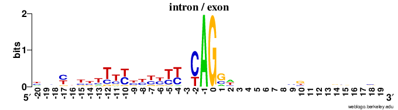

### Zad. 1 - Przyrównanie rodziny białkowej

#### ClustalOmega

```
CLUSTAL O(1.2.4) multiple sequence alignment


XPROT_Z.mays            MAKHLYKTPIPSTRKGTVD----RQVKSNPRNKLIHGRHRCGKGRNARGIITARHRGGGH  56
XPROT_M.polymorpha      MAIRLYRAYTPGTRNRSVPK-FDEIVKCQPQKKLTYN-KHIKKGRNNRGIITSQHRGGGH  58
XPROT_E.virginiana      MAIHLYKTSTPSTRNGTVY----SQVKSNPRKNLIYGQHHCGKGRNVRGIITTRHRGGGH  56
XPROT_G.max             -----------------------------------MGRVIRAHVEGAGSVFKSHTHHRKG  25
XPROT_A.thaliana        -----------------------------------MGRVIRAQRKGAGSVFKSHTHHRKG  25
XPROT_H.lucidula        MAIRFYRDYTPGARDRLVVSSSEGTVRFKPQKKLISG-FTCRKGRNNRGIITSRHRGGGH  59
                                                            .     : ..  .::.:: :    

XPROT_Z.mays            KRLYRKIDFRRNQKDISGRIITIEYDPNRNAYICLIHYGDG-----EKRYILHPRGAIIG  111
XPROT_M.polymorpha      KRLYRKIDFQRNKKYITGKIKTIEYDPNRNTYICLINYEDG-----EKRYILYPRGIKLD  113
XPROT_E.virginiana      KRLYRKISFIRNEKYIYGRIITIEYDPNRNAYICLIHYGDG-----DKRYILHPRGAIIG  111
XPROT_G.max             PARFRSLDFGERNGYLKGVVTDVIHDPGRGAPLAKVAFRHPFRYKKQNELFIAAEGLYTG  85
XPROT_A.thaliana        PAKFRSLDFGERNGYLKGVVTEIIHDPGRGAPLARVAFRHPFRFKKQKELFVAAEGMYTG  85
XPROT_H.lucidula        KRLYRQIDFRRSKRGISGRIVTVEYDPNRNAYICLVHYEDG-----EKKYILHPGGIKIG  114
                           :*.:.* . :  : * :  : :**.*.: :. : : .      ::. ::   *   .

XPROT_Z.mays            DTIVSGTKVPISMGNALPLTDMPLGTAIHNIEITRGRGGQLARAAGAVAKLIAKEG--KL  169
XPROT_M.polymorpha      DTIISSEEAPILIGNTLPLTNMPLGTAIHNIEITPGKGGQLVRAAGTVAKIIAKEG--QL  171
XPROT_E.virginiana      DTLVSGTEVPIIIGNALPLTDMPLGTAIHNIEITLGKGGQLVRAAGAVAKLIAKEG--KL  169
XPROT_G.max             QFIYCGKKATLVVGNVLPLRSIPEGAVICNVEHHVGDRGVFARASGDYAIVISHNPDNDT  145
XPROT_A.thaliana        QFLYCGKKATLVVGNVLPLRSIPEGAVICNVEHHVGDRGVFARASGDYAIVIAHNPDNDT  145
XPROT_H.lucidula        DTIISGPMATILIGNALPLTNMPLGTTIHNVEITPGRGGQLARAAGTAAKLIAKEG--RL  172
                        : : ..  . : :**.*** .:* *:.* *:*   *  * :.**:*  * :*:::     

XPROT_Z.mays            ATLRLPSGEVRLVSQNCLATVGQVGNVGVNQKSLGRAGSKCW-----LGKRPVVRGVVMN  224
XPROT_M.polymorpha      VTLRLPSGEIRLISQKCLATIGQIGNVDVNNLRIGKAGSKRW-----LGKRPKVRGVVMN  226
XPROT_E.virginiana      ATLKLPSGEVRLISKNCSATVGQVGNVGVNKKSLGRAGSKRW-----LGKRPVVRGVVMN  224
XPROT_G.max             SRIKLPSGSKKIVPSDCRAMIGQVAGGGRTEKPLLKAGNAYHKFRVKRNCWPKVRGVAMN  205
XPROT_A.thaliana        SRIKLPSGSKKIVPSGCRAMIGQVAGGGRTEKPMLKAGNAYHKYRVKRNCWPKVRGVAMN  205
XPROT_H.lucidula        ATSRLPSGEVRLISQNCLATVGQVGNVDDNNRTLGKAGSKRW-----LGKRPKVRGVVMN  227
                           :****. ::: . * * :**:.. . .:  : :**.         .  * ****.**

XPROT_Z.mays            PVDHPHGGGEGKAPIGRKKPTTPWGYPALGRRTRKRKKYSDSFILRRRK-----------  273
XPROT_M.polymorpha      PIDHPHGGGEGRAPIGRKKPLTPWGHPALGKRSRKNNKYSDTLILRRRKNS---------  277
XPROT_E.virginiana      PIDHPHGGGEGRAPIGRKKPTTPWGYPALGRRSRKINKYSDNFIVRRRSK----------  274
XPROT_G.max             PVEHPHGGGNHQH-IGHASTVSRDAPPG--Q--------KVGLIAARRTGRLRGQAAATA  254
XPROT_A.thaliana        PVEHPHGGGNHQH-IGHASTVRRDAPPG--K--------KVGLIAARRTGRLRGQAAALA  254
XPROT_H.lucidula        PVDHPHGGGEGRAPIGRKKPLTPWGHTALGGRSRKNHKYSDTLILRRRRNS---------  278
                        *::******: :  **: .     .  .           .  :*  **            

XPROT_Z.mays            ------  273
XPROT_M.polymorpha      ------  277
XPROT_E.virginiana      ------  274
XPROT_G.max             AKADKA  260
XPROT_A.thaliana        SKAD--  258
XPROT_H.lucidula        ------  278
```

#### MAFFT

```
CLUSTAL format alignment by MAFFT FFT-NS-i (v7.397)


XPROT_Z.mays    MAKHLYKTPIPSTRKGTVDR----QVKSNPRNKLIHGRHRCGKGRNARGIITARHRGGGH
XPROT_M.polymor MAIRLYRAYTPGTRNRSVPKFDE-IVKCQPQKKLTYNKH-IKKGRNNRGIITSQHRGGGH
XPROT_E.virgini MAIHLYKTSTPSTRNGTVYS----QVKSNPRKNLIYGQHHCGKGRNVRGIITTRHRGGGH
XPROT_G.max     MG-RVIRAHVEGA--GSVFK-----------------SH-------------THHRKGPA
XPROT_A.thalian MG-RVIRAQRKGA--GSVFK-----------------SH-------------THHRKGPA
XPROT_H.lucidul MAIRFYRDYTPGARDRLVVSSSEGTVRFKPQKKLISGFT-CRKGRNNRGIITSRHRGGGH
                *. :. :    .:    *                                  ::** *  

XPROT_Z.mays    KRLYRKIDFRRNQKDISGRIITIEYDPNRNAYICLIHYG-----DGEKRYILHPRGAIIG
XPROT_M.polymor KRLYRKIDFQRNKKYITGKIKTIEYDPNRNTYICLINYE-----DGEKRYILYPRGIKLD
XPROT_E.virgini KRLYRKISFIRNEKYIYGRIITIEYDPNRNAYICLIHYG-----DGDKRYILHPRGAIIG
XPROT_G.max     R--FRSLDFGERNGYLKGVVTDVIHDPGRGAPLAKVAFRHPFRYKKQNELFIAAEGLYTG
XPROT_A.thalian K--FRSLDFGERNGYLKGVVTEIIHDPGRGAPLARVAFRHPFRFKKQKELFVAAEGMYTG
XPROT_H.lucidul KRLYRQIDFRRSKRGISGRIVTVEYDPNRNAYICLVHYE-----DGEKKYILHPGGIKIG
                :  :*.:.* . :  : * :  : :**.*.: :. : :      . ::. :: . *   .

XPROT_Z.mays    DTIVSGTKVPISMGNALPLTDMPLGTAIHNIEITRGRGGQLARAAGAVAKLIAK--EGKL
XPROT_M.polymor DTIISSEEAPILIGNTLPLTNMPLGTAIHNIEITPGKGGQLVRAAGTVAKIIAK--EGQL
XPROT_E.virgini DTLVSGTEVPIIIGNALPLTDMPLGTAIHNIEITLGKGGQLVRAAGAVAKLIAK--EGKL
XPROT_G.max     QFIYCGKKATLVVGNVLPLRSIPEGAVICNVEHHVGDRGVFARASGDYAIVISHNPDNDT
XPROT_A.thalian QFLYCGKKATLVVGNVLPLRSIPEGAVICNVEHHVGDRGVFARASGDYAIVIAHNPDNDT
XPROT_H.lucidul DTIISGPMATILIGNALPLTNMPLGTTIHNVEITPGRGGQLARAAGTAAKLIAK--EGRL
                : : ..  ..: :**.*** .:* *:.* *:*   *  * :.**:*  * :*::  :.  

XPROT_Z.mays    ATLRLPSGEVRLVSQNCLATVGQVGNVGVNQKSLGRAGS--KCWLGKR---PVVRGVVMN
XPROT_M.polymor VTLRLPSGEIRLISQKCLATIGQIGNVDVNNLRIGKAGS--KRWLGKR---PKVRGVVMN
XPROT_E.virgini ATLKLPSGEVRLISKNCSATVGQVGNVGVNKKSLGRAGS--KRWLGKR---PVVRGVVMN
XPROT_G.max     SRIKLPSGSKKIVPSDCRAMIGQVAGGGRTEKPLLKAGNAYHKFRVKRNCWPKVRGVAMN
XPROT_A.thalian SRIKLPSGSKKIVPSGCRAMIGQVAGGGRTEKPMLKAGNAYHKYRVKRNCWPKVRGVAMN
XPROT_H.lucidul ATSRLPSGEVRLISQNCLATVGQVGNVDDNNRTLGKAGS--KRWLGKR---PKVRGVVMN
                   :****. :::.. * * :**:.. . .:  : :**.  : :  **   * ****.**

XPROT_Z.mays    PVDHPHGGGEGK-----------APIGRKKPTTPWGYPALGRRTRKRKKYSDSFILRRRK
XPROT_M.polymor PIDHPHGGGEGR-----------APIGRKKPLTPWGHPALGKRSRKNNKYSDTLILRRRK
XPROT_E.virgini PIDHPHGGGEGR-----------APIGRKKPTTPWGYPALGRRSRKINKYSDNFIVRRRS
XPROT_G.max     PVEHPHGGGNHQHIGHASTVSRDAPPGQKVGLIA------ARRTGRLRGQAAATAAKADK
XPROT_A.thalian PVEHPHGGGNHQHIGHASTVRRDAPPGKKVGLIA------ARRTGRLRGQAAALASKAD-
XPROT_H.lucidul PVDHPHGGGEGR-----------APIGRKKPLTPWGHTALGGRSRKNHKYSDTLILRRRR
                *::******: :           ** *:*    .      . *: : .  :     :   

XPROT_Z.mays    --
XPROT_M.polymor NS
XPROT_E.virgini K-
XPROT_G.max     A-
XPROT_A.thalian --
XPROT_H.lucidul NS
```

1. Nie, oba programy generują inne przyrównania, szczególnie we fragmencie N-końca białka. *MAFFT* wprowadził mniejszą liczbę przerw w przyrównaniu (`192`) niż *ClustalOmega* (`216`), jednocześnie identyfikując większą liczbę pozycji, na których aminokwas zachowany jest we wszystkich sekwencjach (liczba zachowanych pozycji w MAFFT: `60` i ClustalOmega: `53`).
2. Najdłuższy fragment sekwencji o 100% identyczności to `HPHGGG`.
<br/><br/>

### Zad. 2 - Przyrównanie sekwencji CDS w oparciu o sekwencje białkowe
Przyrównanie sekwencji białkowych insuliny otrzymane w programie RevTrans:

```
CLUSTAL -  multiple sequence alignment - created by revtrans

Sheep          ---MALWTRLVP--LLALLALWAPAPAHAFVN-------------QHLCGSHLVEALYLV
OwlMonkey      ---MALWMHLLP--LLALLALWGPEPAPAFVN-------------QHLCGPHLVEALYLV
Chimp          ---MALWMRLLP--LLVLLALWGPDPASAFVN-------------QHLCGSHLVEALYLV
Dog            ---MALWMRLLP--LLALLALWAPAPTRAFVN-------------QHLCGSHLVEALYLV
Pig            ---MALWTRLLP--LLALLALWAPAPAQAFVN-------------QHLCGSHLVEALYLV
GuineaPig      ---MALWMHLLT--VLALLALWGPNTNQAFVS-------------RHLCGSNLVETLYSV
GreenMonkey    ---MALWMRLLP--LLALLALWGPDPVPAFVN-------------QHLCGSHLVEALYLV
Human          ---MALWMRLLP--LLALLALWGPDPAAAFVN-------------QHLCGSHLVEALYLV
SeaHare        MSKFLLQSHSANACLLTLLLTLASNLDISLANFEHSCNGYMRPHPRGLCGEDLHVIISNL
Chicken        ---MALWIRSLP--LLALLVFSGPGTSYAAAN-------------QHLCGSHLVEALYLV
Mouse          ---MALLVHFLP--LLALLALWEPKPTQAFVK-------------QHLCGPHLVEALYLV


Sheep          C----GERGFFYTPKARREVEGPQVGALELAGGP--G---AGGLEGPPQKR----GIVEQ
OwlMonkey      C----GERGFFYAPKTRREAEDLQVGQVELGGGSITGSLPP--LEGPMQKR----GVVDQ
Chimp          C----GERGFFYTPKTRREAEDLQVGQVELGGGPGAGSLQPLALEGSLQKR----GIVEQ
Dog            C----GERGFFYTPKARREVEDLQVRDVELAGAPGEGGLQPLALEGALQKR----GIVEQ
Pig            C----GERGFFYTPKARREAENPQAGAVELGGGL--GGLQALALEGPPQKR----GIVEQ
GuineaPig      C----QDDGFFYIPKDRRELEDPQVEQTELGMGLGAGGLQPLALEMALQKR----GIVDQ
GreenMonkey    C----GERGFFYTPKTRREAEDPQVGQVELGGGPGAGSLQPLALEGSLQKR----GIVEQ
Human          C----GERGFFYTPKTRREAEDLQVGQVELGGGPGAGSLQPLALEGSLQKR----GIVEQ
SeaHare        CSSLGGNRRFLAKYMVKRDTEN--VNDKLRG-----ILLNKKEAFSYLTKREASGSITCE
Chicken        C----GERGFFYSPKARRDVEQPLVSSPLRGEA---GVLPFQQEEYEKVKR----GIVEQ
Mouse          C----GERGFFYTPKSRREVEDPQVEQLELGGSP--GDLQTLALEVARQKR----GIVDQ


Sheep          CCAGVCSLYQLENYCN---------------------------
OwlMonkey      CCTSICSLYQLQNYCN---------------------------
Chimp          CCTSICSLYQLENYCN---------------------------
Dog            CCTSICSLYQLENYCN---------------------------
Pig            CCTSICSLYQLENYCN---------------------------
GuineaPig      CCTGTCTRHQLQSYCN---------------------------
GreenMonkey    CCTSICSLYQLENYCN---------------------------
Human          CCTSICSLYQLENYCN---------------------------
SeaHare        CCFNQCRIFELAQYCRLPDHFFSRISRTGRSNSGHAQLEDNFS
Chicken        CCHNTCSLYQLENYCN---------------------------
Mouse          CCTSICSLYQLENYCN---------------------------
```

Odpowiadające przyrównanie sekwencji CDS:


```
CLUSTAL -  multiple sequence alignment - created by revtrans

Sheep          ---------ATGGCCCTGTGGACACGCCTGGTGCCC------CTGCTGGCCCTGCTGGCA
OwlMonkey      ---------ATGGCCCTGTGGATGCACCTCCTGCCC------CTGCTGGCGCTGCTGGCC
Chimp          ---------ATGGCCCTGTGGATGCGCCTCCTGCCC------CTGCTGGTGCTGCTGGCC
Dog            ---------ATGGCCCTCTGGATGCGCCTCCTGCCC------CTGCTGGCCCTGCTGGCC
Pig            ---------ATGGCCCTGTGGACGCGCCTCCTGCCC------CTGCTGGCCCTGCTGGCC
GuineaPig      ---------ATGGCTCTGTGGATGCATCTCCTCACC------GTGCTGGCCCTGCTGGCC
GreenMonkey    ---------ATGGCCCTGTGGATGCGCCTCCTGCCC------CTGCTGGCGCTGCTGGCC
Human          ---------ATGGCCCTGTGGATGCGCCTCCTGCCC------CTGCTGGCGCTGCTGGCC
SeaHare        ATGAGCAAGTTCCTCCTCCAGAGCCACTCCGCCAACGCCTGCCTGCTCACCCTTCTGCTC
Chicken        ---------ATGGCTCTCTGGATCCGATCACTGCCT------CTTCTGGCTCTCCTTGTC
Mouse          ---------ATGGCCCTGTTGGTGCACTTCCTACCC------CTGCTGGCCCTGCTTGCC


Sheep          CTCTGGGCCCCCGCCCCGGCCCACGCCTTCGTCAAC------------------------
OwlMonkey      CTCTGGGGACCCGAGCCAGCCCCGGCCTTTGTGAAC------------------------
Chimp          CTCTGGGGACCTGACCCAGCCTCGGCCTTTGTGAAC------------------------
Dog            CTCTGGGCGCCCGCGCCCACCCGAGCCTTCGTTAAC------------------------
Pig            CTCTGGGCGCCCGCCCCGGCCCAGGCCTTCGTGAAC------------------------
GuineaPig      CTCTGGGGGCCCAACACTAATCAGGCCTTTGTCAGC------------------------
GreenMonkey    CTCTGGGGACCTGACCCGGTCCCGGCCTTTGTGAAC------------------------
Human          CTCTGGGGACCTGACCCAGCCGCAGCCTTTGTGAAC------------------------
SeaHare        ACGCTGGCCTCCAACCTCGACATATCCCTGGCCAACTTCGAGCACTCGTGCAACGGCTAC
Chicken        TTTTCTGGCCCTGGAACCAGCTATGCAGCTGCCAAC------------------------
Mouse          CTCTGGGAGCCCAAACCCACCCAGGCTTTTGTCAAA------------------------


Sheep          ---------------CAGCACCTGTGCGGCTCCCACCTGGTGGAGGCGCTGTACCTGGTG
OwlMonkey      ---------------CAGCACCTGTGCGGCCCCCACCTGGTGGAAGCCCTCTACCTGGTG
Chimp          ---------------CAACACCTGTGCGGCTCCCACCTGGTGGAAGCTCTCTACCTAGTG
Dog            ---------------CAGCACCTGTGTGGCTCCCACCTGGTAGAGGCTCTGTACCTGGTG
Pig            ---------------CAGCACCTGTGCGGCTCCCACCTGGTGGAGGCGCTGTACCTGGTG
GuineaPig      ---------------CGGCATCTGTGCGGCTCCAACTTAGTGGAGACATTGTATTCAGTG
GreenMonkey    ---------------CAGCACCTGTGCGGCTCCCACCTGGTGGAAGCCCTCTACCTGGTG
Human          ---------------CAACACCTGTGCGGCTCACACCTGGTGGAAGCTCTCTACCTAGTG
SeaHare        ATGCGGCCCCACCCGCGGGGTCTGTGCGGCGAAGACCTGCACGTCATCATTTCCAACCTG
Chicken        ---------------CAGCACCTCTGTGGCTCCCACTTGGTGGAGGCTCTCTACCTGGTG
Mouse          ---------------CAGCATCTTTGTGGTCCCCACCTGGTAGAGGCTCTCTACCTGGTG


Sheep          TGC------------GGAGAGCGCGGCTTCTTCTACACGCCCAAGGCCCGCCGGGAGGTG
OwlMonkey      TGC------------GGGGAGCGAGGTTTCTTCTACGCACCCAAGACCCGCCGGGAGGCG
Chimp          TGC------------GGGGAACGAGGCTTCTTCTACACACCCAAGACCCGCCGGGAGGCA
Dog            TGC------------GGGGAGCGCGGCTTCTTCTACACGCCTAAGGCCCGCAGGGAGGTG
Pig            TGC------------GGGGAGCGCGGCTTCTTCTACACGCCCAAGGCCCGTCGGGAGGCG
GuineaPig      TGT------------CAGGATGATGGCTTCTTCTATATACCCAAGGACCGTCGGGAGCTA
GreenMonkey    TGC------------GGGGAGCGAGGCTTCTTCTACACGCCCAAGACCCGCCGGGAGGCA
Human          TGC------------GGGGAACGAGGCTTCTTCTACACACCCAAGACCCGCCGGGAGGCA
SeaHare        TGCAGCTCTCTGGGGGGCAACAGGAGGTTCCTGGCCAAGTACATGGTCAAAAGAGACACG
Chicken        TGT------------GGAGAGCGTGGCTTCTTCTACTCCCCCAAAGCCCGACGGGATGTC
Mouse          TGT------------GGGGAGCGTGGCTTCTTCTACACACCCAAGTCCCGCCGTGAAGTG


Sheep          GAGGGCCCCCAGGTGGGGGCGCTGGAGCTGGCCGGAGGCCCC------GGC---------
OwlMonkey      GAGGACCTGCAGGTGGGGCAGGTGGAGCTGGGTGGGGGCTCTATCACGGGCAGCCTGCCA
Chimp          GAGGACCTGCAGGTGGGGCAGGTGGAGCTGGGCGGGGGCCCTGGTGCAGGCAGCCTGCAG
Dog            GAGGACCTGCAGGTGAGGGACGTGGAGCTGGCCGGGGCGCCTGGCGAGGGCGGCCTGCAG
Pig            GAGAACCCTCAGGCAGGTGCCGTGGAGCTGGGCGGAGGCCTG------GGCGGCCTGCAG
GuineaPig      GAGGACCCACAGGTGGAGCAGACAGAACTGGGCATGGGCCTGGGGGCAGGTGGACTACAG
GreenMonkey    GAGGACCCGCAGGTGGGGCAGGTAGAGCTGGGCGGGGGCCCTGGCGCAGGCAGCCTGCAG
Human          GAGGACCTGCAGGTGGGGCAGGTGGAGCTGGGCGGGGGCCCTGGTGCAGGCAGCCTGCAG
SeaHare        GAAAAT------GTGAACGACAAGTTACGAGGG---------------ATCCTGCTCAAT
Chicken        GAGCAGCCCCTAGTGAGCAGTCCCTTGCGTGGCGAGGCA---------GGAGTGCTGCCT
Mouse          GAGGACCCACAAGTGGAACAACTGGAGCTGGGAGGAAGCCCC------GGGGACCTTCAG


Sheep          GCGGGTGGCCTGGAGGGGCCCCCGCAGAAGCGT------------GGCATCGTGGAGCAG
OwlMonkey      CCC------TTGGAGGGTCCCATGCAGAAGCGT------------GGCGTCGTGGATCAG
Chimp          CCCTTGGCCCTGGAGGGGTCCCTGCAGAAGCGT------------GGTATCGTGGAACAA
Dog            CCCCTGGCCCTGGAGGGGGCCCTGCAGAAGCGA------------GGCATCGTGGAGCAG
Pig            GCCCTGGCGCTGGAGGGGCCCCCGCAGAAGCGT------------GGCATCGTGGAGCAG
GuineaPig      CCCTTGGCACTGGAGATGGCACTACAGAAGCGT------------GGCATTGTGGATCAG
GreenMonkey    CCCTTGGCGCTGGAGGGGTCCCTGCAGAAGCGC------------GGCATCGTGGAGCAG
Human          CCCTTGGCCCTGGAGGGGTCCCTGCAGAAGCGT------------GGCATTGTGGAACAA
SeaHare        AAGAAAGAAGCTTTCTCCTACTTGACCAAGAGAGAGGCCTCAGGCTCCATCACATGCGAA
Chicken        TTCCAGCAGGAGGAATACGAGAAAGTCAAGCGA------------GGGATTGTTGAGCAA
Mouse          ACCTTGGCGTTGGAGGTGGCCCGGCAGAAGCGT------------GGCATTGTGGATCAG


Sheep          TGCTGCGCCGGCGTCTGCTCTCTCTACCAGCTGGAGAACTACTGTAAC------------
OwlMonkey      TGCTGCACCAGCATCTGCTCCCTCTACCAGCTGCAGAACTACTGCAAC------------
Chimp          TGCTGTACCAGCATCTGCTCCCTCTACCAGCTGGAGAACTACTGCAAC------------
Dog            TGCTGCACCAGCATCTGCTCCCTCTACCAGCTGGAGAATTACTGCAAC------------
Pig            TGCTGCACCAGCATCTGTTCCCTCTACCAGCTGGAGAACTACTGCAAC------------
GuineaPig      TGCTGTACTGGCACCTGCACACGCCACCAGCTGCAGAGCTACTGCAAC------------
GreenMonkey    TGCTGTACCAGCATCTGCTCCCTCTACCAGCTGGAGAACTACTGCAAC------------
Human          TGCTGTACCAGCATCTGCTCCCTCTACCAGCTGGAGAACTACTGCAAC------------
SeaHare        TGTTGCTTCAACCAGTGTCGGATATTTGAGCTGGCTCAGTACTGCCGTCTGCCAGACCAT
Chicken        TGCTGCCATAACACGTGTTCCCTCTACCAACTGGAGAACTACTGCAAC------------
Mouse          TGCTGCACCAGCATCTGCTCCCTCTACCAGCTGGAGAACTACTGCAAC------------


Sheep          ------------------------------------------------------------
OwlMonkey      ------------------------------------------------------------
Chimp          ------------------------------------------------------------
Dog            ------------------------------------------------------------
Pig            ------------------------------------------------------------
GuineaPig      ------------------------------------------------------------
GreenMonkey    ------------------------------------------------------------
Human          ------------------------------------------------------------
SeaHare        TTCTTCTCCAGAATATCCAGAACCGGAAGGAGCAACAGTGGACATGCGCAGTTGGAGGAC
Chicken        ------------------------------------------------------------
Mouse          ------------------------------------------------------------


Sheep          ---------
OwlMonkey      ---------
Chimp          ---------
Dog            ---------
Pig            ---------
GuineaPig      ---------
GreenMonkey    ---------
Human          ---------
SeaHare        AACTTTAGT
Chicken        ---------
Mouse          ---------
```

1. Tak, liczba przerw jest podzielna przez 3.
2. Tak, pozycje w kodonach odpowiadają sobie, ponieważ przyrównanie sekwencji CDS zostało zbudowane na podstawie przyrównania sekwencji białek.
<br/><br/>


### Zad. 3 - Miejsca akceptorowe egzonu
Logo wykonane w programie [WebLogo](http://weblogo.berkeley.edu/logo.cgi).

