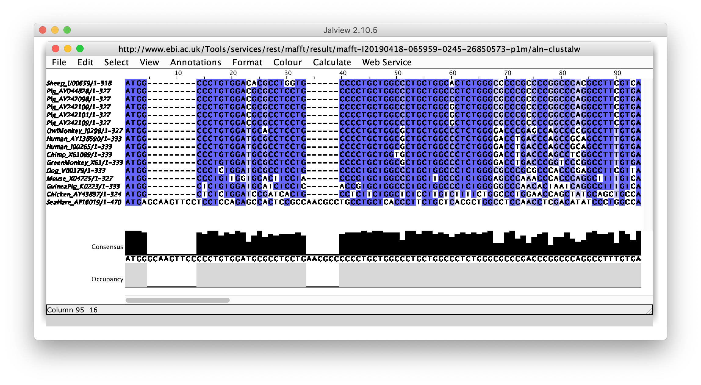
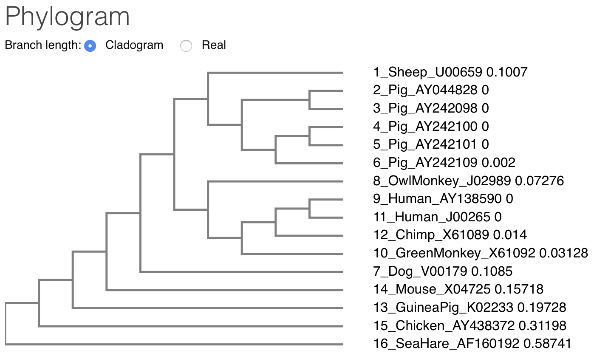
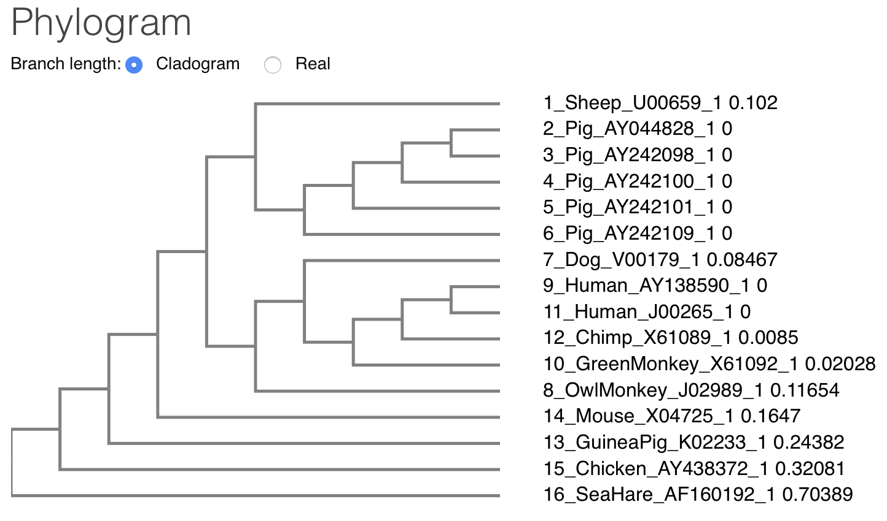

### Zad. 1
Zadanie na podstawie [DTU Course](http://teaching.healthtech.dtu.dk/36611/index.php/Bioinformatics_in_practice,_Faroe_Islands_2018#Morning:_Multiple_alignments).

W zadaniu przeprowadzone zostanie przyrównanie sekwencji CDS insuliny [[insulin.cds.fasta](./data/insulin.cds.fasta)] oraz odpowiadających im sekwencji białkowych. Celem zadania jest zidentyfikowanie różnic między przyrównaniem sekwencji na poziomie nukleotydów i aminokwasów.

#### Przyrównanie sekwencji DNA

```
CLUSTAL format alignment by MAFFT FFT-NS-i (v7.397)


Sheep_U00659    ATGG---------CCCTGTGGACACGCCTGGTG------CCCCTGCTGGCCCTGCTGGCA
Pig_AY044828    ATGG---------CCCTGTGGACGCGCCTCCTG------CCCCTGCTGGCCCTGCTGGCC
Pig_AY242098    ATGG---------CCCTGTGGACGCGCCTCCTG------CCCCTGCTGGCCCTGCTGGCC
Pig_AY242100    ATGG---------CCCTGTGGACGCGCCTCCTG------CCCCTGCTGGCCCTGCTGGCG
Pig_AY242101    ATGG---------CCCTGTGGACGCGCCTCCTG------CCCCTGCTGGCCCTGCTGGCG
Pig_AY242109    ATGG---------CCCTGTGGACGCGCCTCCTG------CCCCTGCTGGCCCTGCTGGCG
OwlMonkey_J0298 ATGG---------CCCTGTGGATGCACCTCCTG------CCCCTGCTGGCGCTGCTGGCC
Human_AY138590  ATGG---------CCCTGTGGATGCGCCTCCTG------CCCCTGCTGGCGCTGCTGGCC
Human_J00265    ATGG---------CCCTGTGGATGCGCCTCCTG------CCCCTGCTGGCGCTGCTGGCC
Chimp_X61089    ATGG---------CCCTGTGGATGCGCCTCCTG------CCCCTGCTGGTGCTGCTGGCC
GreenMonkey_X61 ATGG---------CCCTGTGGATGCGCCTCCTG------CCCCTGCTGGCGCTGCTGGCC
Dog_V00179      ATGG---------CCCTCTGGATGCGCCTCCTG------CCCCTGCTGGCCCTGCTGGCC
Mouse_X04725    ATGG---------CCCTGTTGGTGCACTTCCTA------CCCCTGCTGGCCCTGCTTGCC
GuineaPig_K0223 ATGG---------CTCTGTGGATGCATCTCCTC------ACCGTGCTGGCCCTGCTGGCC
Chicken_AY43837 ATGG---------CTCTCTGGATCCGATCACTG------CCTCTTCTGGCTCTCCTTGTC
SeaHare_AF16019 ATGAGCAAGTTCCTCCTCCAGAGCCACTCCGCCAACGCCTGCCTGCTCACCCTTCTGCTC
                ***.         ..** . *.  *. ..  .         . * ** .. ** **  . 

Sheep_U00659    CTCTGGGCCCCCGCCCCGGCCCACGCCTTCGTCAACC---AGCACCTGTGCGGCTCCCAC
Pig_AY044828    CTCTGGGCGCCCGCCCCGGCCCAGGCCTTCGTGAACC---AGCACCTGTGCGGCTCCCAC
Pig_AY242098    CTCTGGGCGCCCGCCCCGGCCCAGGCCTTCGTGAACC---AGCACCTGTGCGGCTCCCAC
Pig_AY242100    CTCTGGGCGCCCGCCCCGGCCCAGGCCTTCGTGAACC---AGCACCTGTGCGGCTCCCAC
Pig_AY242101    CTCTGGGCGCCCGCCCCGGCCCAGGCCTTCGTGAACC---AGCACCTGTGCGGCTCCCAC
Pig_AY242109    CTCTGGGCGCCCGCCCCGGCCCAGGCCTTCGTGAACC---AGCACCTGTGCGGCTCCCAC
OwlMonkey_J0298 CTCTGGGGACCCGAGCCAGCCCCGGCCTTTGTGAACC---AGCACCTGTGCGGCCCCCAC
Human_AY138590  CTCTGGGGACCTGACCCAGCCGCAGCCTTTGTGAACC---AACACCTGTGCGGCTCACAC
Human_J00265    CTCTGGGGACCTGACCCAGCCGCAGCCTTTGTGAACC---AACACCTGTGCGGCTCACAC
Chimp_X61089    CTCTGGGGACCTGACCCAGCCTCGGCCTTTGTGAACC---AACACCTGTGCGGCTCCCAC
GreenMonkey_X61 CTCTGGGGACCTGACCCGGTCCCGGCCTTTGTGAACC---AGCACCTGTGCGGCTCCCAC
Dog_V00179      CTCTGGGCGCCCGCGCCCACCCGAGCCTTCGTTAACC---AGCACCTGTGTGGCTCCCAC
Mouse_X04725    CTCTGGGAGCCCAAACCCACCCAGGCTTTTGTCAAAC---AGCATCTTTGTGGTCCCCAC
GuineaPig_K0223 CTCTGGGGGCCCAACACTAATCAGGCCTTTGTCAGCC---GGCATCTGTGCGGCTCCAAC
Chicken_AY43837 TTTTCTGGCCCTGGAACCAGCTATGCAGCTGCCAACC---AGCACCTCTGTGGCTCCCAC
SeaHare_AF16019 ACGCTGGCCTCCAACCTCGACATATCCCTGGCCAACTTCGAGCACTCGTGCAACGGCTAC
                 . .  *  .*..   . . .    *  . *. *. .   ..**... **....    **

Sheep_U00659    CTG-----------GTGGAGGCGCTGTACCTGGTGTGCGGAGAGCGCGGCTTCT------
Pig_AY044828    CTG-----------GTGGAGGCGCTGTACCTGGTGTGCGGGGAGCGCGGCTTCT------
Pig_AY242098    CTG-----------GTGGAGGCGCTGTACCTGGTGTGCGGGGAGCGCGGCTTCT------
Pig_AY242100    CTG-----------GTGGAGGCGCTGTACCTGGTGTGCGGGGAGCGCGGCTTCT------
Pig_AY242101    CTG-----------GTGGAGGCGCTGTACCTGGTGTGCGGGGAGCGCGGCTTCT------
Pig_AY242109    CTG-----------GTGGAGGCGCTGTACCTGGTGTGCGGGGAGCGCGGCTTCT------
OwlMonkey_J0298 CTG-----------GTGGAAGCCCTCTACCTGGTGTGCGGGGAGCGAGGTTTCT------
Human_AY138590  CTG-----------GTGGAAGCTCTCTACCTAGTGTGCGGGGAACGAGGCTTCT------
Human_J00265    CTG-----------GTGGAAGCTCTCTACCTAGTGTGCGGGGAACGAGGCTTCT------
Chimp_X61089    CTG-----------GTGGAAGCTCTCTACCTAGTGTGCGGGGAACGAGGCTTCT------
GreenMonkey_X61 CTG-----------GTGGAAGCCCTCTACCTGGTGTGCGGGGAGCGAGGCTTCT------
Dog_V00179      CTG-----------GTAGAGGCTCTGTACCTGGTGTGCGGGGAGCGCGGCTTCT------
Mouse_X04725    CTG-----------GTAGAGGCTCTCTACCTGGTGTGTGGGGAGCGTGGCTTCT------
GuineaPig_K0223 TTA-----------GTGGAGACATTGTATTCAGTGTGTCAGGATGATGGCTTCT------
Chicken_AY43837 TTG-----------GTGGAGGCTCTCTACCTGGTGTGTGGAGAGCGTGGCTTCT------
SeaHare_AF16019 ATGCGGCCCCACCCGCGGGGTCTGTGCGGCGAAGACCTGCACGTCATCATTTCCAACCTG
                 *.           *..*.. *  * .. . .. .. .  . .  .  ..***.      

Sheep_U00659    TCTACACGCCCAAGGCCCGCCGGGAGGT--------------------GGAGGGCCCCCA
Pig_AY044828    TCTACACGCCCAAGGCCCGTCGGGAGGC--------------------GGAGAACCCTCA
Pig_AY242098    TCTACACGCCCAAGGCCCGTCGGGAGGC--------------------GGAGAACCCTCA
Pig_AY242100    TCTACACGCCCAAGGCCCGTCGGGAGGC--------------------GGAGAACCCTCA
Pig_AY242101    TCTACACGCCCAAGGCCCGTCGGGAGGC--------------------GGAGAACCCTCA
Pig_AY242109    TCTACACGCCCAAGGCCCGTCGGGAGGC--------------------GGAGAACCCTCA
OwlMonkey_J0298 TCTACGCACCCAAGACCCGCCGGGAGGC--------------------GGAGGACCTGCA
Human_AY138590  TCTACACACCCAAGACCCGCCGGGAGGC--------------------AGAGGACCTGCA
Human_J00265    TCTACACACCCAAGACCCGCCGGGAGGC--------------------AGAGGACCTGCA
Chimp_X61089    TCTACACACCCAAGACCCGCCGGGAGGC--------------------AGAGGACCTGCA
GreenMonkey_X61 TCTACACGCCCAAGACCCGCCGGGAGGC--------------------AGAGGACCCGCA
Dog_V00179      TCTACACGCCTAAGGCCCGCAGGGAGGT--------------------GGAGGACCTGCA
Mouse_X04725    TCTACACACCCAAGTCCCGCCGTGAAGT--------------------GGAGGACCCACA
GuineaPig_K0223 TCTATATACCCAAGGACCGTCGGGAGCT--------------------AGAGGACCCACA
Chicken_AY43837 TCTACTCCCCCAAAGCCCGACGGGATGT--------------------CGAGCAGCCCCT
SeaHare_AF16019 TGCAGCTCTCTGGGGGGCAACAGGAGGTTCCTGGCCAAGTACATGGTCAAAAGAGACACG
                * .*  . .*....   *.  . **  .                     .*. .  . * 

Sheep_U00659    GGTGGGGGCGCTGGAGCTGGCCGGAGGCCCCGGC-------GCGGGTGGCC---------
Pig_AY044828    GGCAGGTGCCGTGGAGCTGGGCGGAGGCCT-------------GGGCGGCCTGCAGGCCC
Pig_AY242098    GGCAGGTGCCGTGGAGCTGGGCGGAGGCCT-------------GGGCGGCCTGCAGGCCC
Pig_AY242100    GGCAGGTGCCGTGGAGCTGGGCGGAGGCCT-------------GGGCGGCCTGCAGGCCC
Pig_AY242101    GGCAGGTGCCGTGGAGCTGGGCGGAGGCCT-------------GGGCGGCCTGCAGGCCC
Pig_AY242109    GGCAGGTGCCGTGGAGCTGGGCGGAGGCCT-------------GGGCGGCCTGCAGGCCC
OwlMonkey_J0298 GGTGGGGCAGGTGGAGCTGGGTGGGGGCTCTATC-------ACGGGCAGCCTGCCACCCT
Human_AY138590  GGTGGGGCAGGTGGAGCTGGGCGGGGGCCCTGGT-------GCAGGCAGCCTGCAGCCCT
Human_J00265    GGTGGGGCAGGTGGAGCTGGGCGGGGGCCCTGGT-------GCAGGCAGCCTGCAGCCCT
Chimp_X61089    GGTGGGGCAGGTGGAGCTGGGCGGGGGCCCTGGT-------GCAGGCAGCCTGCAGCCCT
GreenMonkey_X61 GGTGGGGCAGGTAGAGCTGGGCGGGGGCCCTGGC-------GCAGGCAGCCTGCAGCCCT
Dog_V00179      GGTGAGGGACGTGGAGCTGGCCGGGGCGCCTGGC-------GAGGGCGGCCTGCAGCCCC
Mouse_X04725    AGTGGAACAACTGGAGCTGGGAGGAAGCCC-------------CGGGGACCTTCAGACCT
GuineaPig_K0223 GGTGGAGCAGACAGAACTGGGCATGGGCCTGGGG-------GCAGGTGGACTACAGCCCT
Chicken_AY43837 AGTGAGCAGTCCCTTGCGTGGCGAGGC-------------------AGGAGTGCTGCCTT
SeaHare_AF16019 GAAAATGTGAACGACAAGTTACGAGGGATCCTGCTCAATAAGAAAGAAGCTTTCTCCTAC
                .. ..      .   .      . ..                     ..           

Sheep_U00659    ------TGGAGGGGCCCCCGCAG----------------------------AAGCGTGGC
Pig_AY044828    TGGCGCTGGAGGGGCCCCCGCAG----------------------------AAGCGTGGC
Pig_AY242098    TGGCGCTGGAGGGGCCCCCGCAG----------------------------AAGCGTGGC
Pig_AY242100    TGGCGCTGGAGGGGCCCCCGCAG----------------------------AAGCGTGGC
Pig_AY242101    TGGCGCTGGAGGGGCCCCCGCAG----------------------------AAGCGTGGC
Pig_AY242109    TGGCGCTGGAGGGGCCCCCGCAG----------------------------AAGCGTGGC
OwlMonkey_J0298 ------TGGAGGGTCCCATGCAG----------------------------AAGCGTGGC
Human_AY138590  TGGCCCTGGAGGGGTCCCTGCAG----------------------------AAGCGTGGC
Human_J00265    TGGCCCTGGAGGGGTCCCTGCAG----------------------------AAGCGTGGC
Chimp_X61089    TGGCCCTGGAGGGGTCCCTGCAG----------------------------AAGCGTGGT
GreenMonkey_X61 TGGCGCTGGAGGGGTCCCTGCAG----------------------------AAGCGCGGC
Dog_V00179      TGGCCCTGGAGGGGGCCCTGCAG----------------------------AAGCGAGGC
Mouse_X04725    TGGCGTTGGAGGTGGCCCGGCAG----------------------------AAGCGTGGC
GuineaPig_K0223 TGGCACTGGAGATGGCACTACAG----------------------------AAGCGTGGC
Chicken_AY43837 TCCAGCAGGAGGAATACGAGAAAGT-------------------------CAAGCGAGGG
SeaHare_AF16019 TTGACCAAGAGAGAGGCCTCAGGCTCCATCACATGCGAATGTTGCTTCAACCAGTGTCGG
                       .***.         ..                             **.*  * 

Sheep_U00659    ATCGTGGAGC-AGTGCTGCGCCGGCGTCTGC--------TCTCTCTAC------------
Pig_AY044828    ATCGTGGAGC-AGTGCTGCACCAGCATCTGT--------TCCCTCTAC------------
Pig_AY242098    ATCGTGGAGC-AGTGCTGCACCAGCATCTGT--------TCCCTCTAC------------
Pig_AY242100    ATCGTGGAGC-AGTGCTGCACCAGCATCTGT--------TCCCTCTAC------------
Pig_AY242101    ATCGTGGAGC-AGTGCTGCACCAGCATCTGT--------TCCCTCTAC------------
Pig_AY242109    ATCGTAGAGC-AGTGCTGCACCAGCATCTGT--------TCCCTCTAC------------
OwlMonkey_J0298 GTCGTGGATC-AGTGCTGCACCAGCATCTGC--------TCCCTCTAC------------
Human_AY138590  ATTGTGGAAC-AATGCTGTACCAGCATCTGC--------TCCCTCTAC------------
Human_J00265    ATTGTGGAAC-AATGCTGTACCAGCATCTGC--------TCCCTCTAC------------
Chimp_X61089    ATCGTGGAAC-AATGCTGTACCAGCATCTGC--------TCCCTCTAC------------
GreenMonkey_X61 ATCGTGGAGC-AGTGCTGTACCAGCATCTGC--------TCCCTCTAC------------
Dog_V00179      ATCGTGGAGC-AGTGCTGCACCAGCATCTGC--------TCCCTCTAC------------
Mouse_X04725    ATTGTGGATC-AGTGCTGCACCAGCATCTGC--------TCCCTCTAC------------
GuineaPig_K0223 ATTGTGGATC-AGTGCTGTACTGGCACCTGC--------ACACGCCAC------------
Chicken_AY43837 ATTGTTGAGC-AATGCTGCCATAACACGTGT--------TCCCTCTAC------------
SeaHare_AF16019 ATATTTGAGCTGGCTCAGTACTGCCGTCTGCCAGACCATTTCTTCTCCAGAATATCCAGA
                .*  * ** * ... * *.  .. *.. **.         . . *. *            

Sheep_U00659    ---------------------------CAGCTGGAGAACTACTGTAACTAG
Pig_AY044828    ---------------------------CAGCTGGAGAACTACTGCAACTAG
Pig_AY242098    ---------------------------CAGCTGGAGAACTACTGCAACTAG
Pig_AY242100    ---------------------------CAGCTGGAGAACTACTGCAACTAG
Pig_AY242101    ---------------------------CAGCTGGAGAACTACTGCAACTAG
Pig_AY242109    ---------------------------CAGCTGGAGAACTACTGCAACTAG
OwlMonkey_J0298 ---------------------------CAGCTGCAGAACTACTGCAACTAG
Human_AY138590  ---------------------------CAGCTGGAGAACTACTGCAACTAG
Human_J00265    ---------------------------CAGCTGGAGAACTACTGCAACTAG
Chimp_X61089    ---------------------------CAGCTGGAGAACTACTGCAACTAG
GreenMonkey_X61 ---------------------------CAGCTGGAGAACTACTGCAACTAG
Dog_V00179      ---------------------------CAGCTGGAGAATTACTGCAACTAG
Mouse_X04725    ---------------------------CAGCTGGAGAACTACTGCAACTAA
GuineaPig_K0223 ---------------------------CAGCTGCAGAGCTACTGCAACTAG
Chicken_AY43837 ---------------------------CAACTGGAGAACTACTGCAACTAG
SeaHare_AF16019 ACCGGAAGGAGCAACAGTGGACATGCGCAGTTGGAGGACAACTTTAGTTA-
                                           **..** **... *** .*..** 
```

1. Tak, w przyrównaniu występują przerwy, które wstawione zostały w miejsca nie odpowiadające kodonom lub długość przerw nie jest podzielna przez trzy. Na przykład, w przyrównaniu jest przerwa odpowiadające jednemu nukleotydowi (przerwa występuje we wszystkich sekwencjach oprócz *Sea Hare*):

```
Sheep_U00659    ATCGTGGAGC-AGTGCTGCGCCGGCGTCTGC--------TCTCTCTAC------------
Pig_AY044828    ATCGTGGAGC-AGTGCTGCACCAGCATCTGT--------TCCCTCTAC------------
Pig_AY242098    ATCGTGGAGC-AGTGCTGCACCAGCATCTGT--------TCCCTCTAC------------
Pig_AY242100    ATCGTGGAGC-AGTGCTGCACCAGCATCTGT--------TCCCTCTAC------------
Pig_AY242101    ATCGTGGAGC-AGTGCTGCACCAGCATCTGT--------TCCCTCTAC------------
Pig_AY242109    ATCGTAGAGC-AGTGCTGCACCAGCATCTGT--------TCCCTCTAC------------
OwlMonkey_J0298 GTCGTGGATC-AGTGCTGCACCAGCATCTGC--------TCCCTCTAC------------
Human_AY138590  ATTGTGGAAC-AATGCTGTACCAGCATCTGC--------TCCCTCTAC------------
Human_J00265    ATTGTGGAAC-AATGCTGTACCAGCATCTGC--------TCCCTCTAC------------
Chimp_X61089    ATCGTGGAAC-AATGCTGTACCAGCATCTGC--------TCCCTCTAC------------
GreenMonkey_X61 ATCGTGGAGC-AGTGCTGTACCAGCATCTGC--------TCCCTCTAC------------
Dog_V00179      ATCGTGGAGC-AGTGCTGCACCAGCATCTGC--------TCCCTCTAC------------
Mouse_X04725    ATTGTGGATC-AGTGCTGCACCAGCATCTGC--------TCCCTCTAC------------
GuineaPig_K0223 ATTGTGGATC-AGTGCTGTACTGGCACCTGC--------ACACGCCAC------------
Chicken_AY43837 ATTGTTGAGC-AATGCTGCCATAACACGTGT--------TCCCTCTAC------------
SeaHare_AF16019 ATATTTGAGCTGGCTCAGTACTGCCGTCTGCCAGACCATTTCTTCTCCAGAATATCCAGA
                .*  * ** * ... * *.  .. *.. **.         . . *. *            
```

Przykładem niepoprawnego umieszczenia przerw może być pierwsza przerwa w przyrównaniu, która występuje po czterech nukleotydach, a nie trzech (poniżej). Algorytm przyrównania nie zakłada, że przyrównywane sekwencje są sekwencjami kodującymi białko, dlatego nie bierze pod uwagę kodonów.

```
Sheep_U00659    ATGG---------CCCTGTGGACACGCCTGGTG------CCCCTGCTGGCCCTGCTGGCA
Pig_AY044828    ATGG---------CCCTGTGGACGCGCCTCCTG------CCCCTGCTGGCCCTGCTGGCC
Pig_AY242098    ATGG---------CCCTGTGGACGCGCCTCCTG------CCCCTGCTGGCCCTGCTGGCC
Pig_AY242100    ATGG---------CCCTGTGGACGCGCCTCCTG------CCCCTGCTGGCCCTGCTGGCG
Pig_AY242101    ATGG---------CCCTGTGGACGCGCCTCCTG------CCCCTGCTGGCCCTGCTGGCG
Pig_AY242109    ATGG---------CCCTGTGGACGCGCCTCCTG------CCCCTGCTGGCCCTGCTGGCG
OwlMonkey_J0298 ATGG---------CCCTGTGGATGCACCTCCTG------CCCCTGCTGGCGCTGCTGGCC
Human_AY138590  ATGG---------CCCTGTGGATGCGCCTCCTG------CCCCTGCTGGCGCTGCTGGCC
Human_J00265    ATGG---------CCCTGTGGATGCGCCTCCTG------CCCCTGCTGGCGCTGCTGGCC
Chimp_X61089    ATGG---------CCCTGTGGATGCGCCTCCTG------CCCCTGCTGGTGCTGCTGGCC
GreenMonkey_X61 ATGG---------CCCTGTGGATGCGCCTCCTG------CCCCTGCTGGCGCTGCTGGCC
Dog_V00179      ATGG---------CCCTCTGGATGCGCCTCCTG------CCCCTGCTGGCCCTGCTGGCC
Mouse_X04725    ATGG---------CCCTGTTGGTGCACTTCCTA------CCCCTGCTGGCCCTGCTTGCC
GuineaPig_K0223 ATGG---------CTCTGTGGATGCATCTCCTC------ACCGTGCTGGCCCTGCTGGCC
Chicken_AY43837 ATGG---------CTCTCTGGATCCGATCACTG------CCTCTTCTGGCTCTCCTTGTC
SeaHare_AF16019 ATGAGCAAGTTCCTCCTCCAGAGCCACTCCGCCAACGCCTGCCTGCTCACCCTTCTGCTC
                ***.         ..** . *.  *. ..  .         . * ** .. ** **  .
```

2. Sekwencja insuliny *Sea Hare* (ślimak morski) wyraźnie odstaje od pozostałych sekwencji. Ma to sens, ponieważ ślimak morski nie jest kręgowcem.



3. Tak, wśród przyrównywanych sekwencji są pary identyczne. Jest to widoczne na drzewie wiodącym (`Guide Tree`) przyrównania programem MAFFT. Dwie sekwencje człowieka są identyczne.



Identyczne są również poniższe pary sekwencji:

```
Pig_AY044828 0
Pig_AY242098 0 
```

oraz 

```
>Pig_AY242100
>Pig_AY242101
```

Powtarzanie tej samej sekwencji w przyrównaniu nie wnosi nowych informacji, dlatego najczęściej w analizach zostawia się tylko jedną sekwencją.


#### Przyrównanie sekwencji białkowych

Sekwencje białkowe insuliny otrzymane w wyniku translacji sekwencji CDS za pomocą programu [EMBOSS Transeq](https://www.ebi.ac.uk/Tools/st/emboss_transeq/):

```
>Sheep_U00659_1
MALWTRLVPLLALLALWAPAPAHAFVNQHLCGSHLVEALYLVCGERGFFYTPKARREVEG
PQVGALELAGGPGAGGLEGPPQKRGIVEQCCAGVCSLYQLENYCN*
>Pig_AY044828_1
MALWTRLLPLLALLALWAPAPAQAFVNQHLCGSHLVEALYLVCGERGFFYTPKARREAEN
PQAGAVELGGGLGGLQALALEGPPQKRGIVEQCCTSICSLYQLENYCN*
>Pig_AY242098_1
MALWTRLLPLLALLALWAPAPAQAFVNQHLCGSHLVEALYLVCGERGFFYTPKARREAEN
PQAGAVELGGGLGGLQALALEGPPQKRGIVEQCCTSICSLYQLENYCN*
>Pig_AY242100_1
MALWTRLLPLLALLALWAPAPAQAFVNQHLCGSHLVEALYLVCGERGFFYTPKARREAEN
PQAGAVELGGGLGGLQALALEGPPQKRGIVEQCCTSICSLYQLENYCN*
>Pig_AY242101_1
MALWTRLLPLLALLALWAPAPAQAFVNQHLCGSHLVEALYLVCGERGFFYTPKARREAEN
PQAGAVELGGGLGGLQALALEGPPQKRGIVEQCCTSICSLYQLENYCN*
>Pig_AY242109_1
MALWTRLLPLLALLALWAPAPAQAFVNQHLCGSHLVEALYLVCGERGFFYTPKARREAEN
PQAGAVELGGGLGGLQALALEGPPQKRGIVEQCCTSICSLYQLENYCN*
>Dog_V00179_1
MALWMRLLPLLALLALWAPAPTRAFVNQHLCGSHLVEALYLVCGERGFFYTPKARREVED
LQVRDVELAGAPGEGGLQPLALEGALQKRGIVEQCCTSICSLYQLENYCN*
>OwlMonkey_J02989_1
MALWMHLLPLLALLALWGPEPAPAFVNQHLCGPHLVEALYLVCGERGFFYAPKTRREAED
LQVGQVELGGGSITGSLPPLEGPMQKRGVVDQCCTSICSLYQLQNYCN*
>Human_AY138590_1
MALWMRLLPLLALLALWGPDPAAAFVNQHLCGSHLVEALYLVCGERGFFYTPKTRREAED
LQVGQVELGGGPGAGSLQPLALEGSLQKRGIVEQCCTSICSLYQLENYCN*
>GreenMonkey_X61092_1
MALWMRLLPLLALLALWGPDPVPAFVNQHLCGSHLVEALYLVCGERGFFYTPKTRREAED
PQVGQVELGGGPGAGSLQPLALEGSLQKRGIVEQCCTSICSLYQLENYCN*
>Human_J00265_1
MALWMRLLPLLALLALWGPDPAAAFVNQHLCGSHLVEALYLVCGERGFFYTPKTRREAED
LQVGQVELGGGPGAGSLQPLALEGSLQKRGIVEQCCTSICSLYQLENYCN*
>Chimp_X61089_1
MALWMRLLPLLVLLALWGPDPASAFVNQHLCGSHLVEALYLVCGERGFFYTPKTRREAED
LQVGQVELGGGPGAGSLQPLALEGSLQKRGIVEQCCTSICSLYQLENYCN*
>GuineaPig_K02233_1
MALWMHLLTVLALLALWGPNTNQAFVSRHLCGSNLVETLYSVCQDDGFFYIPKDRRELED
PQVEQTELGMGLGAGGLQPLALEMALQKRGIVDQCCTGTCTRHQLQSYCN*
>Mouse_X04725_1
MALLVHFLPLLALLALWEPKPTQAFVKQHLCGPHLVEALYLVCGERGFFYTPKSRREVED
PQVEQLELGGSPGDLQTLALEVARQKRGIVDQCCTSICSLYQLENYCN*
>Chicken_AY438372_1
MALWIRSLPLLALLVFSGPGTSYAAANQHLCGSHLVEALYLVCGERGFFYSPKARRDVEQ
PLVSSPLRGEAGVLPFQQEEYEKVKRGIVEQCCHNTCSLYQLENYCN*
>SeaHare_AF160192_1
MSKFLLQSHSANACLLTLLLTLASNLDISLANFEHSCNGYMRPHPRGLCGEDLHVIISNL
CSSLGGNRRFLAKYMVKRDTENVNDKLRGILLNKKEAFSYLTKREASGSITCECCFNQCR
IFELAQYCRLPDHFFSRISRTGRSNSGHAQLEDNFSX
```

Przyrównanie powyższych sekwencji białkowych:

```
CLUSTAL format alignment by MAFFT FFT-NS-i (v7.397)


Sheep_U00659_1  MALWT-----RLVPLLALLALWAPAPAHAFVN-QH------------LCGSHLVEALYLV
Pig_AY044828_1  MALWT-----RLLPLLALLALWAPAPAQAFVN-QH------------LCGSHLVEALYLV
Pig_AY242098_1  MALWT-----RLLPLLALLALWAPAPAQAFVN-QH------------LCGSHLVEALYLV
Pig_AY242100_1  MALWT-----RLLPLLALLALWAPAPAQAFVN-QH------------LCGSHLVEALYLV
Pig_AY242101_1  MALWT-----RLLPLLALLALWAPAPAQAFVN-QH------------LCGSHLVEALYLV
Pig_AY242109_1  MALWT-----RLLPLLALLALWAPAPAQAFVN-QH------------LCGSHLVEALYLV
Dog_V00179_1    MALWM-----RLLPLLALLALWAPAPTRAFVN-QH------------LCGSHLVEALYLV
Human_AY138590_ MALWM-----RLLPLLALLALWGPDPAAAFVN-QH------------LCGSHLVEALYLV
Human_J00265_1  MALWM-----RLLPLLALLALWGPDPAAAFVN-QH------------LCGSHLVEALYLV
Chimp_X61089_1  MALWM-----RLLPLLVLLALWGPDPASAFVN-QH------------LCGSHLVEALYLV
GreenMonkey_X61 MALWM-----RLLPLLALLALWGPDPVPAFVN-QH------------LCGSHLVEALYLV
OwlMonkey_J0298 MALWM-----HLLPLLALLALWGPEPAPAFVN-QH------------LCGPHLVEALYLV
Mouse_X04725_1  MALLV-----HFLPLLALLALWEPKPTQAFVK-QH------------LCGPHLVEALYLV
GuineaPig_K0223 MALWM-----HLLTVLALLALWGPNTNQAFVS-RH------------LCGSNLVETLYSV
Chicken_AY43837 MALWI-----RSLPLLALLVFSGPGTSYAAAN-QH------------LCGSHLVEALYLV
SeaHare_AF16019 MSKFLLQSHSANACLLTLLLTLASNLDISLANFEHSCNGYMRPHPRGLCGEDLHVIISNL
                *:            :*.**    .    : .. .*            *** .*   :  :

Sheep_U00659_1  C----GERGFFYTPKARREVEGPQVGALELAGGPGAGG-----LEGPPQKRG-IVEQCCA
Pig_AY044828_1  C----GERGFFYTPKARREAENPQAGAVELGGGL--GGLQALALEGPPQKRG-IVEQCCT
Pig_AY242098_1  C----GERGFFYTPKARREAENPQAGAVELGGGL--GGLQALALEGPPQKRG-IVEQCCT
Pig_AY242100_1  C----GERGFFYTPKARREAENPQAGAVELGGGL--GGLQALALEGPPQKRG-IVEQCCT
Pig_AY242101_1  C----GERGFFYTPKARREAENPQAGAVELGGGL--GGLQALALEGPPQKRG-IVEQCCT
Pig_AY242109_1  C----GERGFFYTPKARREAENPQAGAVELGGGL--GGLQALALEGPPQKRG-IVEQCCT
Dog_V00179_1    C----GERGFFYTPKARREVEDLQVRDVELAGAPGEGGLQPLALEGALQKRG-IVEQCCT
Human_AY138590_ C----GERGFFYTPKTRREAEDLQVGQVELGGGPGAGSLQPLALEGSLQKRG-IVEQCCT
Human_J00265_1  C----GERGFFYTPKTRREAEDLQVGQVELGGGPGAGSLQPLALEGSLQKRG-IVEQCCT
Chimp_X61089_1  C----GERGFFYTPKTRREAEDLQVGQVELGGGPGAGSLQPLALEGSLQKRG-IVEQCCT
GreenMonkey_X61 C----GERGFFYTPKTRREAEDPQVGQVELGGGPGAGSLQPLALEGSLQKRG-IVEQCCT
OwlMonkey_J0298 C----GERGFFYAPKTRREAEDLQVGQVELGGGSITGSLPP--LEGPMQKRG-VVDQCCT
Mouse_X04725_1  C----GERGFFYTPKSRREVEDPQVEQLELGGSP--GDLQTLALEVARQKRG-IVDQCCT
GuineaPig_K0223 C----QDDGFFYIPKDRRELEDPQVEQTELGMGLGAGGLQPLALEMALQKRG-IVDQCCT
Chicken_AY43837 C----GERGFFYSPKARRDVEQPLVSSPLRGEA---GVLPFQQEEYEKVKRG-IVEQCCH
SeaHare_AF16019 CSSLGGNRRFLAKYMVKRDTEN--VNDKLRGILL--NKKEAFSYLTKREASGSITCECCF
                *     :  *:     :*: *   .     .     .              * :. :** 

Sheep_U00659_1  GVCSLYQLENYC---------------------------N*
Pig_AY044828_1  SICSLYQLENYC---------------------------N*
Pig_AY242098_1  SICSLYQLENYC---------------------------N*
Pig_AY242100_1  SICSLYQLENYC---------------------------N*
Pig_AY242101_1  SICSLYQLENYC---------------------------N*
Pig_AY242109_1  SICSLYQLENYC---------------------------N*
Dog_V00179_1    SICSLYQLENYC---------------------------N*
Human_AY138590_ SICSLYQLENYC---------------------------N*
Human_J00265_1  SICSLYQLENYC---------------------------N*
Chimp_X61089_1  SICSLYQLENYC---------------------------N*
GreenMonkey_X61 SICSLYQLENYC---------------------------N*
OwlMonkey_J0298 SICSLYQLQNYC---------------------------N*
Mouse_X04725_1  SICSLYQLENYC---------------------------N*
GuineaPig_K0223 GTCTRHQLQSYC---------------------------N*
Chicken_AY43837 NTCSLYQLENYC---------------------------N*
SeaHare_AF16019 NQCRIFELAQYCRLPDHFFSRISRTGRSNSGHAQLEDNFSX
                . *  .:* .**                           .
```

4. Przyrównanie sekwencji białkowych różni się istotnie od przyrównania sekwencji CDS. Różnice te są widoczne już na samym początku przyrównania - na poziomie białka w przyrównaniu występuje 5 aminokwasów, po których są przerwy, natomiast w przyrównaniu CDS przerwy wprowadzone są już po czterech nukleotydach.

5. Wszystkie sekwencje białkowe świni są identyczne na poziomie aminokwasów:

