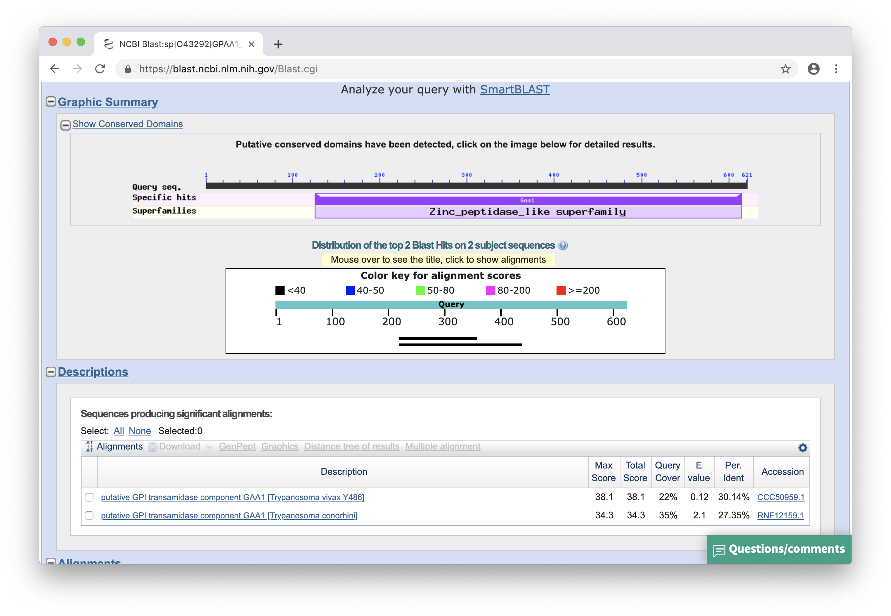
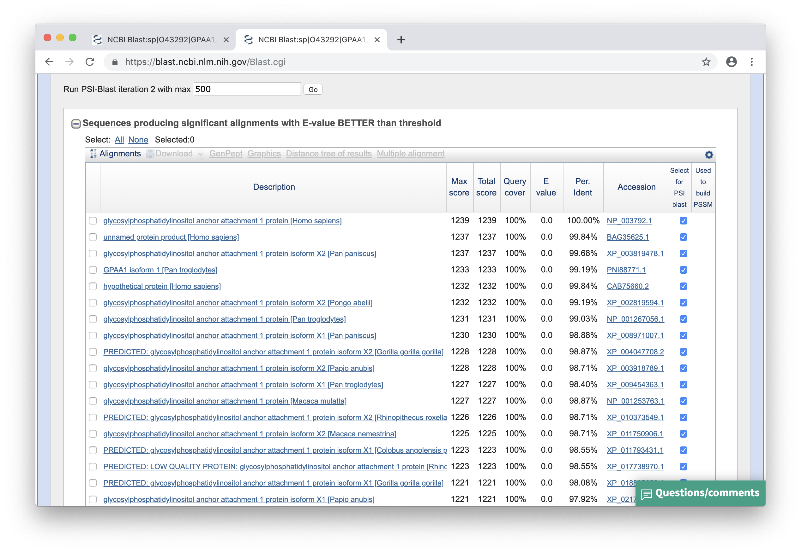
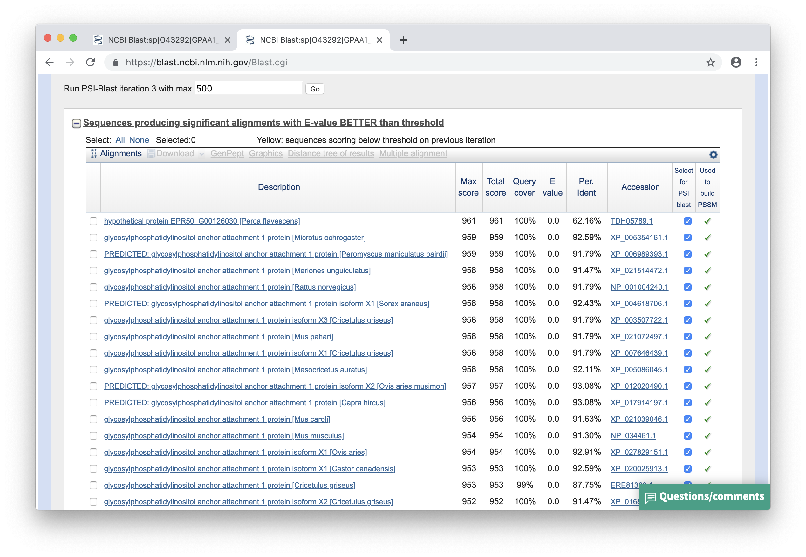
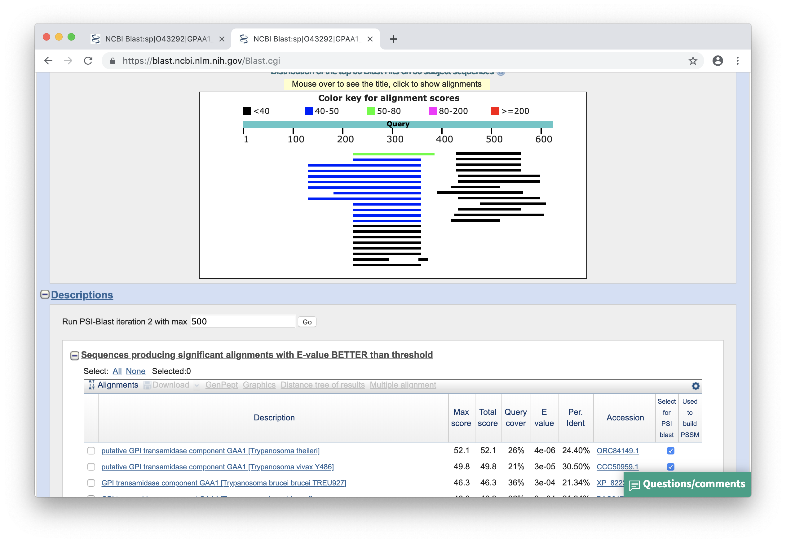

### Zad. 1
Rekord sekwencji GPAA1 w bazie Uniprot: [GPAA1_HUMAN](https://www.uniprot.org/uniprot/O43292).

```
>sp|O43292|GPAA1_HUMAN Glycosylphosphatidylinositol anchor attachment 1 protein OS=Homo sapiens OX=9606 GN=GPAA1 PE=1 SV=3
MGLLSDPVRRRALARLVLRLNAPLCVLSYVAGIAWFLALVFPPLTQRTYMSENAMGSTMV
EEQFAGGDRARAFARDFAAHRKKSGALPVAWLERTMRSVGLEVYTQSFSRKLPFPDETHE
RYMVSGTNVYGILRAPRAASTESLVLTVPCGSDSTNSQAVGLLLALAAHFRGQIYWAKDI
VFLVTEHDLLGTEAWLEAYHDVNVTGMQSSPLQGRAGAIQAAVALELSSDVVTSLDVAVE
GLNGQLPNLDLLNLFQTFCQKGGLLCTLQGKLQPEDWTSLDGPLQGLQTLLLMVLRQASG
RPHGSHGLFLRYRVEALTLRGINSFRQYKYDLVAVGKALEGMFRKLNHLLERLHQSFFLY
LLPGLSRFVSIGLYMPAVGFLLLVLGLKALELWMQLHEAGMGLEEPGGAPGPSVPLPPSQ
GVGLASLVAPLLISQAMGLALYVLPVLGQHVATQHFPVAEAEAVVLTLLAIYAAGLALPH
NTHRVVSTQAPDRGWMALKLVALIYLALQLGCIALTNFSLGFLLATTMVPTAALAKPHGP
RTLYAALLVLTSPAATLLGSLFLWRELQEAPLSLAEGWQLFLAALAQGVLEHHTYGALLF
PLLSLGLYPCWLLFWNVLFWK
```

#### Standardowe wyszukiwanie blastp
Wyszukiwanie programem blastp sekwencji `GPAA1_HUMAN` w bazie `nr` z zawężeniem bazy danych do organizmu *Trypanosoma*.



1. Brak trafień statystycznie istotnych. Znaleziono dwa trafienia, najlepsze z nich ma wartość E-value = `0.12`.

#### PSI-BLAST - tworzenie profilu PSSM

Pierwsza iteracja PSI-BLAST do bazy `nr` wszystskich organizmów.



Druga iteracja PSI-BLAST do bazy `nr` wszystkich organizmów.



Zapisanie profilu PSSM (`Download` > `PSSM to restart search` > `PSSM`)


Profil PSSM: [trypanosoma-PSSM-iter2.asn](./files/trypanosoma-PSSM-iter2.asn)

#### Wyszukiwanie sekwencji za pomocą profilu PSSM
Przeszukanie bazy `nr` z ograniczeniem do organizmu *Trypanosoma* za pomocą profilu PSSM.



2. Znaleziono 7 sekwencji istotnie statystycznych. Białko *Trypanosoma theileri* (putative GPI transamidase component GAA1) jest najbardziej podobne do sekwencji GPAA1 człowieka. Wartość E-value tego trafienia to `4e-06`.