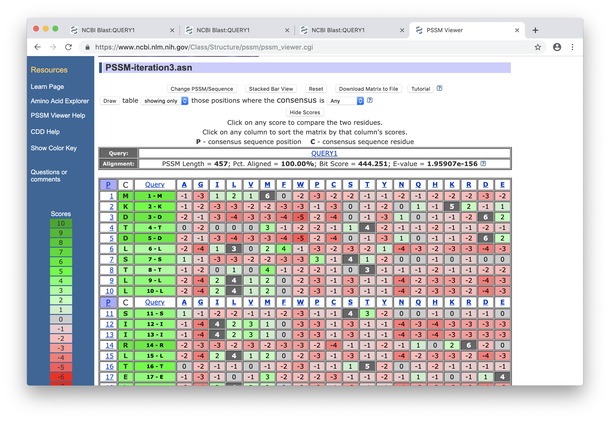

### Zad. 1 - PSI-BLAST: wyszukiwanie odległych homologów sekwencyjnych
> Celem zadania jest znalezienie najbardziej podobnej sekwencji białkowej (do sekwencji zapytania) o rozwiązanej strukturze przestrzennej.

Poniżej znajduje się nieznana sekwencja białkowa (`QUERY1`)

```
>QUERY1
MKDTDLSTLLSIIRLTELKESKRNALLSLIFQLSVAYFIALVIVSRFVRYVNYITYNNLV
EFIIVLSLIMLIIVTDIFIKKYISKFSNILLETLNLKINSDNNFRREIINASKNHNDKNK
LYDLINKTFEKDNIEIKQLGLFIISSVINNFAYIILLSIGFILLNEVYSNLFSSRYTTIS
IFTLIVSYMLFIRNKIISSEEEEQIEYEKVATSYISSLINRILNTKFTENTTTIGQDKQL
YDSFKTPKIQYGAKVPVKLEEIKEVAKNIEHIPSKAYFVLLAESGLRPGELLNVSIENID
LKARIIWINKETQTKRAYFSFFSRKTAEFLEKVYLPAREEFIRANEKNIAKLAAANENQE
IDLEKWKAKLFPYKDDVLRRKIYEAMDRALGKRFELYALRRHFATYMQLKKVPPLAINIL
QGRVGPNEFRILKENYTVFTIEDLRKLYDEAGLVVLE
```

#### Standardowe przeszukanie BLAST

Zidentyfikuj sekwencję wykorzystując program BLAST. Ogranicz przeszukiwanie do bazy `PDB (Protein Data Bank proteins)`.

1. Ile istotnych statystycznie wyników zostało znalezionych (`E-value < 0.005`)?

#### Przeszukanie PSI-BLAST
Wróć do strony programu BLAST. Ogranicz wyszukiwanie do bazy danych `nr` (*non-redundant protein sequences*) oraz wybierz algorytm `PSI–BLAST` (*Position-Specific Iterated BLAST*).

2. Ile istotnych statystycznie wyników zostało znalezionych?
   > *Wskazówka*: zaznacz wszystkie istotne statystycznie wyniki poprzez `Select`: `All` w sekcji `Sequences producing significant alignments with E-value BETTER than threshold`
3. Jakie wartości `Query cover` przyjmują znaleziono przyrównania? (pomijając wynik identyczny)
4. Czy wśród istotnych statystycznie wyników znajduja się wyniki pochodzące z bazy PDB?
   > *Wskazówka*: szukaj identyfikatora bazy PDB w kolumnie `Accession`. Identyfikator składa się z min. 4 znaków, w których pierwszy znak jest cyfrą np. `1XYZ_A`

#### Druga iteracja PSI-BLAST
Wykonaj drugie przeszukiwanie BLAST w celu przygotowania profilu PSSM (*Position-Specific Scoring Matrix*).
> Wybierz przycisk `Go` przy `Run PSI-Blast iteration 2` (znajdziesz go nad i pod tabelą wyników)

5. Ile istotnych statystycznie wyników zostało znalezionych?
6. Ile wynosi wartość `Query cover` pierwszych 20 trafień (z wyłączeniem sekwencji identycznej)?
7. Co oznaczają wiersze w tabeli wyróżnione żółtym kolorem?
8. Dlaczego w wynikach drugiego przeszukiwania PSI-BLAST znajduje się więcej istotnie statystycznych wyników?

#### Zapisanie i użycie profilu PSSM
* Zapisz matrycę PSSM stworzoną przez PSI-BLAST (`Download` > `PSSM to restart search` > `PSSM`).
  - Pobrany plik nazwij `PSSM-iteration2.asn`. 
* Wykorzystaj pobraną matrycę PSSM do przeszukania bazy PDB. W tym celu:
  - W nowej karcie przeglądarki otwórz stronę `protein BLAST`.
  - Ogranicz wyszukiwanie do bazy danych `PDB`
  - Wybierz algorytm `PSI–BLAST`.
  - Rozwiń menu `Algorithm parameters` i w części `Upload PSSM` załaduj zapisany plik z profilem PSSM (`PSSM-iteration2.asn`).
  - Uruchom program BLAST.

9. Ile statystycznie istotnych wyników pochodzi z bazy PDB?
10. Podaj identyfikatory PDB i wartości E-value dwóch najlepszych wyników przeszukiwania.
11. Podaj wartości `Query cover`, `Identities` oraz `Sequence Similarity (Positives)` dla dwóch najlepszych trafień.
12. Jaką funkcję pełnią te białka?

#### Trzecia iteracja PSI-BLAST
Przeprowadź jeszcze jedną iterację PSI-BLAST. W tym celu:
* Wróć do karty przeglądarki, w której znajdują się wyniki przeszukiwania bazy `nr`
* Naciśnij przycisk `Go` znajdujący się obok `Run PSI-Blast iteration 3`
* Zapisz profil PSSM na dysk i nadaj mu nazwę `PSSM-iteration3.asn`.
* Użyj programu PSI-BLAST do przeszukania bazy `PDB` przy użyciu pobranego profilu PSSM `PSSM-iteration3.asn`.

13. Odpowiedz na pytania 9-11.
<br/><br/>

### Zad. 2 - PSSM Viewer: identyfikacja kluczowych aminokwasów
> Celem tego zadania jest identyfikacja aminokwasów w sekwencji `QUERY` (z poprzedniego zadania), które są krytyczne do utrzymania prawidłowej struktury i funkcjonowania białka. Umożliwia to wybranie najbardziej prawdopodobnych pozycji w sekwencji do przeprowadzenia doświadczeń mutagenezy.

* Otwórz stronę programu [NCBI PSSM Viewer](https://www.ncbi.nlm.nih.gov/Class/Structure/pssm/pssm_viewer.cgi).
* Zaznacz opcję `Scoremat file` i załaduj plik z profilem PSSM z poprzedniego zadania (`PSSM-iteration3.asn`)
* Zaznacz opcję `FASTA file` i załaduj plik z sekwencją zapytania (`QUERY`).
* Naciśnij przycisk `Matrix View`



1. Wybierz cztery spośród ośmiu pozycji w sekwencji, które są dobrymi kandytami do przeprowadzania mutagenezy:
   * H271
   * R287
   * E290
   * Y334
   * F371
   * R379
   * R400
   * Y436
2. W tabeli naciśnij na kolumnę `Query` w celu posortowania pozycji sekwencji według malejących wartości punktacji.
   * Czy możesz zaproponować pozycje bardziej odpowiednie niż te wybrane w poprzednim punkcie.
3. W której pozycji sekwencji tryptofan (`W`) ma największą wartość punktacji?
<br/><br/>

### Zad. 3 - hmmer: wyszukiwanie odległych homologów
> Celem tego zadania jest wykorzystanie programu **hmmer** do wyszukania sekwencji podobnych w bazie PDB do sekwencji zapytania z zadania 1.

Otwórz serwis [hmmer](https://www.ebi.ac.uk/Tools/hmmer/). Wybierz zakładkę `Search` i w formularzu programu:
* Umieść sekwencję z zadania 1 w polu `Paste a Sequence`.
* Ustaw bazę danych (`Current database selection`) jako `PDB`.
* Naciśnij przycisk `Submit`.

1. Czy program hmmer zidentyfikował statystycznie istotne przyrównania (`E-value < 0.05`)?
2. Ile wynosi procent identyczności i podobieństwa najlepszego przyrównania?