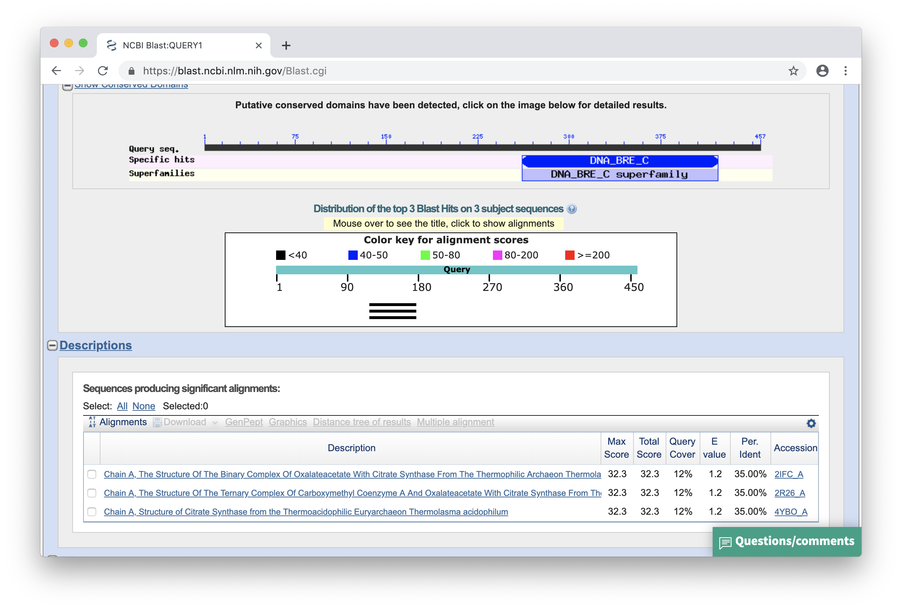
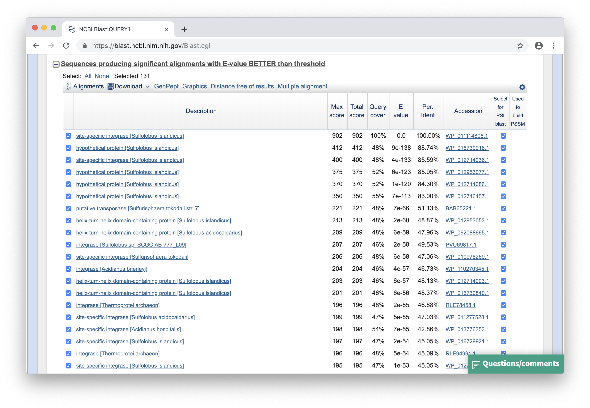
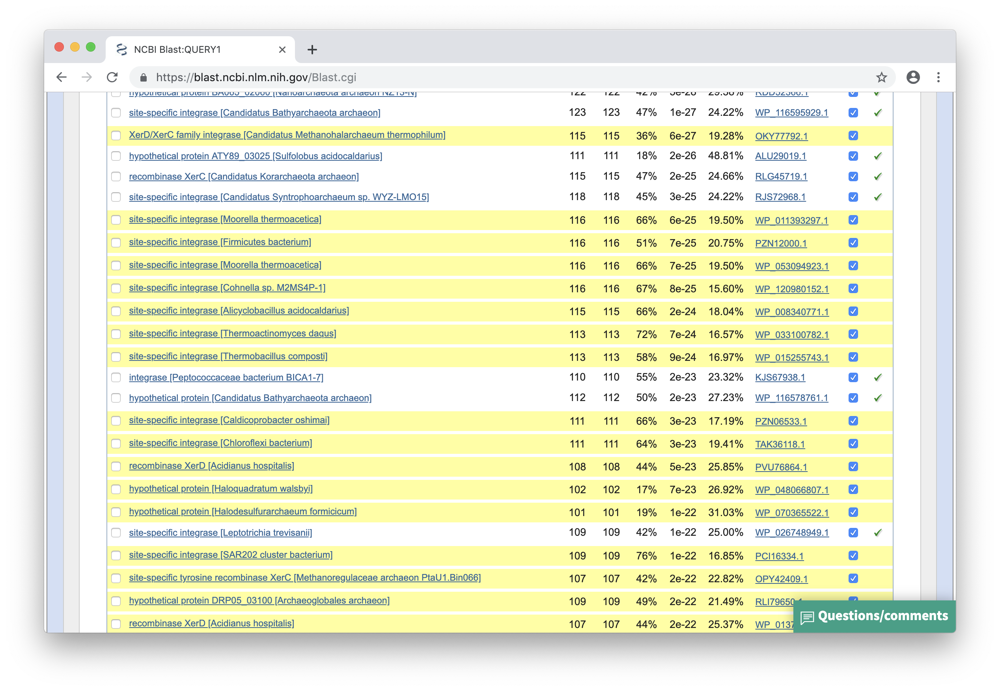
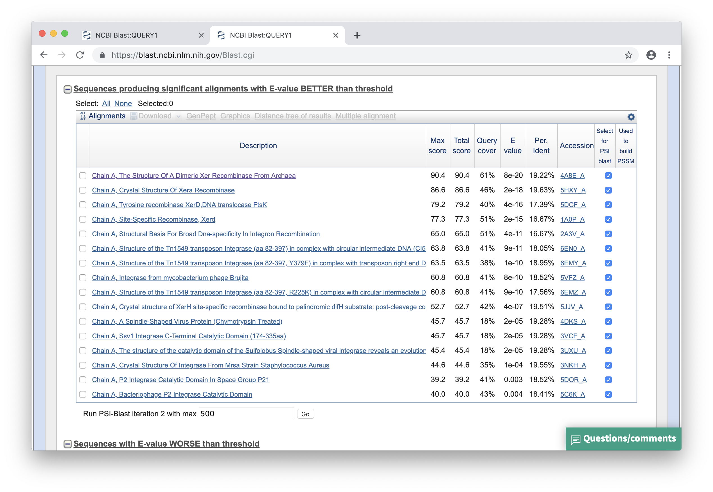
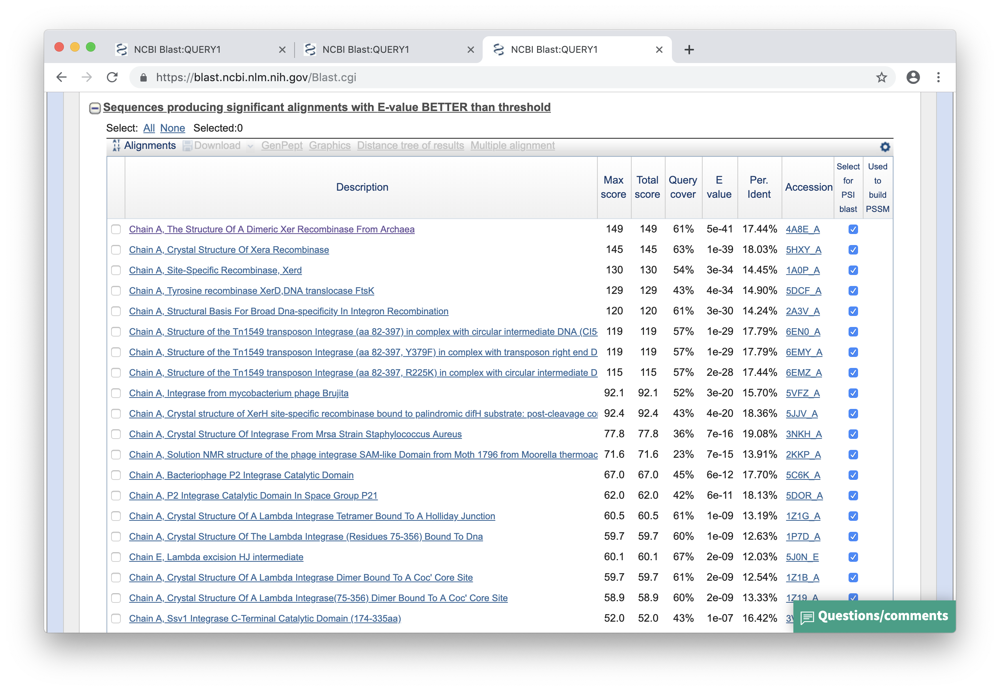
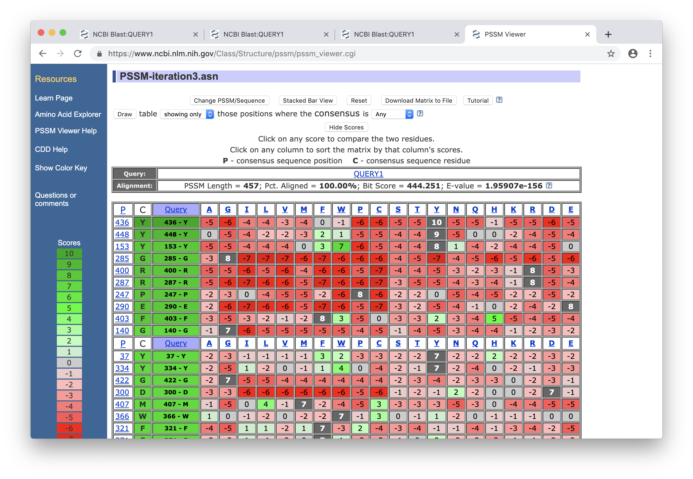
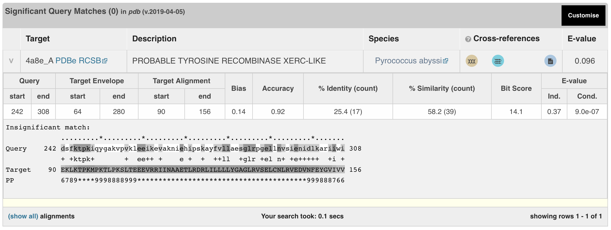

### Zad. 1 - PSI-BLAST: wyszukiwanie odległych homologów sekwencyjnych

#### Standardowe przeszukanie BLAST

1. W wyniku przeszukania bazy PDB nie znaleziono statystycznie istotnych przyrównań.

   

#### Przeszukanie PSI-BLAST

2. W wyniku przeszukania bazy `nr` znaleziono **131** statystycznie istotnych przyrównań (`E-value < 0.005`).

   

3. Przyrównania mają wartość `Query cover` w zakresie `40-50%`.
4. Nie, wśród wyników nie ma sekwencji pochodzących z bazy PDB.

#### Druga iteracja PSI-BLAST

5. W wyniku drugiej iteracji znaleziono **500** statystycznie istotnych przyrównań.

   

6. Pierwsze 20 przyrównań ma wartość `Query cover` w zakresie `50-60%`
7. Wiersze w tabeli wyróżnione na żółto oznaczają nowe trafienia, tzn. takie, których nie udało się zidentyfikować w trakcie poprzedniego przeszukiwania.
8. W wynikach drugiego przeszukiwania, BLAST znajduje więcej trafień. Program PSI-BLAST z wysoko ocenionych sekwencji trafień buduje przyrównanie wielu sekwencji i tworzy z niego profil. Profil sekwencji zawiera więcej informacji na temat danej rodziny białkowej niż każda sekwencja z osobna. Następnie PSI-BLAST wykorzystuje otrzymany profil w drugiej rundzie (*iteracji*) przeszukiwania, w celu zidentyfikowania większej liczby dopasowanych do niego członków tej samej rodziny białkowej. Po zidentyfikowaniu nowych sekwencji, PSI-BLAST dołącza je do poprzedniego przyrównania, tak by utworzyć nowy profil, który wykorzystuje w następnych cyklach przeszukiwania bazy danych. Program powtarza ten proces do momentu, w którym przestanie znajdować nowe sekwencje. 

#### Zapisanie i użycie profilu PSSM

9. Przy użyciu profilu PSSM i przeszukaniu bazy PDB znaleziono **16** istotnych wyników:

   

   Profil PSSM zbudowany przez PSI-BLAST w drugiej iteracji umożliwił identyfikację sekwencji homologicznych w bazie PDB, których nie udało się zidentyfikować przy użyciu klasycznego przeszukiwania programem *Protein BLAST*.

10. Dwa najlepsze trafienia w bazie PDB to:

    ```
    4A8E_A  8e-20
    5HXY_A  2e-18
    ```

11. Dwa najlepsze trafienia mają następujące parametry przyrównania z profilem: 

    ```
    ID      Qcov   ident  sim/pos 
    4A8E_A  61%    19%    37%
    5HXY_A  46%    20%    36%
    ```

    Przyrównania sekwencji zapytania z `4A8E_A`:

    ```
    >4A8E_A Chain A, The Structure Of A Dimeric Xer Recombinase From Archaea
    Length=292
    
     Score = 90.4 bits (223),  Expect = 8e-20, Method: Composition-based stats.
     Identities = 54/281 (19%), Positives = 104/281 (37%), Gaps = 27/281 (10%)
   
    Query  173  SSRYTTISIFTLIVSYMLFIRNKIISSEEEEQIEYEKVATSYISSLINRILNTKFTENTT  232
                 SR T       I  +  F      ++ +  +   +     Y +  +N ++         
    Sbjct  25   KSRNTVRMYTYYISKF--FEEGHSPTARDALRFLAKLKRKGYSTRSLNLVIQ-ALKAYFK  81
    
    Query  233  TIGQDKQLYDSFKTPKIQYGAKVPVKLEEIKEVAKNIEHIPSKAYFVLLAESGLRPGELL  292
                  G D +  +  KTPK+       +  EE++ +    E +  +   +LL  +GLR  EL 
    Sbjct  82   FEGLDSE-AEKLKTPKMPKTLPKSLTEEEVRRIINAAETLRDRLILLLLYGAGLRVSELC  140
    
    Query  293  NVSIENIDLKARIIWINKETQTKRAYFSFFSRKTAEFLEKVYLPAREEFIRANEKNIAKL  352
                N+ +E+++ +  +I + +  +  +      S      +++ YL +R +        +   
    Sbjct  141  NLRVEDVNFEYGVIVV-RGGKGGKDRVVPISESLLSEIKR-YLESRNDDSPYLFVEMK--  196
    
    Query  353  AAANENQEIDLEKWKAKLFPYKDDVLRRKIYEAMDRALGKRFELYALRRHFATYMQLKKV  412
                            K K KL P     L +K      R  G     + LR  FAT+M  + +
    Sbjct  197  -----------RKRKDKLSPKTVWRLVKK----YGRKAGVELTPHQLRHSFATHMLERGI  241
    
    Query  413  PPLAINILQGRVGPNEFRILKENYTVFTIEDLRKLYDEAGL  453
                    I  L G    +  +I    YT  + + L++   +A L
    Sbjct  242  DIRIIQELLGHSNLSTTQI----YTKVSTKHLKEAVKKAKL  278
    ```

    Przyrównania sekwencji zapytania z `5HXY_A`:
   
    ```
    >5HXY_A Chain A, Crystal Structure Of Xera Recombinase
    Length=317
    
     Score = 86.6 bits (213),  Expect = 2e-18, Method: Composition-based stats.
     Identities = 42/214 (20%), Positives = 78/214 (36%), Gaps = 24/214 (11%)
   
    Query  243  SFKTPKIQYGAKVPVKLEEIKEVAKNIE-HIPSKAYFVLLAESGLRPGELLNVSIENIDL  301
                +   PK      V +  +E K + +         A   +LA +G+R GEL N+ I ++DL
    Sbjct  125  NLTPPKRPSHXPVYLSEDEAKRLIEAASSDTRXYAIVSVLAYTGVRVGELCNLKISDVDL  184
    
    Query  302  KARIIWINKETQTKRAYFSFFSRKTAEFLEKVYLPAREEFIRANEKNIAKLAAANENQEI  361
                +  II + +  +  +      + +  + L   YL  R             L+   +N  +
    Sbjct  185  QESIINV-RSGKGDKDRIVIXAEECVKALGS-YLDLR-------------LSXDTDNDYL  229
    
    Query  362  DLEKWKAKLFPYKDDVLRRKIYEAMDRALG-KRFELYALRRHFATYMQLKKVPPLAINIL  420
                 +   + +   +    + R I +   +A   K+   + LR  FAT +         I  +
    Sbjct  230  FVSNRRVR---FDTSTIERXIRDLGKKAGIQKKVTPHVLRHTFATSVLRNGGDIRFIQQI  286
    
    Query  421  QGRVGPNEFRILKENYTVFTIEDLRKLYDEAGLV  454
                 G       +I    YT      LR+ Y +    
    Sbjct  287  LGHASVATTQI----YTHLNDSALREXYTQHRPR  316
    ```

12. Oba białka należą do rodziny rekombinaz. 
    > Miejscowo-specyficzna rekombinacja jest procesem, w którym blok DNA zostaje przeniesiony do innej pozycji w cząsteczce zintegrowanej z genomem gospodarza. Proces ten zachodzi między niespokrewnionymi sekwencjami nukleotydowymi. Znane są dwie rodziny miejscowo-specyficznych rekombinaz (serynowe i tyrozynowe).

#### Trzecia iteracja PSI-BLAST

Przeszukanie bazy `PDB` za pomocą profilu[PSSM-iteration3.asn](./files/PSSM-iteration3.asn) otrzymanego z trzeciej iteracji przeszukania bazy `nr`.



13. W wyniku przeszukania bazy PDB za pomocą PSSM z 3 iteracji uzyskano **25** statystycznie istotnych trafień. Na liście wynikowej nadal najlepszymi trafieniami są `4A8E_A` i `5HXY_A`:

    ```
    ID      E      cov   ident  sim/pos 
    4A8E_A  5e-41  61%   17%    37%
    5HXY_A  1e-39  63%   18%    32%
    ```

    Przyrównania sekwencji profilu z `4A8E_A`:

    ```
    >4A8E_A Chain A, The Structure Of A Dimeric Xer Recombinase From Archaea
    Length=292
    
     Score = 149 bits (375),  Expect = 5e-41, Method: Composition-based stats.
     Identities = 49/281 (17%), Positives = 106/281 (38%), Gaps = 27/281 (10%)
   
    Query  173  SSRYTTISIFTLIVSYMLFIRNKIISSEEEEQIEYEKVATSYISSLINRILNTKFTENTT  232
                 SR T       I  +  F      ++ +  +   +     Y +  +N ++         
    Sbjct  25   KSRNTVRMYTYYISKF--FEEGHSPTARDALRFLAKLKRKGYSTRSLNLVI-QALKAYFK  81
    
    Query  233  TIGQDKQLYDSFKTPKIQYGAKVPVKLEEIKEVAKNIEHIPSKAYFVLLAESGLRPGELL  292
                  G D +  +  KTPK+       +  EE++ +    E +  +   +LL  +GLR  EL 
    Sbjct  82   FEGLDSE-AEKLKTPKMPKTLPKSLTEEEVRRIINAAETLRDRLILLLLYGAGLRVSELC  140
    
    Query  293  NVSIENIDLKARIIWINKETQTKRAYFSFFSRKTAEFLEKVYLPAREEFIRANEKNIAKL  352
                N+ +E+++ +  +I +    +  +      S      +++ YL +R +            
    Sbjct  141  NLRVEDVNFEYGVIVVR-GGKGGKDRVVPISESLLSEIKR-YLESRND------------  186
    
    Query  353  AAANENQEIDLEKWKAKLFPYKDDVLRRKIYEAMDRALGKRFELYALRRHFATYMQLKKV  412
                    ++  + +E  + +        + R + +   +A G     + LR  FAT+M  + +
    Sbjct  187  ----DSPYLFVEMKRKRKDKLSPKTVWRLVKKYGRKA-GVELTPHQLRHSFATHMLERGI  241
    
    Query  413  PPLAINILQGRVGPNEFRILKENYTVFTIEDLRKLYDEAGL  453
                    I  L G    +  +I    YT  + + L++   +A L
    Sbjct  242  DIRIIQELLGHSNLSTTQI----YTKVSTKHLKEAVKKAKL  278
    ```

    Przyrównania sekwencji zapytania z `5HXY_A`:

    ```
    >5HXY_A Chain A, Crystal Structure Of Xera Recombinase
    Length=317
   
     Score = 145 bits (367),  Expect = 1e-39, Method: Composition-based stats.
     Identities = 53/294 (18%), Positives = 95/294 (32%), Gaps = 30/294 (10%)
   
    Query  166  EVYSNLFSSRYTTISIFTLIVSYMLFIRNK---IISSEEEEQIEYEKVATSYISSLINRI  222
                E  +    SRYT      L+  ++ F   K   I   + E    +  V   Y  +     
    Sbjct  48   EYXTGERKSRYTIKEYRFLVDQFLSFXNKKPDEITPXDIERYKNFLAVKKRYSKTSQYLA  107
    
    Query  223  LNTKFTENTTTIGQDKQLYDSFKTPKIQYGAKVPVKLEEIKEVAKNIEHI-PSKAYFVLL  281
                +            +      +   PK      V +  +E K + +         A   +L
    Sbjct  108  IKAVKLFYKALDLRVPI---NLTPPKRPSHXPVYLSEDEAKRLIEAASSDTRXYAIVSVL  164
    
    Query  282  AESGLRPGELLNVSIENIDLKARIIWINKETQTKRAYFSFFSRKTAEFLEKVYLPAREEF  341
                A +G+R GEL N+ I ++DL+  II +    +  +      + +  + L   YL  R   
    Sbjct  165  AYTGVRVGELCNLKISDVDLQESIINVR-SGKGDKDRIVIXAEECVKALGS-YLDLR---  219
    
    Query  342  IRANEKNIAKLAAANENQEIDLEKWKAKLFPYKDDVLRRKIYEAMDRALG-KRFELYALR  400
                              + + + D      +   +    + R I +   +A   K+   + LR
    Sbjct  220  -------------LSXDTDNDYLFVSNRRVRFDTSTIERXIRDLGKKAGIQKKVTPHVLR  266
    
    Query  401  RHFATYMQLKKVPPLAINILQGRVGPNEFRILKENYTVFTIEDLRKLYDEAGLV  454
                  FAT +         I  + G       +I    YT      LR+ Y +    
    Sbjct  267  HTFATSVLRNGGDIRFIQQILGHASVATTQI----YTHLNDSALREXYTQHRPR  316
    ```
<br/><br/>

### Zad. 2 - PSSM Viewer: identyfikacja kluczowych aminokwasów

1. Cztery pozycje odpowiednie do przeprowadzenia mutagenezy to: `R287`, `E290`, `R400`, `Y436`. 
   > W tych pozycjach aminokwasy są najbardziej zachowane i ulegają podstawieniom rzadziej niż wynikałoby to z przypadku. Zatem ich występowanie jest w pewien sposób faworyzowane.

2. W wyniku posortowania tabeli po kolumnie `Query`, na szczycie tabeli są pozycję o największym zachowaniu (najrzadziej ulegają substytucji). Wśród nich znajdują się pozycję zaproponowane w poprzednim punkcie. Dodatkowo, warto zwrócić uwagę na `G285` i `G140` - w tych pozycjach podstawienia na jakikolwiek inny aminokwas występują rzadziej niż wynikałoby to z przypadku.

   

3. Posortuj tabelę według kolumny zawierającej tryptofan `W`. W pozycji `157`, substytucja `L <-> W` zachodzi najczęściej (wartość punktacji: `12` bitów).

   
<br/>

### Zad. 3 - HMMER: Wyszukiwanie odległych homologów

Wynik wyszukiwania programu HMMER:



1. Nie, program HMMER nie zidentyfikował statystycznie istotnych przyrównań z sekwencją zapytania (`E-value < 0.05`). Sekwencją najlepiej przyrównaną do profilu sekwencji zapytania jest - podobnie jak w wynikach programu PSI-BLAST - białko archeona *Pyrococcus abyssi* rekombinazy tyrozynowej (`TYROSINE RECOMBINASE XERC-LIKE`) z bazy PDB o numerze dostępu [4a8e_A](https://www.rcsb.org/structure/4a8e).
2. Identyczność i podobieństwo najlepszego trafienia wynoszą, odpowiednio, `25.4%` i `58.2%`.