## Motywy i domeny białkowe

### Zad. 1 - serwis Pfam
Otwórz stronę serwisu [Pfam](https://pfam.xfam.org). Z menu u góry strony wybierz `SEARCH` a następnie z panelu po lewej stronie wybierz `Sequence`. Umieść sekwencję FASTA w oknie tekstowym `Sequence` i naciśnij przycisk `Submit`.

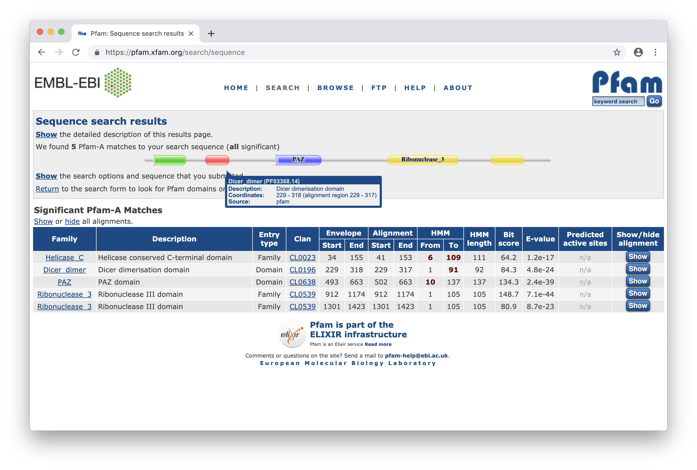

1. W sekwencji zapytania zidentyfikowano:
   * dwie domeny (`Dice_dimer` i `PAZ`)
   * dwie rodziny domen (`Helicase_C` oraz dwa regiony idenyfikujące rodzinę `Ribonuclease_3`)
2. Domena Dicer (`Helicase_C`) znajduje się w pozyjach `229`-`318` sekwencji zapytania.
   > Serwis Pfam przedstawia dwa typy koordynatów `start` i `end`. Pozycje start i end w kolumnie **Alignment** oznaczają region przyrównania sekwencji zapytania z modelem HMM (*Hidden Markov Model*) reprezentującym domenę. Z kolei, koordynaty **Envelope** wyznaczają region w sekwencji, który został dodatkowo probabilistycznie wyznaczony jako region występowania domeny. Region **Envelope** jest zwykle kilka aminokwasów dłuższy niż region **Alignment**.
3. Wartość *E*-value przyrównania domeny `Dicer_dimer` z modelem HMM wynosi `4.8e-24`. Przyrównanie jest zatem statystycznie istotne.
4. Numer dostępu domeny `Dicer_dimer` w bazie Pfam to [PF03368](https://pfam.xfam.org/family/PF03368.14).
5. Domena `Dicer_dimer` bierze udział w interferencji RNA (RNAi), procesie wyciszania genów za pomocą cząsteczek dwuniciowego RNA (dsRNA). Domena jest odpowiedzialna za wiązanie dsRNA.
6. 843 gatunki mają białka z domeną `Dicer_dimer`.
7. Według bazy Pfam domena `Dicer_dimer` nie występuje u organizmów prokariotycznych.
   > Proces RNAi jest charakterystyczny dla eukariontów.
8. 71 gatunków owadów (*Insecta*) posiada domenę `Dicer_dimer`.
9. Widok drzewa taksonomicznego gatunków (`Tree`) wskazuje 1 białko człowieka z domeną `Dicer_dimer`. 
10. Cztery sekwencje *Hominidae* posiadają domenę `Dicer_dimer`. Aby wyświetlić numery dostępu tych białek, zaznacz na drzewie grupę *Hominidae* i w prawym panelu wybierz `Download` > `Sequence accessions`. 
    Numery dostępu tych białek w UniProt: 
    ```
    Q9UPY3
    H2NM60
    H2R458
    A0A2I3SVT1
    ```
11. Logo domeny `Dicer_dimer` utworzone na podstawie modelu HMM składa się z `92` aminokwasów.
12. W ósmej pozycji modelu HMM najbardziej zachowanymi aminokwasami są `Y` (tyrozyna) i `F` (fenyloalanina)
13. Domena `Dicer_dimer` występuje najczęściej w białkach (w 397 sekwencjach) w sąsiedztwie domeny `Helicase_C` i dwóch domen `Ribonuclease_3`.
<br/><br/>

### Zad. 2 - serwis PROSITE
Otwórz stronę serwisu [PROSITE](https://prosite.expasy.org/prosite.html). Umieść sekwencję z zad. 1 w polu `Quick Scan mode of ScanProsite`. Naciśnij przycisk `Scan`.

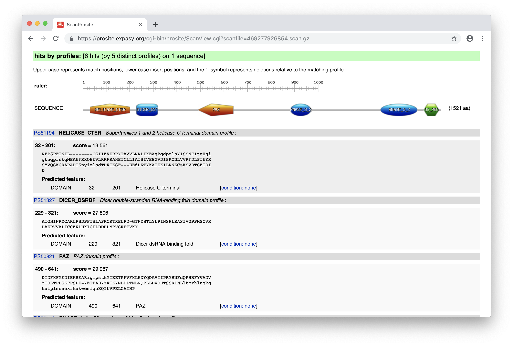

1. Serwis PROSITE zindetyfykował 6 domen. Domeną nie zidentyfikowaną wcześniej w serwisie Pfam jest `DS_RBD` (*Double stranded RNA-binding domain (dsRBD)*). Domena ta ma numer dostępu w serwisie PROSITE: [PS50137](https://prosite.expasy.org/cgi-bin/prosite/nicedoc.pl?PS50137). Przejdź do rekordu domeny.
   * Domena `DS_RBD` rozpoznaje dwuniciowe RNA. Domena jest głównie zaangażowana w posttranskrypcyjną regulację genów, na przykład poprzez zahamowanie ekspresji białek.
2. Numer dostępu domeny Dicer w bazie PROSITE to [PS51327](https://prosite.expasy.org/cgi-bin/prosite/nicedoc.pl?PS51327).
3. Położenie domeny Dicer według serwisu PROSITE w większości zgadza się z lokalizacją domeny według Pfam. Pozycja początku domeny wyznaczona przez oba serwisy jest taki sama (`229`), natomiast koniec domeny w bazie PROSITE to `321`, a w bazie Pfam `318`.
   ```
   Pfam       229-318
   PROSITE    229-321
   ```

#### Rekord domeny Dicer
4. Wyświetl logo profilu domeny Dicer poprzez naciśnięcie na link `Retrieve the sequence logo from the alignment`. Profil domeny Dicer zbudowany jest z `94` aminokwasów.
5. W logotypie domeny Dicer aminokwasy `Y` i `F` nie są najbardziej zachowanymi aminokwasami, jak w przypadku bazy Pfam. Najbardziej zachowanym aminokwasem jest `P` w pozycji `42` profilu.
6. W odróżnieniu od bazy Pfam, domena Dicer serwisu PROSITE występuje również u organizmów prokariotycznych. Domena ta występuje w `14` białkach bakteryjnych (np. w jednym białku *Paraprevotella clara YIT 11840*)
<br/><br/>

### Zad. 3 - metaserwis InterPro
Otwórz stronę metaserwisu [InterPro](http://www.ebi.ac.uk/interpro/). Umieść sekwencję białkową z zad. 1 w polu `Analyse your protein sequence`. Naciśnij przycisk `Submit`.

1. Serwis InterPro zidentyfikowanł 6 domen (część rekordu `Domains and repeats`).

   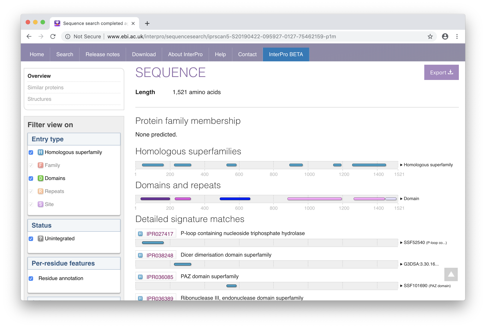

   InterPro jest zintegrowaną bazą domen zaprojektowaną w celu ujednolicenia wielu baz domen i miejsc funkcjonalnych białek. InterPro łączy informacje z ponad 10 baz danych takich jak: PROSITE, Pfam. Program przetwarza wzorce sekwencji z tych baz danych. Uwzględnia jedynie te motywy oraz domeny sekwencji białkowych, które pokrywają się w kilku bazach. InterPro dopasowuje rekordy, wykorzystując kombinację wyrażeń regularnych, profili oraz ukrytych modeli Markowa. InterPro prezentuje wyniki w postaci graficznej, która podsumowauje dopasowania motywów oraz zawiera linki przekierowujące użytkownika do bardziej szczegółowych informacji na temat zidentyfikowanych domen.

2. Numer dostępu domeny Dicer w bazie InterPro to [IPR005034](http://www.ebi.ac.uk/interpro/entry/IPR005034).

3. Lokalizacja domeny Dicer w sekwencji zapytania wegług serwisu InterPro to `229-321`. Lokalizacja ta jest identyczna z przewidywaniami serwisu PROSITE.

4. Domena *Dicer* wyznaczona została w InterPro na podstawie przewidywań otrzymanych z serwisów PROSITE i Pfam.

   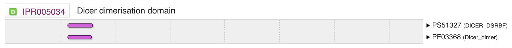

#### Rekord domeny Dicer
Przejdź do strony rekordu domeny *Dicer*: [IPR005034](http://www.ebi.ac.uk/interpro/entry/IPR005034).

5. Naciśnij link `Species`. Domena Dicer występuję w `3660` sekwencjach białkowych.
   * `16` sekwencji białkowych z domeną Dicer występuje u bakterii
   * `3644` białek występuje u eukariontów
   Aby wyświelić numery dostępu UniProt tych sekwencji naciśnij link `Protein IDs`.

6. Domena Dicer występuje w `204` różnych układach z innymi domenami. Najpopularniejszym układem domen (reprezentowanym przez 486 białek) jest występowanie domeny *Dicer* w sąsiedztwie domeny helikazy (`IPR001650`) i rybonukleazy III (`IPR000999`).

7. Przejdź do zakładki `Pathways & interactions`. InterPro wykorzystuje informacje zawarte w bazie Reactome. Według tej bazy, domena *Dicer* zaangażowana jest w dwa szlaki biochemiczne: biogenezę miRNA oraz biogenezę małych interferujących RNA (siRNA).
<br/><br/>

### Zad. 4 - Informacje o domenach w rekordach UniProt
Otwórz stronę serwisu [UniProt](https://www.uniprot.org/). Z menu u góry strony wybierz `BLAST`. Umieść sekwencję w formacie FASTA w polu tekstowym. Ogranicz przeszukiwania BLAST do bazy `UniProtKB/Swiss-Prot`. Naciśnij przycisk `Run BLAST`.

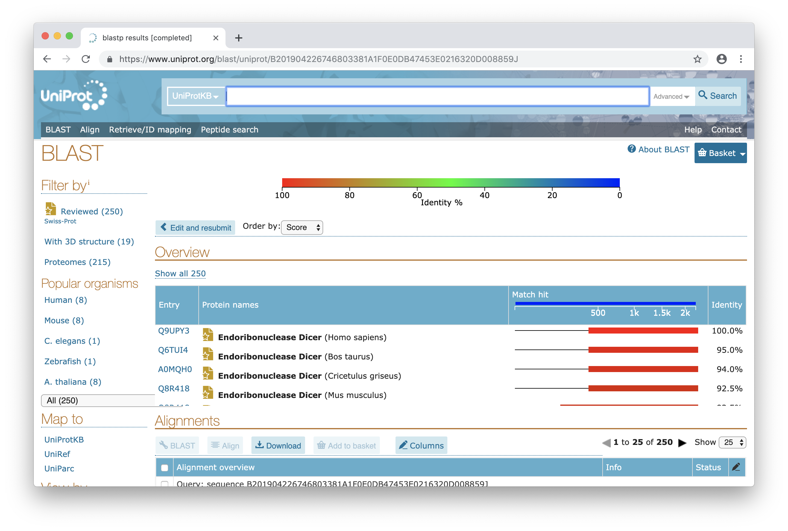

1. Sekwencją zapytania jest endorybonukleaza Dicer człowieka o numerze dostępu: [Q9UPY3](https://www.uniprot.org/uniprot/Q9UPY3).

Przejdź do rekordu tej sekwencji w bazie UniProt.

2. Tak, w rekordzie UniProt zawarte są informacje o domenach występujących w tym białku. Informacje te zawarte są w części `Family & Domains` rekordu. W podsekcji `Family and domain databases` znajdują się informacje o zidentyfikowanych domenach w serwisach InterPro, Pfam, SMART, PROSITE itd.

   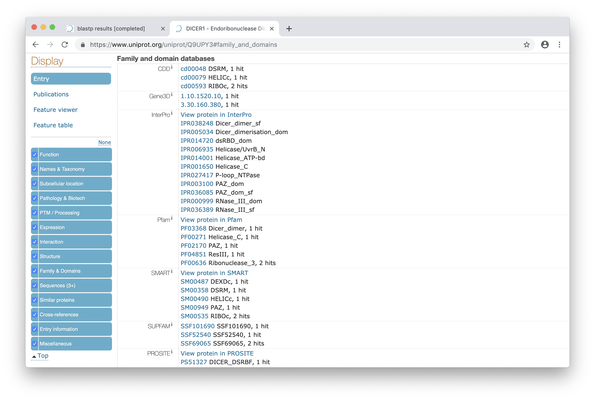
<br/>

### Zad. 5 - InterProt: hierarchiczne relacje między domenami
Otwórz stronę metaserwisu [InterPro](http://www.ebi.ac.uk/interpro/). Umieść sekwencję białkową `seq1` w polu `Analyse your protein sequence`. Naciśnij przycisk `Submit`.

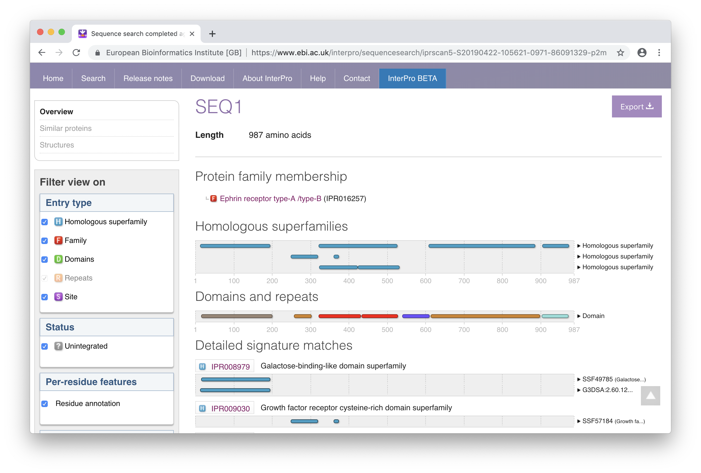

1. Białko zostało przypisane do rodziny receptorów efryn, które stanowią największą rodzinę receptorowych kinaz tyrozynowych. Ich ligandami są efryny, białka na stałe związane z powierzchnią komórki.
2. W sekwencji zostało zidentyfikowanych 7 domen:
   * *Ephrin receptor ligand binding domain*
   * *Tyrosine-protein kinase ephrin type A/B receptor-like*
   * *Fibronectin type III* - dwie domeny
   * *Ephrin receptor, transmembrane domain*
   * *Protein kinase domain*
   * *Sterile alpha motif domain*
3. Lokalizacja domeny kinazowej (`IPR000719`) to `615-899`.
4. Tak, domena kinazowa zawiera miejsce wiązania ATP i centrum aktywne.

   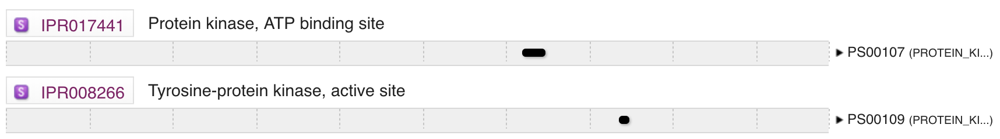

#### Rekord domeny kinazowej

5. Rekord domeny kinazowej [IPR000719](http://www.ebi.ac.uk/interpro/entry/IPR000719) utworzony został w InterPro na podstawie informacji zawartych w trzech bazach danych: PROSITE profiles, SMART i Pfam.

   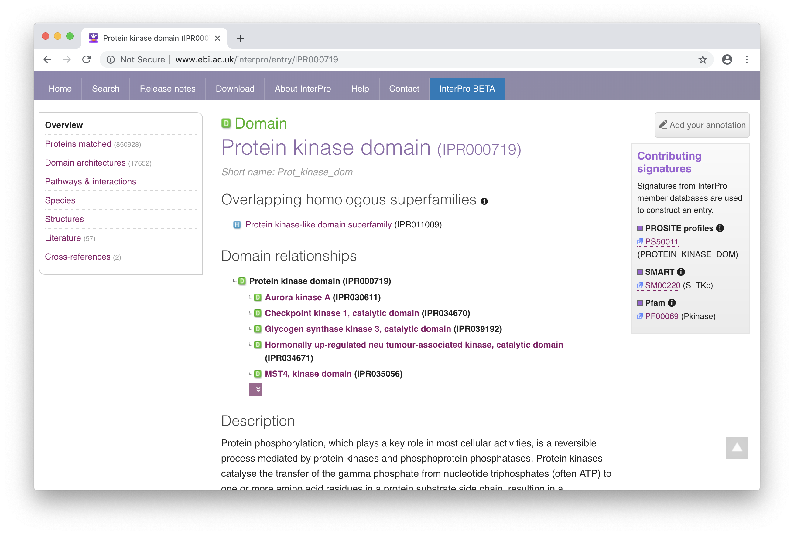

6. InterPro dostarcza informacji temat hierarchii zależności między domenami (`Domain relationships`). W skład ogólnie rozumianej domeny kinazowej (`IPR000719`) mogą wchodzić bardziej wyspecjalizowane domeny kinazowe (np. `Aurora kinase A (IPR030611)`).

7. Domena kinazowa należy do nadrodziny *Protein kinase-like domain superfamily* (`IPR011009`).


### Zad. 6
Otwórz stronę serwisu [EMBOSS Needle](https://www.ebi.ac.uk/Tools/psa/emboss_needle/). Ustaw `Enter a pair of` na `PROTEIN`. Umieść sekwencję `seq1` w pierwszym polu i `seq2` w drugim polu. Naciśnij przycisk `Submit`.

```
# Length: 987
# Identity:     986/987 (99.9%)
# Similarity:   986/987 (99.9%)
# Gaps:           0/987 ( 0.0%)
# Score: 5206.0
# 
#
#=======================================

seq1               1 MELRVLLCWASLAAALEETLLNTKLETADLKWVTFPQVDGQWEELSGLDE     50
                     ||||||||||||||||||||||||||||||||||||||||||||||||||
seq2               1 MELRVLLCWASLAAALEETLLNTKLETADLKWVTFPQVDGQWEELSGLDE     50

seq1              51 EQHSVRTYEVCDVQRAPGQAHWLRTGWVPRRGAVHVYATLRFTMLECLSL    100
                     ||||||||||||||||||||||||||||||||||||||||||||||||||
seq2              51 EQHSVRTYEVCDVQRAPGQAHWLRTGWVPRRGAVHVYATLRFTMLECLSL    100

seq1             101 PRAGRSCKETFTVFYYESDADTATALTPAWMENPYIKVDTVAAEHLTRKR    150
                     ||||||||||||||||||||||||||||||||||||||||||||||||||
seq2             101 PRAGRSCKETFTVFYYESDADTATALTPAWMENPYIKVDTVAAEHLTRKR    150

seq1             151 PGAEATGKVNVKTLRLGPLSKAGFYLAFQDQGACMALLSLHLFYKKCAQL    200
                     ||||||||||||||||||||||||||||||||||||||||||||||||||
seq2             151 PGAEATGKVNVKTLRLGPLSKAGFYLAFQDQGACMALLSLHLFYKKCAQL    200

seq1             201 TVNLTRFPETVPRELVVPVAGSCVVDAVPAPGPSPSLYCREDGQWAEQPV    250
                     ||||||||||||||||||||||||||||||||||||||||||||||||||
seq2             201 TVNLTRFPETVPRELVVPVAGSCVVDAVPAPGPSPSLYCREDGQWAEQPV    250

seq1             251 TGCSCAPGFEAAEGNTKCRACAQGTFKPLSGEGSCQPCPANSHSNTIGSA    300
                     ||||||||||||||||||||||||||||||||||||||||||||||||||
seq2             251 TGCSCAPGFEAAEGNTKCRACAQGTFKPLSGEGSCQPCPANSHSNTIGSA    300

seq1             301 VCQCRVGYFRARTDPRGAPCTTPPSAPRSVVSRLNGSSLHLEWSAPLESG    350
                     ||||||||||||||||||||||||||||||||||||||||||||||||||
seq2             301 VCQCRVGYFRARTDPRGAPCTTPPSAPRSVVSRLNGSSLHLEWSAPLESG    350

seq1             351 GREDLTYALRCRECRPGGSCAPCGGDLTFDPGPRDLVEPWVVVRGLRPDF    400
                     ||||||||||||||||||||||||||||||||||||||||||||||||||
seq2             351 GREDLTYALRCRECRPGGSCAPCGGDLTFDPGPRDLVEPWVVVRGLRPDF    400

seq1             401 TYTFEVTALNGVSSLATGPVPFEPVNVTTDREVPPAVSDIRVTRSSPSSL    450
                     ||||||||||||||||||||||||||||||||||||||||||||||||||
seq2             401 TYTFEVTALNGVSSLATGPVPFEPVNVTTDREVPPAVSDIRVTRSSPSSL    450

seq1             451 SLAWAVPRAPSGAVLDYEVKYHEKGAEGPSSVRFLKTSENRAELRGLKRG    500
                     ||||||||||||||||||||||||||||||||||||||||||||||||||
seq2             451 SLAWAVPRAPSGAVLDYEVKYHEKGAEGPSSVRFLKTSENRAELRGLKRG    500

seq1             501 ASYLVQVRARSEAGYGPFGQEHHSQTQLDESEGWREQLALIAGTAVVGVV    550
                     ||||||||||||||||||||||||||||||||||||||||||||||||||
seq2             501 ASYLVQVRARSEAGYGPFGQEHHSQTQLDESEGWREQLALIAGTAVVGVV    550

seq1             551 LVLVVIVVAVLCLRKQSNGREAEYSDKHGQYLIGHGTKVYIDPFTYEDPN    600
                     ||||||||||||||||||||||||||||||||||||||||||||||||||
seq2             551 LVLVVIVVAVLCLRKQSNGREAEYSDKHGQYLIGHGTKVYIDPFTYEDPN    600

seq1             601 EAVREFAKEIDVSYVKIEEVIGAGEFGEVCRGRLKAPGKKESCVAIKTLK    650
                     ||||||||||||||||||||||||||||||||||||||||||||||.|||
seq2             601 EAVREFAKEIDVSYVKIEEVIGAGEFGEVCRGRLKAPGKKESCVAISTLK    650

seq1             651 GGYTERQRREFLSEASIMGQFEHPNIIRLEGVVTNSMPVMILTEFMENGA    700
                     ||||||||||||||||||||||||||||||||||||||||||||||||||
seq2             651 GGYTERQRREFLSEASIMGQFEHPNIIRLEGVVTNSMPVMILTEFMENGA    700

seq1             701 LDSFLRLNDGQFTVIQLVGMLRGIASGMRYLAEMSYVHRDLAARNILVNS    750
                     ||||||||||||||||||||||||||||||||||||||||||||||||||
seq2             701 LDSFLRLNDGQFTVIQLVGMLRGIASGMRYLAEMSYVHRDLAARNILVNS    750

seq1             751 NLVCKVSDFGLSRFLEENSSDPTYTSSLGGKIPIRWTAPEAIAFRKFTSA    800
                     ||||||||||||||||||||||||||||||||||||||||||||||||||
seq2             751 NLVCKVSDFGLSRFLEENSSDPTYTSSLGGKIPIRWTAPEAIAFRKFTSA    800

seq1             801 SDAWSYGIVMWEVMSFGERPYWDMSNQDVINAIEQDYRLPPPPDCPTSLH    850
                     ||||||||||||||||||||||||||||||||||||||||||||||||||
seq2             801 SDAWSYGIVMWEVMSFGERPYWDMSNQDVINAIEQDYRLPPPPDCPTSLH    850

seq1             851 QLMLDCWQKDRNARPRFPQVVSALDKMIRNPASLKIVARENGGASHPLLD    900
                     ||||||||||||||||||||||||||||||||||||||||||||||||||
seq2             851 QLMLDCWQKDRNARPRFPQVVSALDKMIRNPASLKIVARENGGASHPLLD    900

seq1             901 QRQPHYSAFGSVGEWLRAIKMGRYEESFAAAGFGSFELVSQISAEDLLRI    950
                     ||||||||||||||||||||||||||||||||||||||||||||||||||
seq2             901 QRQPHYSAFGSVGEWLRAIKMGRYEESFAAAGFGSFELVSQISAEDLLRI    950

seq1             951 GVTLAGHQKKILASVQHMKSQAKPGTPGGTGGPAPQY    987
                     |||||||||||||||||||||||||||||||||||||
seq2             951 GVTLAGHQKKILASVQHMKSQAKPGTPGGTGGPAPQY    987
```

1. Sekwencje są prawie identyczne - u chorego pacjenta występuje `S` (seryna) w pozycji `647`, a w `seq1` występuje w tym miejscu `K` (lizyna).

#### Serwis InterPro

2. Mutacja `K>S` w pozycji `647` dotyczy domeny kinazowej. Porównanie wyników InterPro dla dwóch sekwencji wskazuje, że sekwencja `seq1` w pozycji `621-647` zawiera region wiązania ATP (*Protein kinase, ATP binding site*). Natomiast region ten nie występuje w sekwencji `seq2` chorego pacjenta.
<br/><br/>

### Zad. 7 - InterPro: wszystkie białka zawierające domenę RRM
1. Numer dostępu domeny **RRM** w serwisie InterPro to [IPR000504](https://www.ebi.ac.uk/interpro/entry/IPR000504?q=RRM).
2. Na stronie rekordu domeny RRM wybierz zakładkę `Species`. U bakterii jest `14 582` białek zawierających domenę RRM.
<br/><br/>

### Zad. 8 - UniProt: wszystkie białka zawierające domenę RRM
Wejdź na stronę serwisu [UniProt](https://www.uniprot.org/). Skorzystaj z zaawansowanego wyszukiwania.


1. Zapytanie do bazy danych UniProt:

   ```
   database:(type:interpro ipr000504) taxonomy:"Bacteria [2]"
   ```

2. W wyniku powyższego zapytania otrzymano `14 582` białek.
<br/><br/>

### Zad. 9 - MEME: Motif Discovery

1. Program MEME zidentyfikował 3 różne motywy, które są nadreprezentowane w sekwencjach z pliku [sequences.fasta](./data/sequences.fasta). 

   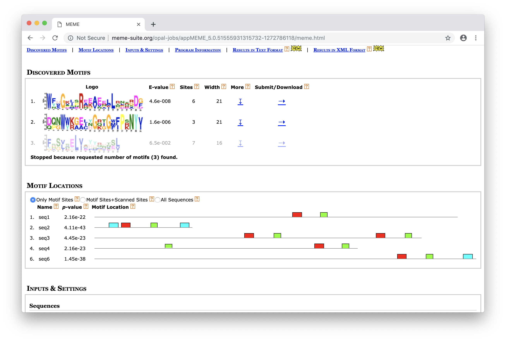

   * Motyw 1 - czerwony prostokąt
   * Motyw 2 - niebieski prostokąt
   * Motyw 3 - zielony prostokąt

2. Dwa motywy (Motyw 1 i Motyw 3) są obecne we wszystkich sześciu sekwencjach. Motyw drugi występuje tylko w dwóch sekwenjach (`seq2` i `seq6`).

3. Wybierz jedną sekwencję posiadającą wszystkie trzy motywy (np. `seq2`). Umieść sekwencję jako zapytanie w serwisie [InterPro](http://www.ebi.ac.uk/interpro/) i rozpocznij identyfikację domen.

   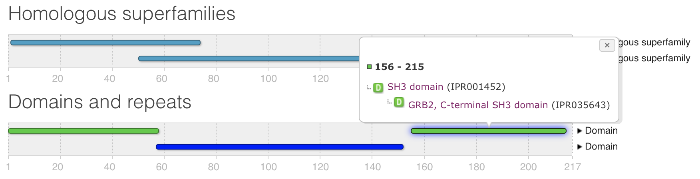

   Tak, motywy zidentyfikowane przez program MEME odpowiadają znanym domenom białkowym występującym w serwisie InterPro. Motyw 2 (niebieski) wchodzi w skład domeny *SH3*. Natomiast motywy 1 i 3 wchodzą w skład domeny *SH2*.

4. Domeny *SH2* i *SH3* uczestniczą w przenoszeniu informacji przez błonę komórkową od receptorów na układy efektorowe. W obrębie domeny *SH2* dochodzi do oddziaływań z rejonami białek zawierającymi ufosforylowaną tyrozynę, zaś w domenie *SH3* z fragmentami bogatymi w prolinę (motyw PXXP)