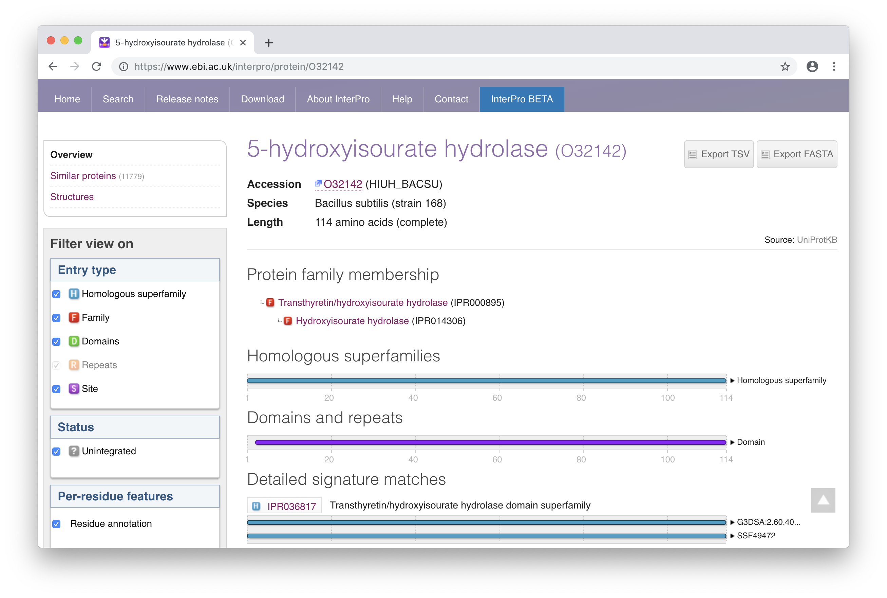

### Zad. 1
Otwórz stronę serwisu [UniProt](https://www.uniprot.org). Skorzystaj z zaawansowanego wyszukiwania.


Zapytanie do bazy danych:

```
database:(type:pfam pf13947) database:(type:pfam pf07645) database:(type:pfam pf07714) taxonomy:"Viridiplantae [33090]"
```

1. 354 białka roślinne posiadają trzy domeny charakterystyczne dla kinaz WAK.
2. Naciśnij przycisk `Download` > `Format:FASTA` > `Go`.
<br/><br/>

### Zad. 2
Otwórz stronę serwisu [InterPro](https://www.ebi.ac.uk/interpro/). W oknie szybkiego wyszukiwania po prawej stronie wpisz numer dostępu białka `O32142`. 



1. Białko przypisane jest do dwóch rodzin białkowych:
   * *Hydroxyisourate hydrolase* (`IPR014306`)
   * *Transthyretin/hydroxyisourate hydrolase* (`IPR000895`)
2. Białko posiada 1 domenę *Transthyretin/hydroxyisourate hydrolase domain* `IPR036817` w pozycji `3-114` sekwencji.