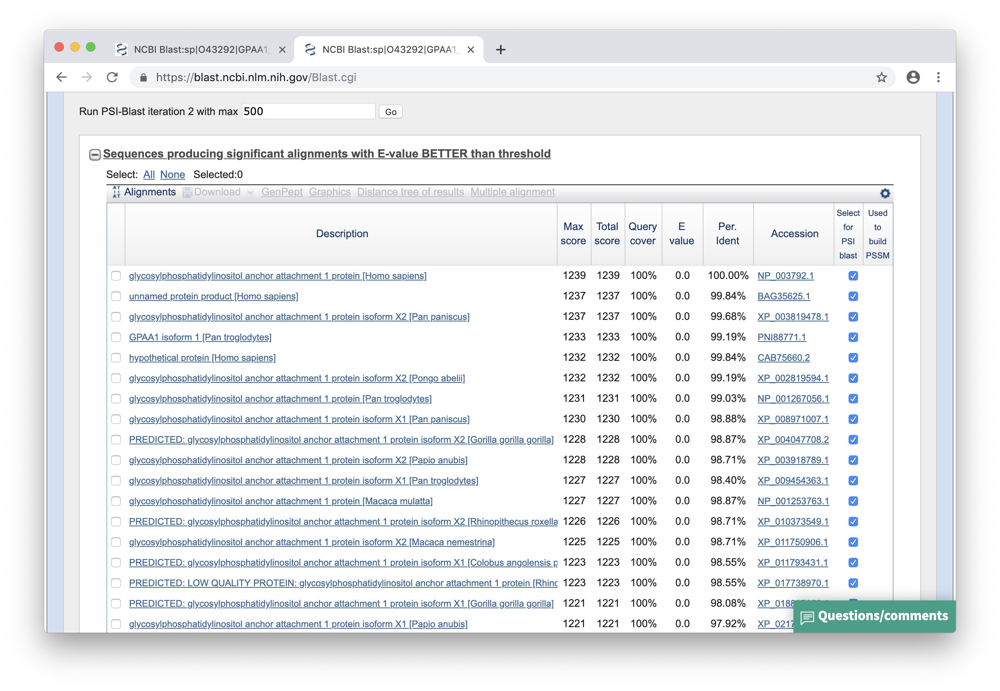
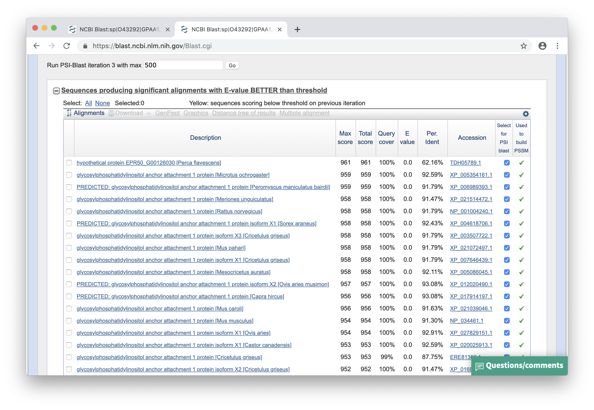

### Zad. 1 - Identyfikacja domen w serwise InterPro
Otwórz stronę serwisu [InterPro](https://www.ebi.ac.uk/interpro/). W oknie szybkiego wyszukiwania po prawej stronie wpisz numer dostępu białka `O32142`. 


1. Białko posiada 2 domeny:
   * `Elongation factor Tu (EF-Tu), GTP-binding domain` [IPR041709](http://www.ebi.ac.uk/interpro/entry/IPR000795) będącą podtypem domeny `Transcription factor, GTP-binding domain` ([IPR000795](http://www.ebi.ac.uk/interpro/entry/IPR000795))
   * `Elongation factor Tu, domain 2` [IPR033720](http://www.ebi.ac.uk/interpro/entry/IPR000795)) będącą podtypem domeny `Translation elongation factor EFTu-like, domain 2` ([IPR004161](http://www.ebi.ac.uk/interpro/entry/IPR004161))
2. Domena `Elongation factor Tu, domain 2` występuje w `86` różnych układach z innymi domenami.
3. Domena występuje w dwóch białkach człowieka o numerach dostępu UniProt: `P49411` I `A0A384ME17`.
<br/><br/>


### Zad. 2 - Wyszukiwanie sekwencji wielodomenowych (kinazy WAK)
Otwórz stronę serwisu [UniProt](https://www.uniprot.org). Skorzystaj z zaawansowanego wyszukiwania.


Zapytanie do bazy danych:

```
database:(type:pfam pf13947) database:(type:pfam pf07645)
database:(type:pfam pf07714) taxonomy:"Viridiplantae [33090]"
```

1. `354` białka roślinne posiadają trzy domeny charakterystyczne dla kinaz WAK.
2. W bazie `SwissProt` (*Reviewed*) znajduje się `5` rekordów; wszystkie rekordy pochodzą z *Arabidopsis thaliana*.

* Aby pobrać sekwencje naciśnij przycisk `Download` > `Format:FASTA` > `Go`.

  ```
  >sp|Q39191|WAK1_ARATH Wall-associated receptor kinase 1 OS=Arabidopsis thaliana OX=3702 GN=WAK1 PE=1 SV=2
  MKVQEGLFLVAIFFSLACTQLVKGQHQPGENCQNKCGNITIEYPFGISSGCYYPGNESFS
  ITCKEDRPHVLSDIEVANFNHSGQLQVLLNRSSTCYDEQGKKTEEDSSFTLENLSLSANN
  KLTAVGCNALSLLDTFGMQNYSTACLSLCDSPPEADGECNGRGCCRVDVSAPLDSYTFET
  TSGRIKHMTSFHDFSPCTYAFLVEDDKFNFSSTEDLLNLRNVMRFPVLLDWSVGNQTCEQ
  VGSTSICGGNSTCLDSTPRNGYICRCNEGFDGNPYLSAGCQDVNECTTSSTIHRHNCSDP
  KTCRNKVGGFYCKCQSGYRLDTTTMSCKRKEFAWTTILLVTTIGFLVILLGVACIQQRMK
  HLKDTKLREQFFEQNGGGMLTQRLSGAGPSNVDVKIFTEDGMKKATNGYAESRILGQGGQ
  GTVYKGILPDNSIVAIKKARLGDSSQVEQFINEVLVLSQINHRNVVKLLGCCLETEVPLL
  VYEFITNGTLFDHLHGSMIDSSLTWEHRLKIAIEVAGTLAYLHSSASIPIIHRDIKTANI
  LLDVNLTAKVADFGASRLIPMDKEELETMVQGTLGYLDPEYYNTGLLNEKSDVYSFGVVL
  MELLSGQKALCFKRPQSSKHLVSYFATATKENRLDEIIGGEVMNEDNLKEIQEAARIAAE
  CTRLMGEERPRMKEVAAKLEALRVEKTKHKWSDQYPEENEHLIGGHILSAQGETSSSIGY
  DSIKNVAILDIETGR
  >sp|Q9LMP1|WAK2_ARATH Wall-associated receptor kinase 2 OS=Arabidopsis thaliana OX=3702 GN=WAK2 PE=1 SV=1
  MKVQEGLFVVAVFYLAYTQLVKGQPRKECQTRCGNVAVEYPFGTSPGCYYPGDESFNLTC
  NEQEKLFFGNMPVINMSLSGQLRVRLVRSRVCYDSQGKQTDYIAQRTTLGNFTLSELNRF
  TVVGCNSYAFLRTSGVEKYSTGCISICDSATTKNGSCSGEGCCQIPVPRGYSFVRVKPHS
  FHNHPTVHLFNPCTYAFLVEDGMFDFHALEDLNNLRNVTTFPVVLDWSIGDKTCKQVEYR
  GVCGGNSTCFDSTGGTGYNCKCLEGFEGNPYLPNGCQDINECISSRHNCSEHSTCENTKG
  SFNCNCPSGYRKDSLNSCTRKVRPEYFRWTQIFLGTTIGFSVIMLGISCLQQKIKHRKNT
  ELRQKFFEQNGGGMLIQRVSGAGPSNVDVKIFTEKGMKEATNGYHESRILGQGGQGTVYK
  GILPDNSIVAIKKARLGNRSQVEQFINEVLVLSQINHRNVVKVLGCCLETEVPLLVYEFI
  NSGTLFDHLHGSLYDSSLTWEHRLRIATEVAGSLAYLHSSASIPIIHRDIKTANILLDKN
  LTAKVADFGASRLIPMDKEQLTTIVQGTLGYLDPEYYNTGLLNEKSDVYSFGVVLMELLS
  GQKALCFERPHCPKNLVSCFASATKNNRFHEIIDGQVMNEDNQREIQEAARIAAECTRLM
  GEERPRMKEVAAELEALRVKTTKYKWSDQYRETGEIEHLLGVQILSAQGETSSSIGYDSI
  RNVTTLDIEAGR
  >sp|Q9LMN6|WAK4_ARATH Wall-associated receptor kinase 4 OS=Arabidopsis thaliana OX=3702 GN=WAK4 PE=2 SV=1
  MKVQRLFLVAIFCLSYMQLVKGQTLPRCPEKCGNVTLEYPFGFSPGCWRAEDPSFNLSCV
  NENLFYKGLEVVEISHSSQLRVLYPASYICYNSKGKFAKGTYYWSNLGNLTLSGNNTITA
  LGCNSYAFVSSNGTRRNSVGCISACDALSHEANGECNGEGCCQNPVPAGNNWLIVRSYRF
  DNDTSVQPISEGQCIYAFLVENGKFKYNASDKYSYLQNRNVGFPVVLDWSIRGETCGQVG
  EKKCGVNGICSNSASGIGYTCKCKGGFQGNPYLQNGCQDINECTTANPIHKHNCSGDSTC
  ENKLGHFRCNCRSRYELNTTTNTCKPKGNPEYVEWTTIVLGTTIGFLVILLAISCIEHKM
  KNTKDTELRQQFFEQNGGGMLMQRLSGAGPSNVDVKIFTEEGMKEATDGYDENRILGQGG
  QGTVYKGILPDNSIVAIKKARLGDNSQVEQFINEVLVLSQINHRNVVKLLGCCLETEVPL
  LVYEFISSGTLFDHLHGSMFDSSLTWEHRLRMAVEIAGTLAYLHSSASIPIIHRDIKTAN
  ILLDENLTAKVADFGASRLIPMDKEDLATMVQGTLGYLDPEYYNTGLLNEKSDVYSFGVV
  LMELLSGQKALCFERPQTSKHIVSYFASATKENRLHEIIDGQVMNENNQREIQKAARIAV
  ECTRLTGEERPGMKEVAAELEALRVTKTKHKWSDEYPEQEDTEHLVGVQKLSAQGETSSS
  IGYDSIRNVAILDIEAGR
  >sp|Q9LMN8|WAK3_ARATH Wall-associated receptor kinase 3 OS=Arabidopsis thaliana OX=3702 GN=WAK3 PE=2 SV=2
  MKFQEGVFLVVIFFLAYTQLVKGQHQPREDCKLKCGNVTIEYPFGISTGCYYPGDDNFNL
  TCVVEEKLLLFGIIQVTNISHSGHVSVLFERFSECYEQKNETNGTALGYQLGSSFSLSSN
  NKFTLVGCNALSLLSTFGKQNYSTGCLSLCNSQPEANGRCNGVGCCTTEDFSVPFDSDTF
  QFGSVRLRNQVNNSLDLFNTSVYQFNPCTYAFLVEDGKFNFDSSKDLKNLRNVTRFPVAL
  DWSIGNQTCEQAGSTRICGKNSSCYNSTTRNGYICKCNEGYDGNPYRSEGCKDIDECISD
  THNCSDPKTCRNRDGGFDCKCPSGYDLNSSMSCTRPEYKRTRIFLVIIIGVLVLLLAAIC
  IQHATKQRKYTKLRRQFFEQNGGGMLIQRLSGAGLSNIDFKIFTEEGMKEATNGYDESRI
  LGQGGQGTVYKGILPDNTIVAIKKARLADSRQVDQFIHEVLVLSQINHRNVVKILGCCLE
  TEVPLLVYEFITNGTLFDHLHGSIFDSSLTWEHRLRIAIEVAGTLAYLHSSASIPIIHRD
  IKTANILLDENLTAKVADFGASKLIPMDKEQLTTMVQGTLGYLDPEYYTTGLLNEKSDVY
  SFGVVLMELLSGQKALCFERPQASKHLVSYFVSATEENRLHEIIDDQVLNEDNLKEIQEA
  ARIAAECTRLMGEERPRMKEVAAKLEALRVEKTKHKWSDQYPEENEHLIGGHILSAQGET
  SSSIGYDSIKNVAILDIETGR
  >sp|Q9LMN7|WAK5_ARATH Wall-associated receptor kinase 5 OS=Arabidopsis thaliana OX=3702 GN=WAK5 PE=2 SV=1
  MKVHSLFLMAIFFYLAYTQLVKAQPRDDCQTRCGDVPIDYPFGISTGCYYPGDDSFNITC
  EEDKPNVLSNIEVLNFNHSGQLRGLIPRSTVCYDQQTNNDFESLWFRLDNLSFSPNNKFT
  LVGCNAWALLSTFGIQNYSTGCMSLCDTPPPPNSKCNGVGCCRTEVSIPLDSHRIETQPS
  RFENMTSVEHFNPCSYAFFVEDGMFNFSSLEDLKDLRNVTRFPVLLDWSIGNQTCEQVVG
  RNICGGNSTCFDSTRGKGYNCKCLQGFDGNPYLSDGCQDINECTTRIHNCSDTSTCENTL
  GSFHCQCPSGSDLNTTTMSCIDTPKEEPKYLGWTTVLLGTTIGFLIILLTISYIQQKMRH
  RKNTELRQQFFEQNGGGMLIQRLSGAGPSNVDVKIFTEEGMKEATDGYNESRILGQGGQG
  TVYKGILQDNSIVAIKKARLGDRSQVEQFINEVLVLSQINHRNVVKLLGCCLETEVPLLV
  YEFISSGTLFDHLHGSMFDSSLTWEHRLRIAIEVAGTLAYLHSYASIPIIHRDVKTANIL
  LDENLTAKVADFGASRLIPMDQEQLTTMVQGTLGYLDPEYYNTGLLNEKSDVYSFGVVLM
  ELLSGEKALCFERPQSSKHLVSYFVSAMKENRLHEIIDGQVMNEYNQREIQESARIAVEC
  TRIMGEERPSMKEVAAELEALRVKTTKHQWSDQYPKEVEHLLGVQILSTQGDTSSIGYDS
  IQNVTRLDIETGR
  ```
* Przyrównanie sekwencji w programie MAFFT:

  ```
  CLUSTAL format alignment by MAFFT FFT-NS-i (v7.397)


  sp|Q39191|WAK1_ MKVQEGLFLVAIFFSLACTQLVKGQHQPGENCQNKCGNITIEYPFGISSGCYYPGNESFS
  sp|Q9LMN8|WAK3_ MKFQEGVFLVVIFF-LAYTQLVKGQHQPREDCKLKCGNVTIEYPFGISTGCYYPGDDNFN
  sp|Q9LMN7|WAK5_ MKVH-SLFLMAIFFYLAYTQLVKA--QPRDDCQTRCGDVPIDYPFGISTGCYYPGDDSFN
  sp|Q9LMP1|WAK2_ MKVQEGLFVVAVFY-LAYTQLVKG--QPRKECQTRCGNVAVEYPFGTSPGCYYPGDESFN
  sp|Q9LMN6|WAK4_ MKVQ-RLFLVAIFC-LSYMQLVKGQTLPR--CPEKCGNVTLEYPFGFSPGCWRAEDPSFN
                  **.:  :*::.:*  *:  ****.   *   *  :**::.::**** *.**: . : .*.

  sp|Q39191|WAK1_ ITC-KEDRPHVLSDIEVANFNHSGQLQVLLNRSSTCYDEQGK-KTEEDSSFTLE-NLSLS
  sp|Q9LMN8|WAK3_ LTCVVEEKLLLFGIIQVTNISHSGHVSVLFERFSECYEQKNE-TNGTALGYQLGSSFSLS
  sp|Q9LMN7|WAK5_ ITC-EEDKPNVLSNIEVLNFNHSGQLRGLIPRSTVCYDQQTN-NDFESLWFRLD-NLSFS
  sp|Q9LMP1|WAK2_ LTC-NEQEKLFFGNMPVINMSLSGQLRVRLVRSRVCYDSQGKQTDYIAQRTTLG-NFTLS
  sp|Q9LMN6|WAK4_ LSCVNEN--LFYKGLEVVEISHSSQLRVLYPASYICYNSKGKFAKGTYYWSNLG-NLTLS
                  ::*  *:   .   : * ::. *.::         **:.: :          *  .:::*

  sp|Q39191|WAK1_ ANNKLTAVGCNALSLLDTFGMQNYSTACLSLCDS-PPEADGECNGRGCCRV-DVSAPLDS
  sp|Q9LMN8|WAK3_ SNNKFTLVGCNALSLLSTFGKQNYSTGCLSLCNS-QPEANGRCNGVGCCTTEDFSVPFDS
  sp|Q9LMN7|WAK5_ PNNKFTLVGCNAWALLSTFGIQNYSTGCMSLCDT-PPPPNSKCNGVGCCRT-EVSIPLDS
  sp|Q9LMP1|WAK2_ ELNRFTVVGCNSYAFLRTSGVEKYSTGCISICDS-ATTKNGSCSGEGCC---QIPVPRGY
  sp|Q9LMN6|WAK4_ GNNTITALGCNSYAFVSSNGTRRNSVGCISACDALSHEANGECNGEGCC---QNPVPAGN
                    * :* :***: ::: : * .. *..*:* *::     :. *.* ***   : . * . 

  sp|Q39191|WAK1_ YTFETTSGRIKHM---------TSFHDFS--PCTYAFLVEDDKFNFSSTEDLLNL--RNV
  sp|Q9LMN8|WAK3_ DTFQFGSVRLRNQVNNSLDLFNTSVYQFN--PCTYAFLVEDGKFNFDSSKDLKNL--RNV
  sp|Q9LMN7|WAK5_ HRIETQPSRFENM---------TSVEHFN--PCSYAFFVEDGMFNFSSLEDLKDL--RNV
  sp|Q9LMP1|WAK2_ SFVRVKPHSFHNH---------PTVHLFN--PCTYAFLVEDGMFDFHALEDLNNL--RNV
  sp|Q9LMN6|WAK4_ NWLIVRSYRFDND---------TSVQPISEGQCIYAFLVENGKFKYNASDKYSYLQNRNV
                    .   .  : :          .:.  :.   * ***:**:. *.: : ..   *  ***

  sp|Q39191|WAK1_ MRFPVLLDWSVGNQTCEQVGSTSICGGNSTCLDSTPRNGYICRCNEGFDGNPYLSAGCQD
  sp|Q9LMN8|WAK3_ TRFPVALDWSIGNQTCEQAGSTRICGKNSSCYNSTTRNGYICKCNEGYDGNPYRSEGCKD
  sp|Q9LMN7|WAK5_ TRFPVLLDWSIGNQTCEQVVGRNICGGNSTCFDSTRGKGYNCKCLQGFDGNPYLSDGCQD
  sp|Q9LMP1|WAK2_ TTFPVVLDWSIGDKTCKQVEYRGVCGGNSTCFDSTGGTGYNCKCLEGFEGNPYLPNGCQD
  sp|Q9LMN6|WAK4_ G-FPVVLDWSIRGETCGQVGEKK-CGVNGICSNSASGIGYTCKCKGGFQGNPYLQNGCQD
                    *** ****: .:** *.     ** *. * :*:   ** *:*  *::****   **:*

  sp|Q39191|WAK1_ VNECTTSSTIHRHNCSDPKTCRNKVGGFYCKCQSGYRLDTTTMSC-----KRKEF-AWTT
  sp|Q9LMN8|WAK3_ IDECISDT----HNCSDPKTCRNRDGGFDCKCPSGYDLN-SSMSC-----TRPEY-KRTR
  sp|Q9LMN7|WAK5_ INECTTRI----HNCSDTSTCENTLGSFHCQCPSGSDLNTTTMSCIDTPKEEPKYLGWTT
  sp|Q9LMP1|WAK2_ INECISSR----HNCSEHSTCENTKGSFNCNCPSGYRKD-SLNSC--TRKVRPEYFRWTQ
  sp|Q9LMN6|WAK4_ INECTTANPIHKHNCSGDSTCENKLGHFRCNCRSRYELNTTTNTC--KPKGNPEYVEWTT
                  ::** :      ****  .**.*  * * *:* *    : :  :*      . ::   * 

  sp|Q39191|WAK1_ ILLVTTIGFLVILLGVACIQQRMKHLKDTKLREQFFEQNGGGMLTQRLSGAGPSNVDVKI
  sp|Q9LMN8|WAK3_ IFLVIIIGVLVLLLAAICIQHATKQRKYTKLRRQFFEQNGGGMLIQRLSGAGLSNIDFKI
  sp|Q9LMN7|WAK5_ VLLGTTIGFLIILLTISYIQQKMRHRKNTELRQQFFEQNGGGMLIQRLSGAGPSNVDVKI
  sp|Q9LMP1|WAK2_ IFLGTTIGFSVIMLGISCLQQKIKHRKNTELRQKFFEQNGGGMLIQRVSGAGPSNVDVKI
  sp|Q9LMN6|WAK4_ IVLGTTIGFLVILLAISCIEHKMKNTKDTELRQQFFEQNGGGMLMQRLSGAGPSNVDVKI
                  :.*   **. :::*    :::  :: * *:**.:********** **:**** **:*.**

  sp|Q39191|WAK1_ FTEDGMKKATNGYAESRILGQGGQGTVYKGILPDNSIVAIKKARLGDSSQVEQFINEVLV
  sp|Q9LMN8|WAK3_ FTEEGMKEATNGYDESRILGQGGQGTVYKGILPDNTIVAIKKARLADSRQVDQFIHEVLV
  sp|Q9LMN7|WAK5_ FTEEGMKEATDGYNESRILGQGGQGTVYKGILQDNSIVAIKKARLGDRSQVEQFINEVLV
  sp|Q9LMP1|WAK2_ FTEKGMKEATNGYHESRILGQGGQGTVYKGILPDNSIVAIKKARLGNRSQVEQFINEVLV
  sp|Q9LMN6|WAK4_ FTEEGMKEATDGYDENRILGQGGQGTVYKGILPDNSIVAIKKARLGDNSQVEQFINEVLV
                  ***.***:**:** *.**************** **:*********.:  **:***:****

  sp|Q39191|WAK1_ LSQINHRNVVKLLGCCLETEVPLLVYEFITNGTLFDHLHGSMIDSSLTWEHRLKIAIEVA
  sp|Q9LMN8|WAK3_ LSQINHRNVVKILGCCLETEVPLLVYEFITNGTLFDHLHGSIFDSSLTWEHRLRIAIEVA
  sp|Q9LMN7|WAK5_ LSQINHRNVVKLLGCCLETEVPLLVYEFISSGTLFDHLHGSMFDSSLTWEHRLRIAIEVA
  sp|Q9LMP1|WAK2_ LSQINHRNVVKVLGCCLETEVPLLVYEFINSGTLFDHLHGSLYDSSLTWEHRLRIATEVA
  sp|Q9LMN6|WAK4_ LSQINHRNVVKLLGCCLETEVPLLVYEFISSGTLFDHLHGSMFDSSLTWEHRLRMAVEIA
                  ***********:*****************..**********: **********::* *:*

  sp|Q39191|WAK1_ GTLAYLHSSASIPIIHRDIKTANILLDVNLTAKVADFGASRLIPMDKEELETMVQGTLGY
  sp|Q9LMN8|WAK3_ GTLAYLHSSASIPIIHRDIKTANILLDENLTAKVADFGASKLIPMDKEQLTTMVQGTLGY
  sp|Q9LMN7|WAK5_ GTLAYLHSYASIPIIHRDVKTANILLDENLTAKVADFGASRLIPMDQEQLTTMVQGTLGY
  sp|Q9LMP1|WAK2_ GSLAYLHSSASIPIIHRDIKTANILLDKNLTAKVADFGASRLIPMDKEQLTTIVQGTLGY
  sp|Q9LMN6|WAK4_ GTLAYLHSSASIPIIHRDIKTANILLDENLTAKVADFGASRLIPMDKEDLATMVQGTLGY
                  *:****** *********:******** ************:*****:*:* *:*******

  sp|Q39191|WAK1_ LDPEYYNTGLLNEKSDVYSFGVVLMELLSGQKALCFKRPQSSKHLVSYFATATKENRLDE
  sp|Q9LMN8|WAK3_ LDPEYYTTGLLNEKSDVYSFGVVLMELLSGQKALCFERPQASKHLVSYFVSATEENRLHE
  sp|Q9LMN7|WAK5_ LDPEYYNTGLLNEKSDVYSFGVVLMELLSGEKALCFERPQSSKHLVSYFVSAMKENRLHE
  sp|Q9LMP1|WAK2_ LDPEYYNTGLLNEKSDVYSFGVVLMELLSGQKALCFERPHCPKNLVSCFASATKNNRFHE
  sp|Q9LMN6|WAK4_ LDPEYYNTGLLNEKSDVYSFGVVLMELLSGQKALCFERPQTSKHIVSYFASATKENRLHE
                  ******.***********************:*****:**: .*::** *.:* ::**:.*

  sp|Q39191|WAK1_ IIGGEVMNEDNLKEIQEAARIAAECTRLMGEERPRMKEVAAKLEALRVEKTKHKWSDQYP
  sp|Q9LMN8|WAK3_ IIDDQVLNEDNLKEIQEAARIAAECTRLMGEERPRMKEVAAKLEALRVEKTKHKWSDQYP
  sp|Q9LMN7|WAK5_ IIDGQVMNEYNQREIQESARIAVECTRIMGEERPSMKEVAAELEALRVKTTKHQWSDQYP
  sp|Q9LMP1|WAK2_ IIDGQVMNEDNQREIQEAARIAAECTRLMGEERPRMKEVAAELEALRVKTTKYKWSDQYR
  sp|Q9LMN6|WAK4_ IIDGQVMNENNQREIQKAARIAVECTRLTGEERPGMKEVAAELEALRVTKTKHKWSDEYP
                  **..:*:** * :***::****.****: ***** ******:****** .**::***:* 

  sp|Q39191|WAK1_ E--ENEHLIGGHILSAQGETSSSIGYDSIKNVAILDIETGR
  sp|Q9LMN8|WAK3_ E--ENEHLIGGHILSAQGETSSSIGYDSIKNVAILDIETGR
  sp|Q9LMN7|WAK5_ K--EVEHLLGVQILSTQGDT-SSIGYDSIQNVTRLDIETGR
  sp|Q9LMP1|WAK2_ ETGEIEHLLGVQILSAQGETSSSIGYDSIRNVTTLDIEAGR
  sp|Q9LMN6|WAK4_ EQEDTEHLVGVQKLSAQGETSSSIGYDSIRNVAILDIEAGR
                  :  : ***:* : **:**:* ********:**: ****:**
  ```

3. Najdłuższy zachowany fragment w tych sekwencjach:

  ```
  TGLLNEKSDVYSFGVVLMELLSG
  TGLLNEKSDVYSFGVVLMELLSG
  TGLLNEKSDVYSFGVVLMELLSG
  TGLLNEKSDVYSFGVVLMELLSG
  TGLLNEKSDVYSFGVVLMELLSG
  ***********************

  ```

4. (dla chętnych) 

### Zad. 3 - Przyrównanie rodziny białkowej

#### ClustalOmega

```
CLUSTAL O(1.2.4) multiple sequence alignment


XPROT_Z.mays            MAKHLYKTPIPSTRKGTVD----RQVKSNPRNKLIHGRHRCGKGRNARGIITARHRGGGH  56
XPROT_M.polymorpha      MAIRLYRAYTPGTRNRSVPK-FDEIVKCQPQKKLTYN-KHIKKGRNNRGIITSQHRGGGH  58
XPROT_E.virginiana      MAIHLYKTSTPSTRNGTVY----SQVKSNPRKNLIYGQHHCGKGRNVRGIITTRHRGGGH  56
XPROT_G.max             -----------------------------------MGRVIRAHVEGAGSVFKSHTHHRKG  25
XPROT_A.thaliana        -----------------------------------MGRVIRAQRKGAGSVFKSHTHHRKG  25
XPROT_H.lucidula        MAIRFYRDYTPGARDRLVVSSSEGTVRFKPQKKLISG-FTCRKGRNNRGIITSRHRGGGH  59
                                                            .     : ..  .::.:: :    

XPROT_Z.mays            KRLYRKIDFRRNQKDISGRIITIEYDPNRNAYICLIHYGDG-----EKRYILHPRGAIIG  111
XPROT_M.polymorpha      KRLYRKIDFQRNKKYITGKIKTIEYDPNRNTYICLINYEDG-----EKRYILYPRGIKLD  113
XPROT_E.virginiana      KRLYRKISFIRNEKYIYGRIITIEYDPNRNAYICLIHYGDG-----DKRYILHPRGAIIG  111
XPROT_G.max             PARFRSLDFGERNGYLKGVVTDVIHDPGRGAPLAKVAFRHPFRYKKQNELFIAAEGLYTG  85
XPROT_A.thaliana        PAKFRSLDFGERNGYLKGVVTEIIHDPGRGAPLARVAFRHPFRFKKQKELFVAAEGMYTG  85
XPROT_H.lucidula        KRLYRQIDFRRSKRGISGRIVTVEYDPNRNAYICLVHYEDG-----EKKYILHPGGIKIG  114
                           :*.:.* . :  : * :  : :**.*.: :. : : .      ::. ::   *   .

XPROT_Z.mays            DTIVSGTKVPISMGNALPLTDMPLGTAIHNIEITRGRGGQLARAAGAVAKLIAKEG--KL  169
XPROT_M.polymorpha      DTIISSEEAPILIGNTLPLTNMPLGTAIHNIEITPGKGGQLVRAAGTVAKIIAKEG--QL  171
XPROT_E.virginiana      DTLVSGTEVPIIIGNALPLTDMPLGTAIHNIEITLGKGGQLVRAAGAVAKLIAKEG--KL  169
XPROT_G.max             QFIYCGKKATLVVGNVLPLRSIPEGAVICNVEHHVGDRGVFARASGDYAIVISHNPDNDT  145
XPROT_A.thaliana        QFLYCGKKATLVVGNVLPLRSIPEGAVICNVEHHVGDRGVFARASGDYAIVIAHNPDNDT  145
XPROT_H.lucidula        DTIISGPMATILIGNALPLTNMPLGTTIHNVEITPGRGGQLARAAGTAAKLIAKEG--RL  172
                        : : ..  . : :**.*** .:* *:.* *:*   *  * :.**:*  * :*:::     

XPROT_Z.mays            ATLRLPSGEVRLVSQNCLATVGQVGNVGVNQKSLGRAGSKCW-----LGKRPVVRGVVMN  224
XPROT_M.polymorpha      VTLRLPSGEIRLISQKCLATIGQIGNVDVNNLRIGKAGSKRW-----LGKRPKVRGVVMN  226
XPROT_E.virginiana      ATLKLPSGEVRLISKNCSATVGQVGNVGVNKKSLGRAGSKRW-----LGKRPVVRGVVMN  224
XPROT_G.max             SRIKLPSGSKKIVPSDCRAMIGQVAGGGRTEKPLLKAGNAYHKFRVKRNCWPKVRGVAMN  205
XPROT_A.thaliana        SRIKLPSGSKKIVPSGCRAMIGQVAGGGRTEKPMLKAGNAYHKYRVKRNCWPKVRGVAMN  205
XPROT_H.lucidula        ATSRLPSGEVRLISQNCLATVGQVGNVDDNNRTLGKAGSKRW-----LGKRPKVRGVVMN  227
                           :****. ::: . * * :**:.. . .:  : :**.         .  * ****.**

XPROT_Z.mays            PVDHPHGGGEGKAPIGRKKPTTPWGYPALGRRTRKRKKYSDSFILRRRK-----------  273
XPROT_M.polymorpha      PIDHPHGGGEGRAPIGRKKPLTPWGHPALGKRSRKNNKYSDTLILRRRKNS---------  277
XPROT_E.virginiana      PIDHPHGGGEGRAPIGRKKPTTPWGYPALGRRSRKINKYSDNFIVRRRSK----------  274
XPROT_G.max             PVEHPHGGGNHQH-IGHASTVSRDAPPG--Q--------KVGLIAARRTGRLRGQAAATA  254
XPROT_A.thaliana        PVEHPHGGGNHQH-IGHASTVRRDAPPG--K--------KVGLIAARRTGRLRGQAAALA  254
XPROT_H.lucidula        PVDHPHGGGEGRAPIGRKKPLTPWGHTALGGRSRKNHKYSDTLILRRRRNS---------  278
                        *::******: :  **: .     .  .           .  :*  **            

XPROT_Z.mays            ------  273
XPROT_M.polymorpha      ------  277
XPROT_E.virginiana      ------  274
XPROT_G.max             AKADKA  260
XPROT_A.thaliana        SKAD--  258
XPROT_H.lucidula        ------  278
```


1. Motyw znaleziony w serwisie PROSITE jest wzorcem rybosomalnego białka L2 (`RIBOSOMAL_L2   Ribosomal protein L2 signature`). Wzorzec ten w bazie PROSITE ma numer dostępu [PS00467](https://prosite.expasy.org/cgi-bin/prosite/nicedoc.pl?PS00467).
2. Długość wzorca `PS00467` wynosi `12` aminokwasów.
   
   ```
   P-x(2)-R-G-[STAIV](2)-x-N-[APK]-x-[DE]
   ```
3. Tak, region przyrównania sekwencji odpowiadający powyższemu motywowi jest dobrze zachowany.
4. Na stronie wzorca [PS00467](https://prosite.expasy.org/cgi-bin/prosite/nicedoc.pl?PS00467) naciśnięcie na link `Taxonomic distribution of all UniProtKB (Swiss-Prot + TrEMBL) entries matching PS00467` otworzy stronę serwisu UniProt, na której wyświetlona będzie liczba wsyztskich białek zawierających ten wzorzec (`33 395` rekordów). 

   
<br/><br/>


### Zad. 4 - Białka z domeną rycyny

#### Białko rycyny w bazie UniProt

Zaawansowane wyszukiwanie:

```
name:ricin organism:"ricinus communis"
```

W wyniku otrzymano na pierwszym miejscu białko [P02879](https://www.uniprot.org/uniprot/P02879).

```
>sp|P02879|RICI_RICCO Ricin OS=Ricinus communis OX=3988 PE=1 SV=1
MKPGGNTIVIWMYAVATWLCFGSTSGWSFTLEDNNIFPKQYPIINFTTAGATVQSYTNFI
RAVRGRLTTGADVRHEIPVLPNRVGLPINQRFILVELSNHAELSVTLALDVTNAYVVGYR
AGNSAYFFHPDNQEDAEAITHLFTDVQNRYTFAFGGNYDRLEQLAGNLRENIELGNGPLE
EAISALYYYSTGGTQLPTLARSFIICIQMISEAARFQYIEGEMRTRIRYNRRSAPDPSVI
TLENSWGRLSTAIQESNQGAFASPIQLQRRNGSKFSVYDVSILIPIIALMVYRCAPPPSS
QFSLLIRPVVPNFNADVCMDPEPIVRIVGRNGLCVDVRDGRFHNGNAIQLWPCKSNTDAN
QLWTLKRDNTIRSNGKCLTTYGYSPGVYVMIYDCNTAATDATRWQIWDNGTIINPRSSLV
LAATSGNSGTTLTVQTNIYAVSQGWLPTNNTQPFVTTIVGLYGLCLQANSGQVWIEDCSS
EKAEQQWALYADGSIRPQQNRDNCLTSDSNIRETVVKILSCGPASSGQRWMFKNDGTILN
LYSGLVLDVRASDPSLKQIILYPLHGDPNQIWLPLF
```

#### Domeny białka rycyny w serwisie Pfam


1. RIP Ribosome inactivating protein (`PF00161`)
2. Ricin-type beta-trefoil lectin domain (`PF00652`)

#### Wyszukanie białek w bazie UniProt z domeną PF00161 i PF00652

```
database:(type:pfam pf00161) database:(type:pfam pf00652)
```

W wyniku otrzymano **155 białek**.
<br/><br/>

### Zad. 5 - PSI-BLAST: szukanie odległych sekwencji homologicznych
Rekord sekwencji GPAA1 w bazie Uniprot: [GPAA1_HUMAN](https://www.uniprot.org/uniprot/O43292).

```
>sp|O43292|GPAA1_HUMAN Glycosylphosphatidylinositol anchor attachment 1 protein OS=Homo sapiens
MGLLSDPVRRRALARLVLRLNAPLCVLSYVAGIAWFLALVFPPLTQRTYMSENAMGSTMV
EEQFAGGDRARAFARDFAAHRKKSGALPVAWLERTMRSVGLEVYTQSFSRKLPFPDETHE
RYMVSGTNVYGILRAPRAASTESLVLTVPCGSDSTNSQAVGLLLALAAHFRGQIYWAKDI
VFLVTEHDLLGTEAWLEAYHDVNVTGMQSSPLQGRAGAIQAAVALELSSDVVTSLDVAVE
GLNGQLPNLDLLNLFQTFCQKGGLLCTLQGKLQPEDWTSLDGPLQGLQTLLLMVLRQASG
RPHGSHGLFLRYRVEALTLRGINSFRQYKYDLVAVGKALEGMFRKLNHLLERLHQSFFLY
LLPGLSRFVSIGLYMPAVGFLLLVLGLKALELWMQLHEAGMGLEEPGGAPGPSVPLPPSQ
GVGLASLVAPLLISQAMGLALYVLPVLGQHVATQHFPVAEAEAVVLTLLAIYAAGLALPH
NTHRVVSTQAPDRGWMALKLVALIYLALQLGCIALTNFSLGFLLATTMVPTAALAKPHGP
RTLYAALLVLTSPAATLLGSLFLWRELQEAPLSLAEGWQLFLAALAQGVLEHHTYGALLF
PLLSLGLYPCWLLFWNVLFWK
```

#### Standardowe przeszukiwanie BLAST
Wyszukiwanie programem blastp sekwencji `GPAA1_HUMAN` w bazie `nr` z zawężeniem bazy danych do organizmu *Trypanosoma*.


1. Brak statystycznie istotnych trafień. Znaleziono dwie sekwencje, z których najwyżej ocenione ma wartość `E-value` = `0.12`.

#### PSI-BLAST - tworzenie profilu PSSM

Pierwsza iteracja programu PSI-BLAST do bazy `nr` wszystkich organizmów.



Druga iteracja PSI-BLAST do bazy `nr` wszystkich organizmów.



Zapisanie profilu PSSM do pliku (`Download` > `PSSM to restart search` > `PSSM`)


Plik z otrzymanej profilem PSSM: [trypanosoma-PSSM-iter2.asn](./files/trypanosoma-PSSM-iter2.asn)

#### Wyszukiwanie sekwencji za pomocą profilu PSSM
Przeszukanie bazy `nr` z ograniczeniem do rodzaju *Trypanosoma* za pomocą profilu PSSM.


2. Znaleziono 7 istotnie statystycznych sekwencji (E-value < `0.005`). Białko *Trypanosoma theileri* (*putative GPI transamidase component GAA1*) wykazuje największe podobieństwo do sekwencji GPAA1 człowieka. Wartość `E-value` tego przyrównania wynosi `4e-06`.