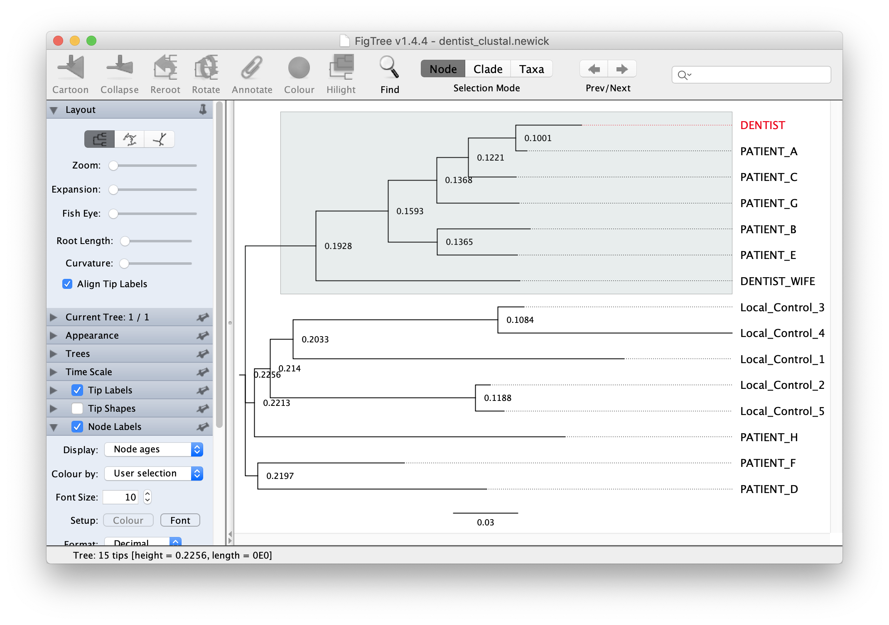

## Analiza filogenetyczna

### Zad. 1 - Podstawowa analiza filogenetyczna
W latach 90’ u ośmiu pacjentów dentysty z Florydy chorego na AIDS zdiagnozowano wirus HIV (HIV+). Mimo, że dentysta przeprowadzał inwazyjne procedury dentystyczne (np. leczenie kanałowe, ekstrakcja zębów), śledztwo przeprowadzone przez amerykańską agencję epidemiologiczną nie wykazało istotnych uchybień w postępowaniu zapewniającym bezpieczeństwo i higienę wykonywanych zabiegów.

W celu ustalenia źródła zakażenia wirusem HIV, wyizolowano wirusowe RNA z próbek krwi należących do: 
* dentysty, 
* żony dentysty chorej na AIDS, 
* pacjentów dentysty chorych na AIDS oraz 
* innych osób z okolicy Florydy zakażonych wirusem HIV, którzy nie mieli kontaktu z dentystą (*local group*). 

Sekwencje wirusowego białka gp120 znajdują się w pliku [HIV_data_set.fasta](./data/HIV_data_set.fasta).

Wejdź na stronę [narzędzi EMBOSS do przyrównywania wielu sekwencji](https://www.ebi.ac.uk/Tools/msa/). Wybierz program **ClustalOmega** i przeprowadź przyrównanie sekwencji. W zakładce `Phylogeny Tree` znajduje się drzewo filogenetyczne utworzone na podstawie algorytmu **Neighbor-Joining**.

1. Czy uważasz, że dentysta z Florydy mógł zakazić któregokolwiek z ośmiu pacjentów?

Umieść tesktową wersję drzewa (część `Tree Data`) w nowym pliku tekstowym i zapisz ją jako `clustal_dentist.newick`. Otwórz zapisane drzewo w programie FigTree. Dostosuj wygląd drzewa i wyeksportuj rysunek jako pdf.

### Zad. 2 - MEGA: zaawansowana analiza filogenetyczna

Otwórz program MEGAX zainstalowany na lokalnym komputerze.

#### Przyrównanie sekwencji

* Otwórz w programie sekwencje znajdujące się w pliku `HIV_data_set.fasta`.
   * `Align` > `Edit/Build Alignment` > `Retrieve sequences from a file`.
* Zaznacz wszystkie sekwencje (Ctrl+A lub `Edit` > `Select all`) i przeprowadź ich przyrównanie (`Alignment` > `Align by ClustalW`) korzystając z domyślnych ustawień.

1. Jaka jest długość dopasowania?

#### Analiza filogenetyczna

* W oknie przyrównania sekwencji wybierz z menu wybierz `Data` > `Phylogenetic Analysis`.
* W głównym oknie programu MEGA wygeneruj drzewo używając algorytmu *Neighbor-Joining (NJ)* 
   * `Analysis` > `Phylogeny` > `Construct Neighbor-Joining tree`.
* W opcjach `Test of Phylogeny` ustaw `None`.
* Naciśnij przycisk `Compute`.

#### Formatowanie i ukorzenianie drzewa

Wyświetl drzewo w formie kladogramu (`View` > `Topology only`).

Wyświetl drzewo w różnych stylach (`View` > `Tree/Branch Style`).

Wróć do prostokątnego widoku drzewa. Zmodyfikuj tak drzewo żeby jego korzeniem była gałąź prowadząca do białka gp120 Dentysty.

Użyj funkcji `Subtree` > `Compress/Expand` i ukryj klad składający się z taksonów `local control 1-5` i `PATIENT D`.

#### 6.4 Macierz dystansów

Oblicz odległości w dopasowaniu par sekwencji analizowanych białek gp120 [główne okno programu > `Analysis` > `Distance` > `Compute Pairwise`].

2. Która para białek gp120 jest najbliżej, a która najdalej spokrewniona?

### Zad. 3 - Badanie powstania wirusa HIV
Celem zadania jest zbadanie relacji ewolucyjnych między wirusami typu HIV człowieka i małp.

AIDS (*Acquired Immune Deficiency Syndrome*) może być wywołany dwoma różnymi wirusami: **HIV-1** i **HIV-2**. HIV-1 jest odpowiedzialny za globalną pandemie, a HIV-2 jest mniej wirulentny i do niedawny występował jedynie w zachodniej Arfyce. Wirusy podobne do HIV występujące w gatunkach naczelnych innych niż człowiek (małp, małp człekokształtnych) nazywają się **SIV** (*Simian Immunodeficiency Virus*). Wirus **HTLV-1** człowieka jest z kolei odległym członkiem rodziny tych retrowirusów, do których należą HIV i SIV.

Gen **Pol**, obecny w genomach tych wirusów, koduje trzy różne polipeptydy niezbędne podczas wirusowego cyklu: integraza, odwrotna transkryptaza i proteaza. Gen ten ulega ekspresji jako pojedyncze polibiałko, które następnie jest cięte na trzy części. W pliku [Pol21.fasta](./data/Pol21.fasta) znajduje się 21 sekwencji polibiałka należących do wirusów HIV-1, HIV-2, SIV szympansa i małpy mangaby oraz HTLV-1 

Przeprowadź analizę filogenetyczną tych sekwencji w programie MEGA. Podczas wykonywania algorytmu Neighbor-Joining jako test filogenetyczny (`Test of Phylogeny`) wybierz metodę bootstrap (`Bootstrap method`) z `1000` pseudoreplikacji (`No. of bootstrap replications`).

1. Obejrzyj różne style prezentacji drzewa (`View` > `Tree/Branch style`).
   * Która sekwencja wyraźnie odstaje pod względem podobieństwa od pozostałych sekwencji?
2. Umieść korzeń drzewa na gałęzi prowadzącej do `HTLV-1`.
   * Jakie są relacje między wirusami HIV-1, HIV-2, i SIV?
3. Jak powstał HIV-1 i HIV-2?
4. Co oznaczają liczby znajdujące się na węzłach uzyskanego drzewa?
5. Czy podział drzewa na dwie grupy monofiletyczne jest wiarygodny?
6. Czy na drzewie znajdują się klady o niskim poziomie ufności?
7. Na czym polega różnica w obliczaniu `Original tree` i `Bootstrap consensus tree`? 

Zapisz rysunek drzewa do pliku PDF (`Image` > `Save as PDF`).

### Zad. 4 - Drzewo gatunków
Celem zadania jest wygenerowanie ukorzenionego drzewa sekwencji DNA kodujących rybosomalne białko L18. Sekwencje kodujące L18 znajdują się w pliku [L18_CDS.fasta](./data/L18_CDS.fasta) i pochodzą z 15 różnych organizmów. Sekwencje w pliku nie są pełnej długości, pozbawione są ok. 30 kodonów.

Przeprowadź analizę filogenetyczną tych sekwencji.

1. Czy ułożenie na drzewie sekwencji gatunków jest zgodne z rozumianą taksonomią?

### Zad. 5 - Mitochondrialne i jądrowe białka
U eukariontów wiele białek występuje w mitochondriach, w których pełnią one funkncje związane z metabolizmem energetycznym lub własnym mitochondrialnym układem genetycznym. W tym układzie występują rybosomy, które różnią się od rybosomów znajdujących się w cytoplazmie. W tym zadaniu, wykorzystana zostanie baza UniProt do zidentyfikowania specyficznych białek rybosomalnych L3, które wchodzą w skład dużej podjednostki zarówno w cytoplazmatycznych, jak i mitochondrialnych rybosomach. Następnie przeprowadzona zostania analiza filogenetyczna tych białek. 

1. W serwisie UniProt znajdź wszystkie sekwencje białek o nazwie `ribosomal protein L3` u Eukaryota pochodzące z bazy Siwss-Prot. Wyszukaj tylko pełnej długości sekwencje (nie fragmenty). Ile trafień otrzymano?

2. Ile wśród tych rekordów znajduje się mitochondriach i cytoplazmie (`Subcellular location`)? Pobierz sekwencje FASTA tych dwóch wyszukiwań.

3. Połącz zawartość dwóch pobranych plików w jeden plik FASTA o nazwie `ribosomal-l3.fasta`.
   > Nazwy białek zaczynają się od `RL3` (cytoplazma) lub `RM03` i `RK3` (mitochondria)

4. W programie MEGA utwórz drzewo filogenetyczne tych białek.

5. Umieść korzeń drzewa tak, aby białka mitochondrialne i cytoplazmatyczne stanowiły odrębne klady (o ile to możliwe).

6. Czy białka mitochondrialne pochodzące z różnych organizmów są bliżej ze sobą spokrewnione, czy raczej mitochondrialne białko z danego organizmu jest bliżej spokrewnione ze swoim odpowiednikiem cytoplazmatycznym?
   * Czy otrzymane drzewo sugeruje, że mitochondrialne sekwencje wyewoluowały raz u eukariontów, czy raczej wiele razy?

7. Zwróć uwagę na gatunki, które występują zarówno w grupie sekwencji mitochondrialnych, jak i cytoplazmatycznych. Czy obie grupy są zgodne z filogenią eukariontów?

8. W której grupie sekwencji ewolucja przebiega szybciej (większa liczba mutacji na jednostkę czasu) - wśród cytoplazmatycznych czy mitochondrialnych rybosomalnych białek?

### Zad. 6 - Drzewo rodziny genowej (duplikacje, delecje)
W pliku [tnrc6.fasta](./data/tnrc6.fasta) znajduje się 17 sekwencji białkowych genu TNRC6 (rodzina genów GW182) pochodzących z bezkręgowców i kręgowców. Białka GW182 wiążą białka Argonaute podczas wyciszania ekspresji genów w oparciu o RNA. Utwórz drzewo filogenetyczne tych sekwencji korzystając z algorytmu Neighbor-Joining i metody boostrap (1000 replikacji).

1. Kiedy w toku ewolucji gen TNRC6 uległ duplikacjom?
2. Która z podrodzin genu (TNRC6A, TNRC6B, TNRC6C) zduplikowała pierwsza?
3. Czy na drzewie są duplikacje/delecje genu, które są specyficzne dla danego organizmu.
4. Które pary sekwencji są bliżej spokrewnione: ortologi TNRC6C człowieka i szympansa czy paralogi TNRC6C kurczaka?

Utwórz drzewo filogenetyczne tych sekwencji, tym razem stosując metodę maksymalnej wiarygodności (`Phylogeny` > `Construc Maximum Likelihood Tree`).

5. Czy topologia drzewa jest taka sama, jak w przypadku metody NJ?