## Analiza filogenetyczna

### Zad. 1 - Podstawowa analiza filogenetyczna

#### ClustalOmega - przyrównanie sekwencji gp120

```
CLUSTAL O(1.2.4) multiple sequence alignment


Local_Control_3      --------RSENFTNNAKIIIVHLNKTVNITCTRPNNNTRRSIPIGPGKAFYT-TDIIGN   51
Local_Control_4      LAEEEVVIRSENFTNNAKIIIVHLNKTVNITCTRPNNNTRRSIPMGPGKAFYT-TEIIGN   59
Local_Control_1      ------------FTDNAKTIIVQLKNSVVINCTRPNNNTRRSVHIGPGSSLYT-TDIIGD   47
PATIENT_H            LAEGEVIIRSENFTDNAKTIIVQLNATINITCERPHNNTRKSIHIGPGRAFFATGDITGD   60
Local_Control_2      ---------SENFTDNTKTIIVQLNTSVTINCTRPGNNTRKSITMGPGKVFYA-GEIIGD   50
Local_Control_5      LAEKEVVIRSENFTDNTKTIIIQLNTSVTINCTRPGNNTRKSITMGPGKVFYA-GEIIGD   59
DENTIST_WIFE         -----------NFTNNAKTIIVQLNTSVEINCTRPSNNTSKGIHIGPGRAFHATDRITGD   49
PATIENT_B            ------------FTDNAKIIIVQLNASVEINCTRPNNNTRKGIHIGPGRAFYATGEIIGD   48
PATIENT_E            -------------------------ASVEINCTRPNNNTRKGIHIGPGRAFYATGEIIGD   35
PATIENT_G            ----EVVIRSANFTDNAKIIIVQLNASVEINCTRPNNNTRRGIHIGPGRAFYATDRIVGD   56
PATIENT_C            ----EVVIRSANFTDNAKIIIVQLNASVEINCTRPNNNTRKGIHIGPGRAVYATDRIIGD   56
DENTIST              ----EVVIRSANFTDNAKIIIVQLNASVEINCTRPNNYTRKGIRIGPGRAVYAAEEIIGD   56
PATIENT_A            ------VIRSANFTDNAKIIIVQLNASVEINCTRPNNNTRKGIRIGPGRAVYAAEEIIGD   54
PATIENT_F            ----EVVIRSENFTDNVKTIIVQLNESVQINCTRPNNNTRKSIHIAPGRAFYATGEIIGD   56
PATIENT_D            ----EVVIRSANFSDNAKTIIVQLNKSVKITCIRPSNNTRQSIPIGPGKAVYATGQIIGD   56
                                               :: *.* ** * * :.: :.**  ..:   * *:

Local_Control_3      IRQAHCNLSRAEWNNTLKQIVKKLREQFK-NKTIVFNHSSGGDPEIVMHSF---------   101
Local_Control_4      IRQAHCNLSKAEWNNTLRQIVKKLRDNLR-IKQ---------------------------   91
Local_Control_1      IRQAHCNLSRANWNKTLEQIVTKLGEQFGNNTTIVFNSSSGG------------------   89
PATIENT_H            IRQAHCNLSKGDWDNALKQIVTKLGEQFGRNKTIVFKQSSGGDPEIIMHSFNCAGEFSYC   120
Local_Control_2      IRQAHCNLSRAAWNDTLKQIVGKLQEQFG-NKTIVFNHSSGGDPEIVMHSF---------   100
Local_Control_5      IRQAHCNLSRTAWNDTLKQIVGKLQEQFG-NKTIVFNHSSGGDPEIVMHSF---------   109
DENTIST_WIFE         IRQAHCNISKAKWNDTLQQVVKKLREQFGGNKTIVFNQSSGGDPEIVLHSFNCGGEFFYC   109
PATIENT_B            IRQAHCNISGAKWNNTLEQVKTKLREQFG-NTTIFFNHSSG-------------------   88
PATIENT_E            IRQAHCNISGEKWNNTLKQVVTKLREQFG-DKTIIFNHSSGGDPEIVM------------   82
PATIENT_G            IRQAYCNISREKWNNTLKQVVAKLREQFV-NKTIIFNHSSGGDPEIVMHSVNCGGEFFYC   115
PATIENT_C            IRQAHCNISREKWNNTLKQVVTKLREQFV-NKTIIFTHPSGGDPEIVMHSVNCGGEFFY-   114
DENTIST              IRRAHCNISREKWNNTLKQVVTKLREQFV-NKTIIFTHPSGGDPEIVMHSVNCGGEFFY-   114
PATIENT_A            IRRAHCNISREKWNNTLKQVVTKLREQFV-NKTIIFNHSSGGDPEIVMHSFNCGGEFFY-   112
PATIENT_F            IRQAHCNLSSTKWNNTLRQIAKKLKEQFG-NKTIVFNQSSGGDPEIVMHSFNCGGEFFYC   115
PATIENT_D            IRQAHCNLSEAKWNNTLAQIVKKLKEQFR-NRTIVFNQSSGGDPEIVMHSFNCGGEFFYC   115
                     **:*:**:*   *:.:* *:  ** :::                                

Local_Control_3      ---    101
Local_Control_4      ---    91
Local_Control_1      ---    89
PATIENT_H            N--    121
Local_Control_2      ---    100
Local_Control_5      ---    109
DENTIST_WIFE         NTT    112
PATIENT_B            ---    88
PATIENT_E            ---    82
PATIENT_G            NT-    117
PATIENT_C            ---    114
DENTIST              ---    114
PATIENT_A            ---    112
PATIENT_F            ---    115
PATIENT_D            ---    115                  
```

#### ClustalOmega - drzewo filogenetyczne
W zakładce `Phylogenetic tree` znajduje się drzewo filogenetyczne uzyskane metodą *Neighbor-Joining (NJ)*.

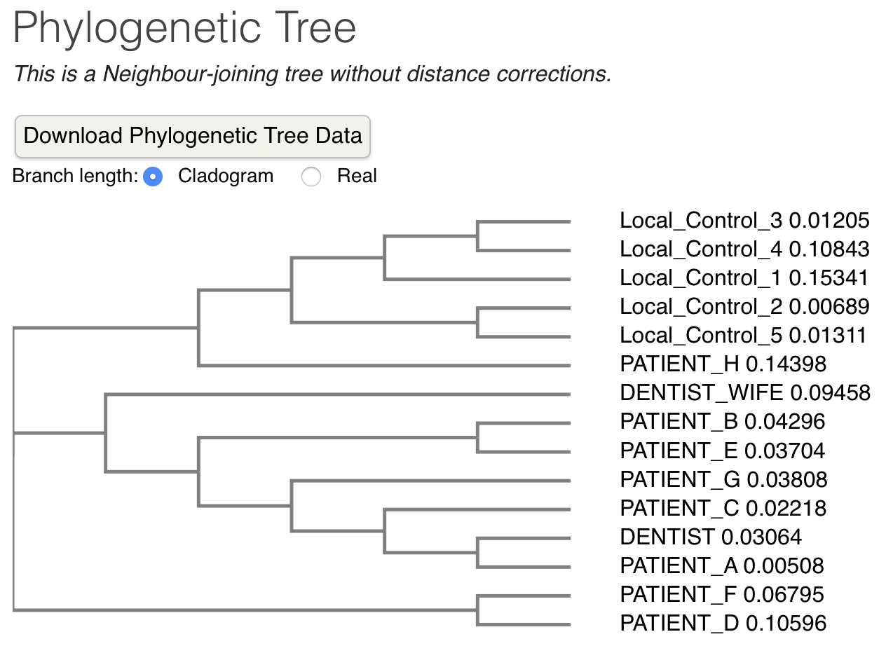

Algorytm NJ tworzy **drzewo nieukorzenione**. Nieukorzenione drzewo filogenetyczne nie zakłada znajomości wspólnego przodka, a jedynie porządkuje taksony, by pokazać ich wzajemne powiązania. Ponieważ nie jest określone, który węzeł odpowiada przodkowi, drodze ewolucji w drzewie nieukorzenionym nie jest przypisany kierunek. Nie można zatem wnioskować na temat kolejności zakażeń wirusem HIV.

Drzewo przedstawione jest w formie **kladogramu**, w którym wszystkie krańcowe taksony są uszeregowane w jednym rzędzie lub kolumnie. Długość ich gałęzi nie są proporcjonalne do ilości zmian ewolucyjnych, a zatem nie niosą żadnej informacji filogenetycznej. W kladogramie istotna jest więc jedynie topologia ilustrująca wzajemne uszeregowanie taksonów. Dystans ewolucyjny gałęzi podany jest obok nazw taksonów. 

Drzewo można również wyświetlić drzewo w formie *filogramu* naciskając na opcję `Real`. W **filogramie** długości gałęzi odpowiadają pdległościom ewolucyjnym dzielącym poszczególne sekwencje; o takich drzewach mówi się, że są wyskalowane. Drzewa wyskalowane pokazują zarówno zależności ewolucyjne, jak też informują o względnym czasie dywergencji poszczególnych gałęzi.


1. Otrzymane drzewo wskazuje, że dentysta mógł być odpowiedzialny za zakażenie niektórych swoich pacjentów. Na przykład, dystans ewolucyjny na drzewie między sekwencją gp120 dentysty a *Pacjenta A* jest najmniejszy z wszystkich innych par sekwencji. Ponadto, sekwencja gp120 dentysty jest bliżej spokrewniona również z sekwencjami innych pacjentów (B, E, G i C) niż z sekwencją wirusową pobraną od żony dentysty.

   Pacjent H najprawdopodobniej nie zaraził się od dentysty, ponieważ jego sekwencja gp120 jest bliżej spokrewniona z sekwencjami kontrolnymi (ludźmi z Florydy chorującymi na AIDS nie mającymi kontaktu z dentystą).

#### Format Newick
Aby informacja o topologii drzewa mogła zostać przekaza programom komputerowym bez konieczności rysowania samego drzewa, stosuje się specjalny format tekstowy, nazwany **formatem Newick**. Drzewa przedstawia się w nim jako ciąg taksonów ujętych w odpowiednio zagnieżdżone nawiasy. W tej liniowej reprezentacji każdy wewnętrzny węzeł jest przedstawiony jako para nawiasów, w którą są ujęte, oddzielone przecinkami, wszystkie taksony danej grupy monofiletycznej. W przypadku filogramu, długości gałezi umieszcza się bezpośrednio za nazwą taksonu, po dwukropku.

Drzewo sekwencji gp120 zapisane w formacie Newick:
```
(
(
(
(
(
Local_Control_3:0.01205,
Local_Control_4:0.10843)
:0.09490,
Local_Control_1:0.15341)
:0.01072,
(
Local_Control_2:0.00689,
Local_Control_5:0.01311)
:0.09526)
:0.00720,
PATIENT_H:0.14398)
:0.00432,
(
DENTIST_WIFE:0.09458,
(
(
PATIENT_B:0.04296,
PATIENT_E:0.03704)
:0.02285,
(
PATIENT_G:0.03808,
(
PATIENT_C:0.02218,
(
DENTIST:0.03064,
PATIENT_A:0.00508)
:0.02199)
:0.01467)
:0.02254)
:0.03345)
:0.03277,
(
PATIENT_F:0.06795,
PATIENT_D:0.10596)
:0.00589);
```

#### FigTree - wizualizacja drzewa
Otwórz program FigTree zainstalowany na komputerze. Następnie otwórz w programie plik [clustal_dentist.newick](./files/clustal_dentist.newick) wybierając z menu `File` > `Open`.

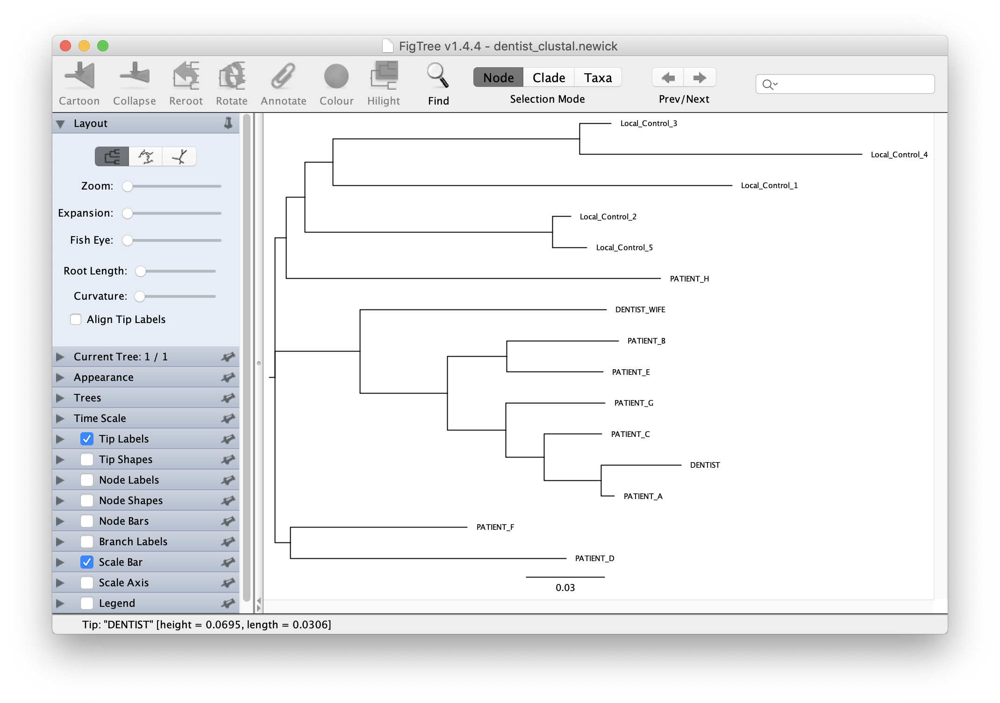

#### Dostosowanie wyglądu drzewa

* Zmiana wielkości czcionki taksonów (`Tip labels` > `Font size`: `13`)
* Pokazanie długości gałęzi (Zaznaczenie `Node labels`)
* Wyrównanie nazw taksonów (Zaznaczenie `Align Tip Labels`)
* Zmiana koloru czcionki nazwy Dentysty
  - Naciśnięcie na takson `Dentist`
  - Naciśnięcie przycisku `Taxa`
  - Naciśnięcie przycisku `Colour`
  - Ustawienie koloru czerwonego
* Ustawienie szarego koloru tła dla wybranej grupy monofiletycznej (kladu)
  - Naciśnięcie gałęzi drzewa danej grupy filetycznej
  - Naciśnięcie przycisku `Clade`
  - Naciśnięcie przycisku `Colour`
  - Ustawienie koloru szarego.

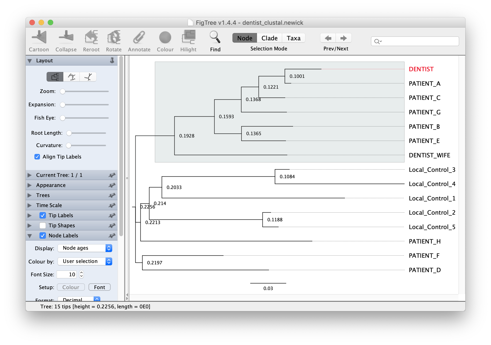

##### Wyeksportowanie rysunku jako PDF
Z menu wybierz `File` > `Export PDF`
<br/><br/>


### Zad. 2 - MEGA: zaawansowana analiza filogenetyczna
Zadanie na podstawie ćwiczeń BSB.

1. Długość przyrównania białkowych sekwencji gp120 wynosi `123` pozycji. 
   > Naciśnięcie na daną kolumnę w przyrównaniu powoduje wyświetlenie odpowiadającej pozycji w przyrównaniu.

#### Formatowanie i ukorzenianie drzewa

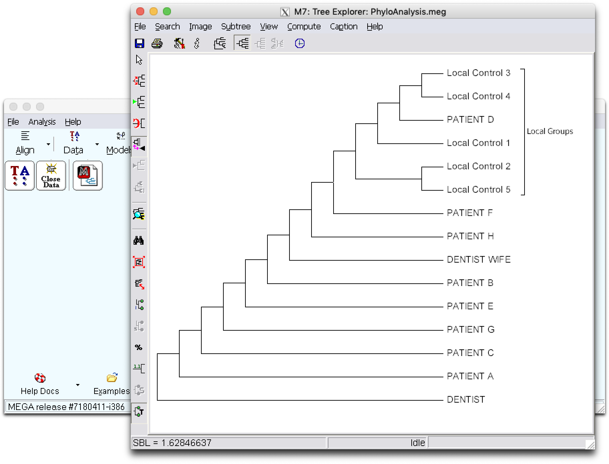

#### Macierze dystansów
W celu obliczenia macierzy dystansów (każda sekwencja z każdą) w głównym oknie programu MEGA wybierz `Analysis` > `Distance` > `Compute pairwise distances`.

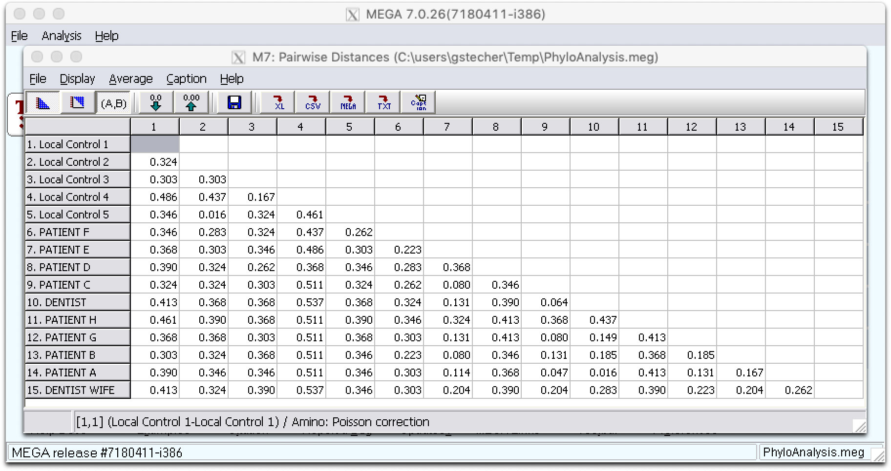

2. Najmniejszy dystans ewolucyjny jest między `Local control 2` i `Local control 5` i wynosi `0.016`. Największy dystans jest między `Local control 4` i `Denstist wife` i wynosi `0.567`.
<br/><br/>

### Zad. 3 - Badanie powstania wirusa HIV
Zadanie na podstawie: [DTU Course](http://teaching.healthtech.dtu.dk/36611/index.php/Exercise:_Phylogeny). [Oryginane odpowiedzi DTU Course](http://teaching.healthtech.dtu.dk/36611/index.php/Exercise:_Phylogeny-Answers).

#### Przyrównanie białkowych sekwencji POL

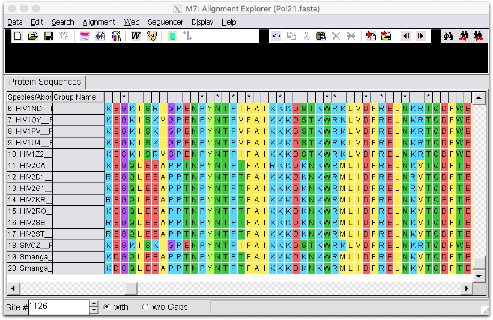

#### Drzewo NJ z testem bootstrap (1000 pseudoreplikacji)

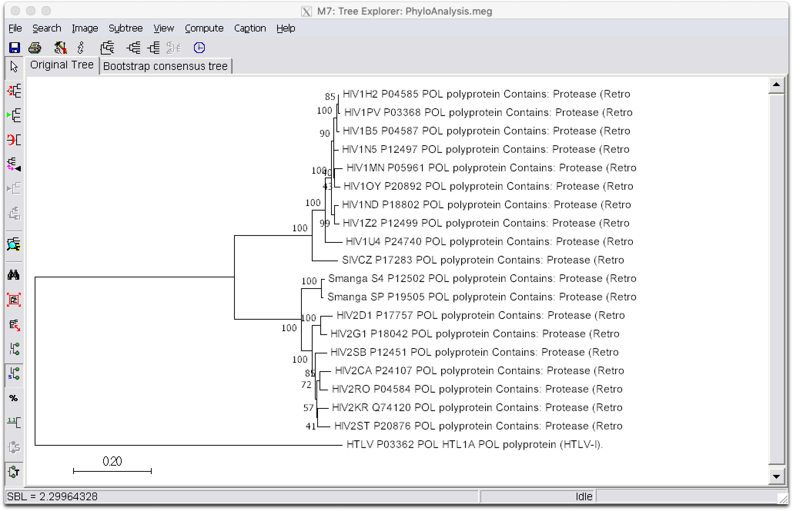

1. Powyższe drzewo jest nieukorzenione, choć widać, że HTLV-1 wyraźnie odstaje od pozostałych sekwencji wirusów HIV-1, HIV-2, SIV. Jest to widoczne na różnych stylach drzewa (np. prostokątny, kolisty).
2. Przesłanki z innych źródeł wskazują, że linia ewolucyjna prowadząca do HTLV oddzieliła się zanim doszło do powstania wirusów HIV1, HIV2 i SIV. Można zatem ukorzenić drzewo w gałęzi prowadzącej do HTLV-1. Korzeń drzewa znajduje się zatem między HTLV-1 a pozostałymi taksonami (grupą wewnątrzną)

   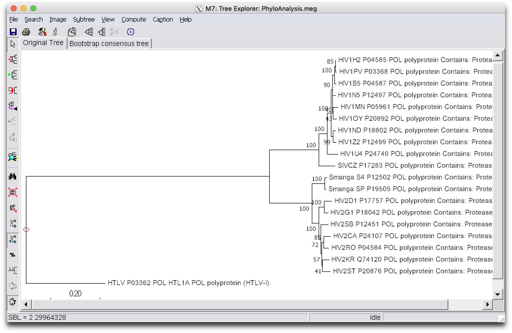

   > Przekształcenie drzewa nieukorzenionego w ukorzenione sprowadza się do ustalenia położenia korzenia drzewa (tzw. ukorzenienie drzewa). Zadanie to można zrealizować, wykorzystując dodatkowe informacje dostępne z analizy skamielin, wcześniejszych badań filogenetycznych prowadzonych na podstawie danych morfologicznych lub też odwołując się do "biologicznego" zdrowego rozsądku. Ukorzenienie drzewa obejmuje ustalenie tzw. **grupy zewnętrznej** (*outgroup*) - zwykle jest to gatunek, który jako pierwszy oddzielił się od pozostałych. Przykładowo, w przypadku filogenezy ssaków łożyskowych jako grupę zewnętrzną wykorzystuje się często torbacze. Zgodnie z posiadaną wiedzą biologiczną spodziewać się można, że ssaki łożyskowe są ze sobą bliżej spokrewnione niż jakimkolwiek przedstawicielem torbaczy.

   > Jeżeli chcemy przekształcić nieukorzenione drzewo w drzewo ukorzenione, a nie znamy grupy zewnętrznej, można wykorzystać tzw. **metodę punktu środkowego** (*midpoint method*). Obejmuje ona ustalenie w drzewie najdłuższej gałęzi łączącej dwa liście i umiejscowieniu korzenia dokładnie na jej środku. Zakłada się przy tym, że średnie tempo ewolucji w obu częściach podzielonego drzewa jest takie samo.

3. Wszystkie sekwencje HIV-1 tworzą klad, którego grupą siostrzaną są wirusy SIV szympansa. Podobnie, wszystkie sekwencje HIV-2 tworzą osobny klad będący grupą siostrzaną do wirusów SIV małpy mangaby. Według aktualnych informacji, HIV-1 powstał poprzez transmisję wirusa SIV (najprawdopodobniej) z szympansów do człowieka. Natomiast HIV-2 powstał niezależnie od HIV-1 poprzez transmisję wirusa z małp mangab do człowieka.

4. Liczby znajdujące się na węzłach drzewa oznaczają wartości uzyskane w teście bootstrap. Wartości te wyrażone są w procentach i informuje o wiarygodności poszczególnych rozgałęzień w drzewie. 
   > Bootstrap jest metodą statystyczną, która opiera się na tworzeniu dużej liczby replik z niewielkimi zmianami w danych początkowych. Drzewa skonstruowane ze zbiorów danych z wprowadzonymi losowymi zmianami dają rozkład topologii drzew, który umożliwia statystyczną ocenę każdego pojedynczego kladu z danego drzewa.

   >Wykorzystanie metody bootstrap do oceny wiarygności skonstruowanego wcześniej drzewa filogenetycznego obejmuje wygenerowanie wielu dopasowań sekwencji (zazwyczaj między 100 a 1000). Dla każdego z wygenerowanych dopasowań jest wyznaczane drzewo filogenetyczne. W zbiorze takich drzew niektóre drzewa będą miały taką samą topologię, jak drzewo oryginalne. Inne będą się od niego różnić. Każdemu z węzłów w oryginalnym drzewie jest następnie przypisywana tzw. *wartość bootstrap* równe odsetkowi wygenerowanych drzew, w których obserwowano dokładnie takie samo rozgałęzienie linii ewolucyjnych.

   > Nie ma ustalonej reguły, która mówiłaby jak duża musi być wartość bootstrap, aby uznać odpowiedni węzeł drzewa za wiarygodny, a tym samym uznać, że gatunki, których linie ewolucyjne się w nim zbiegają, tworzą klad. W praktyce przyjmuje się, że wartości powyżej 70% takie twierdzenie usprawiedliwiają.

5. Podział drzewa na dwie grupy monofilityczne jest bardzo wiarygodny, ponieważ wartości bootstrap przy tych węzłach wynoszą `100`. Oznacza to, że wszystkie drzewa (100%) skonstruowane ze zbiorów danych z losowymi zmianami posiadają rozgałęzienie na dwie takie grupy.

6. Na drzewie znajdują się również klady o niskiej wiarygodności. Dotyczą one głównie końcowych rozgałęzień drzewa. Na przykład, dla kladu pary sekwencji `HIV2KR` i `HIV2SK` wartość bootstrap wynosi `42%`.

7. `Original tree` jest drzewem zbudowanym na oryginalnym przyrównaniu sekwencji. Natomiast `Bootstrap consensus tree` jest drzewem konsensusowym zbudowanym w oparciu o wszystkie repliki drzew, które zostały wygenerowane podczas testu *bootstrap*. Drzewo takie jest złożone z kladów, które występowały najczęściej w replikach.

   Badacz wybiera, które drzewo zaprezentować (np. w publikacji). Należy zwrócić uwagę, że drzewo konsensusowe jest kladogramem - tzn., że nie ma informacji o długości gałęzi, a jedynie informacje o rozmieszczeniu taksonów. Dlatego używanie drzew konsensusowych jest ograniczone do badań, w których dystans ewolucyjny nie jest tak istotny, a jedynie relacje między taksonami.

   > Przy kontrukcji **drzewa konsensusowego** najpierw określa się częstość występowania każdego z możliwych kladów w zestawie wygenerowanych drzew, a następnie klady są uporządkowywane według malejących wartości bootstrap. Konstrukcja drzewa konsensusowego polega na dodawaniu, zgodnie z kolejnością, pojedynczych kladów, poczynając od tych o największych wartościach bootstrap. Dodawany może być wyłącznie taki klad, któremu odpowiada największa możliwa wartość bootstrap oraz którego dodanie nie oznacza konfliktu z wcześniej dodanymi kladami. Topologia drzewa konsensusowego może nieznacznie różnić się od drzewa skonstruowanego dla oryginalnego dopasowania wielosekwencyjnego.

Rysunek drzewa zapisano do pliku: [MEGA-pol21-figure.pdf](./files/MEGA-pol21-figure.pdf).
<br/><br/>

### Zad. 4 - Drzewo gatunków
Otwórz program MEGA i wczytaj sekwencje kodujące białko L18 ([L18_CDS.fasta](./data/L18_CDS.fasta)). Zwróć uwagę, że program MEGA rozpoznał, że sekwencje kodują białko. W zakładce `Translated Protein Sequences` znajdują się przetłumaczone sekwencje aminokwasowe.

#### Przyrównanie sekwencji
Przeprowadź przyrównanie sekwencji biorąc pod uwagę kodony. Z menu wybierz `Alignment` > `Alignment by Clustal (codons)`.

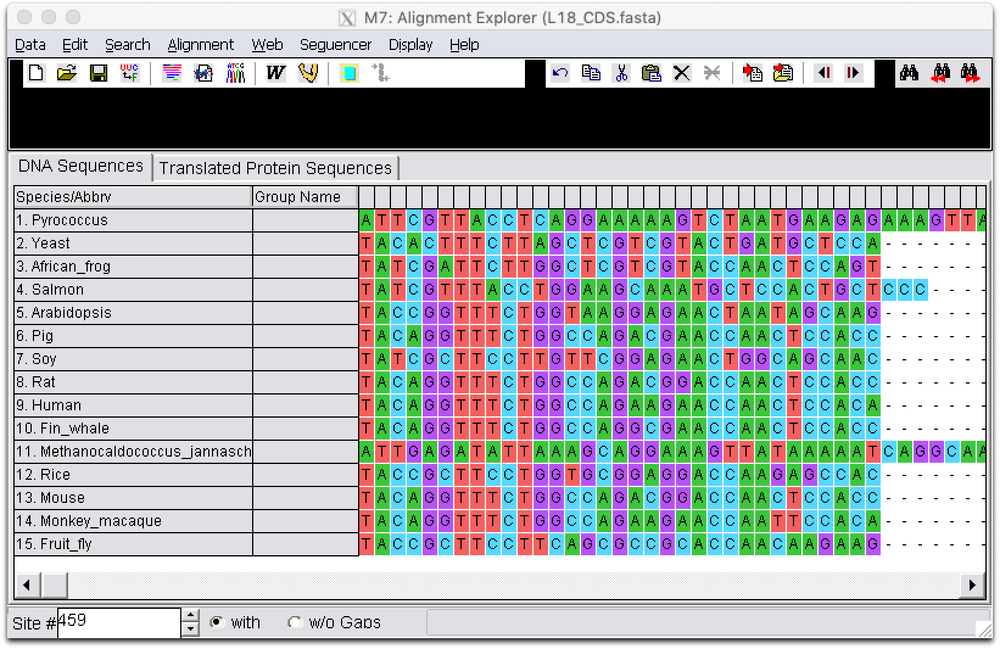

#### Analiza filogentyczna
W menu okna zawierającego przyrównaniem wybierz `Data` > `Phylogenetic Analysis`. Następnie odpowiedz tak, na pytanie czy sekwencje kodują białka. W głównym oknie programu MEGA wybierz `Phylogeny` > `Construct Neighbor-Joining tree`. Wybierz test boostrap z 1000 pseudoreplikacji.

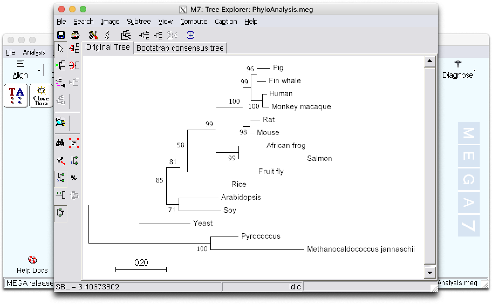

Wszystkie sekwencje, poza dwoma, należą do Eukariontów. *Pyrococcus* i *Methanocaldococcus jannaschii* są archeonami. Mogą być one zatem grupą zewnątrzną dla otrzymanego drzewa. Umieść korzeń drzewa na gałęzi prowadzącej do tych dwóch gatunków (naciśnij kursorem na gałąź i wybierz `Subtree` > `Root`.

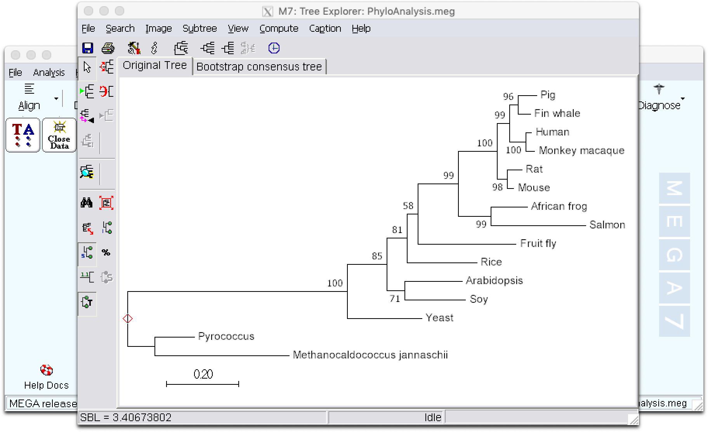

1. Ułożenie gatunków na drzewie jest w większości zgodne z taksonomią. Jednak są cztery błędy w rozmieszczeniu gatunków:
   * Błędne umiejscowienie sekwencji ryżu (`Rice`) poza sekwencjami `Arabidopsis` i `Soya`. Sekwencja ryżu powinna być siostrzana do grypy `Arabidopsis`-`Soya`. 
   * Błędnie umiejscowiony jest łosoś `Salmon`, który powinien oddzielić się od całego kladu ssaków.
   * Błędne umiejscowanie grupy `Human+Macaque` jako siostrzanej grupy dla `Pig+Whale`. Para `Human+Macaque` powinna być siostrzaną grupą dla pary `Rat+Mouse`, ponieważ naczelne i gryzonie należą do tej samej grupy *Euarchontoglires*.
   * Błędne umiejscowanie drożdży. Drożdże są grzybami i powinny grupować razem ze zwierzętami w grupie *Opisthokonta*.

   >Aktualną taksonomię analizowanych gatunków można wyświetlenić używając taksonomii NCBI. Wejdź na stronę [NCBI Taxonomy](https://www.ncbi.nlm.nih.gov/taxonomy). Wybierz funkcję `Common tree` i kolejno wprowadź gatunki.

Filogenia gatunków prowadzona w oparciu o tylko jeden pojedynczy gen bardzo często odbiega od prawdziwej filogenii gatunków. Jest to głównie spowodowane przez stochastyczny charakter mutacji: czasami gen będzie bardziej podobny do genu niesiostrzanego gatunku, z czysto losowych powodów. Wpływ stochastycznego charakteru mutacji na topologię drzewa maleje, gdy do budowy drzewa zostanie wykorzystanych więcej sekwencji genów.
<br/><br/>

### Zad. 5 - Mitochondrialne i jądrowe białka

1. Skorzystaj z zaawansowanego wyszukiwania w bazie UniProt.

   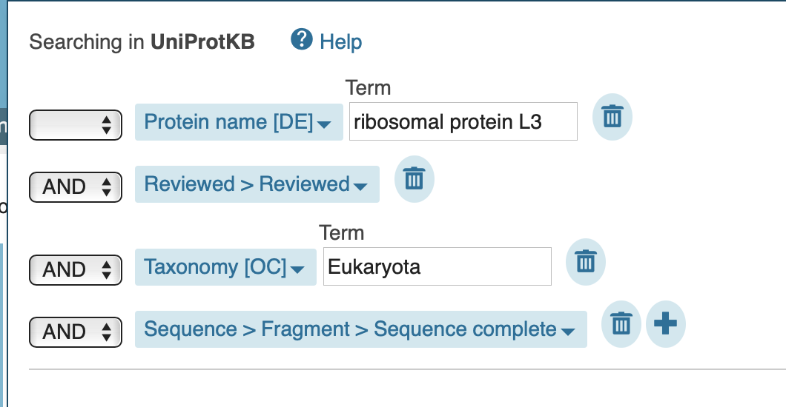

   ```
   name:"ribosomal protein l3" taxonomy:eukaryota fragment:no AND reviewed:yes
   ```
  
  Otrzymano 50 rekordów.

2. Skorzystaj z zaawansowanego wyszukiwania. 
   * Cytoplazma (24 rekordy):

      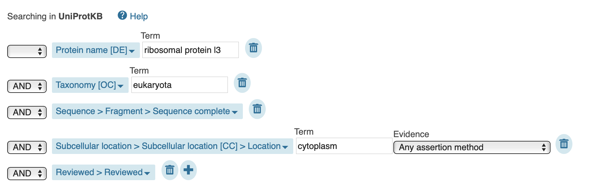
 
      ```
      name:"ribosomal protein l3" taxonomy:eukaryota fragment:no 
      locations:(location:cytoplasm) AND reviewed:yes
      ```
   * Mitochondria (8 rekordów)

     ```
     name:"ribosomal protein l3" taxonomy:eukaryota fragment:no 
     locations:(location:mitochondrion) AND reviewed:yes
     ```

3. Sekwencje białka L3 w formacie FASTA znajdują się w pliku [ribosmal-l3.fasta](./files/ribosmal-l3.fasta).

4. Drzewo nieukorzone utworzone w programie MEGA (Clustal + NJ):

   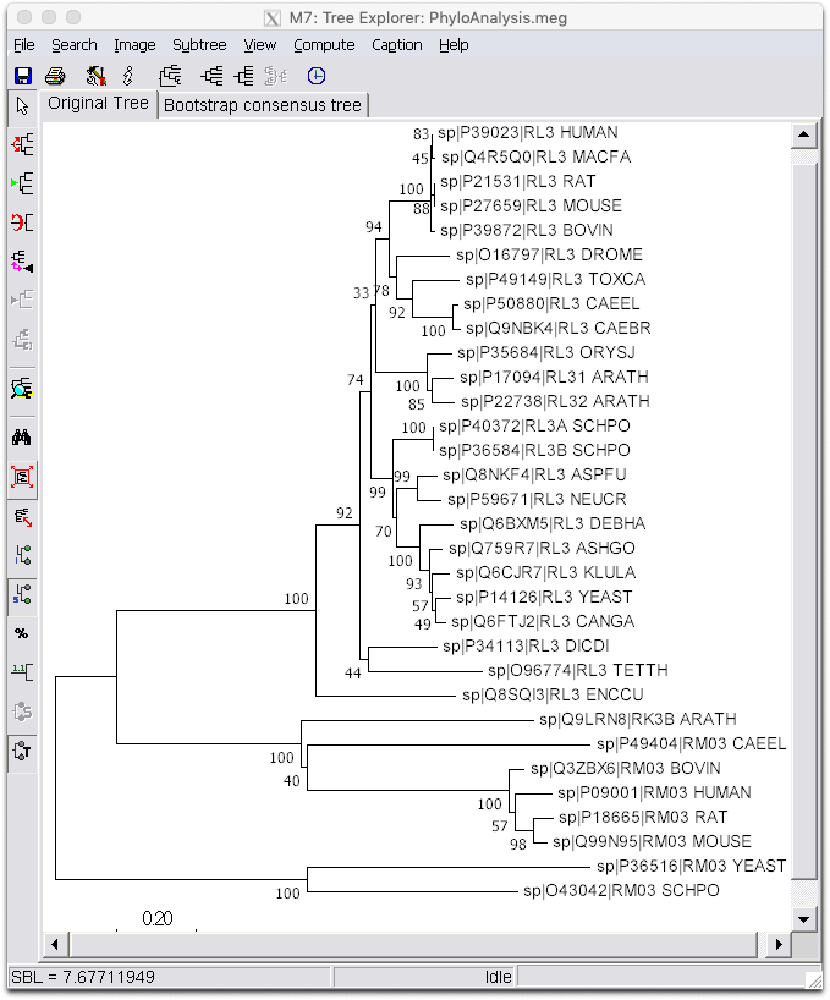

5. Tak, możliwe jest ukorzenienie drzewa tak, aby wszystkie sekwencje cytoplazmatyczne (`RL3_*`) i wszystkie sekwencje mitochondrialne (`RM03_*` i `RK3B`) utworzyły dwie odrębne grupy (klady). W tym celu należy nacisnąć przyciskiem myszy na gałąź prowadzącą do sekwencji cytoplazmatycznych i następnie z menu okna `Subtree` wybrać `Reroot`.

   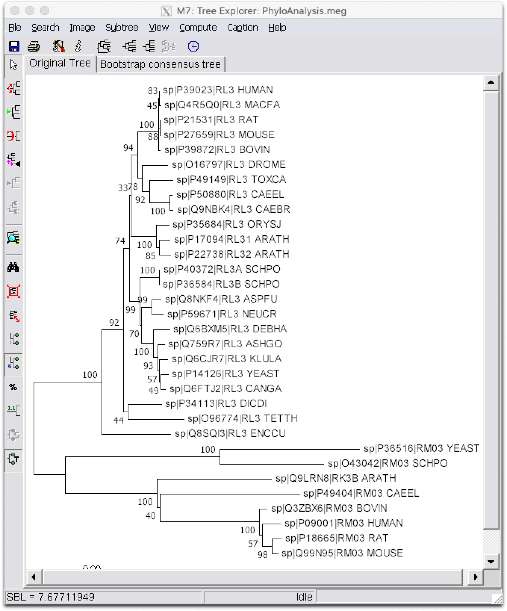 

6. Mitochondrialne geny rybosomowe L3 pochodzące z różnych organizmów grupują razem na drzewie - są ze sobą bliżej spokrewnione niż w stosunku do swoich odpowiedników cytoplazmatycznych. Na przykład, białko cytoplazmatyczne człowieka `RL3` jest bliżej spokrewnione z białkiem cytoplazmatycznym szczura, niż z białkiem mitochondrialnym `RM03` człowieka. Taka topologia drzewa wskazuje, że mitochondria pojawiły się raz w toku ewolucji.

7. Nie ma różnic między dwoma poddrzewami - filogenia eukariontów jest przedstawiona w ten sam sposób.

8. Więcej mutacji na jednostkę czasu zachodzi w grupie sekwencji mitochondrialnych. Jest to widoczne na drzewie, gdzie gałęzie w grupie mitochondrialnych sekwencji są dłuższe i znajdują się daleko od korzenia drzewa.
<br/><br/>

### Zad. 6 - Drzewo rodziny genowej (duplikacje, delecje)
* Otwórz program MEGA
* Wczytaj sekwencje białek TNRC6 (`Align` > `Edit/Build Alignment` > `Retrieve sequences from a file`).
* Przeprowadź przyrównanie sekwencji (`Alignment` > `Align by ClustalW`) 
* Dodaj przyrównanie sekwencji do analiz filogenetycznych (`Data` > `Phylogenetic Analysis`)
* Z głównego okna programu MEGA wybierz `Analysis` > `Phylogeny` > `Construct Neighbor-Joining tree`
* Naciśnij przycisk `Compute`.

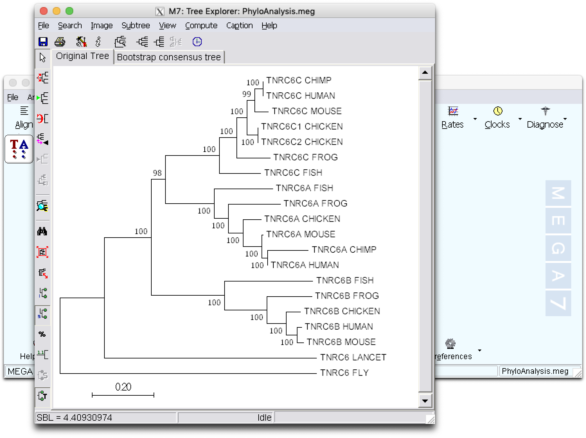

1. Gen TNRC6 uległ duplikacjom najprawdopodobniej u kręgowców. Lancetnik należący do bezczaszkowców ma jedną kopię genu TNRC6, natomiast kręgowce (ryby, płazy, ptaki, ssaki) mają trzy kopię tego genu (`TNRC6A`, `TNRC6B` i `TNRC6C`). Zatem duplikacje genu TNRC6 musiały nastąpić po rozdzieleniu się lini ewolucyjnych bezczaszkowców i kręgowców.

2. Otrzymane drzewo wskazuje, że TNRC6B zduplikował jako pierwszy, następnie TRNC6A uległ duplikacji tworząc gen TNRC6C.

3. Na drzewie występują duplikacje i delecje specyficzne dla danego gatunku:
   * U szympansa nie ma genu `TNRC6B`. Ponieważ gen ten występuje u wszystkich innych kręgowców (tj. ryby, płazy, ssaki) najprawdopodobniej doszło do delecji tego genu w genomie szympansa. 
   * U kurczaka gen TNRC6C występuje w dwóch kopiach (`TNRC6C1` i `TNRC6C2`). Białka kodowane przez te dwa geny są ze sobą bardzo blisko spokrewnione (dystans jest bardzo mały). Dlatego, u kurczaka najprawdopodobniej doszło do specyficznej duplikacji tego genu.

4. Ortologi genu TNRC6C człowieka i szympansa wykazują mniejszy dystans (`0.00`) niż in-paralogi TNCR6C1 i TNRC6C2 kurczaka `0.00111`.

   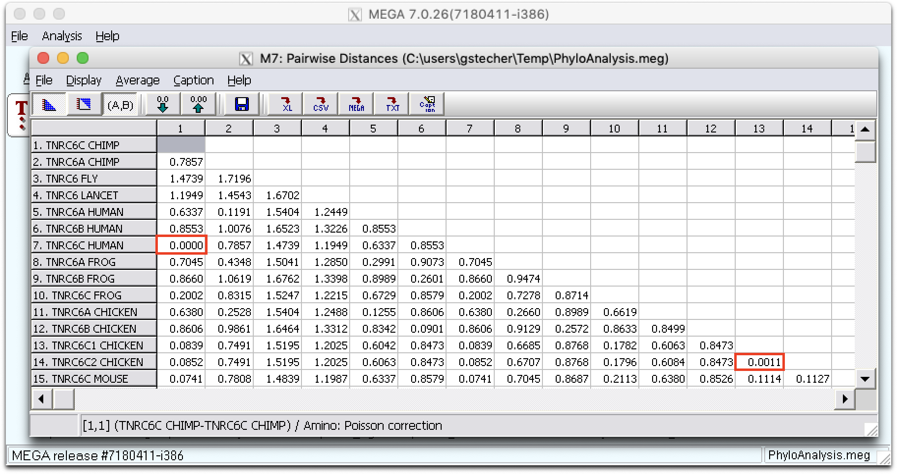

#### Metoda największej wiarygodności
Metoda największej wiarygodności (ML, *Maximum Likelihood*) wybiera drzewo o najwyższym prawdopodobieństwie odtworzenia obserwowanych danych, opierając się na modelach probabilistycznych. ML odnajduje drzewo, które w najbardziej prawdopodobny sposób odzwierciedla rzeczywisty proces ewolucyjny. Jest to metoda wyczerpująca, która wyszukuje każdą możliwą topologię drzewa i uwzględnia każdą pozycję w przyrównaniu, nie tylko pozycje informatywne. Metoda ML oblicza całkowite prawdopodobieństwa ewolucji sekwencji pierwotnych do węzłów wewnętrznych, a ostatecznie do istniejących sekwencji, stosując konkretny model z określonymi wartościami prawdopodobieństwa dla substytucji reszt.

5. Topologia drzewa otrzymanego metodą maksymalnej wiarygodności (`Maximum Likelihood`) jest podobna do drzewa uzyskanego metodą NJ. Różnica między tymi drzewami polega na kolejności duplikacji genu `TNRC6` u kręgowców. Według drzewa ML pierwszy zduplikował gen `TNRC6C` następnie `TNRC6A` i `TNRC6B`.

   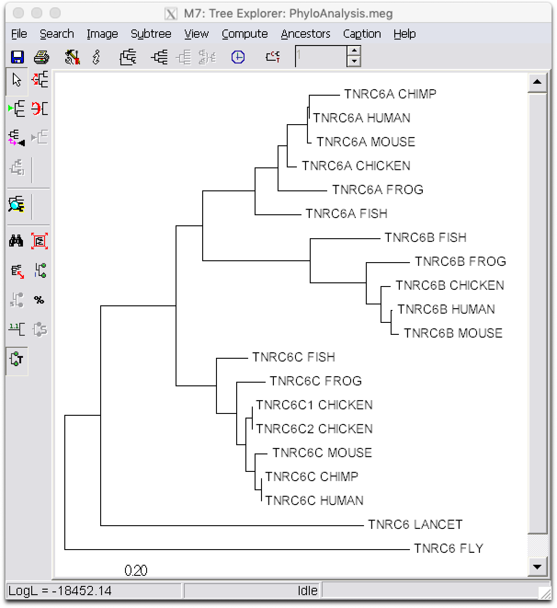

   > Metoda największej wiarygodności jest matematycznie najbardziej rygorystyczną matematycznie metodą ze wszystkich aktualnych podejść konstruowania drzew filogenetycznych. ML wykorzystuje informację zawartą w całej sekwencji, nie tylko w pozycjach informatywnych, zatem jest wiarygodna. Ze względu na jej czasochłonność, nie można wykorzystać metody ML do większej liczby taksonów. 