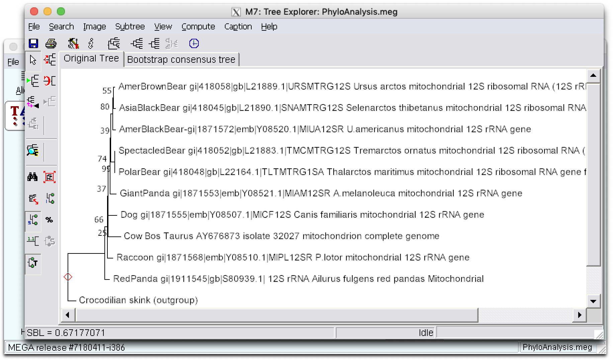
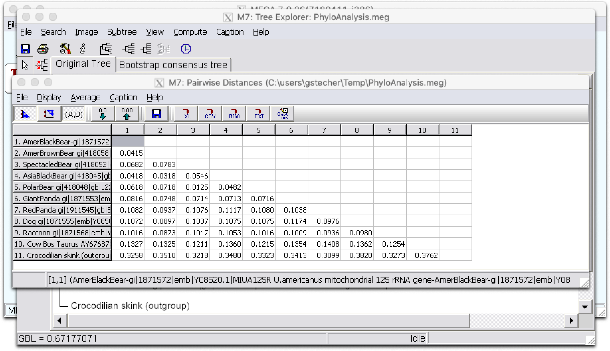
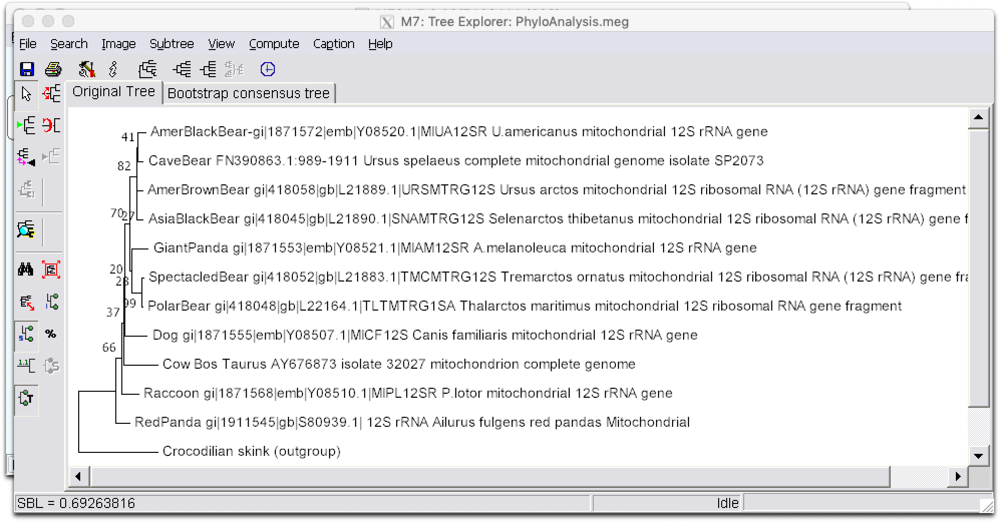

### Zad. 1 - Badanie pokrewieństwa niedźwiedzi

Otwórz program MEGA7 zainstalowany na lokalnym komputerze.

#### Przyrównanie sekwencji

* Otwórz w programie sekwencje znajdujące się w pliku [bears.fasta](./data/bears.fasta).
   * `Align` > `Edit/Build Alignment` > `Retrieve sequences from a file`.
* Zaznacz wszystkie sekwencje (Ctrl+A lub `Edit` > `Select all`) i przeprowadź ich dopasowanie (`Alignment` > `Align by ClustalW`) korzystając z domyślnych ustawień.

#### Analiza filogenetyczna

* W oknie dopasowania sekwencji wybierz z menu wybierz `Data` > `Phylogenetic Analysis`.
* W głównym oknie programu MEGA wygeneruj drzewo używając algorytmu *Neighbor-Joining (NJ)* 
   * `Analysis` > `Phylogeny` > `Construct Neighbor-Joining tree`.
* W opcjach `Test of Phylogeny` ustaw `Bootstrap`.
  * W opcji `No. of bootstrap replications` ustaw `1000`.
* Naciśnij przycisk `Compute`.

Ustaw korzeń drzewa na gałąź `Crocodillian skink (outgroup)`, wyświetl drzewo w pełnej wielkości okna (`Fit tree to screen`) i wyświetl długości gałęzi (`Display of branch lengths`).

1. Sekwencje niedźwiedzi `Spectacled Bear` - `Polar Bear` są ze sobą najbliżej spokrewnione. Świadczy o tym krótka długość poziomych gałęzi łączących te dwie sekwencje.

2. Oblicz macierz dystanstów między sekwencjami (`Distance` > `Compute pairwsie distances`). Sekwencja pandy wielkiej jest bliżej spokrewniona z sekwencjami niedźwiedzi azjatyckimi.

   

3. Sekwencja `Red Panda` jako pierwsza oddzieliła się od reszty niedźwiedzi. Wedłu macierzy dystansów `Red panda` dzieli najkrótszy dystans z psem. Zatem według tego drzewa nie ma podstaw, aby uznać pandę czerwoną za niedźwiedzia.

4. Sekwencja amerykańskiego niedźwiedzia brunatnego jest najstarsza, ponieważ wykazuje największy dystans (`0.3510`) do sekwencji grupy zewnętrznej (`Crocodillan skink`).
  

### Zad. 2 - Wymarły niedźwiedź jaskiniowy
Otwórz stronę serwisu [NCBI BLAST](https://blast.ncbi.nlm.nih.gov/Blast.cgi). Wybierz program `nucleotide BLAST`. Jako sekwencję zapytania podaj którąkolwiek sekwencję `12S rRNA` z pliku [bears.fasta](./data/bears.fasta). Ogranicz przeszukiwania do organizmu *Ursus spelaeus*.

W wynikach programu BLAST, przejdź do rekordu najlepszego trafienia (`Ursus spelaeus complete mitochondrial genome, isolate SP2073`) o numerze dostępu: [FN390863](https://www.ncbi.nlm.nih.gov/nucleotide/FN390863.1). W rekordzie znajdź pozycję genu `12S rRNA`, naciśnij lewym przyciskiem myszy na ten gen, a następnie w prawym dolnym rogu wybierz `FASTA` ([Rekord tej sekwencji](https://www.ncbi.nlm.nih.gov/nuccore/FN390863.1?from=989&to=1911&report=fasta)).

Dołącz sekwencję do pliku `bears.fasta` i wykonaj analizę filogenetyczną, jak w poprzednim zadaniu.

1. Amerykański niedźwiedź czarny jest najbliższym krewnym wymarłego niedźwiedzia jaskiniowego.
2. Uwzględnienie niedźwiedzia jaskiniowego na drzewie nie zmieniło układu pozostałych taksonów.